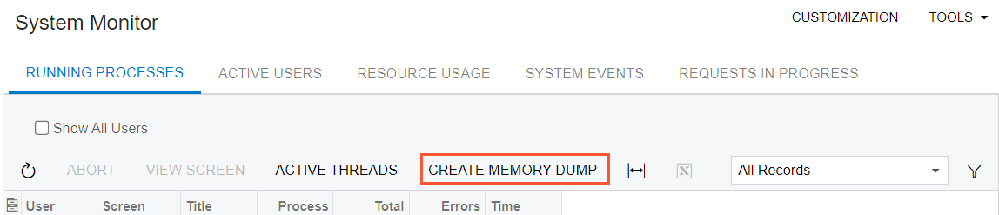
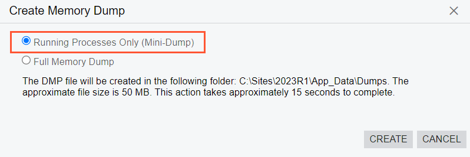
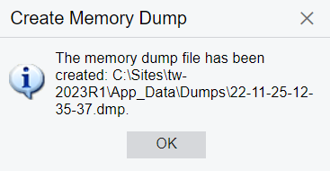

# System Health: To Create a Memory Dump {#_b6318172-940e-4723-b760-9cf4537f208f .task}

The following activity will walk you through the process of creating a memory dump in Acumatica ERP.

**Attention:** This activity is based on the *U100* dataset. If you are using another dataset or if any system settings have been changed in *U100*, these changes can affect the workflow of the activity and the results of the processing. To avoid issues, restore the *U100* dataset to its initial state.

## Story { .section}

Suppose that you have contacted the Acumatica support team, and a support representative has asked you to create a memory dump of your Acumatica ERP instance to diagnose your issue. The representative has requested a mini-dump of running processes only. Acting as the system administrator, you need to create a memory dump by using the [System Monitor](SM_20_15_30.md) \(SM201530\) form and send it to the support representative.

## Configuration Overview { .section}

In the *U100* dataset, the *gibbs* user account has been created on the [Users](SM_20_10_10.md) \(SM2010100\) form and assigned the predefined *Administrator* role. Because you will use this account, you will be able to access the [System Monitor](SM_20_15_30.md) \(SM201530\) form.

## Process Overview { .section}

You will create a memory dump of your Acumatica ERP instance by using the [System Monitor](SM_20_15_30.md) \(SM201530\) form.

## System Preparation { .section}

Launch the Acumatica ERP website, and sign in as a system administrator by using the *gibbs* username and the *123* password.

## Step: Creating a Memory Dump { .section}

To create a memory dump, on the [System Monitor](SM_20_15_30.md) \(SM201530\) form, do the following:

1.  On the **Running Processes** tab, click **Create Memory Dump** on the table toolbar \(see the following screenshot\).

    

2.  In the **Create Memory Dump** dialog box, which opens, select the *Running Processes Only \(Mini-Dump\)* option button, so that you generate the type of memory dump that the support team requested. \(See the following screenshot.\) Click **Create**.

    

    **Important:** Creating a full memory dump file can cause performance issues and even cause the instance to restart.

    Upon successful creation, the system shows a dialog box with the location of the created memory dump.

3.  In the dialog box, click **OK** to finish creating the memory dump \(see the following screenshot\).

    

**Parent topic:**[Monitoring System Health](../UserGuide/SA_Monitoring_System_Health_Mapref.md)

