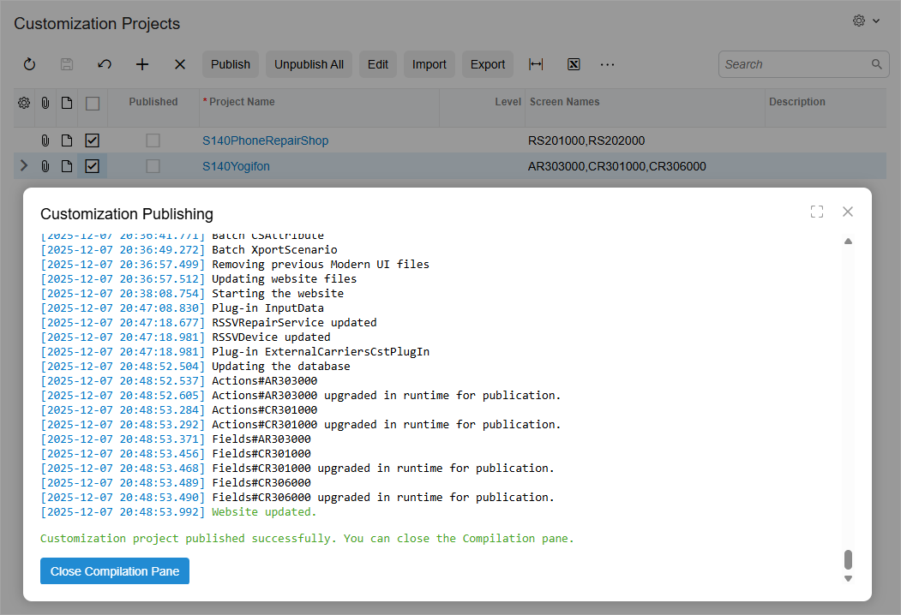
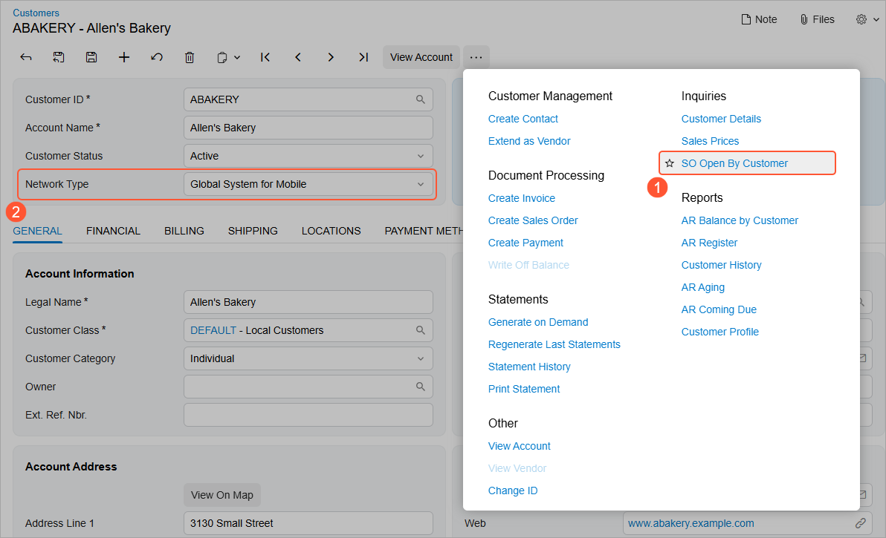
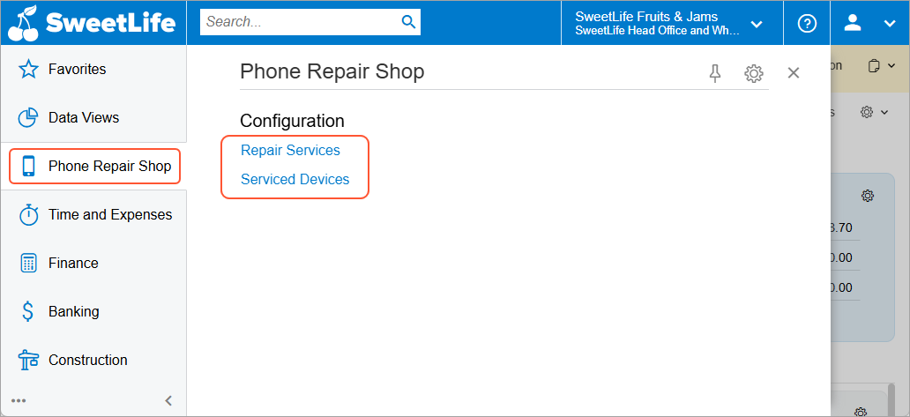
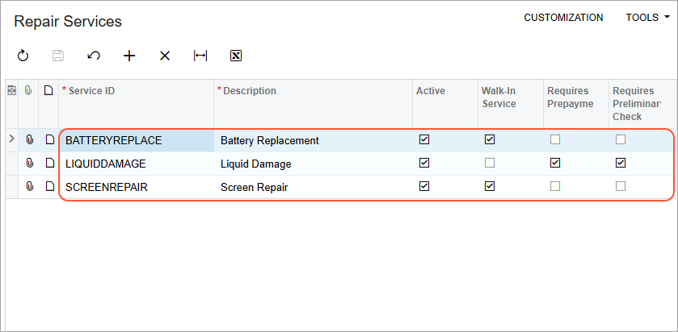
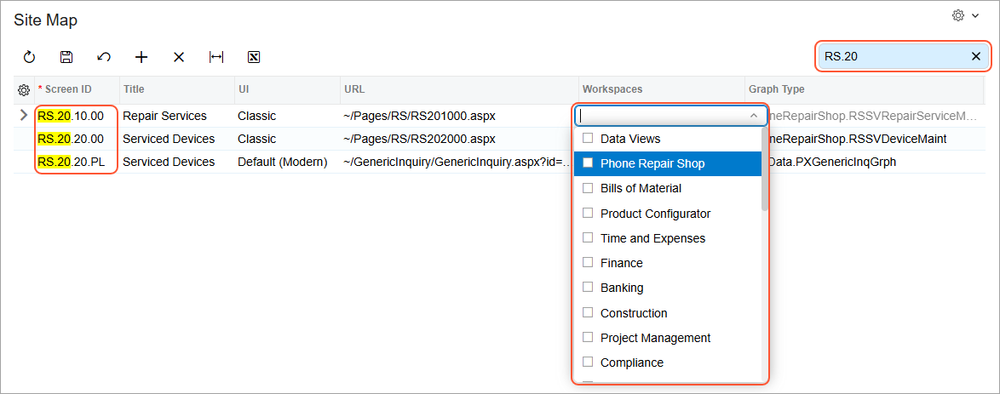
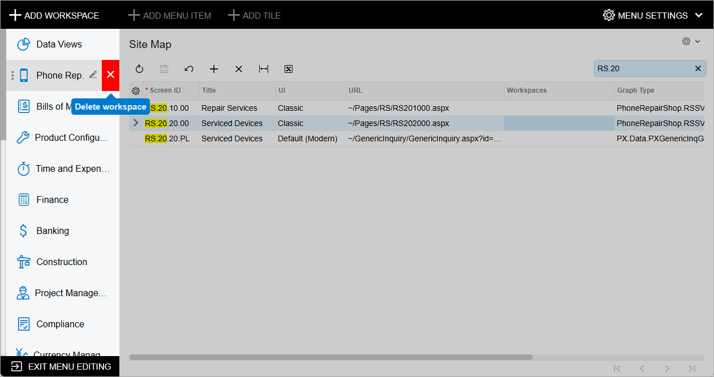
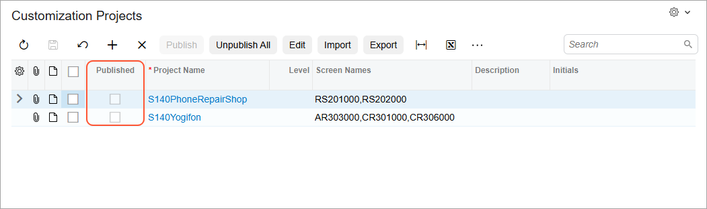

# Customization Projects: To Publish Projects {#_b7c3ba0c-f190-4435-b82a-43e924988448 .task}

The following activity will walk you through the process of publishing customization projects.

**Attention:** This activity is based on the *U100* dataset. If you are using another dataset or if any system settings have been changed in *U100*, these changes can affect the workflow of the activity and the results of the processing. To avoid issues, restore the *U100* dataset to its initial state.

## Story { .section}

Suppose that the SweetLife Fruits &amp; Jams company has decided to investigate new business opportunities. For this purpose, the company has received two customization projects from a third-party vendor for a trial run. Acting as the system administrator, you need to apply these customizations to a sandbox \(an instance of Acumatica ERP that has no production tenants\).

The customization projects will introduce the following functionality.

|Customization Project|Website Changes|Metadata|
|---------------------|---------------|--------|
|*S140Yogifon*|Adds a predefined field \(**Type**\) to the **General** tab \(**Account Address** section\) of the [Customers](AR_30_30_00.md) \(AR303000\) form.|-   Adds the Open Sales Orders by Customers \(GI400001\) generic inquiry to the database and to the site map
-   Adds a user-defined field \(**Network Type**\) to the [Customers](AR_30_30_00.md) form
-   Adds the **SO Open by Customers** command in the More menu; a user clicks this command to open the corresponding generic inquiry

|
|*S140PhoneRepairShop*|Adds two forms: Repair Services \(RS201000\) and Serviced Devices \(RS202000\). The company will use these forms to manage the lists of repair services that are provided and devices that can be serviced, respectively. Also adds the Serviced Devices \(RS2020PL\) generic inquiry|-   Adds the **Phone Repair Shop** workspace
-   Adds the forms and generic inquiry to the site map and specifies the Serviced Devices \(RS2020PL\) generic inquiry to be used as the entry-point form for the Serviced Devices \(RS202000\) form
-   Adds test data—that is, predefined services and devices

|

## Process Overview { .section}

You will import the deployment packages \(each of which is a file with the contents of a customization project\) and then publish the customization projects by using the [Customization Projects](SM_20_45_05.md) \(SM204505\) form. Then you will review how the applied customization projects have affected the system.

By using the same form, you will unpublish all the projects. Then you will restore the user interface of the tenant to its previous state as follows:

-   On the [Site Map](SM_20_05_20.md) \(SM200520\) form, you will clear the check boxes in the **Workspaces** column for the forms and inquiries that were introduced by the customization projects.
-   You will remove the **Phone Repair Shop** menu item, which was used to open the workspace of the same name, from the main menu.

## System Preparation { .section}

Before you start publishing customization projects, you should do the following:

1.  Request the *S140PhoneRepairShop* and *S140Yogifon* deployment packages by emailing to *training@acumatica.com*.
2.  Launch the Acumatica ERP website, and sign in to a company with the *U100* dataset preloaded; you should sign in as system administrator by using the *gibbs* username and the *123* password.

## Step 1: Uploading Deployment Packages { .section}

To upload the *S140PhoneRepairShop* and *S140Yogifon* deployment packages, do the following:

1.  Open the [Customization Projects](SM_20_45_05.md) \(SM204505\) form.
2.  On the form toolbar, click **Import**.
3.  In the **Open Package** dialog box, which opens, click **Choose File**, and select the `S140PhoneRepairShop.zip` deployment package.
4.  Click **Upload**.

    The system adds a new record to the table with the imported *S140PhoneRepairShop* customization project.

5.  On the form toolbar, click **Import**.
6.  In the **Open Package** dialog box, which opens, click **Choose File** and select the `S140Yogifon.zip` deployment package.
7.  Click **Upload**.

    The system adds a new record to the table with the imported *S140Yogifon* customization project.

## Step 2: Publishing the Customization Projects {#section_tj2_htk_qpb .section}

To publish the customization projects, do the following:

1.  While you are still on the [Customization Projects](SM_20_45_05.md) \(SM204505\) form, select the unlabeled check boxes in the *S140PhoneRepairShop* and *S140Yogifon* rows, and click **Publish** on the form toolbar.
2.  In the **Customization Publishing** dialog box, which opens, wait for the validation to finish successfully, and click **Publish**.
3.  When the system displays the *Website updated* message in the **Customization Publishing** dialog box \(shown in the following screenshot\), close the dialog box.

    

    The system applies the packages and reloads the website. Notice that the **Published** check box is now selected for both customization projects in the table.

## Step 3: Reviewing the Changes Introduced by the Customization Projects { .section}

To review the changes that have been introduced by the publication of the customization projects, do the following:

1.  Open the Customers \(AR3030PL\) form.
2.  In the **Customer ID** column, click *ABAKERY*.
3.  On the [Customers](AR_30_30_00.md) \(AR303000\) form, notice the following changes, which have appeared on the form as a result of the *S140Yogifon* customization project being published:

    -   The **SO Open by Customer** command appears on the More menu \(see Item 1 in the following screenshot\).
    -   A new **Network Type** box \(Item 2\) appeared as a user-defined field in the **Section Configuration** dialog box.
    

4.  To review the changes introduced by the *S140PhoneRepairShop* customization project, on the main menu, click the new **Phone Repair Shop** menu item to open the workspace, which has been added. The workspace includes two forms from the customization project, as the following screenshot demonstrates.

    

5.  Open the Repair Services \(RS201000\) form. The system opens the form with the list of services defined in the test data, as shown in the following screenshot.

    

6.  In the **Phone Repair Shop** workspace, click the *Serviced Devices* link. The system opens the Serviced Devices \(RS202000\) form.
7.  Select *IPHONE6* in the **Device Code** column to see the settings of this device.

## Step 4: Restoring the Initial User Interface { .section}

To remove the changes to the user interface that the system could not revert while unpublishing the customization projects, do the following:

1.  Open the [Site Map](SM_20_05_20.md) \(SM200520\) form.
2.  In the **Workspaces** column, clear the selected check boxes in the rows with the following identifiers in the **Screen ID** column \(see the following screenshot\):

    **Tip:** To quickly find the needed forms, type `RS.20` in the Search box on the form toolbar.

    -   *RS.20.10.00*
    -   *RS.20.20.00*
    -   *RS.20.20.PL*
    

3.  On the form toolbar, click **Save**.
4.  In the lower left corner of the screen, click the **Open Configuration Menu** button, and then click **Edit Menu**.
5.  On the main menu, point at the **Phone Repair Shop** menu item, and on the pop-up toolbar, click **Delete Workspace**, as the following screenshot demonstrates.

    

6.  Click **OK** in the warning dialog box.
7.  Click **Exit Menu Editing**.

## Step 5: Unpublishing the Customization Projects { .section}

To unpublish the customization projects, do the following:

1.  Open the [Customization Projects](SM_20_45_05.md) \(SM204505\) form.
2.  On the form toolbar, click **Unpublish All**. Wait for the system to complete the operation.

    Notice that the **Published** check box is cleared for all customization projects in the table \(as shown in the following screenshot\).

    

You applied the *S140Yogifon* and *S140PhoneRepairShop* customization projects to a tenant on your instance. Then you reviewed how the publication of the projects affected the tenants. You have unpublished the customization projects and cleaned up the user interface.

**Parent topic:**[Publishing Customization Projects](../UserGuide/SA_Publishing_Customization_Projects_Mapref.md)

