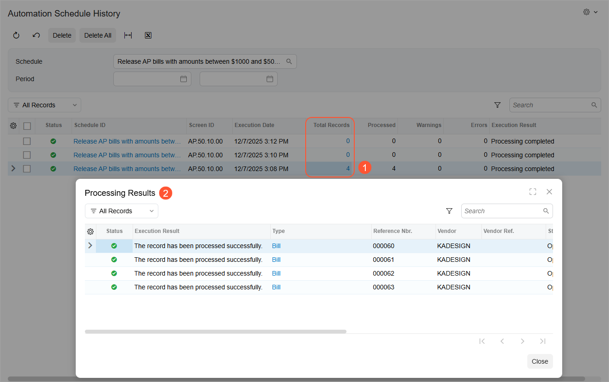

# Automated Processing: To Configure Scheduled Processing {#_3cca2ff7-b9e1-47bf-97e1-fec9fa333786 .task}

The following activity will walk you through the scheduling of automated processing for a particular form.

**Attention:** This activity is based on the *U100* dataset. If you are using another dataset or if any system settings have been changed in *U100*, these changes can affect the workflow of the activity and the results of the processing. To avoid issues, restore the *U100* dataset to its initial state.

## Story { .section}

Suppose that in the SweetLife Fruits &amp; Jams company, AP clerks enter the bills into the system on a daily basis. The accountant does not need to manually release bills for the Karn Design Inc. vendor with amounts more than $1000 and less than or equal to $5000. These bills should be released automatically to free up the accountant's time.

You, as the system administrator, need to schedule this processing—that is, automate the release of AP documents that have the *Balanced* status, the *KADESIGN* vendor, and amounts of or more than $1000 and less than or equal to $5000.

**Tip:** The details of the processes of releasing and posting AP documents are outside of the scope of this activity. For details, see [Processing AP Bills](Finance_ProcessingAPBills_Mapref.md).

## Configuration Overview { .section}

In the *U100* dataset, the following tasks have been performed to support this activity:

-   The *Scheduled Processing* feature has been enabled on the [Enable/Disable Features](CS_10_00_00.md) \(CS100000\) form.
-   On the [Vendors](AP_30_30_00.md) \(AP303000\) form, the *KADESIGN* vendor has been created.
-   On the [Bills and Adjustments](AP_30_10_00.md) \(AP301000\) form, a few AP bills for the *KADESIGN* vendor have been created.

## Process Overview { .section}

You will use the [Release AP Documents](AP_50_10_00.md) \(AP501000\) form to filter documents by amount. Then you will open the [Automation Schedules](SM_20_50_20.md) \(SM205020\) form by clicking **Schedules** &gt; **Add** on the form toolbar.

On the [Automation Schedules](SM_20_50_20.md) form, you will adjust the settings of the schedule. You will add the condition to make the system process AP bills for the *KADESIGN* vendor and execute the schedule every two minutes daily.

You will review successive executions of the processing and clear the history of the executions on the [Automation Schedule History](SM_20_50_35.md) \(SM205035\) form.

Finally, you will switch off the schedule execution on the [Automation Schedules](SM_20_50_20.md) form.

## System Preparation { .section}

Before you start scheduling automated processing, you should do the following:

1.  Launch the Acumatica ERP website, and sign in to a company with the *U100* dataset preloaded; you should sign in as system administrator by using the *gibbs* username and the *123* password.
2.  Make sure that on the Company and Branch Selection menu, in the top pane of the Acumatica ERP screen, the *SweetLife Head Office and Wholesale Center* branch is selected.
3.  Make sure that the business date in your system is set to 1/30/2026. If a different date is displayed, click the Business Date menu button in the top pane of the Acumatica ERP screen, and select 1/30/2026 in the calendar.

## Step 1: Filtering Documents by Amount { .section}

To apply a filter to a table column, do the following:

1.  Open the [Release AP Documents](AP_50_10_00.md) \(AP501000\) form.
2.  In the list of bills, click the header of the **Amount** column.
3.  In the Sorting and Filtering Settings dialog box, which opens, do the following:
    1.  Select **Is Between** in the list of filter conditions.
    2.  In the **From** box, type `1000`.
    3.  In the **To** box, type `5000`.
    4.  At the bottom of the dialog box, click **Apply**.

The system is now displaying only documents with amounts that are more than $1000 and less than or equal to $5000.

## Step 2: Scheduling Automated Release of AP Documents { .section}

To schedule the automated release of AP documents, do the following:

1.  While you are still on the [Release AP Documents](AP_50_10_00.md) \(AP501000\) form with the filter applied to the **Amount** column, click **Schedules** &gt; **Add** on the form toolbar.
2.  On the [Automation Schedules](SM_20_50_20.md) \(SM205020\) form, which opens in a pop-up window, specify the following settings in the Summary area, and leave the default settings in the other elements:
    -   **Description**: `Release AP bills with amounts between $1000 and $5000`
    -   **Action**: *Mass-Process*
    -   **Action Name**: *Release All*
3.  On the **Details** tab, specify the following settings, and leave the default settings in the other elements:
    -   **No Expiration Date**: Selected
    -   **No Execution Limit**: Selected
    -   **Keep Full History**: Selected
4.  On the **Schedule** tab of the schedule, specify the following settings, and leave the default settings in the other elements:
    -   **Daily**: Selected
    -   **Start Time**: *11:00 PM*
5.  On the **Conditions** tab of the schedule, verify that the system has copied the condition specified in the filter. That is, the settings of the row should be filled in as follows:
    -   **Active**: Selected
    -   **Field Name**: *Amount*
    -   **Condition**: *Is Between*
    -   **Value**: *1,000.00*
    -   **Value 2**: *5,000.00*
6.  On the form toolbar, click Save &amp; Close.

## Step 3: Modifying the Scheduled Release of AP Documents { .section}

Now you will change schedule so that the system processes AP bills with amounts equal to or more than $1000 USD and less than or equal to $5000 USD for the *KADESIGN* vendor and executes the schedule every two minutes for one hour daily. To modify the scheduled release of the AP documents, do the following:

1.  While you are still viewing the AP documents on the [Release AP Documents](AP_50_10_00.md) \(AP501000\) form, click **Schedules** &gt; **View** on the form toolbar.

    **Tip:** If the command is not displayed, reload the browser page.

2.  On the [Automation Schedules](SM_20_50_20.md) \(SM205020\) form, which opens in a pop-up window, specify the following settings on the **Schedule** tab:
    -   **Start Time**: The current time plus one minute
    -   **Stops On**: The current time plus one hour
    -   **Every**: *00:02*
3.  On the **Conditions** tab of the schedule, add a row with the following settings:
    -   **Active**: Selected
    -   **Field Name**: *Vendor*
    -   **Condition**: *Equals*
    -   **Value**: *KADESIGN*
4.  In the **Description** box in the Summary area, change the description as follows: `Release AP bills with amounts between $1000 and $5000 for KADESIGN`.
5.  On the form toolbar, click Save &amp; Close.

## Step 4: Viewing and Deleting the History of the Schedule { .section}

To view and then delete the history of the schedule, do the following:

1.  While you are still on the [Release AP Documents](AP_50_10_00.md) \(AP501000\) form, click **Schedules** &gt; **History** on the form toolbar.
2.  On the [Automation Schedule History](SM_20_50_35.md) \(SM205035\) form, which opens in a new browser tab, the system displays the history of all schedules configured for this form. In the **Schedule** box of the Selection area, select the schedule with the *Release AP bills with amounts between $1000 and $5000 for KADESIGN* description.
3.  Verify that the system has executed the processing at least once since you modified the schedule in the previous step.

    **Tip:** If no records are displayed, click **Refresh** on the form toolbar.

4.  In the **Total Records** column, click a link that holds a nonzero number of the processed records \(see Item 1 in the following screenshot\).
5.  In the **Processing Results** dialog box, which opens, review the processing results \(Item 2\).

    

6.  Close the **Processing Results** dialog box.
7.  On the form toolbar, click **Delete All** to clear the execution history of the selected schedule.

## Step 5: Deactivating the Schedule { .section}

To switch off the *Release AP bills with amounts between $1000 and $5000 for KADESIGN* schedule, do the following:

1.  Open the [Automation Schedules](SM_20_50_20.md) \(SM205020\) form.
2.  In the **Schedule ID** box, select *Release AP bills with amounts between $1000 and $5000 for KADESIGN*.
3.  In the Summary area, clear the **Active** check box.
4.  Click **Save** on the form toolbar.

In this activity, you have configured a scheduled release of AP documents by opening the [Automation Schedules](SM_20_50_20.md) form in a pop-up window on the [Release AP Documents](AP_50_10_00.md) \(AP501000\) form.

Then you have modified the schedule settings to review the successive executions of the processing and cleared the history of the executions on the [Automation Schedule History](SM_20_50_35.md) \(SM205035\) form.

Finally, you switched off the schedule execution on the [Automation Schedules](SM_20_50_20.md) form.

**Parent topic:**[Scheduling Automated Processing](../UserGuide/SA_Scheduling_Automated_Processing_Mapref.md)

