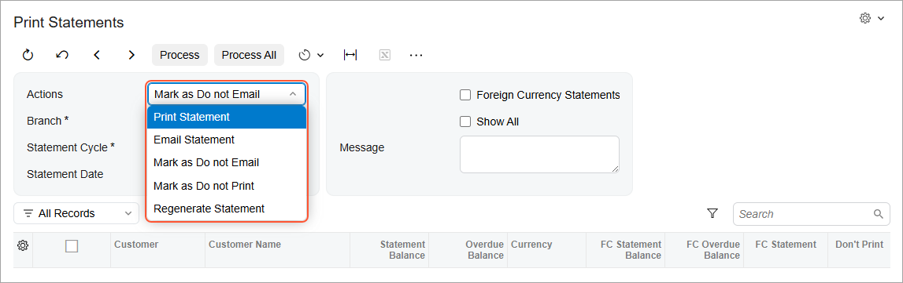
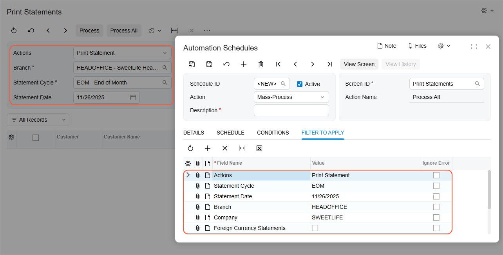
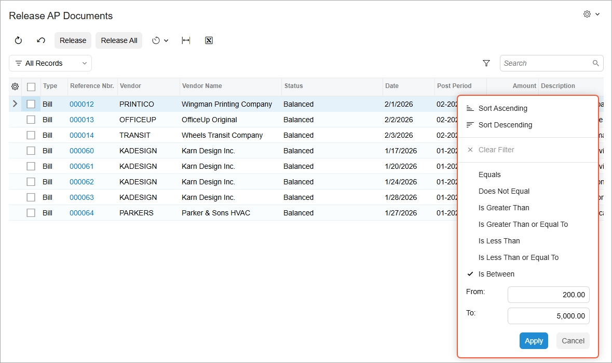
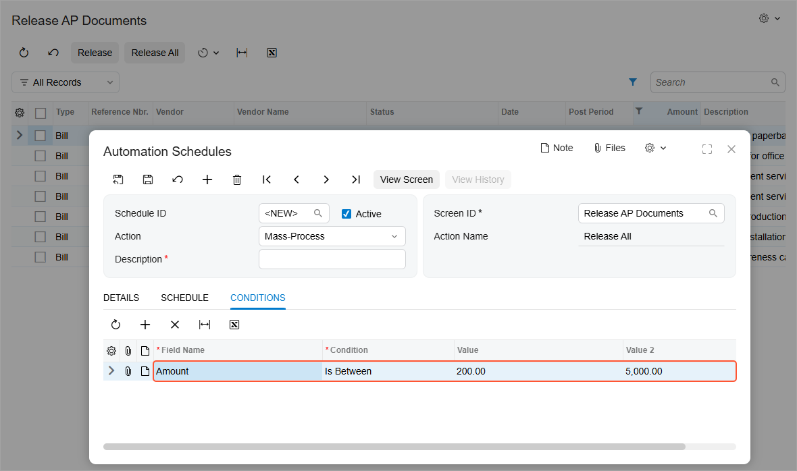

# Automated Processing: General Information {#_8a6c65f2-2379-48e1-b249-fb70d8122c4e .concept}

In any ERP system, such tasks as the processing of documents require significant time and system resources. These tasks should be processed at times when there are no employees at work, such as weekends or nights. Other processing, such as releasing or posting documents, takes less time but should also be performed regularly, with the frequency determined by your business' needs.

Scheduling this processing to be performed automatically relieves you and your employees of remembering this processing while ensuring that the processing is performed regularly at times that will not affect users' work.

When you set up automatic processing, you will have to create separate schedules for each set of documents you generally process \(or for the most time-consuming ones\) and manually process the rest of the documents.

## Learning Objectives { .section}

In this chapter, you will learn how to do the following:

-   Schedule automatic processing
-   View the history of executions
-   Delete the history of scheduled processes

## Applicable Scenarios { .section}

You schedule automated processing in the following cases:

-   If the processing of some records requires significant time and system resources, such as the validation of accounts
-   If there are regular operations that need to be performed frequently, such as releasing or posting documents

## Configuring Scheduled Execution { .section}

Acumatica ERP has a variety of mass-processing forms so that you can process multiple records at once. You can schedule the automatic execution of a specific operation for the records that match certain conditions.

You can configure a scheduled execution of a specific operation from scratch by using the settings on the [Automation Schedules](SM_20_50_20.md) \(SM205020\) form. On the form, you specify the mass-processing form for which you will configure a schedule, the operation to execute, the execution and frequency settings, and the conditions for the records.

Alternatively, you can ease the configuration by opening the [Automation Schedules](SM_20_50_20.md) form directly from the target processing form. This approach can be useful if you need to configure the selection of specific records for the processing. Multiple mass-processing forms have a Selection area with elements that can filter of the records or specify the operation to be performed on the records. Additionally, you can apply simple or advanced filters to the table records to form the needed set of records. When you then open the [Automation Schedules](SM_20_50_20.md) form by using **Schedules** &gt; **Add** on the form toolbar, the system populates the newly created schedule with the form identifier and the settings of the configured conditions, and you need to specify only the execution and frequency settings of the schedule.

When you need to run a report regularly, you can create a schedule directly from its report form. By creating the schedule in this way, you can specify which email template will be used to send the report. To schedule the report, do the following:

1.  Go to the **Email Notifications** tab on the report form and click **Schedule Report** on the table toolbar. This opens the [Email Templates](SM_20_40_03.md) \(SM204003\) form and automatically populates it with the report identifier, format, email settings, and other relevant parameters from the report form.
2.  Save the email template.
3.  Create a new schedule by clicking **Create Schedule** on the table toolbar of the **Send By Schedules** tab. The [Automation Schedules](SM_20_50_20.md) form opens in a pop-up window, where you can specify the execution and frequency settings for the schedule.

**Attention:** The system uses the *admin* user account to run scheduled processes. This account uses the first available system locale that is specified on the [System Locales](SM_20_05_50.md) \(SM200550\) form for the company with the schedule.

## Selecting the Action {#section_atn_nbc_lqb .section}

When you configure a scheduled execution on the [Automation Schedules](SM_20_50_20.md) \(SM205020\) form, you need to select the action type in the **Action** drop-down box:

-   *Mass-Process*: The system should perform the action on the form you specify in the **Screen ID** box. You should also specify the exact action to execute in the **Action Name** box.
-   *Raise Business Event*: The system should raise and process the business events configured for the inquiry form you specify in the **Screen ID** box. You need to specify the business events on the [Business Events](SM_30_20_50.md) \(SM302050\) form.
-   *Send Email Notification*: The system should send the email notifications specified on the Email Notifications tab. These notifications must first be configured on the [Email Templates](SM_20_40_03.md) \(SM204003\) form.

Depending on what action type you select in this box, certain UI elements will be displayed or hidden on the [Automation Schedules](SM_20_50_20.md) form.

## Specifying Schedule Duration { .section}

You can specify the duration of the schedule's life on the **Details** tab of the [Automation Schedules](SM_20_50_20.md) \(SM205020\) form. By using the **Starts On** and **Expires On** boxes, you define the period of time during which the system should execute the schedule.

If you need the system to run the schedule forever, you select the **No Expiration Date** check box on the tab.

## Limiting Schedule Executions { .section}

You can limit the number of schedule executions by using the **Execution Limit** box on the **Details** tab of the [Automation Schedules](SM_20_50_20.md) \(SM205020\) form. The system will stop executing the schedule if the limit is reached, even if the schedule has not expired yet.

If there is no need to limit the number of executions, you select the **No Execution Limit** check box on the tab.

## Retaining History { .section}

Keeping the history of schedule executions can be useful if you need to investigate any issues with the processed records. However, history records can take up a lot of space in the database. You can limit the number of executions to keep in the history by using the **Executions to Keep in History** box on the **Details** tab of the [Automation Schedules](SM_20_50_20.md) \(SM205020\) form. The system will keep history records only for the specified number of the most recently performed executions.

If you need to keep all the schedule executions for some reason, you select the **Keep Full History** check box on the tab.

## Setting the Frequency { .section}

On the **Schedule** tab of the [Automation Schedules](SM_20_50_20.md) \(SM205020\) form, you can specify the execution schedule with an accuracy of up to a minute. For details, see [Automated Processing: Schedule Types](SA_Scheduling_Automated_Processing_Schedule_Types_Concept.md).

## Specifying Filter Values { .section}

When scheduling mass-processing operations, you may notice that many of the processing forms have a Selection area with elements that make it possible to filter the records or select a specific action to perform on the records, as shown below.

**Attention:** We strongly recommend that you specify the settings of the Selection area on the target processing form, because this form has a validation mechanism behind the elements. The elements can be required for processing or can depend on other elements of the area. The business logic behind the elements is not validated on the [Automation Schedules](SM_20_50_20.md) \(SM205020\) form.

If you specify settings for the elements in the Selection area and then open the [Automation Schedules](SM_20_50_20.md) form by clicking **Schedules** &gt; **Add** on the form toolbar, the system adds only the elements for which a value was specified on the **Filter Values** tab \(see below\).

When you create a schedule for this type of form directly on the [Automation Schedules](SM_20_50_20.md) form, the system displays only the elements of the Selection area that have a default value on the **Filter Values** tab of the form. If you need to add other elements to the schedule, we recommend at least testing the configuration on the target processing form and then proceeding with the schedule configuration.

When the system executes the processing, it first inserts the values specified for the filters in the corresponding elements of the Selection area and then proceeds with the execution.

## Applying Filters { .section}

When scheduling mass-processing operations or general inquiry forms, you can also apply simple and advanced filters \(if available\) to the records.

You can filter the list of records by any column available in the table by setting up a simple filter, as shown below.

Suppose that you apply a simple or advanced filter to the records on a processing form and then open the [Automation Schedules](SM_20_50_20.md) form by clicking **Schedules** &gt; **Add** on the form toolbar. The system copies the specified conditions to the **Conditions** tab of the schedule \(shown below\). You can manually add other conditions or adjust existing ones on the tab, if needed.

When you create a schedule directly on the [Automation Schedules](SM_20_50_20.md) form, you can specify the needed conditions manually on the **Conditions** tab of the schedule.

## Monitoring Schedule Execution { .section}

Once you have assigned the processing to the schedule, the processing of the form will be performed automatically, in accordance with the assigned schedule.

To view all scheduled processes configured in the system and their details, you use the [Automation Schedule Statuses](SM_20_50_30.md) \(SM205030\) form. You can click the following buttons on the form toolbar of this form:

-   **View History** to view the history of a selected schedule on the [Automation Schedule History](SM_20_50_35.md) \(SM205035\) form
-   **View Screen** to open the form for which the schedule was configured

Alternatively, on the target processing form, you can click **Schedules** &gt; **History** on the form toolbar, and the system opens the [Automation Schedule History](SM_20_50_35.md) form so that you can view the history of schedule execution in a specified date range.

Also, you can use the [Automation Schedule History](SM_20_50_35.md) form to clear the history of a scheduled processing as a part of database maintenance routines. For each scheduled processing, you can delete the historical records of all executions by clicking **Delete All** on the form toolbar. Also, you can delete particular records, by selecting the records in the table and clicking **Delete** on the form toolbar.

**Parent topic:**[Scheduling Automated Processing](../UserGuide/SA_Scheduling_Automated_Processing_Mapref.md)

