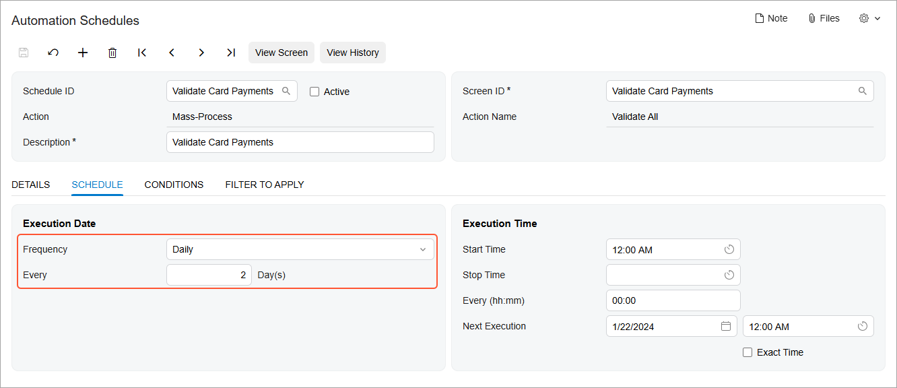
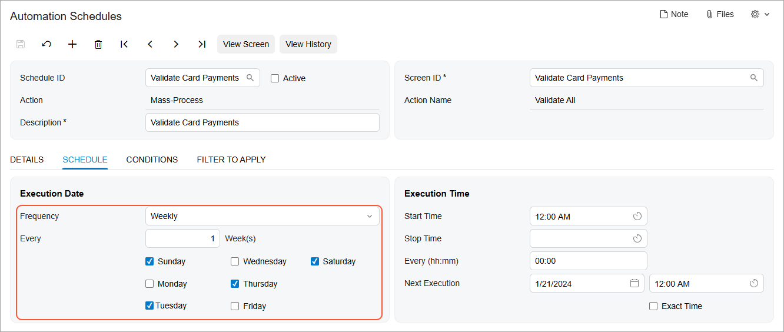
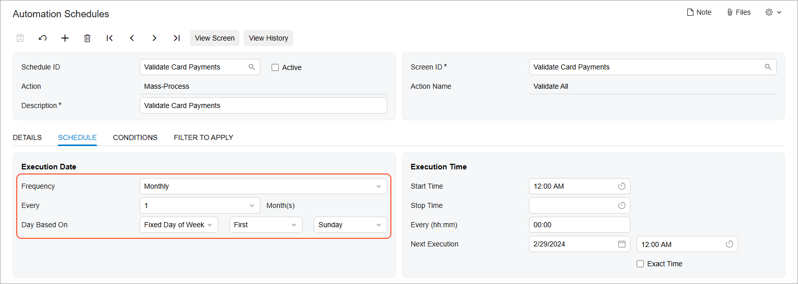
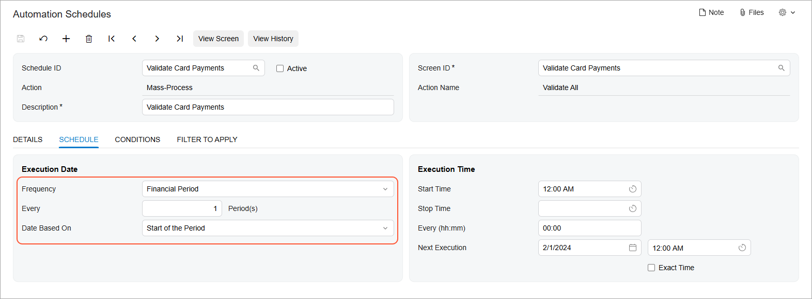
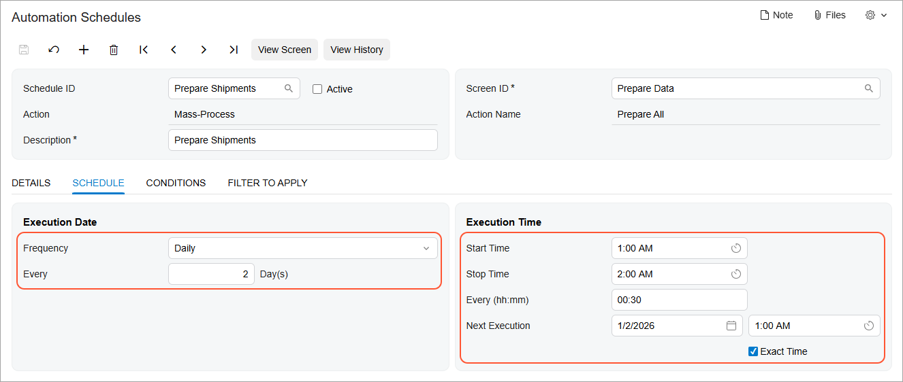

# Automated Processing: Schedule Types {#_9824c0dd-95e1-43a0-a903-5c614d949ee9 .concept}

In Acumatica ERP, you can configure various types of schedules with the frequency of execution determined by your business needs.

You use the settings on the **Schedule** tab of the [Automation Schedules](SM_20_50_20.md) \(SM205020\) form to specify the frequency and time of a particular schedule's execution. First, you select a frequency in the **Execution Date** section. Then you specify additional settings for the selected frequency in the **Execution Time** section and configure the timing of the schedule.

## Calculation of the Next Schedule Execution Date { .section}

When you save your specification of a schedule's frequency, details, and time on the [Automation Schedules](SM_20_50_20.md) \(SM205020\) form, the system calculates the next execution date and time for the schedule and updates the value of the **Next Execution Date** box in the **Execution Time** section.

The calculation of a schedule's next execution date for a newly created schedule is performed based on the date specified in the **Starts On** box on the **Details** tab and the **Start Time**, **Stop Time** and **Every** boxes on the **Schedule** tab. If a schedule was run previously and you adjust the settings, the system calculates the next execution date based on the date in the **Last Executed** box on the **Details** tab. Also, you can manually specify a date or time in the **Next Execution Date** box of the **Schedule** tab, if needed.

## Daily Schedule Execution { .section}

With the *Daily* option selected in the **Frequency** box of the **Execution Date** section of the [Automation Schedules](SM_20_50_20.md) \(SM205020\) form, you specify the recurrence of execution in days by using the **Every x Day\(s\)** box. The following screenshot shows the configuration of a schedule that will be executed every two days.

When you save the recurrence settings you have specified, the system automatically adjusts the date and time in the **Next Execution Date** box.

## Weekly Schedule Execution { .section}

With the *Weekly* option selected in the **Frequency** box of the **Execution Date** section of the [Automation Schedules](SM_20_50_20.md) \(SM205020\) form, you specify the recurrence of execution in weeks by using the **Every x Week\(s\)** box. Additionally, you specify the exact weekdays when the processing should be run. For the schedule configured in the following screenshot, execution will occur every three weeks, on Monday and Friday.

When you save the recurrence settings you have specified, the system automatically adjusts the date and time in the **Next Execution Date** box.

## Monthly Schedule Execution { .section}

With the *Monthly* option selected in the **Frequency** box of the **Execution Date** section of the [Automation Schedules](SM_20_50_20.md) \(SM205020\) form, you specify the recurrence of execution in months by using the **Every x Month\(s\)** box. Also, you can specify the exact day of month when the system should run the processing by selecting the *Fixed Day of Month* option in the **Day Based On** box and specifying the day number in a month. Alternatively, you can select the *Fixed Day of Week* option; in the first adjacent box, you specify the ordinal number representing the week of the month \(*First*, *Second*, *Third*, *Fourth*, or *Last*\), and in the second box, you select *Weekday*, *Weekend*, or the exact weekday of schedule execution.

For the *Weekday* or *Weekend* option, the system will automatically calculate the date for each month, regardless of its duration. For example, in the following screenshot, *Last* and *Weekday* are selected, indicating that the system will execute the schedule on the last weekend day of each month.

When you save the recurrence settings you have specified, the system automatically adjusts the date and time in the **Next Execution Date** box.

## Schedule Execution by Financial Period { .section}

With the *By Financial Period* option selected in the **Frequency** box of the **Execution Date** section of the [Automation Schedules](SM_20_50_20.md) \(SM205020\) form, you specify the recurrence of the execution in financial periods by using the **Every x Period\(s\)** box

Also, you specify when during the period the system should execute the processing by selecting one of the following options:

-   *Start of the Period*
-   *End of the Period*
-   *Fixed Day of the Period* \(for this option, you also specify the day\)

The following screenshot demonstrates a sample configuration of a schedule executed with a frequency calculated by the dates of financial periods; in this case, the schedule is executed every other period, on the first day of the period.

The system will calculate the schedule dates according to the periods generated in the system on the [Master Financial Calendar](GL_20_10_00.md) \(GL201000\) form, in addition to the start date of the schedule or its last execution date.

When you save the recurrence settings you have specified, the system automatically adjusts the date and time in the **Next Execution Date** box.

## Schedule Execution Time { .section}

With Acumatica ERP you can configure the execution of scheduled processing down to the minute. This capability can be useful when you schedule the processing of operations that should be run in a particular order.

For each schedule, you can specify the particular time zone whose times will be used in the **Time Zone** box on the **Details** tab of the [Automation Schedules](SM_20_50_20.md) \(SM205020\) form. By default, the system inserts the time zone specified in the profile of the user who creates the schedule. If a time zone is not specified for the user, then the system inserts the time zone specified for the application server.

When you create a schedule, you need to specify the time when the system should start the execution of the processing in the **Start Time** box of the **Execution Time** section on the **Schedule** tab of the form. The system inserts the same time in the **Next Execution Date** box. You can manually adjust the execution date and time, if needed, and the system will change the next execution time accordingly.

Also, if you select the **Exact Time** check box of the **Execution Time** section, the system will execute the schedule at exactly the time specified in the **Next Execution Date** box. If the check box is cleared, the system may shift the next execution time of the schedule by multiple minutes. We recommend that you select this check box if another schedule that depends on the current schedule should be executed after the current schedule.

## Multiple Successive Executions { .section}

In some cases, you may need to run processing multiple times during a particular period of time in a day. To configure this, after you have selected the schedule frequency and specified the schedule details on the **Schedule** tab of the form, in the **Next Execution Date** box, you specify the same date that is specified in the **Starts On** box on the **Details** tab. Also, you should either limit the number of executions to the number of times you expect the system to run the processing or clear the execution limit by selecting the **No Execution Limit** check box on the same tab.

Then you specify the hour and minute of the first execution in the **Start Time** box in the **Execution Time** section of the **Schedule** tab. In the **Stop Time** box, you specify the hour and minute when the last session of the schedule should stop. When the specified time comes, the system finishes the processing of the current record \(if the processing is in mid-record at the stop time\) and proceeds with the remaining records during the next session.

For the specified execution duration, in the **Every \(hh:mm\)** box, you specify the interval in hours and minutes between successive sessions of the execution.

The following screenshot shows a sample configuration of a schedule that the system runs every other day, starting at exactly 1:00 AM; the system repeats the execution every 30 minutes for one hour.

**Parent topic:**[Scheduling Automated Processing](../UserGuide/SA_Scheduling_Automated_Processing_Mapref.md)

