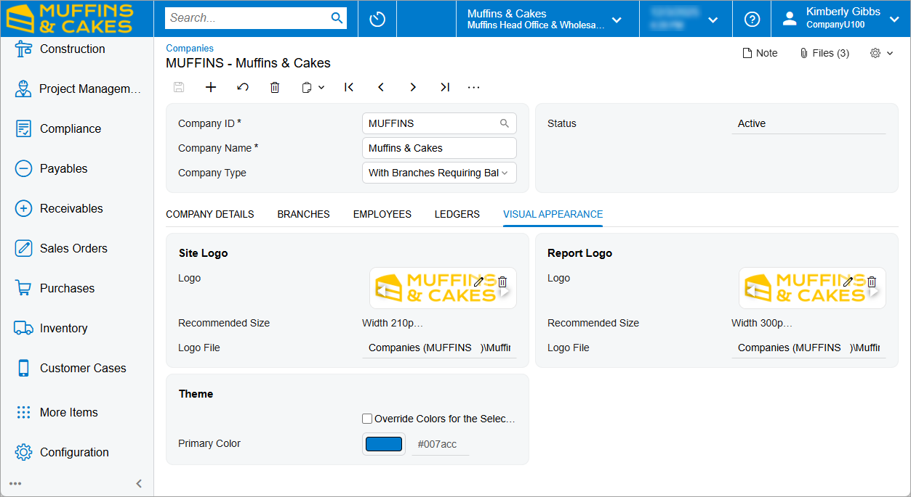

# Company Logo Usage: To Set Up a Logo {#_e0eeb4da-9739-4e4a-85d9-fdf8bfdfd5c7 .task}

The following activity will walk you through the process of configuring the UI to display a company logo.

**Attention:** This activity is based on the *U100* dataset. If you are using another dataset or if any system settings have been changed in *U100*, these changes can affect the workflow of the activity and the results of the processing. To avoid issues, restore the *U100* dataset to its initial state.

## Story { .section}

Suppose that you are a system administrator at the Muffins &amp; Cakes company. You need to configure the user interface to have a specific look and feel for the company, so you are starting with adding to the UI the company logo that the designer has prepared for you.

## Configuration Overview { .section}

For the purposes of this activity, in the *U100* dataset, on the [Companies](CS_10_15_00.md) \(CS101500\) form, the Muffins &amp; Cakes \(*MUFFINS*\) company has been configured.

## Process Overview { .section}

In this activity, on the [Companies](CS_10_15_00.md) \(CS101500\) form, you will specify the company logo of the Muffins &amp; Cakes company, which will be displayed in the upper left corner of Acumatica ERP for all branches of the company.

## System Preparation { .section}

Before you begin adding the company logo, do the following:

1.  Download the [`Muffins_logo.png`](Files/Muffins_logo.png) file.
2.  Launch the Acumatica ERP website, and sign in to a company with the *U100* dataset preloaded; you should sign in as system administrator by using the *gibbs* username and the *123* password.
3.  On the Company and Branch Selection menu in the top pane of the Acumatica ERP screen, make sure that the *Muffins Head Office &amp; Wholesale Center* branch is selected. If it is not selected, click the Company and Branch Selection menu button to view the list of branches that you have access to, and then click *Muffins Head Office and Wholesale Center*.

## Step: Setting Up the UI to Show the Company Logo { .section}

To set up the UI to display the company logo, do the following:

1.  On the [Companies](CS_10_15_00.md) \(CS101500\) form, open the *MUFFINS* company.
2.  In the **Site Logo** section of the **Visual Appearance** tab, click **Browse**.
3.  In the dialog box that opens, click **Upload Files**, open the folder where you have downloaded the file and select the `Muffins_logo.png` file.
4.  Click **Select**.

    The preview of the new logo appears in the **Site Logo** section.

5.  On the form toolbar, click **Save**.

    The Acumatica ERP screen should look as shown in the following screenshot.

    

You have set up the Muffins &amp; Cakes company's logo to be displayed in the upper left corner of the screen.

**Parent topic:**[Using Company Logos](../UserGuide/SA_Using_Company_Logos_Mapref.md)

