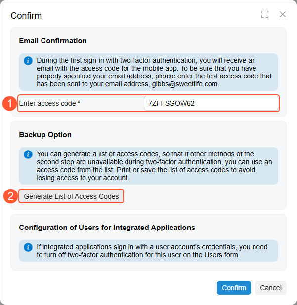
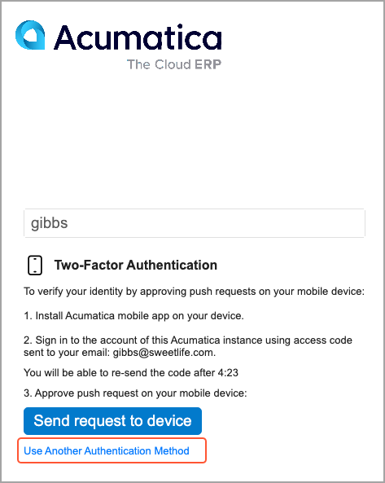
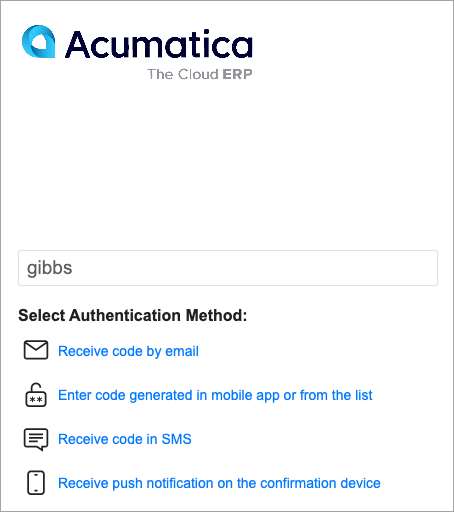
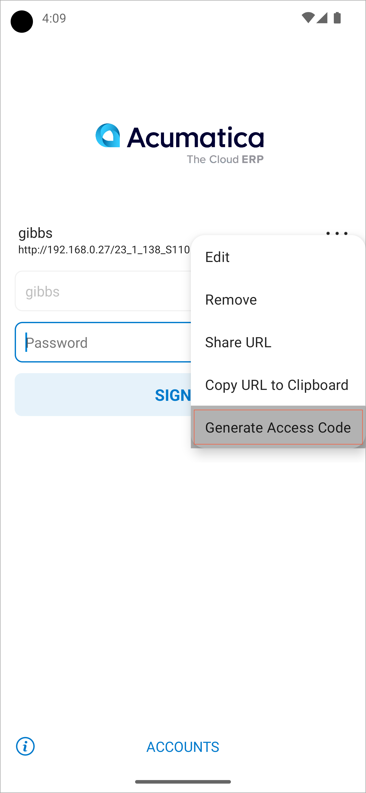
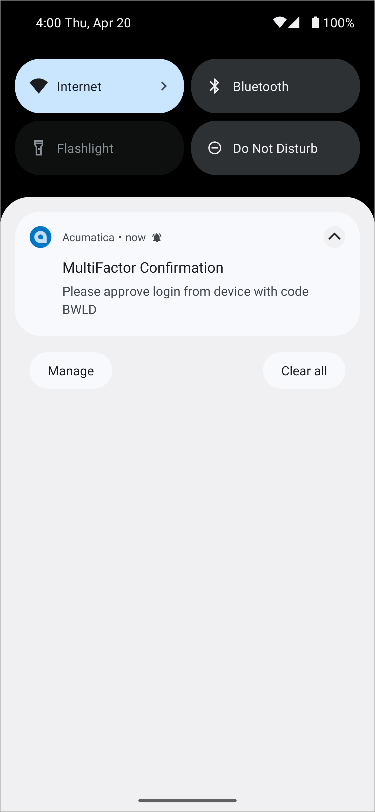
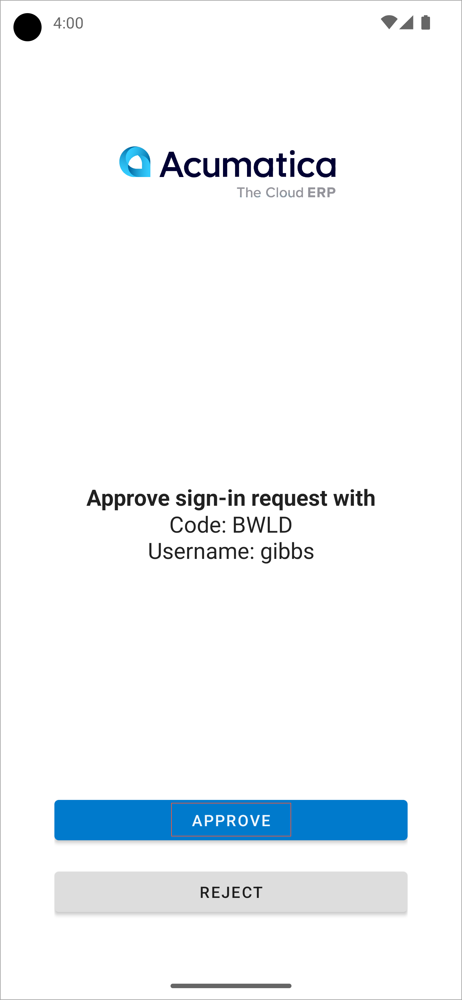
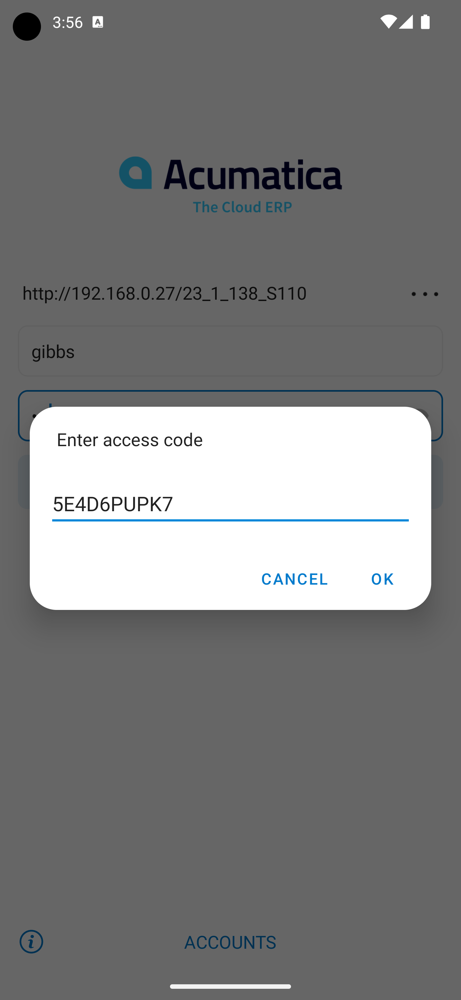
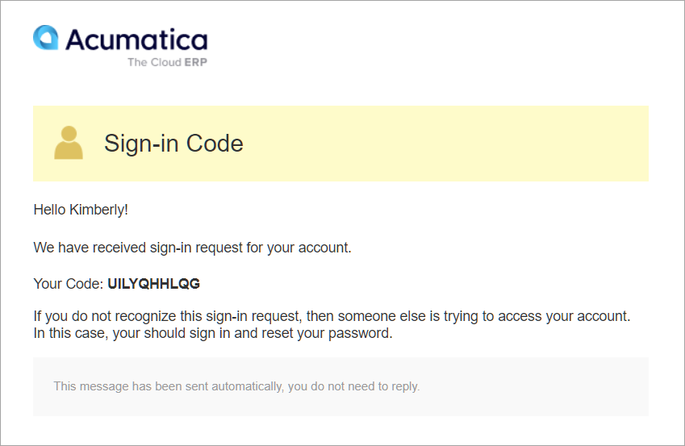

# Two-Factor Authentication: General Information {#_e612d54b-72d9-400c-b913-cdfa02220c58 .concept}

Acumatica ERP and the Acumatica mobile app provide mechanisms to support two-factor authentication, so that you can prevent unauthorized system access. Security-conscious businesses require two-factor authentication to verify users’ identities before these users can be allowed to access sensitive ERP data.

**Attention:** This functionality is available only if the *Two-Factor Authentication* feature is enabled on the [Enable/Disable Features](CS_10_00_00.md) \(CS100000\) form.

## Learning Objectives { .section}

In this chapter, you will learn how to do the following:

-   Activate two-factor authentication system-wide and individually for a user
-   Generate a list of access codes
-   Configure the delivery of access codes by email or through a short message service \(SMS\) message
-   Authenticate yourself by using an access code generated with a mobile device or by approving a push request

## Applicable Scenario { .section}

You use two-factor authentication if your company wants \(or needs\) to verify users’ identities before allowing them to access sensitive ERP data.

## Configuration of System-Wide Two-Factor Authentication { .section}

You use the settings in the **Two-Factor Authentication Policy** section on the [Security Preferences](SM_20_10_60.md) \(SM201060\) form for setting up system-wide two-factor authentication. The settings in this section affect all of the company's users that do not have individual settings specified in the Summary area \(**Two-Factor Authentication** section\) of the [Users](SM_20_10_10.md) \(SM201010\) form.

On the [Security Preferences](SM_20_10_60.md) form, in the **Two-Factor Authentication** box \(**Two-Factor Authentication Policy** section\), you can select one of the following options:

-   *Required*: Two-factor authentication is required for all users of the system who do not have a different option selected on the [Users](SM_20_10_10.md) form, regardless of the specific devices or browsers used to access the web application.
-   *Required for Unknown Devices*: Two-factor authentication is required for any user of the system \(unless the user has a different option selected on the [Users](SM_20_10_10.md) form\) if the user is using a new device or browser to access the web application.

    **Tip:** If a user is trying to access the web application by using the *Private* or *Incognito* mode of a browser, the system will require two-factor authentication with *Required for Unknown Devices* selected.

-   *None* \(default\): Two-factor authentication is not in use in the system.

To complete the activation of two-factor authentication, you click **Save** on the form toolbar, and the system displays the **Confirm** dialog box. In the top sections of the dialog box, the system provides the following possible ways you can confirm the activation of two-factor authentication:

-   A test access code sent to you by email: In the **Enter access code** box \(see Item 1 in the following screenshot\), you enter the access code the system has sent to the email address specified on the [Users](SM_20_10_10.md) \(SM201010\) form for the user account you are currently signed in with.
-   A generated access code: In the **Backup Option** section, you click **Generate List of Access Codes** \(Item 2\). The system generates a PDF document with the list of access codes. You enter an access code to the **Enter access code** box.

After the two-factor authentication has been activated by entering the access code and clicking **OK** in the dialog box, every user needs to present to the system additional evidence \(the second factor\) of authentication in addition to the user credentials.

**Important:** After the two-factor authentication has been activated system-wide, make sure that at least one user has an access code for the first sign-in to either the web application or the mobile app. Otherwise, no one will be able to sign in to the system, and you will need to contact your Acumatica ERP Support provider to resolve the situation.

## Configuration of Individual Authentication { .section}

On the [Users](SM_20_10_10.md) \(SM201010\) form, in the **Two-Factor Authentication** section of the Summary area, you select the **Override Security Preferences** check box in order to override the default system settings and specify the two-factor authentication mode for the specific selected user. Otherwise, the settings specified on the [Security Preferences](SM_20_10_60.md) \(SM201060\) form will be used.

## Configuration of Users for Integrated Applications { .section}

If you activate two-factor authentication system-wide, the settings affect all system users. If there are integrated applications that sign in with some user credentials, you need to turn off the two-factor authentication for these users individually on the [Users](SM_20_10_10.md) \(SM201010\) form. For each of these users, you select the **Override Security Preferences** check box and then select the *None* option in the **Two-Factor Authentication** box. For details on users for integrated applications, see [Integration Development Guide](../IntegrationDevelopmentGuide/IntegrationDev_Guide.md).

## Configuration of Authentication Methods { .section}

By default, the system recommends the push notification method to authenticate the sign-in operation, as shown in the following screenshot. The push notification method of authentication requires the Acumatica mobile app to be set up on a mobile device.

If an employee of your company does not have the Acumatica mobile app installed or has turned off push notifications for the app for some reason, they can sign in by providing the system with an access code that can be delivered by email or an SMS message. Also, the list of access codes can be provided by the system administrator or generated by the user using mobile app or web application. \(You can see the available authentication methods in the following screenshot.\)

**Attention:** After the two-factor authentication has been activated for a user, the user may use authentication methods that involve the Acumatica app only after the user has passed authorization in the app.

## Authentication by Access Code { .section}

If a user does not use the Acumatica mobile app or has turned off push notifications for the app, they can provide an access code as the second factor during authorization. There are several ways to receive an access code.

A system administrator can generate a list of access codes for a user for the first sign-in by clicking the **Generate Access Codes** button on the [Users](SM_20_10_10.md) \(SM201010\) form. The system generates and displays the list of codes that can be exported in PDF or Excel format. Each code can be used only once and has an expiration date. The system administrator shares the list with the user securely. After the first sign-in, the user can generate the individual list of codes by using the **Generate Access Codes** button on the [User Profile](SM_20_30_10.md) \(SM203010\) form; the user can then save the list securely.

If the receipt of an access code by email or an SMS message is configured, a user can select the corresponding authentication method on the sign-in page and enter the received code.

If a user has installed the Acumatica mobile app and has passed authorization there, the app may be used for generation of an access code. The user can click the **Generate Access Code** command in the account editing menu of the mobile app, as shown in the following screenshot.

## Authentication by Push Notifications { .section}

If a user of the system is using the Acumatica mobile app and has allowed push notifications from the app for the applicable device, the system will send an approval request as a push notification to the mobile device, as the following screenshot demonstrates.

The user taps **Approve** in the Acumatica mobile app, and the system completes sign-in to the web application \(see the following screenshot\).

A user can turn push notifications on or off for a registered mobile device on the **Devices** tab of the [User Profile](SM_20_30_10.md) \(SM203010\) form. The **Send Confirmation Push** column on this tab indicates whether the push notification sign-in request will be sent to each particular device when the user tries to sign in to the web application. For details on user access through a user’s mobile device, see [User Access: Mobile Devices](SA_Managing_User_Access_Mobile_Devices_Concept.md).

## First Sign-In to the Mobile App { .section}

If two-factor authentication is required for a particular user, the first time that the user signs in to the Acumatica mobile app, the system will request the security access code. \(The following screenshot shows the prompt to enter the access code.\) The user should use an access code generated for this user account by a system administrator on the [Users](SM_20_10_10.md) \(SM201010\) form. The mobile app will also require the user’s personal information number \(PIN\) or biometric verification when the user signs in.

## Delivery of an Access Code by Email { .section}

You make possible the delivery of an access code by email by selecting the **Allow Email** check box on the [Security Preferences](SM_20_10_60.md) \(SM201060\) form. If you do so, the system suggests this authentication method \(by making the *Receive code by email* link available\) on the sign-in page. When a user selects this method, the system sends a one-time access code to the email address specified for the user on the [Users](SM_20_10_10.md) \(SM201010\) form. The following screenshot demonstrates a sample email with the access code.

We recommend that you make sure that all users have email addresses specified on the [Users](SM_20_10_10.md) \(SM201010\) form, and that all the necessary actions have been performed to make it possible to send and receive emails by schedule. For details, see [Managing Emails](EP__con_Email_Management.md).

## Delivery of an Access Code in SMS { .section}

Acumatica ERP provides integration with the Twillio and Amazon SMS providers. To set up the delivery of an access code in SMS, you configure an SMS provider on the [SMS Providers](SM_20_35_35.md) \(SM203535\) form. Then on the [Security Preferences](SM_20_10_60.md) \(SM201060\) form, you select the **Allow SMS** check box under the **Two-Factor Authentication Policy** section. With the check box selected, the system suggests this authentication method \(by presenting the *Receive code in SMS* link\) on the sign-in page. When a user selects this method, the system sends a one-time access code to the phone number specified for the user on the [User Profile](SM_20_30_10.md) \(SM203010\) form.

We recommend that you test the configuration of the selected SMS provider and make sure that all users have phone numbers specified in the system.

**Parent topic:**[Managing Two-Factor Authentication](../UserGuide/SA_Two_Factor_Auth_Mapref.md)

