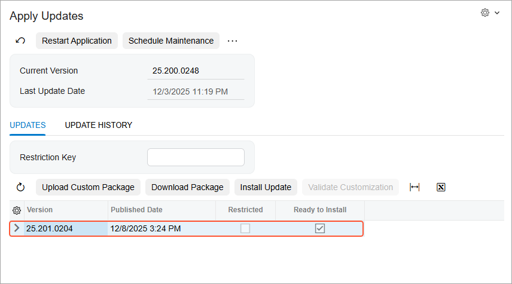

# Update of Acumatica ERP: To Update an Instance by Using the Web Interface {#_9f5c3f5b-7326-4324-9eb2-99014dab87a5 .task}

The following activity will walk you through the process of updating an Acumatica ERP instance by using the web interface.

**Attention:** This activity is based on the *U100* dataset. If you are using another dataset or if any system settings have been changed in *U100*, these changes can affect the workflow of the activity and the results of the processing. To avoid issues, restore the *U100* dataset to its initial state.

## Story { .section}

Suppose that your company has deployed Acumatica ERP on-premises. You are the system administrator, and you have received notification that a new minor update is available. Your manager has approved the update installation.

## Process Overview { .section}

You will download an installation package at the [builds.acumatica.com](https://builds.acumatica.com) website.

In your Acumatica ERP instance, you will use the [Apply Updates](SM_20_35_10.md) \(SM203510\) form to perform the following operations:

1.  Uploading the package with the update
2.  Scheduling system lockout
3.  Unlocking the system

For the purposes of this activity, you will not actually install the update. This is because system updates may take some time, and the instance and all its tenants will not be available during this time.

## System Preparation { .section}

Launch the Acumatica ERP website, and sign in to a company with the *U100* dataset preloaded as the system administrator by using the *gibbs* username and the *123* password.

## Step 1: Downloading an Installation Package { .section}

To download an installation package from the [builds.acumatica.com](https://builds.acumatica.com) website, do the following:

1.  Go to [Amazon Storage](http://acumatica-builds.s3.amazonaws.com/index.html?prefix=builds/25.1).
2.  Open the `Packages` folder from the latest build number of the current Acumatica ERP version \(for example, `builds/25.1/25.100.0054/Packages`\).
3.  Perform the necessary steps, which depend on your browser and settings, to locally save the `ErpPackage.zip` file.

## Step 2: Uploading the Custom Package { .section}

To upload an Acumatica ERP custom package, do the following:

1.  Launch the Acumatica ERP website, and sign in to a company with the *U100* dataset preloaded. You should sign in as the system administrator by using the *gibbs* username and the *123* password.
2.  Open the [Apply Updates](SM_20_35_10.md) \(SM203510\) form.
3.  On the **Updates** tab, click **Upload Custom Package** on the table toolbar.
4.  In the **Upload File** dialog box, click **Choose File**, and select the installation package that you have downloaded earlier in this activity.
5.  Click **Upload**.

    The system adds a new record to the table for the uploaded installation package with the check box in the **Ready to Install** column selected \(see the following screenshot\).

    

## Step 3: Scheduling the System Lockout { .section}

To switch on maintenance mode and lock the system, do the following:

1.  While you are still on the [Apply Updates](SM_20_35_10.md) \(SM203510\) form, click **Schedule Maintenance** on the form toolbar.
2.  In the **Schedule Lockout** dialog box, leave the default settings and click **OK**.
3.  Sign out of the system.
4.  On the Sign-In page, observe the maintenance warning.
5.  Open a new browser window in private mode.
6.  Launch the Acumatica ERP website, and try to sign in to the system as a company accountant by using the *johnson* username and the *123* password.
7.  Notice that the system redirects you to the Maintenance page with the warning, as the following screenshot demonstrates.

    

## Step 4: Unlocking the System { .section}

To stop the lockout of the system, do the following:

1.  In the browser tab that you used to sign in to the system as the system administrator, sign in by using the *gibbs* username and the *123* password. Notice that the home page of your Acumatica ERP instance opens.
2.  Open the [Apply Updates](SM_20_35_10.md) \(SM203510\) form.
3.  On the form toolbar, click **Stop Maintenance**.
4.  Sign out of the system.
5.  On the Sign-In page, notice that the maintenance warning is not displayed.

In this activity, you have downloaded an installation package and uploaded it to the system. You have scheduled the system lockout and then stopped it.

**Parent topic:**[Updating Acumatica ERP by Using the Web Interface](../UserGuide/SA_Updating_Acumatica_by_Using_Web_Interface_Mapref.md)

