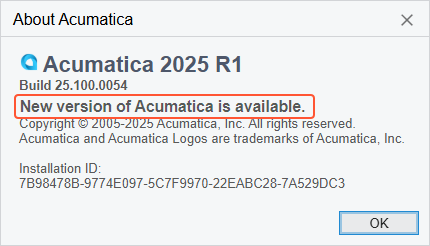
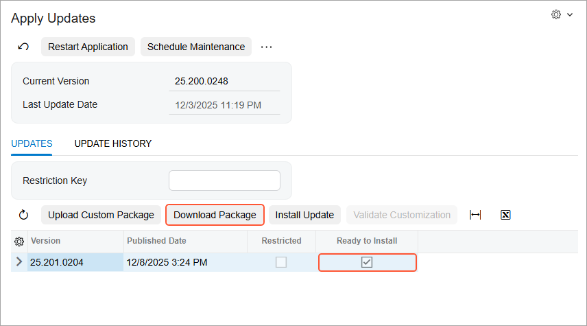
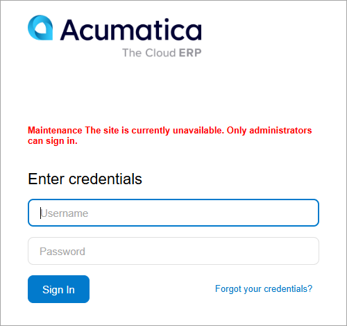

# Update of Acumatica ERP: General Information {#_800ba52f-cf65-4ba5-8b6f-2172e0ffb8aa .concept}

Updates to Acumatica ERP provide functional enhancements and new functionality. Updates are distributed in builds \(as installation packages\), which include fixes to issues that have been reported and may also contain functionality improvements. Builds are cumulative—each new build contains everything from previous builds, along with any new fixes. Thus, you do not have to install any previous builds before you install the latest build.

You can use the Acumatica ERP web interface to remotely update Acumatica ERP \(which is installed on the premises of your organization or on Amazon EC2\) to a newer build of the installed product version.

**Attention:** The ability to update an instance by using the web interface is not available for SAAS customers of Acumatica Business Cloud. For details, contact your Acumatica support provider.

## Learning Objectives { .section}

In this chapter, you will learn how to do the following:

-   Configure update preferences
-   Prepare for update
-   Schedule the system lockout and unlock the system afterward
-   Install a minor update

## Applicable Scenarios { .section}

You use the web interface only for minor updates to Acumatica ERP \(that is, updates released between major versions of the product\).

**Attention:** Upgrading between major versions by using the web interface is not supported because of significant changes in customization projects. You should use the Acumatica ERP Configuration wizard instead.

## Download of Updates from the Acumatica Update Server { .section}

If a server with Acumatica ERP is connected to the internet, you can download installation packages directly from the Acumatica update server before installation. You use the [Update Preferences](SM_20_35_05.md) \(SM203505\) form to configure the connection to the Acumatica update server. By default, the address of the server \([http://update.acumatica.com](http://update.acumatica.com)\) is specified in the **Update Server Address** box on the form.

To make the system download installation packages from the update server, you select the **Use Update Server** check box on this form.

To make the system automatically check for new updates, you select the **Check for Updates** check box. When a new product update \(a major version or a minor update\) has been approved and released by the Acumatica Quality Assurance team, a notification appears in the **About Acumatica** dialog box, as shown in the following screenshot. To open this dialog box, sign in to the system, and on the form title toolbar, click **Settings** &gt; **About**.

Available product updates are listed on the **Updates** tab of the [Apply Updates](SM_20_35_10.md) \(SM203510\) form. The check box in the **Ready to Install** column indicates whether an installation package has been downloaded and thus is ready to be installed. To download the package from the update server, you click **Download Package** on the table toolbar \(see the following screenshot\).

After the system downloads the package, it selects the check box in the **Ready to Install** column for the update. You click **Install Update** to initiate the installation of the new build.

## Manual Download of Updates and Use of Custom Packages { .section}

In some cases, you might not want to configure a connection to Acumatica update server. You can download a needed installation package on the [builds.acumatica.com](https://builds.acumatica.com) website. A path to an installation package is as follows: `builds/<major_version>/<build_number>/Packages/ErpPackage.zip`. Also, you may receive a custom installation package issued specifically for your company.

On the [Apply Updates](SM_20_35_10.md) \(SM203510\) form, you can upload an installation package from your local computer to the system by clicking the **Upload Custom Package** button on the table toolbar of the **Updates** tab. When the download is complete, the **Ready to Install** check box is automatically selected for the uploaded package in the table.

## Preparation to Update { .section}

In most cases, you do not need to perform any preparations before the update of the system, except for switching on maintenance mode by locking the system. For the list of recommended preparations, see [Update of Acumatica ERP: Preparation Checklist](SA_Updating_Acumatica_Preparation_Checklist.md).

## Lockout of the System { .section}

We recommend that you switch on maintenance mode when you are updating the system. In this mode, users cannot access the system and process documents; therefore, it is safe to apply updates. When the lockout is in effect, non-administrative users will see a message on the Sign-In page indicating that the site is under maintenance, as the following screenshot demonstrates.

**Attention:** When the lockout is in effect, the following happens in the system:

-   Only users that have the *Administrator* role can sign in to the system.
-   The system stops all processes that were run by a schedule.

To switch on maintenance mode, you click **Schedule Maintenance** on the form toolbar of the [Apply Updates](SM_20_35_10.md) \(SM203510\) form. In the **Schedule Lockout** dialog box, which opens, you specify the date and time when the system will be locked out and the reason for the lockout.

## Post-Update Operations { .section}

When you update Acumatica ERP by using the web interface, both the site and the database of the application are updated at the same time. After you have updated the system, you need to build the search indexes by using the [Rebuild Full-Text Entity Index](SM_20_95_00.md) \(SM209500\) form.

**Attention:** We strongly recommend rebuilding the search indexes by using the [Rebuild Full-Text Entity Index](SM_20_95_00.md) form after the system has been updated. The indexing of the data may be a time-consuming process if a very large number of records has been created in the system.

You can check whether the system has the search indexes that were built before the update by performing a search—such as searching for a particular document or transaction by its reference number or ID, or searching for a customer by its name.

After finishing the update, you need to manually switch off maintenance mode \(that is, unlock the system\) by clicking **Stop Maintenance** on the form toolbar of the [Apply Updates](SM_20_35_10.md) \(SM203510\) form.

**Parent topic:**[Updating Acumatica ERP by Using the Web Interface](../UserGuide/SA_Updating_Acumatica_by_Using_Web_Interface_Mapref.md)

