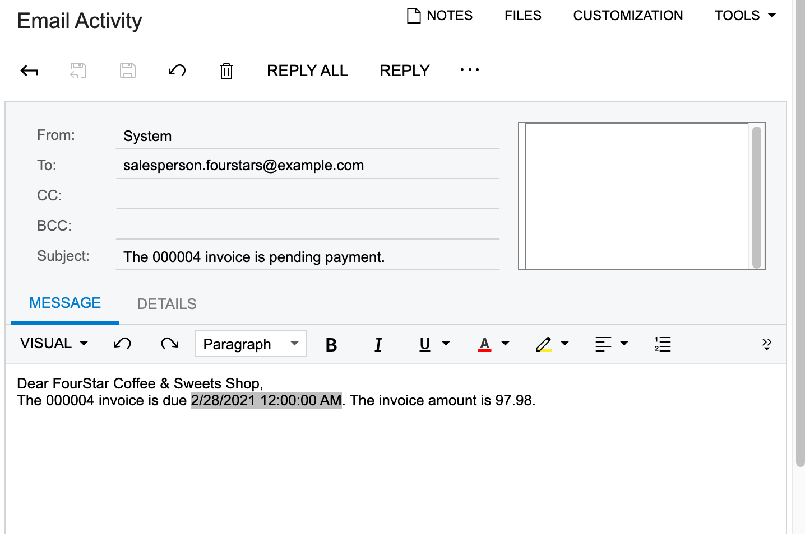

# Business Events: To Configure the User-Triggered Processing of Subscribers {#_c6eb6c77-1a82-477c-8ee1-fbfc517fbd65 .task}

This activity will walk you through the process of configuring user-triggered processing of subscribers.

**Attention:** This activity is based on the *U100* dataset. If you are using another dataset or if any system settings have been changed in *U100*, these changes can affect the workflow of the activity and the results of the processing. To avoid issues, restore the *U100* dataset to its initial state.

## Story { .section}

Suppose that a sales manager wants to filter pending invoices by using a generic inquiry and initiate the sending of reminders to customers about the invoices. Separate actions should give the sales manager the ability to send reminders for all listed invoices or only those the manager selects.

Acting as the system administrator, you need to configure a business event that the sales manager can use to send invoice reminders to customers from the BE\_InvoiceDueTomorrow \(BE403010\) form, which is a custom generic inquiry that lists invoices.

## Process Overview {#section_oxx_zxj_2sb .section}

You will initiate the creation of the business event from the BE\_InvoiceDueTomorrow \(BE403010\) form by opening the form and clicking **Settings** &gt; **Business Events** on the form title bar.

In the **Business Events** dialog box, which opens, you will click **Create Business Event**, enter the name of the event in the dialog box, and click **OK**. The system will open the [Business Events](SM_30_20_50.md) \(SM302050\) form with the generic inquiry form selected as a data source.

On the form, you will configure a subscriber for the event. After the business event has been configured and triggered, you will verify that the notification email appears on the **All Records** tab of the [All Emails](CO_40_90_70.md) \(CO409070\) form.

## System Preparation {#section_e2x_xnb_bsb .section}

Launch the Acumatica ERP website, and sign in to a tenant with the *U100* dataset preloaded as system administrator Kimberly Gibbs. You should sign in by using the *gibbs* username and the *123* password.

**Tip:** The *gibbs* user is assigned the *Administrator* role, which has sufficient access rights to manage the system configuration and to modify generic inquiries, advanced filters, pivot tables, and dashboards.

## Step 1: Creating a Business Event Triggered by a User {#section_ipr_b4b_bsb .section}

To configure a business event to an action that the sales manager can use to send invoice reminders to customers, do the following:

1.  Open the BE\_InvoiceDueTomorrow \(BE403010\) inquiry form, and click **Settings** &gt; **Business Events** on the form title bar.
2.  In the **Business Events** dialog box, which opens, click **Create Business Event**, type `Email Invoice Reminder` in the dialog box, and click **OK**.

    The system opens the [Business Events](SM_30_20_50.md) \(SM302050\) form with an active business event for which the BE\_InvoiceDueTomorrow \(BE403010\) form is selected as the data source in the **Screen Name** box and the event name you entered is specified in the **Event ID** box.

3.  In the **Type** box, select *Trigger by Action*.
4.  In the **Action Name** box, type `Email Invoice Reminder`.
5.  In the **Raise Event** box, select *For Each Record*.
6.  In the **Description** box, type `Remind customers about pending invoices`.
7.  On the form toolbar, click **Save**.
8.  On the **Subscribers** tab, click **Create Subscriber** &gt; **Email Notification**.
9.  On the [Email Templates](SM_20_40_03.md) \(SM204003\) form, which opens, in the **Notification ID** box of the Summary area, leave the system-inserted value.
10. In the **Description** box, type `Email Invoice Reminder`.
11. In the **From** box, select *system@sweetlife.com*.
12. In the **To** box, type `((CustomerContact_eMail));`.
13. In the **Subject** box, type `The ((ARInvoice_refNbr)) invoice is pending payment`.
14. In the **Message** area, type the following text:

    `Dear ((CustomerContact_fullName)),`

    `The ((ARInvoice_refNbr)) invoice is due ((ARInvoice_dueDate))​. The invoice amount is ((ARInvoice_curyOrigDocAmt)).`

15. On the form toolbar, click **Save &amp; Close**.

## Step 2: Verifying that the Notification Works Correctly {#section_jpr_b4b_bsb .section}

You have configured a business event that has added actions to the More menu of the BE\_InvoiceDueTomorrow \(BE403010\) generic inquiry form. A user can click one of these actions and send invoice reminders to customers. To test this event, you will select some invoices, click an added action, and see if the notification works correctly. Do the following:

1.  Open the BE\_InvoiceDueTomorrow \(BE403010\) inquiry form.
2.  In rows with open invoices, select multiple check boxes in the unlabeled column.
3.  On the form toolbar, on the More menu, click **Email Invoice Reminder**.
4.  Open the [All Emails](CO_40_90_70.md) \(CO409070\) form.
5.  On the **All Records** tab, verify that records with text similar to *The 000004 invoice is pending payment* in the **Summary** column are listed in the table. \(The invoice number will differ depending on which invoices you have selected.\)

    **Tip:** You may need to refresh the inquiry results multiple times until the records appear. To do this, click **Refresh** on the form toolbar.

6.  Click one of these emails to view its details on the [Email Activity](CR_30_60_15.md) \(CR306015\) form. Notice that the system has replaced the placeholders with the data copied from the invoice \(see the following screenshot\).

    

**Parent topic:**[Using Business Events](../UserGuide/SA_Using_Business_Events_Mapref.md)

