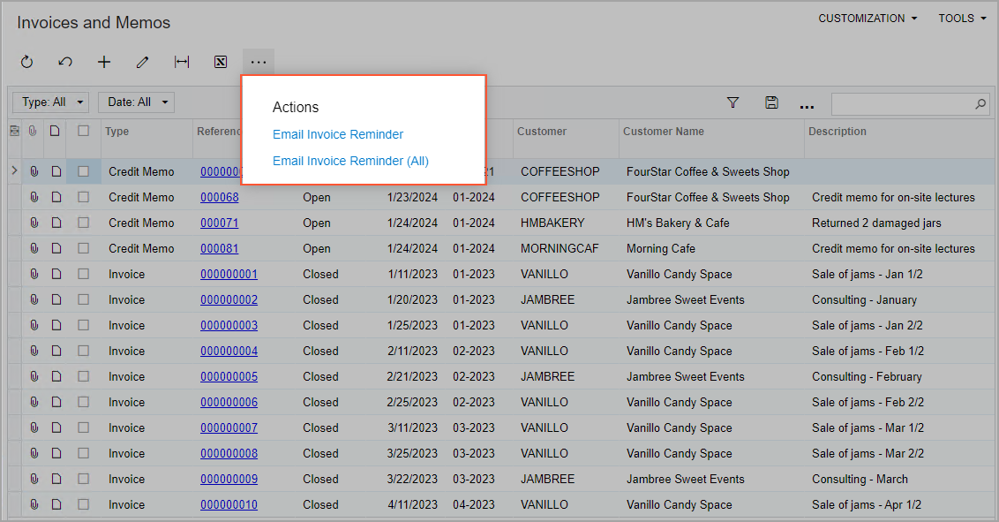
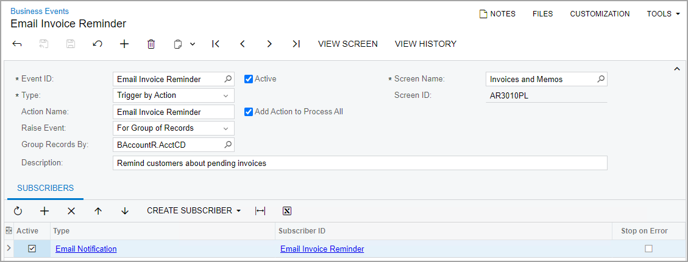
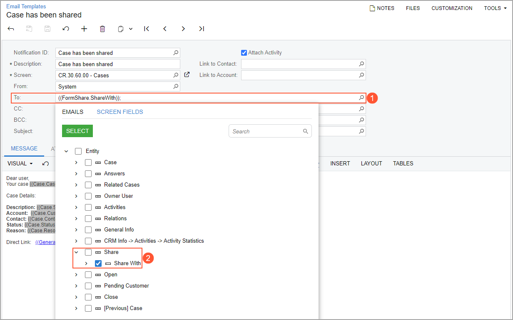
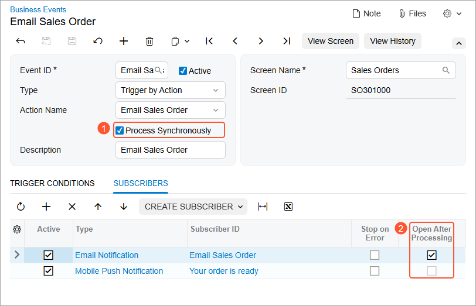
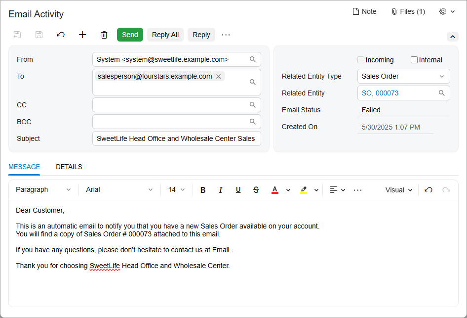

# Business Events: User-Triggered Processing of Subscribers {#_95fb2be7-cf17-42b4-97dc-629bb23254cf .concept}

You can configure the system to start the processing of configured subscribers when a user initiates a particular action. You use a business event of the *Trigger by Action* type for this. With a business event of this type configured for a generic inquiry, a user will be able to launch the event for the list of all, selected, or filtered records of the inquiry. For example, a sales manager might filter pending invoices by using a generic inquiry and initiate the sending of reminders to customers about the invoices.

In this topic, you can find information about the configuration of the business events initiated by user actions.

## Configuration of an Event Triggered by an Action { .section}

On the [Business Events](SM_30_20_50.md) \(SM302050\) form, you specify a generic inquiry or a data entry form as the data source in the **Screen Name** box for the new business event. Then you select the *Trigger by Action* option in the **Type** box.

With this option selected, the **Action Name** box is available on the form. If a generic inquiry form is specified as the screen, then in this box, you specify the action name that will be displayed as the **&lt;Action Name&gt;** command in the **Actions** category of the More menu of the generic inquiry form. If you want the system to display the action in two commands—**&lt;Action Name&gt;** and **&lt;Action Name&gt; \(All\)**—you select the **Add Action to Process All** check box to the right of the **Action Name** box.

The actions are used similarly to the actions available on the mass processing forms. For example, a user might click **Actions** &gt; **Email Invoice Reminder** to send reminders of only the selected records of an inquiry, or the user can click **Actions** &gt; **Email Invoice Reminder \(All\)** to email reminders for all records returned by the inquiry. \(The following screenshot shows these actions on a generic inquiry form.\)

If a data entry form is specified as the data source, all actions defined in the code or in the workflow for the primary DAC of the selected form are available for selection in the **Action Name** box.

As the last step of the configuration, you need to specify the event subscribers to be processed when a user clicks the action on the inquiry or form toolbar. All types of event subscribers are available for this type of business event.

The following screenshot demonstrates the configuration of a business event to be used to send invoice reminders to customers from the Invoices and Memo \(AR3010PL\) form, which is a generic inquiry that lists invoices.

## Specification of Dialog Box Values in Subscribers { .section}

If you have dialog boxes configured in a workflow with specific values specified for fields in these dialog boxes, you can specify these fields in subscribers to business events and in trigger conditions. This functionality is supported for business events of the *Triggered by Action* type that are configured for only data entry forms. With business events defined in this way on the [Business Events](SM_30_20_50.md) \(SM302050\) form, the system can trigger events when specific values are specified in the dialog boxes that are displayed when the user performs those actions.

The dialog box fields can be selected in the following boxes of the forms where these subscribers are created:

-   On the [Email Templates](SM_20_40_03.md) \(SM204003\) form:
    -   **To**
    -   **CC**
    -   **BCC**
    -   **Subject**
    -   **Insert** &gt; **Data Field**
-   On the [Mobile Notifications](SM_20_40_04.md) \(SM204004\) form:
    -   **To**
    -   **Title**
    -   **Insert** &gt; **Data Field**
-   On the [Task Templates](SM_20_40_05.md) \(SM204005\) form:
    -   **Owner**
    -   **Value** on the **Task Settings** tab \(**Fields** &gt; **Internal** in the Formula Editor\)
-   On the [Action Executions](SM_20_40_07.md) \(SM204007\) form:
    -   **Value** on the **Keys** tab
    -   **Value** on the **Field Values** tab

On the **Screen Fields** tab of the lookup table in any of these boxes of the forms listed above, you search for a dialog box by the name of the action for which this dialog box is configured. You then select the check box for the needed box of this dialog box and click **Select**. The system inserts the placeholder for the dialog box value, as it does with other elements in the templates.

## Use of Dialog Box Values in Business Events { .section}

In most cases, the use of dialog box values in business events requires the modification of the form's workflow. In the customized workflow, you need to create an action that displays a dialog box, and then use the values of this dialog box in the trigger conditions or in the subscribers of a business event.

For example, you can customize the workflow for the [Cases](CR_30_60_00.md) \(CR306000\) form by performing the following general steps:

-   On the [Dialog Boxes](AU_20_10_40.md) page, creating a dialog box \(**Share**\) that has a single box \(**Share With**\).
-   On the [Actions](AU_20_10_50.md) page, adding a new action \(`Share`\), and specifying the new dialog box for this action.

    When a user clicks the button corresponding to the action on the form, the dialog box opens, and the user specifies the name of the person with whom they want to share current record.

-   Publishing the customization project.

On the [Business Events](SM_30_20_50.md) \(SM302050\) form, you then create a business event triggered by the *Share* action and create an email notification on the **Subscribers** tab of the form. In the **To** box of the [Email Templates](SM_20_40_03.md) \(SM204003\) form \(see Item 1 in the following screenshot\), you then select the **Share With** box of the **Share** dialog box, which the system displays when a user shares a case \(Item 2\).

## Business Event Processing { .section}

When a business event is configured and is active—that is, the **Active** check box is selected for it on the [Business Events](SM_30_20_50.md) \(SM302050\) form—the system waits for a user to trigger the processing on the generic inquiry form or the data entry form.

If a user triggers an action, the system processes the subscribers of the event that are specified on the **Subscribers** tab for the list of all, selected, or filtered records of an inquiry.

For the business events triggered by an action on a data entry form, the system starts processing of the business events after all the workflow steps defined for the clicked action are completed. That is, transition by action is done and all the affected fields are updated.

After all subscribers of the business event have been processed, the system saves information about the processing of the business event, which you can view on the [Business Event History](SM_50_20_30.md) \(SM502030\) form.

## Preview the Results of Event Processing {#section_v11_qwj_hgc .section}

You can configure business events of the *Trigger by Action* type that relate to non-inquiry forms to process their subscribers synchronously — so you can open the draft of the generated message after processing.

To check what email message will be generated by a business event, you should select the **Process Synchronously**check box \(Item 1 below\) on the [Business Events](SM_30_20_50.md) \(SM302050\) form. This will automatically select the new **Open After Processing** \(Item 2\) check box for all active subscribers of the *Email Notification* type.

When the system triggers events that are configured this way, for each email notification subscriber, a new browser tab opens showing the [Email Activity](CR_30_60_15.md) \(CR306015\) form with the draft of the message \(see below\).

**Parent topic:**[Using Business Events](../UserGuide/SA_Using_Business_Events_Mapref.md)

