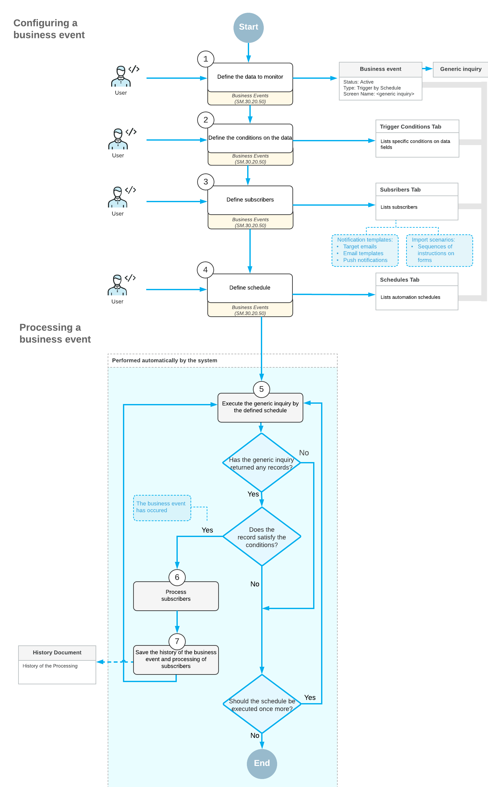

# Business Events: Scheduled Event Processing {#_85c42962-1673-41f7-a895-5ec94b1467ca .concept}

You can configure the system to perform actions based on the occurrence of particular events, which the system checks for at the schedule you specify. In this topic, you can find information about the processing of this type of business events.

## Business Event Processing { .section}

When a business event is configured and is active—that is, the **Active** check box is selected for it on the [Business Events](SM_30_20_50.md) \(SM302050\) form—and the next schedule execution date comes, the system executes the generic inquiry. If the generic inquiry returns any data, the system checks whether the returned records satisfy the conditions specified on the **Trigger Conditions** tab. If there are records that satisfy the conditions \(which means that the business event has occurred\), the system processes the subscribers of the event that are specified on the **Subscribers** tab.

After all subscribers of the business event have been processed, the system saves information about the processing of the business event, which you can view on the [Business Event History](SM_50_20_30.md) \(SM502030\) form.

The following diagram shows how business events checked for on a schedule are configured and processed.

**Parent topic:**[Using Business Events](../UserGuide/SA_Using_Business_Events_Mapref.md)

