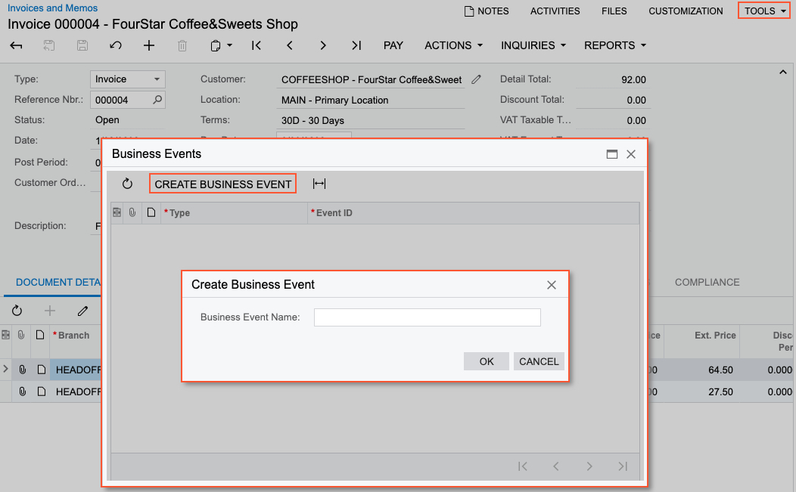
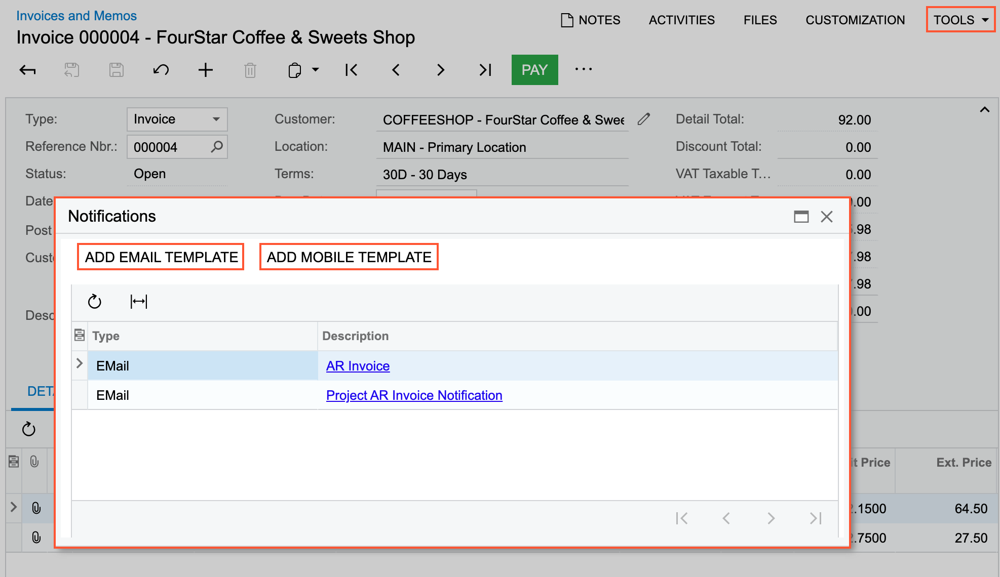

# Business Events: Use of a Data Entry Form as a Source {#_1493e897-4ff2-42c2-b57a-ecf95bdbab65 .concept}

You can use a data entry form as a source of data that you need to monitor. The created business events act as notifications for the events on the forms.

In this topic, you will read about the ways to create business events to monitor data changes made on a particular entry form and the limitations applied to the business events functionality for this data source.

## Ways to Create Business Events for a Data Entry Form { .section}

You can create a business event directly from a data entry form whose data changes you need to monitor. To create business events for a data entry form, you open the form and click **Settings** &gt; **Business Events** on the form title bar.

In the **Business Events** dialog box, which opens, you click **Create Business Event**, enter the name of the event in the dialog box, and click **OK** \(as shown in the following screenshot\). The system opens the [Business Events](SM_30_20_50.md) \(SM302050\) form with the data entry form selected as a data source.

Alternatively, you can start the creation of a business event by specifying the data entry form in the **Screen Name** box on the [Business Events](SM_30_20_50.md) \(SM302050\) form.

## Creation of Notification Templates from a Data Entry Form { .section}

You can create a notification template \(for email, push, or SMS notifications\) directly from the data entry form which data you want to use in the notification. You open this entry form and click **Settings** &gt; **Notifications** on the form title bar.

In the **Notifications** dialog box, which opens, you can click **Add Email Template** or **Add Mobile Template** to create a notification template. The system opens either the [Email Templates](SM_20_40_03.md) \(SM204003\) form or the [Mobile Notifications](SM_20_40_04.md) \(SM204004\) form with the data entry form selected in the **Screen Name** box. On the [Mobile Notifications](SM_20_40_04.md) \(SM204004\) form, you will need to select the delivery method \(*Push* or *SMS*\).

Also, by using the dialog box, you can review the notifications that have been already configured for the entry form.

After you have saved the notification template, you can link it to the business event on the **Send by Events** tab of the template. You add a row to the table and select the needed business event in the **Event ID** column. You can also create a needed business event by clicking **Create Business Event** on the table toolbar of the tab. Alternatively, you can return to the [Business Events](../Shared/../UserGuide/SM_30_20_50.md) form and add the notification template on the **Subscribers** tab for the event.

## Limitations of Using Data Entry Form { .section}

You can use a data entry form as a source for business events of the *Trigger by Record Change* and *Trigger by Action* type only. You cannot use an import scenario as a subscriber if this type of source is selected.

**Parent topic:**[Using Business Events](../UserGuide/SA_Using_Business_Events_Mapref.md)

