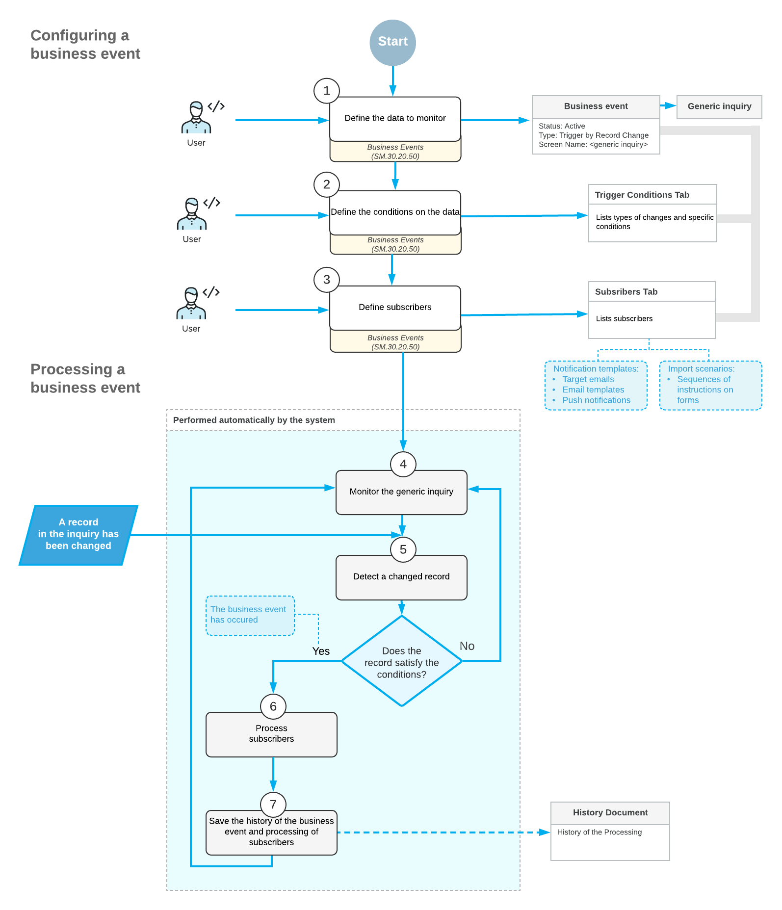

# Business Events: Data Change Processing {#_83582d78-a752-4175-af4f-3cec6150aca0 .concept}

You can configure the system to perform actions when a change of the data related to a business process has occurred. In this topic, you can find information about the processing of the business events related to data changes.

## Business Event Processing { .section}

When a business event is configured and is active—that is, the **Active** check box is selected for it on the [Business Events](SM_30_20_50.md) \(SM302050\) form—the system starts monitoring data changes made to the data included in the generic inquiry form or provided by a data-entry form.

If a record has been changed, the system checks whether the record satisfies the conditions specified on the **Trigger Conditions** tab. If the record satisfies the conditions \(which means that the business event has occurred\), the system processes the subscribers of the event that are specified on the **Subscribers** tab.

After all subscribers of the business event have been processed, the system saves information about the processing of the business event, which you can view on the [Business Event History](SM_50_20_30.md) \(SM502030\) form.

The following diagram illustrates the configuration and processing of business events related to record changes.

**Parent topic:**[Using Business Events](../UserGuide/SA_Using_Business_Events_Mapref.md)

