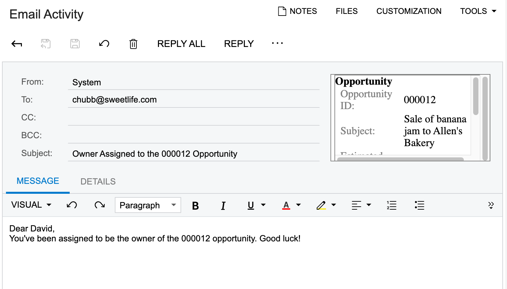
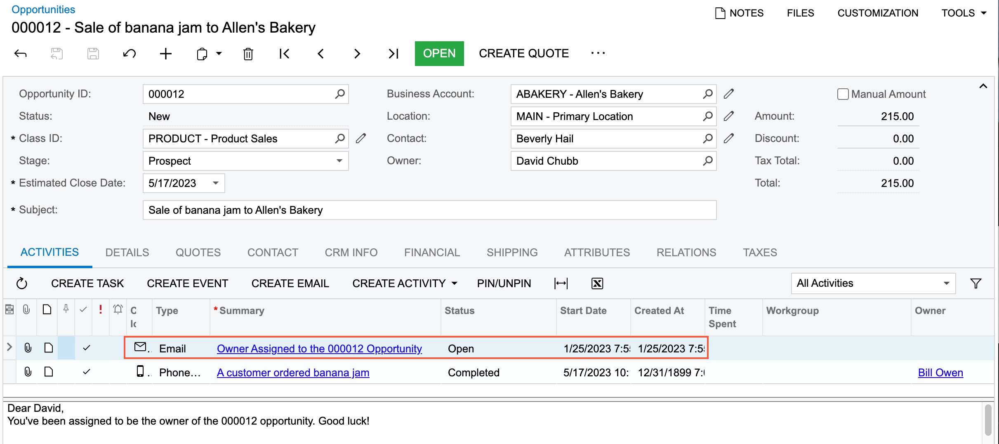

# Business Events: To Automate Sending of a Notification on Data Change {#_0d8232b8-d530-4ed8-ba8e-0fa4fea25972 .task}

This activity will walk you through the process of configuring a business event to monitor data changes using a data entry form as data source and email notification as a subscriber.

**Attention:** This activity is based on the *U100* dataset. If you are using another dataset or if any system settings have been changed in *U100*, these changes can affect the workflow of the activity and the results of the processing. To avoid issues, restore the *U100* dataset to its initial state.

## Story { .section}

Suppose that a sales manager needs to inform the employee who has been assigned to be the owner of an opportunity—that is, the employee that has been selected in the **Owner** box in the Summary area of the [Opportunities](CR_30_40_00.md) \(CR304000\) form.

Acting as the system administrator, you need to configure a business event to automate the sending of notifications about the assignment.

## Process Overview { .section}

To monitor a business event that is based on a change in a field on a specific form, you will initiate the creation of the business event from this form. Thus, you will open the [Opportunities](CR_30_40_00.md) \(CR304000\) form and click **Settings** &gt; **Business Events** on the form title bar.

In the **Business Events** dialog box, which opens, you will click **Create Business Event**, enter the name of the event in the dialog box, and click **OK**. The system will open the [Business Events](SM_30_20_50.md) \(SM302050\) form with the data entry form selected as a data source.

On the form, you will trigger conditions and subscriber for the event. After the business event is configured and triggered, you will verify that the notification email appears on the **All Records** tab of the [All Emails](CO_40_90_70.md) \(CO409070\) form.

## System Preparation {#section_e2x_xnb_bsb .section}

Launch the Acumatica ERP website, and sign in to a tenant with the *U100* dataset preloaded as system administrator Kimberly Gibbs. You should sign in by using the *gibbs* username and the *123* password.

**Tip:** The *gibbs* user is assigned the *Administrator* role, which has sufficient access rights to manage the system configuration and to modify generic inquiries, advanced filters, pivot tables, and dashboards.

## Step 1: Creating a Business Event Triggered by a Record Change {#section_ipr_b4b_bsb .section}

To configure a business event to monitor when an owner is assigned to an opportunity, do the following:

1.  Open the [Opportunities](CR_30_40_00.md) \(CR304000\) form, and click **Settings** &gt; **Business Events** on the form title bar.
2.  In the **Business Events** dialog box, which opens, click **Create Business Event**, type `Owner Assigned` in the dialog box, and click **OK**.

    The system opens the [Business Events](SM_30_20_50.md) \(SM302050\) form with an active business event for which the [Opportunities](CR_30_40_00.md) form is selected as the data source in the **Screen Name** box and the event name you entered is specified in the **Event ID** box. Also, the system has populated the **Type** and **Raise Event** boxes with the options available only for a data entry form.

3.  In the **Description** box, type `Owner Assigned`.
4.  On the **Trigger Conditions** tab, add two rows with the following values:
    -   Row 1:

        -   **Operation**: *Field Changed*
        -   **Table Name**: *Opportunity*
        -   **Field Name**: *Owner \(OwnerID\)*
        -   **Operator**: *And*
    -   Row 2:

        -   **Operation**: *New Field Value*
        -   **Table Name**: *Opportunity*
        -   **Field Name**: *Owner \(OwnerID\)*
        -   **Condition**: *Is Not Empty*
5.  On the form toolbar, click **Save**.
6.  On the **Subscribers** tab, click **Create Subscriber** &gt; **Email Notification**.
7.  On the [Email Templates](SM_20_40_03.md) \(SM204003\) form, which opens, in the **Notification ID** box of the Summary area, leave the system-inserted value.

    Notice, that the **Attach Activity** check box is selected by default. It means that the system will attach the email to each opportnunity that triggers the business event.

8.  In the **Description** box, type `Owner Assigned`.
9.  In the **From** box, select *system@sweetlife.com*.
10. In the **To** box, open the selection dialog box, switch to the **Screen Fields** tab, select *Entity -&gt; Opportunity-&gt; Owner-&gt; Email* and click **Select**.
11. In the **Subject** box, type `Owner Assigned to the ((Opportunity.OpportunityID)) Opportunity`.
12. In the **Message** area, type the following text:

    `Dear ((Opportunity.OwnerID.FirstName))​,`

    `You've been assigned to be the owner of the ((Opportunity.OpportunityID)) opportunity. Good luck!`.

13. On the form toolbar, click **Save &amp; Close**.

## Step 2: Assigning an Owner and Verifying that the Notification Works Correctly {#section_jpr_b4b_bsb .section}

You have configured a business event for which the responsible employee should receive an email when they are assigned to be owner. To test this event, you will assign an opportunity to an employee, David Chubb, and see if the notification works correctly. Do the following:

1.  Open the [Opportunities](CR_30_40_00.md) \(CR3040PL\) generic inquiry form.
2.  On the **All Records** tab, click any record, and open the **Opportunities** tab on the side panel. On the tab, the system displays the [Opportunities](CR_30_40_00.md) \(CR304000\) form with the details of the selected opportunity.
3.  In the **Owner** box of the Summary area, select *David Chubb*.
4.  On the form toolbar, click **Save**.
5.  Open the [All Emails](CO_40_90_70.md) \(CO409070\) form.
6.  On the **All Records** tab, verify that a record with the following settings is listed in the table:

    -   **Summary**: *Owner Assigned to the 000012 Opportunity* \(the opportunity number may differ depending on which opportunity you have changed\)
    -   **From**: *"System" &lt;system@sweetlife.com&gt;*
    -   **To**: *chubb@sweetlife.com*
    **Tip:** You may need to refresh the inquiry results multiple times until the record appears. To do this, you click **Refresh** on the form toolbar.

7.  Click the email to view its details on the [Email Activity](CR_30_60_15.md) \(CR306015\) form. Notice that the system has replaced the placeholders with the data copied from the opportunity \(see the following screenshot\).

    

8.  Optional. You can view the email details on the **Activities** tab of the [Opportunities](CR_30_40_00.md) \(CR304000\) form for the opportunity \(see the following screenshot\). The system attached the email as an activity to the opportunity because the **Attach Activity** check box was selected for the email template configured as subscriber.

    

**Parent topic:**[Using Business Events](../UserGuide/SA_Using_Business_Events_Mapref.md)

