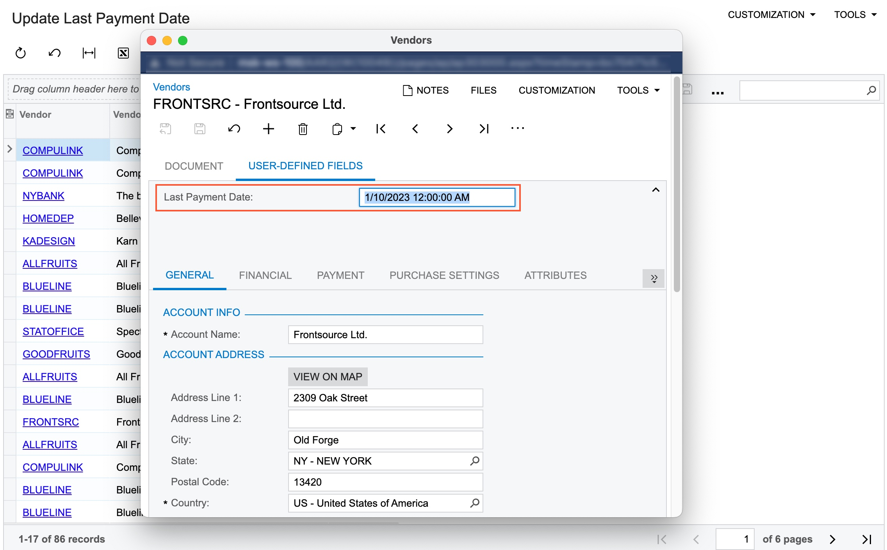

# Business Events: To Automate Updating of a Field Value on Data Change {#_54245074-7619-49d0-a17f-3fbe7d6f09c0 .task}

This activity will walk you through the process of configuring a business event to monitor data changes using a generic inquiry as data source and an import scenario as a subscriber.

**Attention:** This activity is based on the *U100* dataset. If you are using another dataset or if any system settings have been changed in *U100*, these changes can affect the workflow of the activity and the results of the processing. To avoid issues, restore the *U100* dataset to its initial state.

## Story { .section}

Suppose that an accountant needs to have information when the last payment was done for a vendor, to plan future payments.

Acting as the system administrator, you need to configure a user-defined field to hold the date of the last payment to vendor and a business event to monitor payments to vendors and update the last payment date for a vendor by means of import scenario.

## Process Overview { .section}

On the [Attributes](CS_20_50_00.md) \(CS205000\) form, you will create an attribute to used as a basis for a user-defined field. Then, on the [Vendors](AP_30_30_00.md) \(AP303000\) form, you will add the user-defined field to track the last payment date for a vendor.

You upload the *ImS\_UpdateVendorLastPymtDt* import scenario that you will use as a subscriber and the *BE\_UpdateVendorLastPymtDt* generic inquiry that you will use as a data source for the business event, using appropriate forms.

Using the uploaded inquiry form, you will create a business event that will track payments to vendors and update the last payment date for such vendors.

## System Preparation {#section_e2x_xnb_bsb .section}

Launch the Acumatica ERP website, and sign in to a tenant with the *U100* dataset preloaded as system administrator Kimberly Gibbs. You should sign in by using the *gibbs* username and the *123* password.

**Tip:** The *gibbs* user is assigned the *Administrator* role, which has sufficient access rights to manage the system configuration and to modify generic inquiries, advanced filters, pivot tables, and dashboards.

## Step 1: Creating a User-Defined Field { .section}

To create a user-defined field that will hold the last payment date for a vendor, do the following:

1.  On the [Attributes](CS_20_50_00.md) \(CS205000\) form, add a new record.
2.  In the **Attribute ID** box, type `LASTPAYDAT`.
3.  In the **Description** box, type `Last Payment Date`.
4.  In the **Control Type** box, select *Text*.
5.  On the form toolbar, click **Save**.
6.  Open the [Vendors](AP_30_30_00.md) \(AP303000\) form, and click **Customization** &gt; **Manage User-Defined Fields** on the form title bar.
7.  Do the following to add the user-defined field to the [Vendors](AP_30_30_00.md) form:
    1.  On the form toolbar, click **Add User-Defined Field**.
    2.  In the **User-Defined Field Parameters** dialog box, which opens, in the **Attribute ID** box, select the *LASTPAYDAT* attribute that you have created. In the **Column** and **Row** boxes, type `1`.
    3.  Click **OK** to close the dialog box.
8.  Click **Back** on the form toolbar to return to the [Vendors](AP_30_30_00.md) form. On the **User-Defined Fields** tab, notice the **Last Payment Date** box.

## Step 2: Uploading the Needed Generic Inquiry and Import Scenario {#section_uhq_4g4_2sb .section}

To upload the *ImS\_UpdateVendorLastPymtDt* import scenario that you will use as a subscriber and the *BE\_UpdateVendorLastPymtDt* generic inquiry that you will use as a data source for the business event, do the following:

1.  Open the [Import Scenarios](SM_20_60_25.md) \(SM206025\) form.
2.  On the form toolbar, click **Clipboard** &gt; **Import from XML**.
3.  In the **Upload XML File** dialog box, select [ImS\_UpdateVendorLastPymtDt.xml](Files/ImS_UpdateVendorLastPymtDt.xml), and click **Upload**. You may need to wait a bit until the system uploads the scenario.
4.  Open the [Generic Inquiry](SM_20_80_00.md) \(SM208000\) form.
5.  On the form toolbar, click **Clipboard** &gt; **Import from XML**.
6.  In the **Upload XML File** dialog box, select [BE\_UpdateVendorLastPymtDt.xml](Files/BE_UpdateVendorLastPymtDt.xml), and click **Upload**. You may need to wait a bit until the system uploads the inquiry.
7.  On the form toolbar, click **View Inquiry**. The systems opens the Update Last Payment Date \(GI000194\) generic inquiry form in a new browser tab.

## Step 3: Creating a Business Event Triggered by a New Record {#section_tk1_5jc_2sb .section}

To create a business event that is triggered by a new record in the monitored generic inquiry, do the following:

1.  While you are viewing the Update Last Payment Date \(GI000194\) inquiry, click **Settings** &gt; **Business Events** on the form title bar.
2.  In the **Business Events** dialog box, which opens, click **Create Business Event**, type `Update Last Pay Date` in the dialog box, and click **OK**.

    The system opens the [Business Events](SM_30_20_50.md) \(SM302050\) form with an active business event for which the Update Last Payment Date \(GI000194\) inquiry is selected as the data source in the **Screen Name** box and the event name you entered is specified in the **Event ID** box.

3.  In the **Type** box, select *Trigger by Record Change*.
4.  In the **Raise Event** box, select *For Each Record*.
5.  In the **Description** box, type `Update the last payment date for a vendor`.
6.  On the **Trigger Conditions** tab, add a row and in the **Operation** column, select *Record Inserted*.
7.  On the **Fields to Track** tab, select the **Track All Fields** check box.
8.  On the form toolbar, click **Save**.
9.  On the **Subscribers** tab, add a row with the following values:
    -   **Type**: *Import Scenario*
    -   **Subscriber ID**: *UpdateVendorLastPymtDt*
10. On the form toolbar, click **Save**.

## Step 4: Verifying the Configuration of the Business Event {#section_xs1_5jc_2sb .section}

You have configured a business event that is triggered when the inquiry returns a new record, that is a paid bill. When the event occurs, the system execute the import scenario that updates the **Last Payment Date** user-defined field for a vendor of the paid bill.

To test the configuration, you pay a bill and verify that the **Last Payment Date** field is updated for the vendor of the bill. Do the following:

1.  Open the [Bills and Adjustments](AP_30_10_00.md) \(AP301000\) form.
2.  In the **Reference Nbr.** box, select the *000043* bill of the Frontsource Ltd. vendor.
3.  Click **Pay** on the form toolbar and follow the workflow configured for payment of a bill.
4.  Open the Update Last Payment Date \(GI000194\) inquiry.
5.  Locate the record with the Frontsource Ltd. value in the **Vendor Name** column and current business date in the **Payment Date** column.
6.  For the located record, click the link in the **Vendor** column. The system opens the [Vendors](AP_30_30_00.md) \(AP303000\) form in the pop-up window with the vendor details.
7.  On the **User-Defined Fields** tab, verify that the **Last Payment Date** box is filled with the current business date and time of the payment, as the following screenshot demonstrates.

    

**Parent topic:**[Using Business Events](../UserGuide/SA_Using_Business_Events_Mapref.md)

