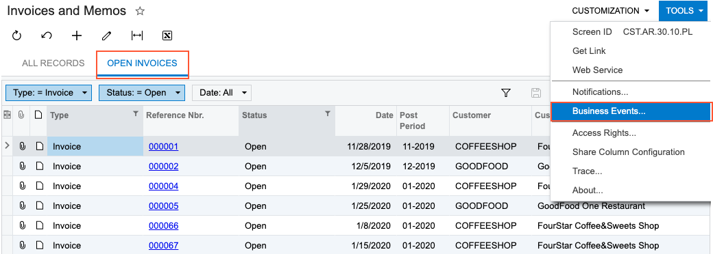
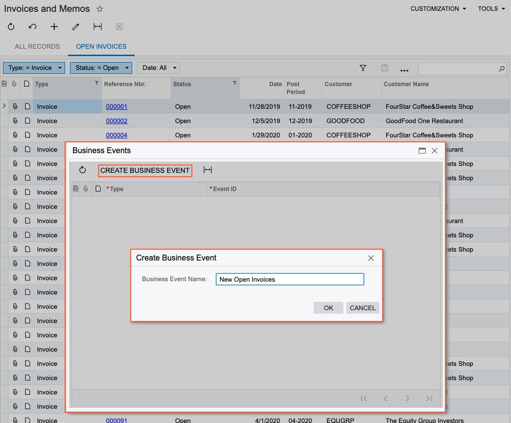
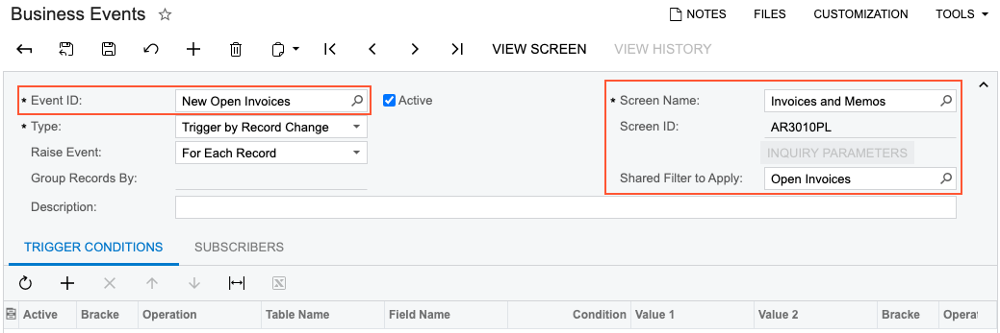

# Business Events: Generic Inquiry as Source {#_4ab6b0d1-4074-4692-bf51-00afb20a57a3 .concept}

You can create a generic inquiry to retrieve data from the database fields that you want the system to monitor. Also, you can instead use an existing generic inquiry if one exists that retrieves the needed data.

In this topic, you will read about recommendations for and limitations on using a generic inquiry as a source for monitoring.

## General Recommendations { .section}

If you are using a generic inquiry as a basis for monitoring a business process, the generic inquiry should be as simple as possible. We recommend that you make sure that only the needed fields and tables are used in this generic inquiry. If the already-existing inquiry uses any fields and tables that are unnecessary for your specific business event, you should instead make a copy of the inquiry, delete unneeded fields and tables in the new inquiry, and use it.

Business events of the *Trigger by Action* and *Trigger by Record Change* types do not support generic inquiries that have grouping specified on the **Grouping** tab of the [Generic Inquiry](SM_20_80_00.md) \(SM208000\) form. Thus, we recommend that you avoid unnecessary multiple joins and joins to the same tables. In most cases, you can exclude from the generic inquiry all the tables that are not used on the **Results Grid** tab of the corresponding generic inquiry.

**Attention:** You must add all key fields of used tables to the **Results Grid** tab of the corresponding generic inquiry on the [Generic Inquiry](SM_20_80_00.md) form. You can make the columns hidden if you do not need to view them on the inquiry form. For details on discovering key fields, see [Data from Multiple Data Sources: Discovery of Key Fields](GI_Manual_Configuration_of_Relations_Concept.md).

If you are using a generic inquiry that has conditions specified on the **Conditions** tab of the [Generic Inquiry](SM_20_80_00.md) form and you plan to use the *Record Inserted* option as a trigger condition on the **Trigger Conditions** tab of the [Business Events](SM_30_20_50.md) \(SM302050\) form, you should remove the conditions for the inquiry and add them as trigger conditions for the business event.

If you plan to use a value of an unbound field that depends on the date to trigger some actions, you should use a business event with the *Trigger by Schedule* type selected in the Summary area of the [Business Events](SM_30_20_50.md) form to monitor value change of this field. For example, to monitor case resolution time, which is calculated as the difference between the current date and date of a case creation \(`Now – CreatedDateTime`\), you create a business event of the *Trigger by Schedule* type and configure a schedule that checks the value regularly. A business event of the *Trigger by Record Change* type will not work for such a field because the value is not stored in database and thus does not change.

On the [Business Events](SM_30_20_50.md) form, the system displays a warning indicating that the business event might work incorrectly if any of the following are true of the generic inquiry:

-   The generic inquiry contains grouping fields.
-   The generic inquiry uses unbound fields in trigger conditions.
-   Some of the key fields have not been added to the **Results Grid** tab of the [Generic Inquiry](SM_20_80_00.md) form.

**Important:** You cannot use a generic inquiry that uses another generic inquiry as its table.

Note that the *Inner* join works similar to the *Left* join if you use a generic inquiry as a source. Suppose that in a source generic inquiry, parent and child table are joined by using the *Inner* join, and the child table contains the detail lines of records. Further suppose that you need to trigger a business event for only records with some detail lines. Then for this business event, you must add a trigger condition that checks that the key field of the child table is not empty.

For details on working with generic inquiries, see the topics in the [Managing Generic Inquiries](SM__MNG_Managing_Generic_Inquiry.md) chapter.

## Recommendations for Push Notifications { .section}

If you plan to send push notifications to users of the Acumatica mobile app on mobile devices, make sure that the generic inquiry you have selected includes the `NoteID` data field for the entity that you plan to display when a user taps a notification on the mobile device.

For example, suppose that you want to notify employees about new opportunities assigned to them, and when an employee taps this notification, the app should display the new opportunity. In this case, you should add the `NoteID` data field for the `CROpportunity` object on the **Results Grid** tab of the [Generic Inquiry](SM_20_80_00.md) \(SM208000\) form.

## Creation of a Business Event from a Generic Inquiry Form { .section}

You click **Tools** &gt; **Business Events** \(see the following screenshot\) on the form title bar of any generic inquiry form to view any existing business events based on the generic inquiry being viewed and to create new business events.

Also, if the generic inquiry has shared filters saved as tabs, when you create a business event from the generic inquiry, the system considers the active shared filter \(that is, the filter tab you were viewing, which in the following screenshot is **Open Invoices**\).

When you click **Tools** &gt; **Business Events**, the system opens the **Business Events** dialog box, which lists any business events based on the generic inquiry. To create a new business event, you click **Create Business Event** on the toolbar of the dialog box. The system opens the **Create Business Event** dialog box, where you enter a name for the new business event and click **OK** \(see the following screenshot\).

The system opens the [Business Events](SM_30_20_50.md) \(SM302050\) form with the name you had entered in the **Event ID** box, and with the **Screen Name** and **Screen ID** boxes populated with the values of the generic inquiry for which the business event has been created. Also, if the generic inquiry had shared filters saved as tabs, the **Shared Filter to Apply** box is populated with the shared filter that was active when you created the event \(see the following screenshot, in which *Open Invoices* has been inserted into this box\).

You may now proceed to configuring the business event.

**Parent topic:**[Using Business Events](../UserGuide/SA_Using_Business_Events_Mapref.md)

