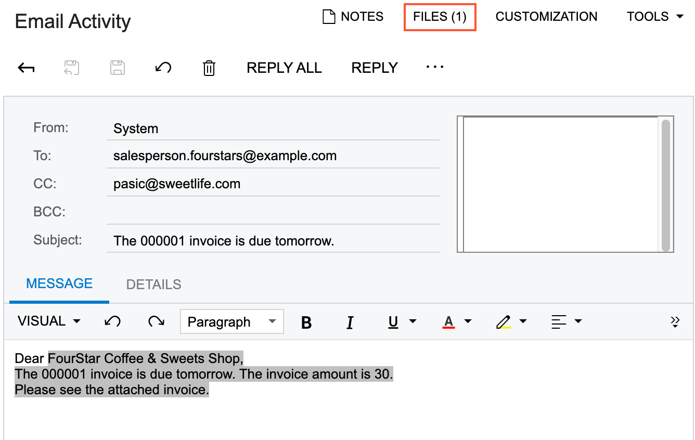
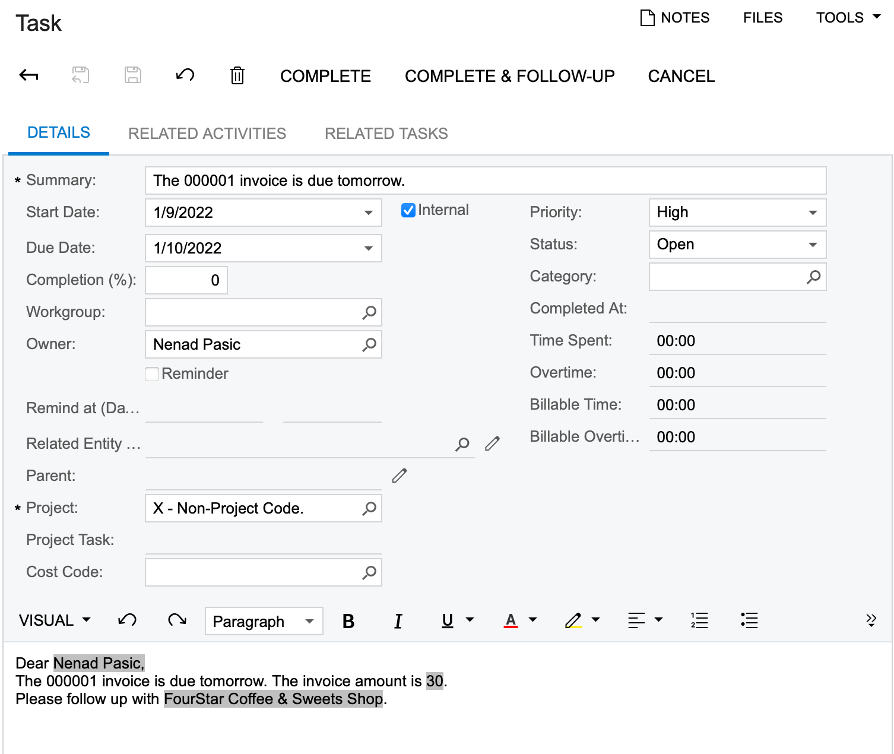

# Business Events: To Configure the Monitoring of Condition Fulfillment on a Schedule {#_d3ca0331-3648-439d-b2af-ef419644c212 .task}

This activity will walk you through the process of configuring a business event to monitor condition fulfillment on schedule.

**Attention:** This activity is based on the *U100* dataset. If you are using another dataset or if any system settings have been changed in *U100*, these changes can affect the workflow of the activity and the results of the processing. To avoid issues, restore the *U100* dataset to its initial state.

## Story { .section}

Suppose that the accounting team needs to inform customers by email about invoices that are due tomorrow. The system should also attach the invoice in PDF format to the email. Additionally, the system should send a copy of the email to the owner of invoice and create a task for the owner to follow up with the customer regarding the payment of the invoice. The task's due date should be two days after the due date of the invoice.

Acting as the system administrator, you need to configure the business event to automate the sending of notifications about the invoices that are due and the creation of follow-up tasks for the owners of the invoices. As the data source, you will use the BE\_InvoiceDueTomorrow \(BE403010\) form, which is a custom generic inquiry that lists invoices. The inquiry contains all the data fields that are needed for monitoring the due invoices.

## Configuration Overview {#section_tz4_djx_cnb .section}

In the *U100* dataset, on the [Enable/Disable Features](CS_10_00_00.md) \(CS100000\) form, the *Scheduled Processing* feature has been enabled.

## Process Overview {#section_pfh_2nb_2sb .section}

First, on the [Generic Inquiry](SM_20_80_00.md) \(SM208000\) form, you will upload the [BE\_InvoiceDueTomorrow.xml](Files/BE_InvoiceDueTomorrow.xml) generic inquiry.

Next, you will define the notification and task templates to be used as the event subscribers by using the [Email Templates](SM_20_40_03.md) \(SM204003\) and [Task Templates](SM_20_40_05.md) \(SM204003\) forms, respectively.

On the [Business Events](SM_30_20_50.md) \(SM302050\) form, you will create the needed business event. You will specify trigger conditions, add subscribers, and add a schedule for the event.

To verify that the business event works correctly, you will change a due date of an invoice to tomorrow. After the system executes the inquiry based on the specified schedule, you will verify that the notification email appears on the **All Records** tab of the [All Emails](CO_40_90_70.md) \(CO409070\) form. Also, you will sign in as the owner of the invoice and verify that the related task appears on the **My Tasks** tab of the Tasks \(EP4040PL\) form.

## System Preparation {#section_e2x_xnb_bsb .section}

Launch the Acumatica ERP website, and sign in to a tenant with the *U100* dataset preloaded as system administrator Kimberly Gibbs. You should sign in by using the *gibbs* username and the *123* password.

**Tip:** The *gibbs* user is assigned the *Administrator* role, which has sufficient access rights to manage the system configuration and to modify generic inquiries, advanced filters, pivot tables, and dashboards.

## Step 1: Uploading the Needed Generic Inquiry {#section_uhq_4g4_2sb .section}

To upload the *BE\_InvoiceDueTomorrow* generic inquiry so that you can use the corresponding generic inquiry form as a data source for the business event, do the following:

1.  Open the [Generic Inquiry](SM_20_80_00.md) \(SM208000\) form.
2.  On the form toolbar, click **Clipboard** &gt; **Import from XML**.
3.  In the **Upload XML File** dialog box, select [BE\_InvoiceDueTomorrow.xml](Files/BE_InvoiceDueTomorrow.xml), and click **Upload**. You may need to wait a bit until the system uploads the inquiry.
4.  On the form toolbar, click **View Inquiry**. The systems opens the BE\_InvoiceDueTomorrow \(BE403010\) generic inquiry form in a new browser tab.

## Step 2: Creating a Notification Template { .section}

To create a notification template to be used as a subscriber to the business event you will configure, do the following:

1.  While you are still viewing the BE\_InvoiceDueTomorrow \(BE403010\) generic inquiry form, on the form title bar, click **Settings** &gt; **Notifications**.
2.  In the **Notifications** dialog box, click **Add Email Template**. The system opens the [Email Templates](SM_20_40_03.md) \(SM204003\) form in a new browser tab. Notice that the system has populated the **Screen Name** box with *BE\_InvoiceDueTomorrow*.
3.  In the **Description** box, type `Invoice Due Tomorrow`.
4.  In the **From** box, select *system@sweetlife.com*.
5.  In the **To** box, open the selection dialog box, switch to the **Screen Fields** tab, select *Entity -&gt; ARInvoice-&gt; Owner-&gt; Email* and click **Select**.
6.  In the **To** box, type `((CustomerContact_eMail));`.
7.  In the **CC** box, type `((OwnerContact_eMail));`.
8.  In the **Subject** box, type `The ((ARInvoice_refNbr)) invoice is due tomorrow`.
9.  On the **Message** tab, type the following text:

    `Dear ((CustomerContact_fullName)),`

    `The ((ARInvoice_refNbr)) invoice is due tomorrow. The invoice amount is ((ARInvoice_curyOrigDocAmt)).`

    `Please see the attached invoice.`

10. Go to the **Attached Reports** tab.
11. On the table toolbar of the **Reports Attached by Report ID** table \(left pane\), click **Add Row**.
12. In the **Report ID** column, select the [Invoice/Memo](AR_64_10_00.md) \(AR641000\) report, which is a printed form for the selected invoice or memo.
13. On the right pane of the tab, select the **Use Event as Data Source** check box. The system automatically inserts *ARInvoice* in the **Source Table** box, based on the intersection of the tables used for the inquiry and for the report.
14. In the **Report Parameters** table, add two rows with the following values:

    |Parameter Name|Parameter Value|
    |--------------|---------------|
    |*Document Type*|*ARInvoice.docType*|
    |*Reference Number*|*ARInvoice.refNbr*|

    The system will use these parameters to generate an invoice attachment for each customer.

15. On the form toolbar, click **Save**.

## Step 3: Configuring the Task Template { .section}

To configure the task template to be used as the event subscriber, do the following:

1.  On the [Task Templates](SM_20_40_05.md) \(SM204003\) form, add a new record.

    **Tip:** To open the form for creating a new record, type the form ID in the Search box, and on the Search form, point at the form title and click **New** right of the title.

2.  In the **Description** box, type `Invoice Due Tomorrow`.
3.  In the **Screen ID** box, select *BE\_InvoiceDueTomorrow*.
4.  In the **Owner** box, select the *Entity -&gt; ARInvoice-&gt; Owner* option.
5.  In the **Summary** box, type `The ((ARInvoice_refNbr)) invoice is due tomorrow`.
6.  In the **Body** area, type the following text:

    `Dear ((OwnerContact_displayName)),`

    `The ((ARInvoice_refNbr)) invoice is due tomorrow. The invoice amount is ((ARInvoice_curyOrigDocAmt)).`

    `Please follow up with ((CustomerContact_fullName)).`

7.  On the form toolbar, click **Save**.
8.  Go to the **Task Settings** tab.
9.  In the row with *Start Date* in the **Field Name** column, in the **Value** column, type the following formula : `=DateAdd( [Results.ARInvoice_dueDate], 'day', 1 )`. The system will calculate the start date for the task by using the data from the inquiry. The start date will be the day after the due date of the invoice.
10. In the row with *Due Date* in the **Field Name** column, in the **Value** column,type the following formula: `=DateAdd( [Results.ARInvoice_dueDate], 'day', 2 )`. The system will calculate the due date for the task by using the data from the inquiry. The due date will be two days after the due date of the invoice.
11. In the row with *Priority* in the **Field Name** column, in the **From Schema** column, select the check box, and in the **Value** column, select the *High* option.
12. On the form toolbar, click **Save**.

## Step 4: Creating a Business Event Monitored on Schedule {#section_tk1_5jc_2sb .section}

To create a business event that is monitored on a schedule, do the following:

1.  On the [Business Events](SM_30_20_50.md) \(SM302050\) form, add a new record.

    **Tip:** To open the form for creating a new record, type the form ID in the Search box, and on the Search form, point at the form title and click **New** right of the title.

2.  In the **Event ID** box, type `InvoiceDueTomorrow`.
3.  In the **Screen Name** box, select *BE\_InvoiceDueTomorrow*.
4.  In the **Type** box, select *Trigger by Schedule*.
5.  In the **Raise Event** box, leave the *For Each Record* option, which is selected by default.
6.  In the **Description** box, type `InvoiceDueTomorrow`.
7.  On the **Trigger Conditions** tab, add three rows with the following values:
    -   Row 1:

        -   **Table Name**: *ARInvoice*
        -   **Field Name**: *Type \(docType\)*
        -   **Condition**: *Equals*
        -   **Value 1**: *Invoice*
        -   **Operator**: *And*
    -   Row 2:

        -   **Table Name**: *ARInvoice*
        -   **Field Name**: *Status \(status\)*
        -   **Condition**: *Equals*
        -   **Value 1**: *Open*
        -   **Operator**: *And*
    -   Row 3

        -   **Table Name**: *ARInvoice*
        -   **Field Name**: *Due Date \(dueDate\)*
        -   **Condition**: *Equals*
        -   **Value 1**: *@Today+1*
8.  On the **Subscribers** tab, add two rows with the following values:
    -   Row 1:

        -   **Type**: *Email Notification*
        -   **Subscriber ID**: *Invoice Due Tomorrow*
    -   Row 2:

        -   **Type**: *Task*
        -   **Subscriber ID**: *Invoice Due Tomorrow*
9.  On the **Schedules** tab, on the table toolbar, click **Create Schedule**. The **Automation Schedules** pop-up window opens.
10. In the **Description** box, type *Invoice Due Tomorrow Check*.
11. On the **Details** tab, in the **Starts On** box, select the current date.
12. Select the **No Execution Limit** check box.
13. Select the **Keep Full History** check box.
14. On the **Schedule** tab \(**Schedule Type** section\), select *Daily*.
15. In the **Schedule Details** section, in the **Every** box, type `1`.
16. In the **Execution Time** section, in the **Starts On** box, select *1:00 AM*.
17. In the **Next Execution Date** box, type your current time plus five minutes \(you need this time to finish the configuration\).
18. In the **Stops On** box, select *11:30 PM*.
19. Optional: In the **Every** box, type `00:02`. This setting will make the system execute the inquiry every 2 minutes, in case you want to test the event multiple times.
20. On the form toolbar, click **Save &amp; Close**.
21. On the form toolbar of the [Business Events](SM_30_20_50.md) form, to which you return, click **Save**.

## Step 5: Verifying the Configuration of the Business Event {#section_xs1_5jc_2sb .section}

You have configured a business event that is triggered when the inquiry returns an invoice that is due tomorrow. The system monitors the inquiry results based on the specified schedule. When the event occurs, the system should send an email notification to a customer and owner of the due invoice. Also, the system must create a task for the owner to follow up with the customer.

To test the configuration, you change a due date for an invoice, wait for the system to execute the inquiry based on the schedule, and verify that the notification and the task have been created. Do the following:

1.  Open the [Invoices and Memos](AR_30_10_00.md) \(AR301000\) form.
2.  In the **Reference Nbr.** box, select *00001*.
3.  In the **Due Date** box, select tomorrow's date.
4.  On the form toolbar, click **Save**.
5.  On the **Financial** tab, notice that *Nenad Pasic* is specified in the **Owner** box.
6.  Open the [All Emails](CO_40_90_70.md) \(CO409070\) form.
7.  On the **All Records** tab of the form, locate the record with *The 00001 invoice is due tomorrow* in the **Summary** column.
8.  Click the email to view its details on the [Email Activity](CR_30_60_15.md) \(CR306015\) form. Notice that the system has replaced the placeholders with the data copied from the invoice and attached the invoice in PDF format \(see the following screenshot\).

    

9.  Sign out, and sign back in as Nenad Pasic by using the *pasic* username and the *123* password.
10. Open the Tasks \(EP4040PL\) form.
11. On the **My Tasks** tab of the form, locate the record with *The 00001 invoice is due tomorrow* in the **Summary** column.
12. Click the task to view its details on the [Task](CR_30_60_20.md) \(CR306020\) form. Notice that the system has replaced the placeholders with the data copied from the invoice \(see the following screenshot\).

    

**Parent topic:**[Using Business Events](../UserGuide/SA_Using_Business_Events_Mapref.md)

