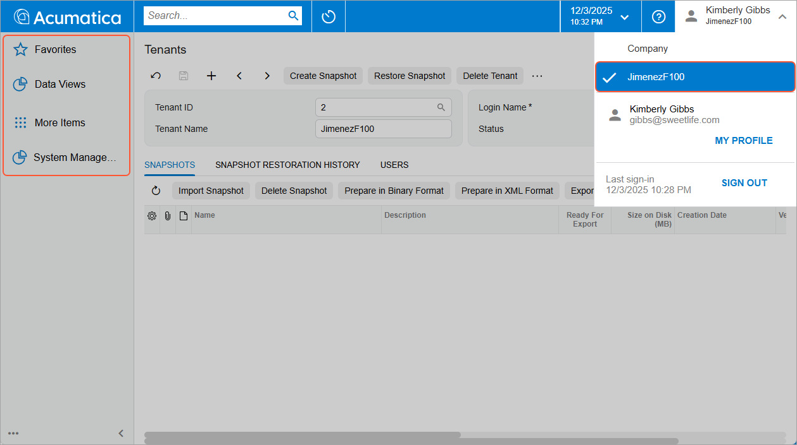
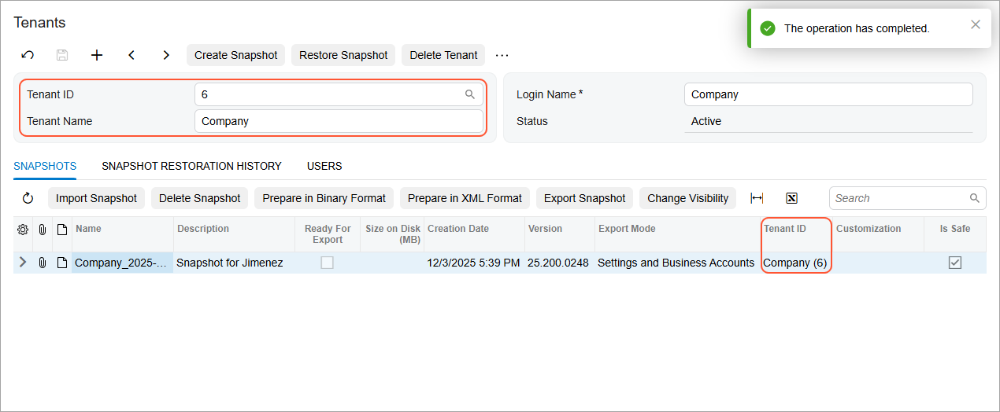
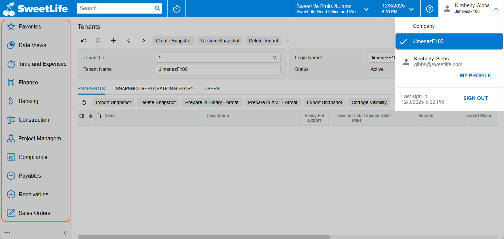

# Snapshots: To Take, Restore, and Delete a Snapshot {#_e12b9fcd-9e96-4366-97d5-a262b505c87a .task}

The following activity will walk you through the process of taking, restoring, and deleting a snapshot for the tenants of an instance.

**Attention:** This activity is based on the *U100* dataset. If you are using another dataset or if any system settings have been changed in *U100*, these changes can affect the workflow of the activity and the results of the processing. To avoid issues, restore the *U100* dataset to its initial state.

## Story { .section}

Suppose that the SweetLife Fruits &amp; Jams company has a new hire, Alberto Jimenez, who should complete a training course during his probation period. To complete the training, the new employee needs a copy of the production tenant. Acting as a system administrator, you need to create a test tenant for the new employee. To save space, you will take a snapshot whose content is limited to the settings and business accounts of the production tenant, instead of copying all production data of the tenant. You will toggle the visibility of the snapshot and restore this snapshot for the test tenant. Then you will delete the snapshot.

## Process Overview { .section}

You will use the [Tenants](SM_20_35_20.md) \(SM203520\) form to create a test tenant. Then you will schedule the system lockout on the [Apply Updates](SM_20_35_10.md) \(SM203510\) form to ensure that the snapshot data is consistent. Then on the [Tenants](SM_20_35_20.md) form, you will create a snapshot whose content is limited to settings and business accounts. You will toggle the snapshot's visibility and restore the snapshot to the test tenant.

On the same form, you will then delete the snapshot. Finally, on the [Apply Updates](SM_20_35_10.md) form, you will stop the lockout of the system.

## System Preparation { .section}

Launch the Acumatica ERP website, and sign in to the tenant with the *U100* dataset preloaded \(that is, the tenant you created for the course\) as the system administrator by using the *gibbs* username and the *123* password.

## Step 1: Creating a New Tenant {#section_erm_y3k_qpb .section}

To create a new tenant, do the following:

1.  On the [Tenants](SM_20_35_20.md) \(SM203520\) form, add a new record.
2.  In the **Tenant Name** box of the Summary area, type `JimenezF100`.
3.  In the **Login Name** box, type `JimenezF100`.
4.  On the form toolbar, click **Save**. Wait for the system to complete the operation.

    **Tip:** When you create a system tenant, you may be signed out after its creation, depending on how many non-System tenants your Acumatica ERP instance already had:

    -   One non-System tenant \(to which you are signed in\): After you create a new one, the system signs you out to switch from single-tenant mode to multitenant mode.
    -   Multiple non-System tenants: When you create another tenant, it is already in multitenant mode. Instead of being signed out, you wait until the system completes the operation and then proceed.
5.  Reload the webpage.
6.  By using the User menu \(on the right side of the top pane\), switch to the *JimenezF100* tenant.
7.  Verify that a few default workspaces are available in the tenant, as shown in the following screenshot, which means that an empty tenant has been created.

    

## Step 2: Scheduling the System Lockout { .section}

To switch on maintenance mode and lock the system, do the following:

1.  Open the [Apply Updates](SM_20_35_10.md) \(SM203510\) form.
2.  On the form toolbar, click **Schedule Maintenance**.
3.  In the **Schedule Lockout** dialog box, leave the default settings and click **OK**.

## Step 3: Creating a Snapshot and Toggling Its Visibility { .section}

To create a snapshot for the new employee, do the following:

1.  On the User menu \(on the right side of the top pane\), switch to the tenant with the *U100* dataset preloaded \(that is, the tenant you have created for performing the activities of this course\).
2.  Open the [Tenants](SM_20_35_20.md) \(SM203520\) form.
3.  In the **Tenant ID** box of the Summary area, select the tenant with the *U100* dataset preloaded.
4.  On the form toolbar, click **Create Snapshot**.
5.  In the **Create Snapshot** dialog box, specify the following settings:
    -   **Description**: `Snapshot for Jimenez`
    -   **Export Mode**: *Settings and Business Accounts*
6.  Click **OK**. Wait for the system to complete the operation. The system adds the record with the summary information of the snapshot to the **Snapshots** tab. Notice that the tenant name in the **Tenant ID** column is the name of the tenant used as the source \(see the following screenshot\).

    

7.  On the table toolbar of the **Snapshots** tab, click **Change Visibility**, and verify that the **Tenant ID** column became empty in the row with the snapshot. This indicates that the snapshot has increased visibility, that is the snapshot is available for export or restoration regardless of the tenant that you select in the **Tenant ID** box of the Summary area.

## Step 4: Restoring the Snapshot { .section}

To restore the snapshot, do the following:

1.  While you are still on the [Tenants](SM_20_35_20.md) \(SM203520\) form, in the **Tenant ID** box, select the ID of the *JimenezF100* tenant. The snapshot with the *Snapshot for Jimenez* description is still displayed for this tenant on the **Snapshots** tab because you have increased the visibility for this snapshot.
2.  On the form toolbar, click **Restore Snapshot**.
3.  In the **Restore Snapshot** dialog box, which opens, click **OK**. Wait until the system completes the snapshot restoration. Notice the list of workspaces in the source tenant \(the one to which you are currently signed in\).
4.  On the User menu, switch to the *JimenezF100* tenant.
5.  Verify that the tenant has the same set of workspaces as the source tenant does, as shown in the following screenshot.

    

## Step 5: Deleting the Snapshot {#section_mmw_ynq_qpb .section}

To delete the snapshot, do the following:

1.  On the User menu, switch to the tenant with the *U100* dataset preloaded \(the tenant you have created for this course\).
2.  Open the [Delete Snapshots and Tenants](SM_50_30_00.md) \(SM503000\) form.
3.  In the **Action** box in the Selection area, select *Delete Snapshot*.
4.  In the Included column, select the check box in the row with the *Snapshot for Jimenez* snapshot that you want to delete.
5.  On the form toolbar, click **Process**. The **Processing** dialog box opens. Wait for the system to complete the operation.
6.  In the **Processing** dialog box, click **Close**.
7.  On the [Tenants](SM_20_35_20.md) \(SM203520\) form, make sure that the snapshot has been deleted and is no longer listed in the table.

## Step 6: Unlocking the System { .section}

To stop the lockout of the system, do the following:

1.  Open the [Apply Updates](SM_20_35_10.md) \(SM203510\) form.
2.  On the form toolbar, click **Stop Maintenance**.

In this activity, you have created a snapshot whose content is limited to settings and business accounts. Then you toggled the snapshot visibility, restored the snapshot to the test tenant, and deleted the snapshot.

**Parent topic:**[Using Snapshots](../UserGuide/SA_Using_Snapshots_Mapref.md)

