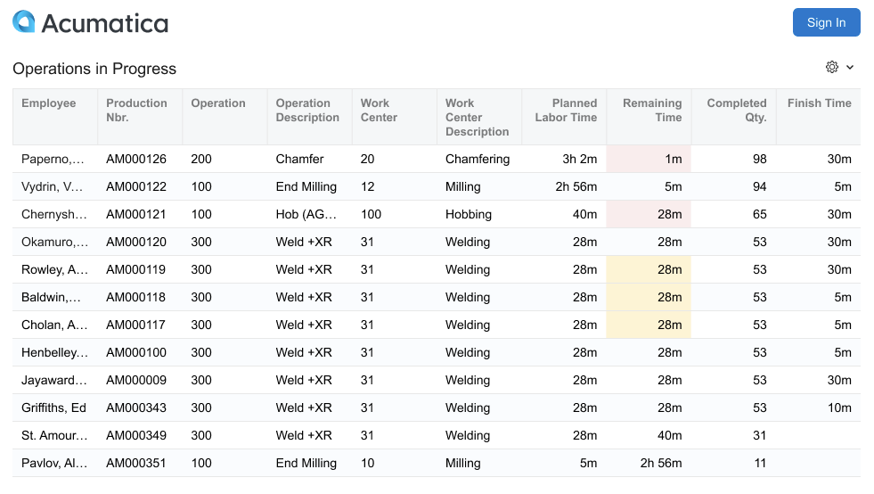
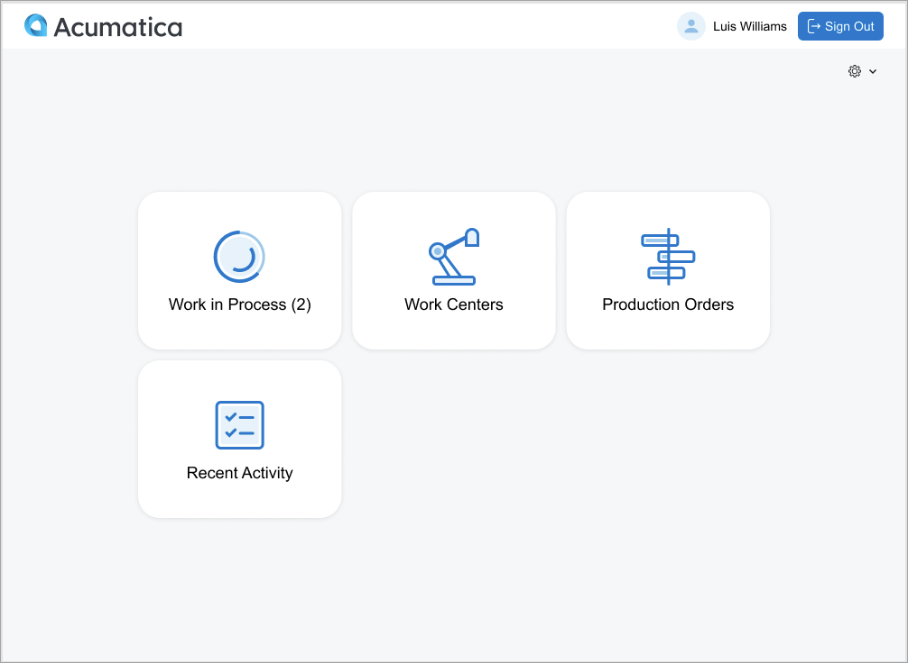
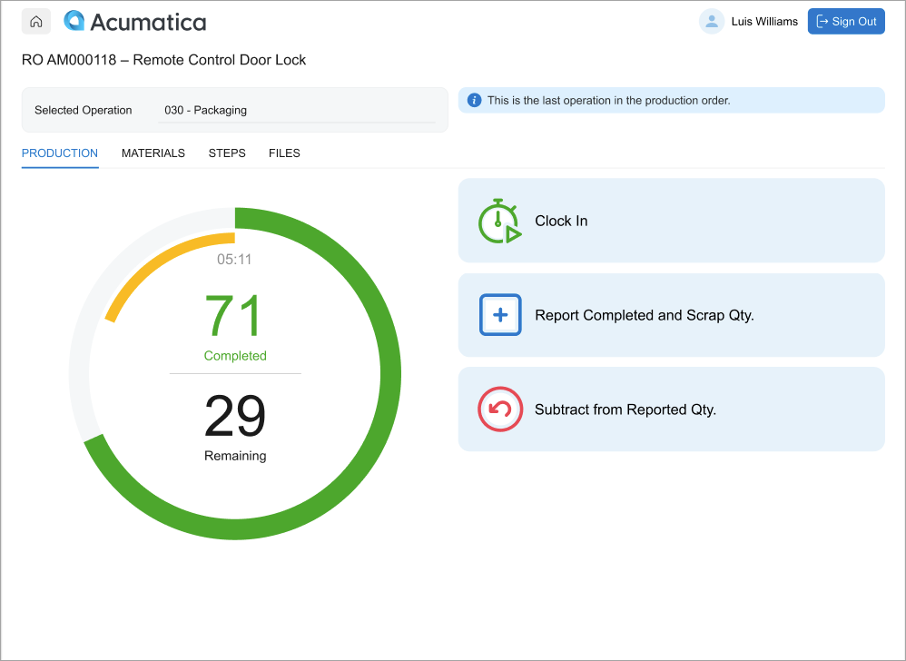

# Shop Floor Kiosk: Interface Overview {#_c777e4c5-ed3d-4275-9f2a-0eac1ef614d0 .concept}

The Shop Floor Kiosk gives you a focused interface for viewing shop floor activity, selecting work, and reporting production progress. After you sign in, you use tiles on the home page to open the workflows available to you.

## Landing Page \(Operations in Progress\) { .section}

The landing page is the first page you see when the kiosk is available for use. Before you sign in, you can view operations that are currently in progress on the shop floor.

Use this page to see active production activity, including the employee working on the operation, production order, operation, work center, planned and remaining labor time, completed quantity, and estimated finish time.

To start using the kiosk, click **Sign In** and select your employee record.

## Home Page { .section}

After you sign in, the home page opens. This page confirms that you are signed in and shows the navigation tiles available to you.

The top area of the page shows the company logo, your name, and the **Sign Out** button. The main area contains tiles that open kiosk workflows.

## Work in Process Tile { .section}

Use the **Work in Process** tile to return to an operation you are currently clocked in to. The number on the tile shows how many active operations are available to you.

If you are not clocked in to any operation, this tile is not available.

## Work Centers Tile { .section}

Use the **Work Centers** tile to select work by work center. You first select a work center, then select an operation from that work center’s dispatch list.

Use this workflow when you want to pull work from a work center queue.

## Production Orders Tile { .section}

Use the **Production Orders** tile to select work by production order. This workflow is useful when you are working from a production order, traveler, or job packet.

You select a production order, review its operations, and then select the operation you want to report.

## Recent Activity Tile { .section}

Use the **Recent Activity** tile to review actions you performed in the kiosk during the previous seven days.

You can use this page to confirm recent clock-in, clock-out, material issue, completed quantity, and scrap reporting activity. You can also use it to return to a recently used operation.

## Basic Navigation Patterns { .section}

You typically use the kiosk in this sequence:

1.  Sign in from the landing page.
2.  Select a tile on the home page.
3.  Select a work center, production order, or operation.
4.  Use the **Production Reporting** page to record work.
5.  Return to the home page or sign out.

Most kiosk pages include the same basic navigation controls: the Home button, company logo, your signed-in user name, and the **Sign Out** button.

The **Production Reporting** page is the main page where you report work for an operation. Depending on the operation and your current activity, you can clock in or out, report completed and scrap quantities, review materials, and view related operation details.

**Parent topic:**[Shop Floor Kiosk](../UserGuide/MFG_SFK_Mapref.md)

