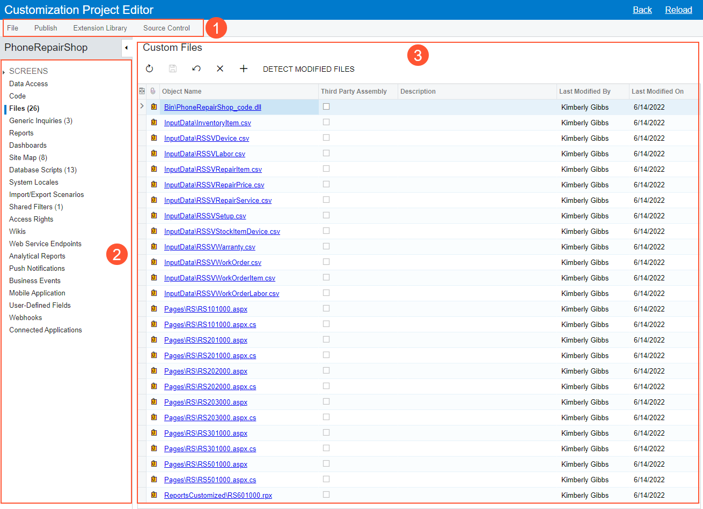

# Customization Project Editor {#_0bb97781-e987-4039-962d-457720821bff .reference}

Form ID: SM204510

You can use the Customization Project Editor to develop and manage the content of a customization project. The editor contains separate pages to add and manage items in the currently selected customization project. \(See [Managing Items in a Project](../CustomizationPlatform/CG_GL_Items.md) for instructions.\)

You can launch the Customization Project Editor and view its pages only if you have selected a customization project and your user account is assigned the *Customizer* role.

**Tip:** You can launch the editor from any Acumatica ERP form by using the [Customization Menu](AU_CustomizationMenu.md) or from the [Customization Projects](SM_20_45_05.md) \(SM204505\) form.

## Pages of the Customization Project Editor { .section}

The Customization Project Editor is a set of pages with a common interface, and the interface consists of the following parts:

-   The main menu for working with the customization project \(see Item 1 in the following screenshot\)
-   The navigation pane, which displays the list of pages used to manage the corresponding project items \(Item 2\)
-   The main area, which displays the selected page \(Item 3, which shows the [Files](AU_20_45_00.md) page\)

In the navigation pane, a node with a capitalized name can be expanded to give you direct access to items of the appropriate type.

## Main Menu of the Project Editor { .section}

The main menu contains the following items and commands.

|Command|Description|
|-------|-----------|
|The **File** menu contains the following commands.|
|**Manage Customization Projects**|Opens the [Customization Projects](SM_20_45_05.md) \(SM204505\) form in a new window.|
|**Edit Project XML**|Opens the Project XML Editor, which you can use to edit the XML source code of the current customization project, save it to the database, download the project package, and upload a deployment package to replace the project content.|
|**Edit Project Items**|Opens the Edit Project Items page, which you can use to edit the XML source code of a project item.|
|**Export Project Package**|Exports the deployment package of the project—that is, the ZIP file that contains the project. The file has the same name as the exported customization project has.|
|**Replace from Package**|Initiates the import of a previously exported deployment package from a ZIP file. This menu command opens the **Open Package** dialog box with the **Choose File** button and the **Upload** button, which you can use to replace the current project content.|
|**Validate Project Prefix**|Opens the **Customization Project Prefix** dialog box, in which you can make sure that all project items contain the needed prefix.|
|**Export Project Items Workbook**|Generates a workbook with the project items in Excel format. The workbook contains a list of solution objects and integration scenarios grouped by the following types:

 -   Site map nodes
-   Mobile site map nodes
-   BLСs and BLC extensions
-   DACs and DAC extensions
-   Push notifications
-   Import or export scenarios

|
|The **Publish** menu contains the following commands.|
|**Publish Current Project**|Initiates the process of publishing the current customization project. The system launches a publication process that opens the **Compilation** window, where you can view a log with information about the process.|
|**Validate Current Project**|Initiates the process of validating the current project. The system launches the validation process and opens the **Compilation** window, where you can view a log with information about the process.

 If both the validation and the compilation of the project are successful, the system makes the **Publish** button available. You can click this button to finalize the publishing and to update the website.

|
|**Multiple Projects**|Opens the [Customization Projects](SM_20_45_05.md) form.|
|**Publish with Cleanup**|Initiates the process of publishing the current customization project, as the **Publish Current Project** command does, but with the following difference: When the Acumatica Customization Platform publishes a project that contains a database script, the platform executes the script and tries to avoid executing the script at every publication of the project for optimization purposes. Therefore, the platform keeps information about each script that has been executed at least once and has not since been changed in the database, and omits the repeated execution of such scripts.

 If you run the **Publish with Cleanup** operation, the platform cleans all the information about previously executed scripts of the customization project and executes this scripts once more while publishing the project.

|
|The **Extension Library** menu contains the following commands.|
|**Create New**|Creates a solution for Microsoft Visual Studio in which you can develop an extension library for the customization project. The solution contains the website and extension library projects. This action also downloads the `OpenSolution.bat` file. The file contains the absolute path to the `.sln` file in the file system; you can use this file to open the solution in Visual Studio.

 **Tip:** By default, the system uses the `App_Data\Projects` folder of the website as the parent folder for the solution project. If the website folder is outside of the `C:\Program Files (x86)` and `C:\Program Files` folders, such as `C:\AcumaticaSites\MySite`, we recommend that you not change it. Otherwise, we recommend that you specify a parent folder outside these folders to avoid an issue with permission to access files.

|
|**Bind to Existing**|Opens the **Bind to Extension Library** dialog box with the **Containing Folder** box and the **OK** and **Cancel** buttons. In this dialog box, you specify the extension library project in the file system to which the customization code will be moved if you click **Move to Ext. Library** on the page toolbar of the [Code Editor](AU_20_40_00_CodeEditor.md) page.|
|**Open in Visual Studio**|Downloads the `OpenSolution.bat` file, which is used to open the existing solution in Visual Studio.|
|**Show Active Extensions**|Starts the verification of extensions for data access classes and business logic controllers, and opens the **Validate Extensions** pop-up window to display the validation log. In the log, every error is highlighted in red. We recommend that you verify extensions if you have upgraded legacy DAC customization.|
|**Analyze Referenced Assemblies**|Runs the validation of custom files in the customization project and downloads the CSV file with the report.|
|The **Source Control** menu contains the following commands.|
|**Save Project to Folder**|Saves the customization project as a set of files to a local folder that is used for integration with source control systems. Opens the **Saves Project to Folder** dialog box \(see [To Save a Project to a Local Folder](../CustomizationPlatform/CG_GL_VCS_Saving2Folder.md) for instructions\), in which you can select the name and location of the folder inside a repository.|
|**Open Project from Folder**|Opens the **Open Project from Folder** dialog box. In this dialog box, you specify the repository \(in the **Containing Folder** box\) from which the system should load the customization project.|

|Element|Description|
|-------|-----------|
|The dialog box contains the following elements.|
|**Project Prefix**|The prefix that the project items should have.|
|**Validation Result**|The area that displays the results of the validation.|
|The dialog box has the following buttons.|
|**Validate Project Items**|Runs the validation process. This button becomes available when you enter the prefix in the **Project Prefix** box and click **Save**.|
|**Save**|Saves the project prefix to the customization project.|
|**Save &amp; Close**|Saves the project prefix and closes the dialog box.|
|**Cancel**|Closes the dialog box without saving your changes.|

|Element|Description|
|-------|-----------|
|Parent Folder|The path to the folder to save the project items.|
|Project Name|The name of the folder.|
|The dialog box has the following buttons.|
|**OK**|Closes the dialog box and saves the project items to the specified folder.|
|**Cancel**|Closes the dialog box without saving your changes.|

