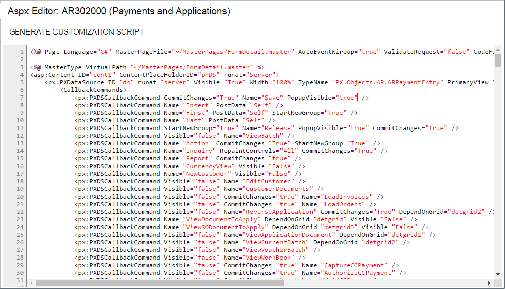

# ASPX Editor {#_31a5d453-4b6b-4a68-96c5-b7af2b0e52a9 .reference}

Page ID: \(SM204590\)

You use the ASPX Editor page to edit the ASPX code of the particular screen \(that is, the form in Acumatica ERP\) that you are customizing by using the Screen Editor page.

The ASPX Editor page contains the Source Code pane and a toolbar with only the **Generate Customization Script** button, which is described below.

**Tip:** You open the ASPX Editor page by clicking **Edit ASPX** on the page toolbar of the Screen Editor page of the Customization Project Editor. The name that appears on the page is *ASPX Editor:* followed by the form ID and then the form name in parentheses.

## Page Toolbar { .section}

The page toolbar includes only the following page-specific button.

|Button|Description|
|------|-----------|
|**Generate Customization Script**|Generates a customization script and saves it to the customization project. You use the **Generate Customization Script** button instead of a **Save** button because this action saves to the customization project not the modified ASPX code but the difference between the modified code and the original code of the page.|

## Source Code Pane {#1 .section}

You use the Source Code pane of the ASPX editor \(shown in the following screenshot\) instead of the Screen Editor page if you want to use a text editor rather than a visual tool.

