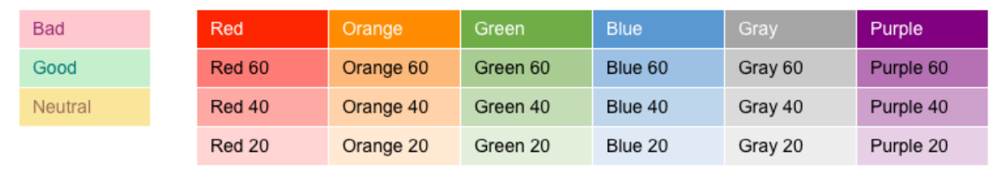

# Generic Inquiry {#_5388c653-eac4-4f43-b769-163cd037ab09 .reference}

Form ID: \(SM208000\)

By using this form, you can create inquiries on the fly, without programming. You can view how the selected or newly designed inquiry looks, and you can test its functionality by selecting parameters and viewing the results.

## Form Toolbar {#section_lfw_qtz_k3c .section}

The form toolbar and More menu include the buttons and commands described below.

|Command|Description|
|-------|-----------|
|**Change Inquiry Title**|Opens the **Change Inquiry Title** dialog box, in which you can enter the new title for the generic inquiry and click **OK**. If the specified title is not unique, the system displays an error; you can enter another title. If the title is unique, the system closes the dialog box and inserts the new title in the **Inquiry Title** box. You must save the generic inquiry with the new title.|
|**Detect Anomalies**|Opens the [Detect Anomalies in Generic Inquiries](ML_50_20_00.md) \(ML502000\) form, on which you can start the anomaly detection process for the generic inquiry.

 This command appears on the More menu if the **Detect Anomalies**check box is selected on the **Interface Options** tab.

|
|**Publish to the UI**|Opens the **Publish to the UI** dialog box, in which you can modify the site map title and screen ID for the generic inquiry, change default workspace and category, and specify access right.|
|**Export as Report**|Exports data access class information from the generic inquiry to an `.rpx` file, which can be used in Acumatica Report Designer as a basis for a report.|
|**View Inquiry**|Displays the inquiry form resulting from the settings specified for the generic inquiry selected on the current form.|
|**Unpublish**|Removes the respective node from the site map, clears the assignment of screen identifier and deletes all configured access rights from the database.|

|Element|Description|
|-------|-----------|
|**Site Map Title**|The name that will be shown on the form and in its row on the [Site Map](../Shared/../UserGuide/SM_20_05_20.md) \(SM200520\) form.|
|**Workspace**|The workspace in Acumatica ERP from which the form can be accessed.|
|**Category**|The category under which the form will be displayed in the selected workspace.|
|**Screen ID**|The identifier to be assigned to the form.|
|**Access Rights**|An option button that indicates which access rights should be specified for the newly added form:

-   **Set to Granted for All Roles**: The system sets the access rights for this form to *Granted* for all user roles in the system.
-   **Set to Revoked for All Roles**: The system sets the access rights for this form to *Revoked* for all user roles in the system.
-   **Copy Access Rights from Screen** \(default\): The system copies the set of the access rights from the form you specify. When you select this option button, a box appears right of it; click the magnifier icon to select the source form in the lookup table.

|
|The dialog box has the following buttons.|
|**Publish**|Publishes the form and closes the dialog box. The system assigns the form the specified screen ID and makes it available in the specified workspace.|
|**Cancel**|Cancels publication and closes the dialog box.|

## Summary Area {#1 .section}

In this area, you can specify the titles to be used for the newly created generic inquiry and for the corresponding generic inquiry form in the site map. Also, you can select how you want to configure the generic inquiry.

|Element|Description|
|-------|-----------|
|**Inquiry Title**|The title to be used for the inquiry form. You can type a name to add a new inquiry, or select an inquiry for editing from the list of existing inquiries.|
|**Mode**|The mode of generic inquiry configuration, which can be one of the following:-   *Low-Code*: You define all components of a generic inquiry by working with the following tabs: **Data Source**, **Relations**, **Parameters**, **Conditions**, **Grouping**, **Sort Order**, and **Results Grid**.
-   *Advanced*: You define all components of a generic inquiry by using Generic Inquiry Query Language \(GIQL\). For details about GIQL, see [GIQL: General Information](GI_GIQL_GeneralInfo.md).

|
|**Disable Record Counts and Totals**|A check box that \(if selected\) hides the number of records or pages in the footer so the associated generic inquiry form loads faster.|
|**Site Map Title**|The name of the inquiry form as it will be displayed on the site map. You can enter any name by using alphabetic or numeric characters. You must specify the site map title if you want to replace an entry form with this inquiry form or expose this inquiry through the OData interface.

 For more information, see [Exposing Inquiry Results by Using OData](GI_Exposing_Inquiry_by_Using_OData_Mapref.md) and [Making a Generic Inquiry a Substitute Form](GI_Gi_as_Entry_Point_Mapref.md).

|
|**Screen ID**|The identifier of the form related to the generic inquiry. The system automatically assigns the identifier when you publish the generic inquiry. You can change the identifier during the publication. If an identifier has been assigned and you have removed the inquiry from the UI, using the **Unpublish** command, the system clears the box value and removes the inquiry from the site map.

 The automatically assigned identifier starts with *GI* and then has a six-digit number that follows the number assigned to the most recent generic inquiry created in the system. For example, if the most recently created generic inquiry has the *GI000001* identifier, the newly created generic inquiry is assigned the *GI000002* identifier. \(The numbering sequence is not used by customizations that have generic inquiries with IDs of a different format.\) The maximum number of generic inquiries in the system is 999999. If you exceed this value, an error message will be displayed.

 **Tip:** The screen ID, title, workspace, and category of an inquiry can be modified on the [Site Map](SM_20_05_20.md) \(SM200520\) form.

If you want to import a generic inquiry, make sure that its identifier does not coincide with any generic inquiry identifier that already exists in the system.

|

## Query Tab {#section_pfw_qtz_k3c .section}

On the **Query** tab, you can access the Generic Inquiry Query Language \(GIQL\) Editor and write GIQL queries. For details about GIQL, see [GIQL: General Information](GI_GIQL_GeneralInfo.md).

The tab appears on the form only if the *Advanced* mode is selected in the Summary area.

## Data Sources Tab {#2 .section}

The **Data Sources** tab holds the list of generic inquires and data access classes \(DACs\) to be used for the inquiry \(that is, the DACs that are used to represent the data from the system database tables\).

The tab appears on the form only if the *Low-Code* mode is selected in the Summary area.

|Button|Description|
|------|-----------|
|**Add Related Table**|Opens the **Related Tables** dialog box, where you can configure a relation between a parent table and a child table.

 In the **Related Tables** dialog box, when you specify a pair of tables—that is, a parent table and a child table—the system automatically inserts a statement in the **Relation** box that represents the relation between the parent table and the child table.

 The button is not available if a generic inquiry is selected in the table on the tab.

|

|Column|Description|
|------|-----------|
|**Source Name**|The name of a data source. The data source can be the DAC, which provides access to database tables, or a generic inquiry. You can click the magnifier icon to open the dialog box and select a DAC or a generic inquiry from the list of available sources. The dialog box has the following tabs:

 -   **All Records**: This tab shows all the available data sources, DACs and generic inquiries.
-   **Most Used**: This tab opens by default and shows the list of tables with **Display Name** value that is not empty.
-   **Generic Inquiries**: This tab shows all the available generic inquiries.

 After you have added a DAC, its name is displayed as a link. If you click the link, the DAC Schema Browser opens with the DAC selected.

 After you have added a generic inquiry, its name is displayed as a link. If you click the link, the [Generic Inquiry](SM_20_80_00.md) \(SM208000\) form opens in the new browser tab with the inquiry selected.

|
|**Alias**|The alias to be used in SQL statements to designate the table.

 If no alias is specified, the **Source Name** is used.

|

## Relations Tab {#3 .section}

In the **Table Relations** table of this tab, you can specify relations between pairs of tables or inquiries. For each pair of related data sources, you specify links between the columns of these two data sources in the **Data Field Links for Active Relations** table.

The tab appears on the form only if the *Low-Code* mode is selected in the Summary area.

|Button|Description|
|------|-----------|
|**Add Related Table**|Opens the **Related Tables** dialog box, where you can configure a relation between a parent data sources and a child data source.

 In the **Related Tables** dialog box, when you specify a pair of tables—that is, a parent table and a child table—the system automatically inserts a statement in the **Relation** box that represents the relation between the parent table and the child table.

 The button is not available if a generic inquiry is selected in the **Table Relations** table.

|

|Column|Description|
|------|-----------|
|**Active**|A check box that indicates \(if selected\) that the record is active and is used to specify relations.|
|**Parent Table**|The name \(alias\) of the first data source in a *JOIN* statement of SQL.|
|**Join Type**|The type of *JOIN* between participating data sources, which can be one of the following options:

 -   *Inner*: Returns rows when there is at least one match in both sources.
-   *Right*: Returns all rows from the right source, even if there are no matches in the left source.
-   *Left*: Returns all rows from the left source, even if there are no matches in the right source.
-   *Full*: Returns rows when there is a match in one of the sources.
-   *Cross*: Returns all records in which each row from the first source is combined with each row from the second source. The size of a resulting set is the number of rows in the first source multiplied by the number of rows in the second source.

 You can concatenate multiple joining conditions between different parent sources to the same child source into one *ON* clause. For example, if you cross join Custom Week and Employees, you can also join time cards that exist for the Custom Week-Employees pairs.

|
|**Child Table**|The second data source to be used in the *JOIN* statement.|

|Button|Description|
|------|-----------|
|**Add Relations**|Opens the **Related Tables** dialog box to view the configured relation between a parent and child table.

 In the **Related Tables** dialog box, you can view the configured relation between a pair of tables—that is, a parent table and a child table. You can also configure the relation between a new pair of tables.

 The button is not available if a generic inquiry is selected in the **Table Relations** table.

|

|Element|Description|
|-------|-----------|
|**Brackets**|The opening bracket or brackets for composing a logical expression with multiple conditions.|
|**Parent Field**|The field from the parent data source. Select a field, or click the Edit button to open the Formula Editor dialog box and create a formula.

 For details on the functions that can be used in the formula, see [Formulas](#_781f6418-1ce2-457f-a160-ef5eb968a086).

|
|**Condition**|One of the following logical conditions:

 -   *Equals*: Returns *TRUE* if the value of the specified parent field is equal to the value of the specified child field
-   *Does Not Equal*: Returns *TRUE* if the parent field value is not equal to the child field value
-   *Is Greater Than*: Returns *TRUE* if the parent field value is greater than the child field value
-   *Is Greater Than or Equal To*: Returns *TRUE* if the parent field value is greater than or equal to the child field value
-   *Is Less Than*: Returns *TRUE* if the parent field value is less than the child field value
-   *Is Less Than or Equal To*: Returns *TRUE* if the parent field value is less than or equal to the child field value
-   *Is Between*: Is not applicable for parent and child field values
-   *Contains*: Returns *TRUE* if the parent field value \(string\) contains the child field value
-   *Ends With*: Returns *TRUE* if the parent field value ends with the same character or string as the child field value contains
-   *Starts With*: Returns *TRUE* if the parent field value contains at the beginning the child field value
-   *Is Empty*: Returns *TRUE* if the parent field value is empty \(null\)
-   *Is Not Empty*: Returns *TRUE* if the parent field value is not empty \(not null\)

|
|**Child Field**|The field from the second data source. Select a field, or click the Edit button to open the Formula Editor dialog box and create a formula.

 For details on the functions that can be used in the formula, see [Formulas](#_781f6418-1ce2-457f-a160-ef5eb968a086).

|
|**Brackets**|The closing bracket or brackets for composing a logical expression with multiple conditions.|
|**Operator**|The logical operator between conditions, which can be *And* or *Or*.|

## Parameters Tab {#section_rfw_qtz_k3c .section}

You use the **Parameters** tab to specify the types of fields to be used in the parameters area of the inquiry form.

The tab appears on the form only if the *Low-Code* mode is selected in the Summary area.

|Button|Description|
|------|-----------|
|**Arrange Parameters in _x_columns**|The number of columns in which the elements for parameters should be arranged in the Selection area of the inquiry form.|
|**Move Row Up**|Moves the selected row up by one row.|
|**Move Row Down**|Moves the selected row down by one row.|
|**Combo Box Values**|Brings up the **Combo Box Values** dialog box, which you can use to enter the options to be used for the drop-down list for this parameter.|

|Column|Description|
|------|-----------|
|**Active**|A check box that indicates \(if selected\) that the parameter is active and will be added to the inquiry area that provides fields for inquiry parameters.|
|**Is Required**|A check box that indicates \(if selected\) that this field is required on the inquiry form.|
|**Name**|The name of the parameter.

 **Attention:** A generic inquiry cannot have multiple active parameters with the same name; similarly, it cannot have multiple inactive parameters with the same name.

|
|**Schema Field**|The type of control to be used for the parameter in the Selection area of the resulting inquiry form. You can select one of the following:

 -   *&lt;Checkbox&gt;*: A check box will be used for the parameter.
-   *&lt;Combobox&gt;*: A drop-down list will be used for the parameter. If you select this control, you need to define the list of options that will be available in the drop-down list. You specify these options in the **Combo Box Values** dialog box, which you can invoke by clicking **Combo Box Values** on the table toolbar with this row selected.
-   Field name: A lookup box that has a corresponding lookup table will be used as the parameter. For example, if you specify a field name that is a date field, then when a user clicks in the lookup box, a calendar will be displayed. The list of field names includes the names of fields of all data sources added on the **Data Sources** tab of the current form for the selected inquiry.
-   Empty: A data input field will be used as the parameter.

|
|**Display Name**|The name for the field to be displayed on the form.|
|**From Schema**|A check box that indicates \(if selected\) that the default value can be selected from the predefined values of the field name selected in the **Schema Field** column. If a field name is selected in the **Schema Field** column and you select the **From Schema** check box, in the **Default Value** column, a lookup box, drop-down list, or check box \(depending on the control type of the selected schema field\) is displayed.|
|**Default Value**|The default value of the field.

 If the **From Schema** check box is selected in this row, the system presents the appropriate control in the **Default Value** column, and you can select the default value or select or clear the check box \(if the schema field is a check box\).

 If the **From Schema** check box is cleared in this row, in the **Default Value** column, you can enter any value of the field.

 When you use a generic inquiry as a data source for another generic inquiry, and the **From Schema** check box is cleared in this row, the **Default Value** column displays a drop-down list with the values of the parent inquiry parameters. The parameter names are displayed in brackets to avoid confusion with text values.

 For data fields of the date type that are based on schema fields, you can select one of the following date-relative parameters in the Calendar dialog box:

 -   *@Today*: The business day.
-   *@WeekStart* and *@WeekEnd*: The start and end of the current week. The start and end of the week are determined based on the default system locale or the locale the user has selected when signing in to Acumatica ERP. System locales are defined on the [System Locales](../Shared/../UserGuide/SM_20_05_50.md) \(SM200550\) form.
-   *@MonthStart* and *@MonthEnd*: The start and end of the current month.
-   *@QuarterStart* and *@QuarterEnd*: The start and end of the current quarter.
-   *@PeriodStart* and *@PeriodEnd*: The start and end of the current financial period. The financial periods are defined on the [Financial Year](../Shared/../UserGuide/GL_10_10_00.md) \(GL101000\) form.

For more information about financial periods in Acumatica ERP, see [Managing Financial Periods](../Shared/../UserGuide/Finance_ManagingPeriods_Mapref.md).

-   *@YearStart* and *@YearEnd*: The start and end of the current calendar year.

 All the date-relative parameters use the date of the server used to run the Acumatica ERP instance as the current date. Additionally, you can modify the date-relative parameters by adding or subtracting integers. The unit of measure of the parameter is determined automatically and the reference point is moved according to the measurement of the parameter—for example, *@WeekStart+1* relate to the start of the next week.

 **Important:** You must specify default values for the required parameters before using anomaly detection. If default values aren’t specified and you try to select the **Detect Anomalies** check box on the **Interface Options** tab, the system displays an error.

|
|**Column Span**|The number of columns in the parameters area on the inquiry form this column will span.|
|**Control Size**|The width of the grid column.|
|**Description for AI**|An instruction for using the parameter. This information helps AI Assistant provide better answers.|

|Element|Description|
|-------|-----------|
|**Value**|The value assigned to an option to be added to the combo-box list.|
|**Label**|A text string to be displayed as an option.|
|The dialog box has the following button.|
|**OK**|Saves the combo-box options for the parameter.|

## Conditions Tab {#4 .section}

On this tab, you can specify the conditions to be met for the rows to be returned; the system uses these conditions to generate the *WHERE* SQL request.

To include a parameter value in any condition, use the `[ParameterName]` format. You configure the fields for inquiry parameters \(to be displayed in the Selection area of the new generic inquiry form\) on the **Parameters** tab of the current form; once they have been configured, they appear on the list of fields shown in the **Data Field** column on this tab.

The tab appears on the form only if the *Low-Code* mode is selected in the Summary area.

|Button|Description|
|------|-----------|
|**Move Row Up**|Moves the selected row up by one position.|
|**Move Row Down**|Moves the selected row down by one position.|

|Column|Description|
|------|-----------|
|**Active**|A check box that indicates \(if selected\) that the row is an active condition.|
|**Brackets**|The opening bracket or brackets for composing a logical expression with multiple conditions.|
|**Data Field**|The field whose value the condition should be applied to.|
|**Condition**|One of the following logical conditions, which will be applied to the value of the field specified as the **Data Field** and the values in the **Value 1** and **Value 2** fields, if applicable:

 -   *Equals*: Returns *TRUE* if the value of the **Data Field** field is equal to the value specified as **Value 1**.
-   *Does Not Equal*: Returns *TRUE* if the field value is not equal to the **Value 1** value.
-   *Is Greater Than*: Returns *TRUE* if the field value is greater than the **Value 1** value.
-   *Is Greater Than or Equal To*: Returns *TRUE* if the field value is greater than or equal to the **Value 1** value.
-   *Is Less Than*: Returns *TRUE* if the field value is less than the **Value 1** value.
-   *Is Less Than or Equal To*: Returns *TRUE* if the field value is less than or equal to the **Value 1** value.
-   *Is Between*: Returns *TRUE* if the field value is between the **Value 1** and **Value 2** values. \(For this option, you must specify both **Value 1** and **Value 2**.\)
-   *Contains*: Returns *TRUE* if the field value \(string\) contains the **Value 1** value.
-   *Does Not Contain*: Returns *TRUE* if the field value \(string\) does not contain the **Value 1** value.
-   *Starts With*: Returns *TRUE* if the field value contains at the beginning the **Value 1** value.
-   *Ends With*: Returns *TRUE* if the field value ends with the **Value 1** value.
-   *Is Empty*: Returns *TRUE* if the field value is empty \(null\).
-   *Is Not Empty*: Returns *TRUE* if the field value is not empty \(not null\).
-   *Is In* \(for a field of the user type\): Returns *TRUE* if the value of the specified field \(a user\) is included in the workgroup specified in the **Value 1** column. You can select this option for the `@MyGroups` and `@MyWorktree` parameters specified in **Value 1**.
-   *Is Not In* \(for the fields of the user type\): Returns *TRUE* if the value of the specified field \(a user\) is not included in the workgroup specified in the **Value 1** column. You can select this option for the `@MyGroups` and `@MyWorktree` parameters specified in **Value 1**.

 If you specify a date in the **Value** or **Value 2** box but do not specify a time, the system uses `00:00:00` or `23:59:99` as the time, depending on the condition.

 If you specify date-relative parameters, such as *@Today*, in those boxes, the system also uses `00:00:00` or `23:59:99` as the time, depending on the condition.

 **Tip:** If you try to filter the inquiry results by using a string with the underscore, the result will also contain the values with the same string with any symbol instead of the underscore. For example, if you try to filter the inquiry by a customer name that contains the *Customer\_Name* string, the system will return all the customers whose name contains any of the following strings: *Customer\_Name*, *Customer-Name*, and *Customer Name*. All of these strings will be returned because the underscore is used as a wildcard character.

|
|**From Schema**|A check box that indicates \(if selected\) that in the **Value 1** and **Value 2** columns, you can select one of the predefined values of the selected **Data Field**, for example, a document type or a document status.|
|**Value 1**|The value to be used in the selected condition. Select a field, or click the Edit button to open the Formula Editor dialog box and create a formula.

 For the date-related data fields, you can use the date-relative parameters either by selecting the parameter in the Calendar dialog box \(if the field is based on a schema field and the **From Schema** check box is selected\) or by using the date-relative parameter in a formula \(if the field is not based on a schema field and you use the formula editor\). The following date-relative parameters are available:

 -   *@Today*: The business day.
-   *@WeekStart* and *@WeekEnd*: The start and end of the current week. The start and end of the week are determined based on the default system locale or the locale the user has selected when signing in to Acumatica ERP. System locales are defined on the [System Locales](../Shared/../UserGuide/SM_20_05_50.md) \(SM200550\) form.
-   *@MonthStart* and *@MonthEnd*: The start and end of the current month.
-   *@QuarterStart* and *@QuarterEnd*: The start and end of the current quarter.
-   *@PeriodStart* and *@PeriodEnd*: The start and end of the current financial period. The financial periods are defined on the [Financial Year](../Shared/../UserGuide/GL_10_10_00.md) \(GL101000\) form.

For more information about financial periods in Acumatica ERP, see [Managing Financial Periods](../Shared/../UserGuide/Finance_ManagingPeriods_Mapref.md).

-   *@YearStart* and *@YearEnd*: The start and end of the current calendar year.

 **Tip:** All the date-relative parameters use the date \(in UTC\) of the server used to run the Acumatica ERP instance as the current date.

 Additionally, you can modify the date-relative parameters by adding or subtracting integers. The unit of measure of the parameter is determined automatically and the reference point is moved according to the measurement of the parameter—for example, *@WeekStart+1* relate to the start of the next week.

 You can use the following company-related parameters to filter records or show values that depend on a branch or a company selected by a user in the Company and Branch Selection Menu:

 -   *@branch*: The branch specified for an entity.
-   *@company*: The company specified for an entity

 You can also use the following user-relative parameters for the workgroup-related data fields with the *Is In* or *Is Not In* condition:

 -   `@MyGroups`: The workgroups in which the current user is a member, excluding the workgroups that are the subordinates of these workgroups.
-   `MyWorktree`: The workgroups in which the current user is a member, including the groups that are subordinates of these groups according to the tenant tree structure.

|
|**Value 2**|The second value to be used, if the selected condition requires one. Select a field, or click the Edit button to open the Formula Editor dialog box and create a formula.

 For the date-related data fields that are not based on a schema field \(that is, the **From Schema** check box is cleared\), you can use one of the date-relative parameters, as described in **Value1**.

 For details on the functions that can be used in the formula, see [Formulas](SM_20_80_00.md#_781f6418-1ce2-457f-a160-ef5eb968a086).

|
|**Brackets**|The closing bracket or brackets for composing a logical expression with multiple conditions.|
|**Operator**|The logical operator to join conditions in a logical expression, which can be *And* or *Or*.|

## Grouping Tab {#section_ufw_qtz_k3c .section}

On this tab, you specify the grouping conditions according to which the results should be displayed on the inquiry form. One result row is returned for each group. *SUM* is the aggregate function that is applied to the result columns with the numeric type by default. *MAX* is the aggregate function that is applied to the other result columns by default. You can select an aggregate function value for each result column in the **Aggregate Function** column on the **Results Grid** tab.

The tab appears on the form only if the *Low-Code* mode is selected in the Summary area.

|Button|Description|
|------|-----------|
|**Move Row Up**|Moves the selected row up by one position.|
|**Move Row Down**|Moves the selected row down by one position.|

|Column|Description|
|------|-----------|
|**Active**|A check box that indicates \(if selected\) that the row is active and is used in grouping the inquiry results.|
|**Data Field**|The field of the table or the formula whose value the grouping should be applied to. Includes fields and constants. Select a field, or click the Edit button to open the Formula Editor dialog box and create a formula. For example, to create a generic inquiry listing total sales by month, you can create grouping condition `=MONTH([ARInvoice.TranDate])`.

 **Attention:** In this column, you cannot use the following:

-   Attribute fields. On the entry and maintenance form of a class, the attribute fields are listed on the **Attributes** tab.
-   Calculated fields, such as `Unit Cost * (1 + Markup Percent/100)`.
-   Calculated fields that are used in the generic inquiry that is the data source for the current inquiry, if applicable. \(For details, see [Data from Multiple Data Sources: Use of Generic Inquiry as Data Source](GI_Use_of_Generic_Inquiry_as_Data_Source_Concept.md).\)

 For details on the functions that can be used in the formula, see [Formulas](#_781f6418-1ce2-457f-a160-ef5eb968a086).

|

## Sort Order Tab {#5 .section}

On this tab, you specify the order in which the results should be displayed on the new inquiry form.

The tab appears on the form only if the *Low-Code* mode is selected in the Summary area.

|Button|Description|
|------|-----------|
|**Move Row Up**|Moves the selected row up by one position.|
|**Move Row Down**|Moves the selected row down by one position.|

|Column|Description|
|------|-----------|
|**Active**|A check box that indicates \(if selected\) that the row is active and is used in sorting the inquiry results.|
|**Data Field**|The field of the table or the formula that includes fields and constants. Select a field, or click the Edit button to open the Formula Editor dialog box and create a formula.

 For details on the functions that can be used in the formula, see [Formulas](#_781f6418-1ce2-457f-a160-ef5eb968a086).

|
|**Sort Order**|An option describing how values should be ordered in this column: in *Ascending* or *Descending* order.|

## Results Grid Tab {#7 .section}

By using this tab, you can specify how the results of the search in the database tables should be displayed.

The tab appears on the form only if the *Low-Code* mode is selected in the Summary area.

|Element|Description|
|-------|-----------|
|**Up**|Moves the selected row up by one row.|
|**Down**|Moves the selected row down by one row.|
|**Row Style**|A box to specify the style of a generic inquiry row. This box supports the use of formulas.

 For details on the functions that can be used in the formula, see [Formulas](#_781f6418-1ce2-457f-a160-ef5eb968a086).

|

|Column|Description|
|------|-----------|
|**Active**|A check box that indicates \(if selected\) that the row is active and thus is used in selecting the results.|
|**Object**|The name \(alias\) of the table.|
|**Data Field**|The field of the table or a formula that includes fields and constants. Select a field, or click the Edit button to open the Formula Editor dialog box and create a formula.

 For details on the functions that can be used in the formula, see [Formulas](#_781f6418-1ce2-457f-a160-ef5eb968a086).

|
|**Schema Field**|The field to be used to determine how the data should be formatted. The properties of the specified field—such as the format, mask, and data type—are used to format the data.

 The following examples demonstrate the use of the **Schema Field** column:

 -   In the **Data Field** column, you have a formula that calculates a turnover value, and you want to display this value using the same format as in the `GLHistory.TranPtdDebit` field—that is, with a localized group separator character between each group and two digits after the decimal separator. In the **Schema Field** column, you select *GLHistory.TranPtdDebit*.
-   In the **Data Field** column, you have a string, such as *ScreenID*, and you want to display it using the *CC.CC.CC.CC* mask—that is, with a dot as a separator after every two characters \(excluding the last two\). In the **Schema Field** column, you specify the name of the field that contains a screen ID with this mask.
-   In the **Data Field** column, you have a date, such as `StartDate`, and you want to display it as a string, such as *September eighteenth*. In the **Schema Field** column, you specify the name of the field that contains a date as a string.

 **Attention:** The values in this column must have the following format: `<DAC>.<Field>`.

|
|**Width \(px\)**|The width of the grid column in pixels.|
|**Visible**|A check box that indicates \(if selected\) that this field will appear in the resulting grid. If the check box is cleared, the field will be hidden by default but can be added to the grid by a user.|
|**Default Navigation**|A check box that indicates \(if selected, which is the default value\) that the field value can be a link to the default form, which the user can open by clicking the link specified in the source code. For example, for the field that holds the invoice reference number, the default form is the [Invoices and Memos](AR_30_10_00.md) \(AR301000\) form. If the check box is cleared, the field value can be a link to the screen selected in the **Navigate To** box.

 **Tip:** If the screen that should be opened by clicking the link is the same as the **Entry Screen** specified on the **Entry Point** tab of this form, the field value is displayed with no link. You can open any of these rows by clicking the row and then clicking the **Edit** action on the inquiry toolbar or by double-clicking the row.

 If the **Default Navigation** check box and the **Navigate To** box are cleared, the field cannot be a link.

 **Tip:** If you select the **Default Navigation** check box, you should clear the **Navigate To** box.

|
|**Navigate To**|A screen specified on the **Navigation** tab that the user can open by clicking the link in the column.

 If you select any screen in the column, the **Default Navigation** check box is cleared automatically.

|
|**Aggregate Function**|A function that defines how the resulting value should be calculated for the grouped values in this column. The following aggregate functions are available:

 -   *AVG*: Returns the average of all non-null values of the group.
-   *COUNT*: Returns a count of all values of the group.
-   *MAX*: Returns the maximum value of all values of the group.
-   *MIN*: Returns the minimum value of all values of the group.
-   *SUM*: Returns the sum of all values of the group.
-   *STRINGAGG*: Concatenates the values of the group into a string

 The following aggregate functions are applied by default, when no one function is selected:

 -   *SUM* is applied to the columns with the numeric type.
-   *MAX* is applied to the other columns.

|
|**Caption**|The name for the column header to be displayed on the form.

 **Attention:** This column is hidden by default. You can display this column in the table by using the **Column Configuration** dialog box. For details, see [Adjustment of the Acumatica ERP UI: To Personalize a View of a Form](../Shared/../UserGuide/GS_ModernUI_User_Interface_Personalization_Activity.md).

|
|**Quick Filter**|A check box that indicates \(if selected\) that the system should add a button with the quick filter for this field to the filtering area of the generic inquiry form. If multiple tabs are displayed on this generic inquiry form, the button with the quick filter is added to the filtering area of the **All Records** tab.

 By default, this check box is cleared.

 For details about quick filters, see [Managing Advanced Filters](GI_Reusable_Filters_Mapref.md).

|
|**Use in Quick Search**|A check box that indicates \(if selected\) that the system will include the column when performing a quick search by means of the generic inquiry filtering area. If the check box is cleared, the quick search algorithm will ignore the values for the column.

 **Attention:** This column is hidden by default. You can display this column in the table by using the **Column Configuration** dialog box. For details, see [Adjustment of the Acumatica ERP UI: To Personalize a View of a Form](../Shared/../UserGuide/GS_ModernUI_User_Interface_Personalization_Activity.md).

|
|**Total Aggregate Function**|A function that defines how the resulting value should be calculated for the total of aggregated generic inquiry column. When the **Total Aggregate Function** box is used, the resulting generic inquiry will display the aggregated value of the column displayed at the bottom of the screen. The following aggregate functions are available:

 -   *AVG*: Returns the average of all non-null values of the column
-   *COUNT*: Returns a count of all values of the column
-   *MAX*: Returns the maximum value of all values of the column
-   *MIN*: Returns the minimum value of all values of the column
-   *SUM*: Returns the sum of all values of the column

|
|**Style**|A box to specify the style of a generic inquiry column. This box supports the use of formulas.

 For details on the functions that can be used in the formula, see [Formulas](#_781f6418-1ce2-457f-a160-ef5eb968a086).

|
|**Description for AI**|A short description of the field, which may help AI Assistant to provide better answers.|

## Interface Options Tab {#section_bgw_qtz_k3c .section}

By using this tab, you can specify the interface settings for the selected generic query.

|Element|Description|
|-------|-----------|
|**Show Deleted Records**|A check box that indicates \(if selected\) that the *DeletedDatabaseRecord* field is available for adding to the inquiry results on the **Results Grid** tab. For details, see [Modification of Inquiry Results: Including Deleted Records](GI_Modifying_Inquiry_Results_DeletedRecords.md).|
|**Show Archived Records**|A check box that indicates \(if selected\) that archived records can be displayed on the generic inquiry form.|
|**Expose via OData**|A check box that indicates \(if selected\) that the selected inquiry is available through the OData interface. If you want to expose an inquiry, make sure that the title and the workspace of the inquiry are specified in the **Site Map Title** and **Workspace** boxes, and review the access rights configured for the inquiry.

 For more information, see [Exposing Inquiry Results by Using OData](GI_Exposing_Inquiry_by_Using_OData_Mapref.md) and [Managing User Access](SA_Managing_User_Access_Mapref.md).

|
|**Expose to the Mobile Application**|A check box that indicates \(if selected\) that the generic inquiry is displayed in the Acumatica mobile app connected to this Acumatica ERP site. If the check box is selected, a user of the Acumatica mobile app can view this generic inquiry on the main menu of the application.

 By default, the check box is cleared.

|
|**Detect Anomalies**|A check box that indicates \(if selected\) that the system can detect anomalies in the generic inquiry.

 This check box appears on the form only if the *Detection of Numeric Anomalies in Generic Inquiries* feature is enabled on the [Enable/Disable Features](CS_10_00_00.md) \(CS100000\) form.

 If you select the check box, the **Anomaly Detection** tab appears on the form, and the **Detect Anomalies** command appears on the More menu.

 **Important:** You can select the check box for no more than 10 generic inquiries in the system. If you select the check box for an 11th generic inquiry, you will not be able to save your changes.

|
|**Expose to AI Assistant**|A check box that you select to make the generic inquiry available to AI Assistant. AI Assistant will use the inquiry when answering users' questions.|
|**Select Top _x_ records**|The maximum number of records to be displayed as results. For details, see [Modification of Inquiry Results: The Number of Records Shown](GI_Modifying_Inquiry_Results_NumberOfRecords.md).|
|**Records per Page**|The maximum number of records to be displayed on the page. For details, see [Modification of Inquiry Results: The Number of Records Shown](GI_Modifying_Inquiry_Results_NumberOfRecords.md).|
|**Export Top** **_x_** **Records**|The maximum number of records that can be exported to Microsoft Excel from the generic inquiry form when a user clicks **Export to Excel** on the table toolbar.|
|**Attach Notes To**|A drop-down list in which you can select the table to which files and notes should be attached in the resulting generic inquiry form, or you can instead disable any attachments. For details, see [Modification of Inquiry Results: Attachments to Generic Inquiry Rows](GI_Modifying_Inquiry_Results_AttachementOfFiles.md).|

## Entry Point Tab {#section_dgw_qtz_k3c .section}

By using this tab, you can match the selected inquiry \(called the *substitute form* in this context\) to a data entry or maintenance form \(called the *entry form* in this context\). You can then replace the entry form with the inquiry in the navigation pane. Once you have replaced the entry form with this inquiry, when you try to click the name of the entry form in the navigation pane, you are redirected to the inquiry. If you select a record in the list, the entry form opens with the details of the selected record. Also, if you create a new record from the inquiry, the entry form opens.

Additionally, you can configure the actions to be available on the inquiry. For more information, see [Making a Generic Inquiry a Substitute Form](GI_Gi_as_Entry_Point_Mapref.md).

|Element|Description|
|-------|-----------|
|**Entry Screen**|The entry form to be associated with this inquiry. The list of available forms is filtered according to the data access classes selected for the inquiry on the **Data Sources** tab.

 When you select an entry form, this form is added to the **Navigation** tab automatically. The navigation parameters, which are the key fields on the entry form and the inquiry parameters that should be passed to these fields, are filled in automatically, but you can also specify these parameters manually.

|
|**Replace Entry Screen with this Inquiry in Menu**|A check box you select to replace the entry form selected in the **Entry Screen** box with the inquiry \(that is, to display the inquiry instead of the entry form when the user clicks the form name in a workspace or search results\).|
|**Enable Mass Actions on Records**|A check box that you select to give users the ability to perform the actions you select on the records on the inquiry form. With this check box selected, the **Mass Actions** tab appears on this form. On this tab, you can specify the action or actions that will be available as commands on the More menu \(under **Actions**\) of the inquiry form.

 If this box is selected, the selected commands will appear on the More menu \(under **Actions**\), and the Included column will be displayed in the table of the substitute form. A user can select one record or multiple records, and then apply any available command to the selected records.

 **Tip:** We do not recommend using mass actions that involve redirecting to other pages, such as customer details or analytical reports. This scenario may cause performance issues and is not guaranteed to work properly.

|
|**Enable Mass Record Deletion**|A check box you select to allow users to delete multiple records from the list on the inquiry form.

 If this check box is selected, the **Delete** button appears on the form toolbar and the Included column is displayed in the table of the substitute form. A user can select one or multiple records, and then delete them.

|
|**Auto-Confirm Custom Delete Confirmations**|A check box that you select to have the system automatically confirm the deletion of records when a user clicks **Delete**.|
|**Enable Mass Record Update**|A check box that you select to allow users to update multiple records from the list on the inquiry form. If you select this check box, the **Mass Update Fields** tab appears on the form. Use this tab to select the field \(or fields\) that users should be able to update.

 If this check box is selected, the **Update** and **Update All** commands appear on the More menu \(under **Actions**\), and the Included column will be displayed in the table of the substitute form. A user can select one record or multiple records, and then change the specified fields of the selected records.

|
|**Enable New Record Creation**|A check box you select to allow users to create new records from the inquiry form.

 If this check box is selected, the **Add Record** button appears on the form toolbar in the table of the inquiry form. When a user clicks the button, the entry form opens so the user can add a new record.

|

|Column|Description|
|------|-----------|
|**Field**|The name of the field on the entry form.|
|**Value**|The default value for the selected field.|

## Navigation Tab {#section_fgw_qtz_k3c .section}

By using this tab, you can specify the list of forms and webpages to which users can navigate from the inquiry form. For each form and page, you can specify navigation parameters and select the way to open the form.

|Column|Description|
|------|-----------|
|**Active**|A check box that indicates \(if selected\) that the side panel is activated for the resulting generic inquiry form. If the **Active** check box is cleared, the side panel is deactivated for the resulting generic inquiry form. If the table contains multiple active rows with the *Side Panel* window mode, each of these rows is represented as a tab on the side panel.

 The check box is available only if the *Side Panel* option is selected in the **Window Mode** column of the table.

|
|**Link**|The navigation target, which is either the ID and name of the Acumatica ERP form, the URI of the page to be shown, or a parameter value surrounded with double or triple parenthesis.

 **Tip:** You surround each parameter value with double parentheses if you need the system to apply URL encoding for the values. Otherwise, you surround each parameter value with triple parentheses.

 You can specify a form of any of the following types:

 -   Inquiry
-   Data entry
-   Report
-   Mass processing
-   Dashboard

 **Tip:** You can add multiple rows with the same link specified but with different parameters selected in the **Navigation Parameters** table.

|
|**Window Mode**|The way the navigation target is opened. The following modes are available:

 -   *Same Tab* \(default\): The navigation target opens in the same browser tab instead of the inquiry.
-   *New Tab*: The navigation target opens in a new browser tab.
-   *Pop-Up Window*: The navigation target opens in a new pop-up window.
-   *Side Panel*: The navigation target opens in the side panel, giving the user the ability to quickly edit the desired values while the main generic inquiry form is still open. For details, see [Navigation Configuration: To Configure the Side Panel](GI_Enabling_Navigation_Enabling_Side_Panel_Activity.md). If you select this option, the **Icon** box appears in the right pane.
-   *Inline*: The navigation target opens in the same browser tab when a user is adding a new record or viewing the details of an existing record. If the navigation target is selected as the entry screen on the **Entry Point** tab and replaced with the inquiry, the system inserts this window mode, which you cannot change.

|

|Element|Description|
|-------|-----------|
|**Icon**|The icon to be displayed on the side panel bar of the resulting generic inquiry form.

 This box appears in the pane only if the *Side Panel* option is selected in the **Window Mode** column in the table for the selected row on the **Navigation Targets** pane. If the user clicks this icon on the generic inquiry form, the system opens the side panel with the form to which navigation has been configured, and the user can quickly edit the desired values while still viewing the main generic inquiry form.

|
|**Custom Title**|The title to be displayed for the icon on the side panel bar. This title replaces the default title of the icon.|

|Column|Description|
|------|-----------|
|**Field**|The name of the field of the form, or the name of the parameter from the URI in double parentheses. The system composes the list in the column based on the selected navigation target on the **Navigation Targets** pane, and then you can select the needed name from the list.|
|**Parameter**|The parameters of the generic inquiry that are passed to the navigation target, which can be data fields, report or dashboard parameters, or formula.

 **Attention:** If a data field is used as a navigation parameter, it becomes read-only on the target form or a dashboard when the form or dashboard is displayed in the side panel.

 Depending of the type of the navigation target, in the **Parameter** column, the system makes the following available for selection:

 -   Inquiry form, mass processing form, or webpage: Fields of all data access classes used in the generic inquiry
-   Data entry form: Key fields of the entry form
-   Report form: Report parameters
-   Dashboard: Dashboard parameters

 **Tip:** To enter a formula, click the pencil icon in the cell, the system opens the Formula Editor dialog box and create a formula. For details on the functions that can be used in the formula, see [Formulas](#_781f6418-1ce2-457f-a160-ef5eb968a086).

|

|Column|Description|
|------|-----------|
|**Active**|A check box that indicates \(if selected\) that the row is an active condition.|
|**Brackets**|The opening bracket or brackets for composing a logical expression with multiple conditions.|
|**Data Field**|The field whose value the condition should be applied to.|
|**Condition**|One of the following logical conditions, which will be applied to the value of the field specified as the **Data Field** and the values in the **Value 1** and **Value 2** fields, if applicable:

 -   *Equals*: Returns *TRUE* if the value of the **Data Field** field is equal to the value specified as **Value 1**.
-   *Does Not Equal*: Returns *TRUE* if the field value is not equal to the **Value 1** value.
-   *Is Greater Than*: Returns *TRUE* if the field value is greater than the **Value 1** value.
-   *Is Greater Than or Equal To*: Returns *TRUE* if the field value is greater than or equal to the **Value 1** value.
-   *Is Less Than*: Returns *TRUE* if the field value is less than the **Value 1** value.
-   *Is Less Than or Equal To*: Returns *TRUE* if the field value is less than or equal to the **Value 1** value.
-   *Is Between*: Returns *TRUE* if the field value is between the **Value 1** and **Value 2** values. \(For this option, you must specify both **Value 1** and **Value 2**.\)
-   *Contains*: Returns *TRUE* if the field value \(string\) contains the **Value 1** value.
-   *Does Not Contain*: Returns *TRUE* if the field value \(string\) does not contain the **Value 1** value.
-   *Starts With*: Returns *TRUE* if the field value contains at the beginning the **Value 1** value.
-   *Ends With*: Returns *TRUE* if the field value ends with the **Value 1** value.
-   *Is Empty*: Returns *TRUE* if the field value is empty \(null\).
-   *Is Not Empty*: Returns *TRUE* if the field value is not empty \(not null\).
-   *Is In* \(for a field of the user type\): Returns *TRUE* if the value of the specified field \(a user\) is included in the workgroup specified in the **Value 1** column. You can select this option for the `@MyGroups` and `@MyWorktree` parameters specified in **Value 1**.
-   *Is Not In* \(for the fields of the user type\): Returns *TRUE* if the value of the specified field \(a user\) is not included in the workgroup specified in the **Value 1** column. You can select this option for the `@MyGroups` and `@MyWorktree` parameters specified in **Value 1**.

 If you specify a date in the **Value** or **Value 2** box but do not specify a time, the system uses `00:00:00` or `23:59:99` as the time, depending on the condition.

 If you specify date-relative parameters, such as *@Today*, in those boxes, the system also uses `00:00:00` or `23:59:99` as the time, depending on the condition.

 **Tip:** If you try to filter the inquiry results by using a string with the underscore, the result will also contain the values with the same string with any symbol instead of the underscore. For example, if you try to filter the inquiry by a customer name that contains the *Customer\_Name* string, the system will return all the customers whose name contains any of the following strings: *Customer\_Name*, *Customer-Name*, and *Customer Name*. All of these strings will be returned because the underscore is used as a wildcard character.

|
|**From Schema**|A check box that indicates \(if selected\) that in the **Value 1** and **Value 2** columns, you can select one of the predefined values of the selected **Data Field**, for example, a document type or a document status.|
|**Value 1**|The value to be used in the selected condition. Select a field, or click the Edit button to open the Formula Editor dialog box and create a formula.

 For the date-related data fields, you can use the date-relative parameters either by selecting the parameter in the Calendar dialog box \(if the field is based on a schema field and the **From Schema** check box is selected\) or by using the date-relative parameter in a formula \(if the field is not based on a schema field and you use the formula editor\). The following date-relative parameters are available:

 -   *@Today*: The business day.
-   *@WeekStart* and *@WeekEnd*: The start and end of the current week. The start and end of the week are determined based on the default system locale or the locale the user has selected when signing in to Acumatica ERP. System locales are defined on the [System Locales](../Shared/../UserGuide/SM_20_05_50.md) \(SM200550\) form.
-   *@MonthStart* and *@MonthEnd*: The start and end of the current month.
-   *@QuarterStart* and *@QuarterEnd*: The start and end of the current quarter.
-   *@PeriodStart* and *@PeriodEnd*: The start and end of the current financial period. The financial periods are defined on the [Financial Year](../Shared/../UserGuide/GL_10_10_00.md) \(GL101000\) form.

For more information about financial periods in Acumatica ERP, see [Managing Financial Periods](../Shared/../UserGuide/Finance_ManagingPeriods_Mapref.md).

-   *@YearStart* and *@YearEnd*: The start and end of the current calendar year.

 **Tip:** All the date-relative parameters use the date \(in UTC\) of the server used to run the Acumatica ERP instance as the current date.

 Additionally, you can modify the date-relative parameters by adding or subtracting integers. The unit of measure of the parameter is determined automatically and the reference point is moved according to the measurement of the parameter—for example, *@WeekStart+1* relate to the start of the next week.

 You can use the following company-related parameters to filter records or show values that depend on a branch or a company selected by a user in the Company and Branch Selection Menu:

 -   *@branch*: The branch specified for an entity.
-   *@company*: The company specified for an entity

 You can also use the following user-relative parameters for the workgroup-related data fields with the *Is In* or *Is Not In* condition:

 -   `@MyGroups`: The workgroups in which the current user is a member, excluding the workgroups that are the subordinates of these workgroups.
-   `MyWorktree`: The workgroups in which the current user is a member, including the groups that are subordinates of these groups according to the tenant tree structure.

|
|**Value 2**|The second value to be used, if the selected condition requires one. Select a field, or click the Edit button to open the Formula Editor dialog box and create a formula.

 For the date-related data fields that are not based on a schema field \(that is, the **From Schema** check box is cleared\), you can use one of the date-relative parameters, as described in **Value1**.

 For details on the functions that can be used in the formula, see [Formulas](SM_20_80_00.md#_781f6418-1ce2-457f-a160-ef5eb968a086).

|
|**Brackets**|The closing bracket or brackets for composing a logical expression with multiple conditions.|
|**Operator**|The logical operator to join conditions in a logical expression, which can be *And* or *Or*.|

## Description for AI {#section_ssh_tqz_f3c .section}

You use this tab to add the generic inquiry's description, which will be used by AI Assistant. Adding the descriptions helps AI Assistant understand users’ questions and provide better answers. You use the rich text editor to enter a short explanation of how the generic inquiry is used.

If your instance has multiple active locales, you can provide localized versions of the descriptions on this tab.

**Tip:** This tab is available only if the *AI Automation* feature is enabled on the [Enable/Disable Features](CS_10_00_00.md) \(CS100000\) form.

## Mass Update Fields Tab {#section_jgw_qtz_k3c .section}

By using this tab, you can specify the fields of the entry form that can be updated for the selected or all the entities listed on the inquiry form if a user clicks **Update** or **Update All** on the More menu \(under **Actions**\) of the resulting inquiry form.

For instance, you can select the *Description* field on this tab. Then on the inquiry form, when a user selects some entities in the table and clicks **Update** on the More menu \(under **Actions**\), the system opens the **Values for Update** dialog box, where the user can specify a new description for the selected entities and update them.

**Attention:**

During the mass update on the inquiry form, the ability to update a particular field of the entry form that the inquiry replaces depends on the business logic of the field and may vary.

Mass updating of attributes is not supported. For more information on attributes, see [Attributes](CS__con_Attributes.md).

This tab appears on the form only if the **Enable Mass Record Update** check box is selected on the **Entry Point** tab.

The table toolbar has only standard buttons.

|Column|Description|
|------|-----------|
|**Select**|An unlabeled check box that you use to select the fields you want to be updated. When you add a field to this table, it becomes active, with the Select check box automatically selected. You can clear the check box at any time.|
|**Field Name**|The name of the field of the entry form selected in the **Entry Screen** box on the **Entry Point** tab that should be updated.|

## Mass Actions Tab {#section_lgw_qtz_k3c .section}

By using this tab, you can specify the commands that will be available on the More menu \(under **Actions**\) of the resulting inquiry form. This tab appears only if the **Enable Mass Actions on Records** check box is selected on the **Entry Point** tab \(**Operations with Records** section\).

**Attention:** The ability to perform mass actions for the entry form that the inquiry replaces depends on the business logic of the form. It is possible that you could list some mass actions on the **Mass Actions** tab that cannot actually be performed. On the resulting generic inquiry form that replaces the particular entry form, you need to test each of the commands related to the actions you have added on the **Mass Actions** tab to make sure that the action meets the following requirements:

-   Performs properly in mass processing
-   Does not involve redirection to other forms
-   Does not cause pop-up windows to be displayed

If an action does not meet the requirements, you must delete this action from the list on the **Mass Actions** tab.

The table toolbar has only standard buttons.

|Column|Description|
|------|-----------|
|**Select**|An unlabeled check box that you use to select an action. When you add an action to this table, it becomes active, with the Select check box automatically selected. You can clear this check box at any time.|
|**Action**|The name of the action that will be available on the More menu \(under **Actions**\) of the inquiry.|

## Anomaly Detection Tab {#section_mgw_qtz_k3c .section}

By using this tab, you can configure anomaly detection settings for the generic inquiry. This tab appears only if the **Detect Anomalies** check box is selected on the **Interface Options** tab of the current form.

**Important:** If you’ve already run anomaly calculation for the generic inquiry and you modify its settings on this tab, the existing calculation becomes outdated, and you must start a new calculation. If a schedule is already running, the system stops it and then reruns the calculation with the updated values.

|Element|Description|
|-------|-----------|
|**Field for Analysis**|The field that holds the value that the system analyzes to find anomalies. You can select any data field that is specified on the **Results Grid** tab and has numeric values.

 If you change this setting after anomaly detection has run, the system deletes all previous calculation results for the generic inquiry.

 If your generic inquiry uses another inquiry as a source, you can select a field either from the current generic inquiry or from the source one.

|
|**Date Field for Timeline**|The date field whose values provide the data points on the timeline. You can select only a data field that is specified on the **Results Grid** tab and has date or date and time values.

 If you change this setting after anomaly detection has run, the system deletes all previous calculation results for the generic inquiry.

|

|Element|Description|
|-------|-----------|
|**Skip Empty Groups**|A check box that you select to indicate that the system should skip groups with empty key values.|
|The table has the following column.|
|**Data Field**|The data field by which the records are grouped. You can specify multiple data fields in the table. The system isolates groups of records when detecting anomalies and searches for anomalies in the values selected in the **Field for Analysis** box only inside the specified groups. Anomalies found in one group do not influence the detection of anomalies in another group.

 If you change this setting after anomaly detection has run, the system deletes all previous calculation results for the generic inquiry.

|

|Element|Description|
|-------|-----------|
|**Update Frequency**|The frequency of running the anomaly detection process.|

## Side Panel {#section_ngw_qtz_k3c .section}

On the side panel, you can preview the resulting generic inquiry form. When you click the eye icon, the system displays the generic inquiry form on the side panel. You can use the arrow icon to open and close the side panel.

## Formulas {#_781f6418-1ce2-457f-a160-ef5eb968a086 .section}

In some columns of the **Relations**, **Conditions**, and **Result Grid** tabs, you can use formulas to calculate the values of these columns by using the formula editor, which is invoked by clicking the edit control button in the columns.

The formula editor includes standard and form-specific functions. For the list of standard functions, see [Formula Operators](CS__ARM_Operators.md#) and [Formula Functions](CS__ARM_Functions.md#). The form-specific function is the `Concat()` function. If the software of your Acumatica ERP database is MySQL Server, for generic inquiries, use the `Concat()` function instead of `+` to sum the values of the string data type, as follows.

``` {#codeblock_ogw_qtz_k3c}
=Concat('My first string', 'My second string', [Object.DataField])
```

The **Styles** components of the formula editor can be used in the formulas in **Row Style** and **Style** box so that the user can highlight certain elements of the resulting generic inquiry or a *Data Table* dashboard widget based on Acumatica ERP generic inquiry. By using the **Styles** components, the user can specify the display style of an element described by the formula.

The following operators can be used to specify the styles for the highlighted elements.



As an example, consider the following formula: `=IIf([CRCase.Priority] = 'H', 'bad', 'default')`. If this formula is used as the value specified in the **Row Style** box of a generic inquiry listing support cases, then all the high-priority cases will be highlighted with red color.

To learn more about specifying formulas, see [Using Formulas](GI_Using_Formulas_Mapref.md).

**Parent topic:**[Customization Forms](../UserGuide/CU__CU_Form_Reference.md)

