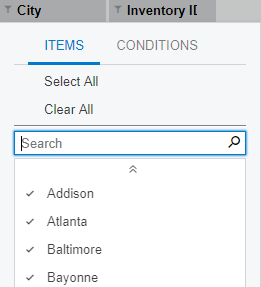

# Pivot Tables {#_16a3e9a2-8368-443f-a60e-840f8aa5b907 .reference}

Form ID: \(SM208010\)

You use this form to add and edit pivot tables, which are based on generic inquiries. When designing a pivot table, you select the generic inquiry fields that will provide data for analysis and for filtering. In addition, you can specify display parameters for each field that is used in the pivot table.

This form can be opened:

-   As a standalone form \(opened through a search or a workspace\)
-   As a part of the **Settings** dialog box when you’re creating or modifying a pivot table as a data view

Depending on how the form is opened, some of the elements may be hidden.

## Form Toolbar { .section}

The form toolbar includes the buttons described below.

The form toolbar is displayed only when the form has been opened as standalone form.

|Command|Description|
|:------|:----------|
|**Edit Inquiry**|Opens the [Generic Inquiry](SM_20_80_00.md) \(SM208000\) form for the generic inquiry that is selected in the **Screen ID** box.

 This button becomes available after you select a generic inquiry in the **Screen ID** box.

|
|**View Pivot**|Builds the pivot table designed or selected on the form. This button becomes available after you save changes in the pivot table parameters.|
|**Publish to the UI**|Opens the **Publish to the UI** dialog box, in which you can modify the site map title and screen ID for the pivot table, change default workspace and category, and specify access right.|
|**Unpublish**|Removes the respective node from the site map, clears the assignment of screen identifier and deletes all configured access rights from the database.|

|Element|Description|
|-------|-----------|
|**Site Map Title**|The name that will be shown on the form and in its row on the [Site Map](../Shared/../UserGuide/SM_20_05_20.md) \(SM200520\) form.|
|**Workspace**|The workspace in Acumatica ERP from which the form can be accessed.|
|**Category**|The category under which the form will be displayed in the selected workspace.|
|**Screen ID**|The identifier to be assigned to the form.|
|**Access Rights**|An option button that indicates which access rights should be specified for the newly added form:

-   **Set to Granted for All Roles**: The system sets the access rights for this form to *Granted* for all user roles in the system.
-   **Set to Revoked for All Roles**: The system sets the access rights for this form to *Revoked* for all user roles in the system.
-   **Copy Access Rights from Screen** \(default\): The system copies the set of the access rights from the form you specify. When you select this option button, a box appears right of it; click the magnifier icon to select the source form in the lookup table.

|
|The dialog box has the following buttons.|
|**Publish**|Publishes the form and closes the dialog box. The system assigns the form the specified screen ID and makes it available in the specified workspace.|
|**Cancel**|Cancels publication and closes the dialog box.|

## Summary Area { .section}

In this area, you can create a new pivot table or select an existing pivot table to view and edit its parameters. The Summary area is displayed only when the form has been opened as standalone form.

|Element|Description|
|-------|-----------|
|**Screen ID**|Required. The unique identifier of the generic inquiry that is used for building the pivot table.|
|**Pivot Table ID**|Required. The unique identifier of the pivot table. For a new pivot table, leave this box blank; once the pivot table is saved, the system will insert the value of the **Name** box in this box as an ID.

 For an existing pivot table, you can select a value in this field only after the screen ID has been selected.

|
|**Name**|The name of the pivot table. For a new pivot table, enter a name that describes the type of data that is shown with this pivot table. The value will be used as a default value for the table title in the site map|
|**Shared Filter to Apply**|The name of a shared filter that is used with the pivot table.

 The default value of this box is *All Records*.

|
|**Make Visible on the UI**|A check box that indicates \(if selected\) that the table will be published when you save the table with the required settings specified. This means that a screen identifier will be assigned to the table form and the form will be added to the site map; the form can be accessed from the specified workspace.

 When you clear the **Make Visible on the UI** check box and save the table, the system removes the table from the site map and clears the title, workspace, category, and screen ID. When you publish the table again, the system will assign the next available screen ID by using the internal system numbering sequence. \(This internal numbering sequence cannot be accessed on the UI for review or modification.\)

 **Tip:** The screen ID, title, workspace, and category of a form can be modified on the [Site Map](SM_20_05_20.md) \(SM200520\) form.

|
|**Site Map Title**|The name of the table form as it will be displayed on the site map. You can enter any name by using alphabetic or numeric characters. By default the box is filled with the value specified in the **Name** box.

 The box is available for editing if the **Make Visible on the UI** check box is selected for the table.

|
|**Workspace**|The name of a workspace in the user interface from which the pivot table can be accessed.

 The box is available for editing if the **Make Visible on the UI** check box is selected for the table.

|
|**Category**|The name of a category under which the pivot table will be displayed in the selected workspace.

 The box is available for editing if the **Make Visible on the UI** check box is selected for the table.

|

## Fields Pane { .section}

This pane contains the full list of fields from the selected generic inquiry. You can add fields from this pane to other panes of the form in the following ways:

-   Select fields in this pane, and then click the **Add** toolbar button on the pane where you want to add the field.
-   Drag fields to other panes on the form.

**Tip:** A field can be added to multiple panes.

The pane toolbar includes only standard buttons that are similar to standard buttons on a table toolbar.

## Filters Pane { .section}

This pane contains a list of fields from the selected generic inquiry that are used as filters in the pivot table. You can filter pivot table data by multiple fields. The filters pane is displayed only when the form has been opened as standalone form.

**Tip:** A pivot table filter can have **Items** and **Conditions** tabs to select specific items to filter. The **Items** tab is shown only if there are 100 or less records to be filtered.

You can add fields to this pane and remove fields from the pane by dragging them or by using the toolbar buttons.

The pane toolbar includes only standard buttons that are similar to standard buttons on a table toolbar.

## Columns Pane { .section}

This pane contains a list of fields from the selected generic inquiry that are displayed as columns in the pivot table. You can use multiple fields in the columns of the pivot table.

You can add fields to this pane and remove fields from the pane by dragging and dropping them or by using the toolbar buttons.

The pane toolbar includes only standard buttons that are similar to standard buttons on a table toolbar.

## Rows Pane { .section}

This pane contains a list of fields from the selected generic inquiry that are displayed as rows in the pivot table. You can use multiple fields in the rows of the pivot table.

You can add fields to this pane and remove fields from the pane by dragging them or by using the toolbar buttons.

The pane toolbar includes only standard buttons that are similar to standard buttons on a table toolbar.

## Values Pane { .section}

This pane contains a list of fields from the selected generic inquiry whose values are displayed in cells of the pivot table. You can add multiple fields in this pane.

You can add fields to this pane and remove fields from the pane by dragging them or by using the toolbar buttons.

The pane toolbar includes only standard buttons that are similar to standard buttons on a table toolbar.

## Properties Pane { .section}

This pane contains the display properties for a field that is selected in the **Filters**, **Columns**, **Rows**, or **Values** pane. The following table describes the properties.

|Property|Description|
|--------|-----------|
|**Field Name**|Displays the field name of an element.|
|**Caption**|The caption of the field that is displayed in the pivot table. You change the caption in this box if you want to see a different field name than the field name in the generic inquiry in the pivot table.

 By default, the property value is equal to the field name in the generic inquiry.

|
|**Aggregate**|An aggregate function that is applied to the field values. Select one of the following functions: -   *Sum*: Returns the sum of the field values \(for numeric fields\)
-   *Count All*: Returns the number of the field values \(for all types of fields\)
-   *Count Distinct*: Returns the number of the unique field values
-   *Average*: Returns the average value of the field values \(for numeric fields\)
-   *Min*: Returns the smallest value among the field values \(for date and numeric fields\)
-   *Max*: Returns the largest value among the field values \(for date and numeric fields\)
-   *Median*: Returns the middle value of the field values \(for date and numeric fields\)

The default value of this property is *Sum* for numeric fields and *Count* for non-numeric fields.

|
|**Sort Order**|The order in which the field values are sorted in the pivot table. Select one of the following values:

 -   *Ascending*: That is, A to Z for text, lower to higher for numbers, or newest to oldest for dates.
-   *Descending*: That is, Z to A for text, higher to lower for numbers, or oldest to newest for dates.

 The default value of this parameter is *Ascending*.

|
|**Sort By**|The key to be used as basis for sorting. Some fields have internal \(database\) representation and external \(user interface\) representation. for example date-time fields: *Jan* is an external representation to be displayed on user interface and *2020-01-01 12:00:00* is internal representation. For such fields you can select which value to be used as basis for sorting. The following options are available:-   *Display Name*: The system uses external representation of a value as basis for sorting.
-   *Value*: The system uses internal representation of a value as basis for sorting.

The default value of this parameter is *Display Name*.

|
|**Show Value As**|The presentation of numeric values in the pivot table. Select one of the following values:

 -   *Number*: The system displays the value as a number.
-   *% of Grand Total*: The system displays the value as percentage of grand total.
-   *% of Column Total*: The system displays the value as percentage of column total.
-   *% of Row Total*: The system displays the value as percentage of row total.

 The default value of this parameter is *Number*.

 You can add the same field to the **Values** pane multiple times and specify different display options for each entry.

|
|**Show Total**|A check box that you select if you want to display the total box for the set of fields.

 By default, the check box is selected.

|
|**Collapsed**|A check box that you select for the row or the column items to be displayed as collapsed by default.|
|**Total Label**|The name of the total box in the pivot table. The box is displayed only when the **Show Total** check box is selected.

 By default, the box is empty and the box label is *Total*.

|
|**Show Empty Value As**|The label for an empty value of the field, such as *&lt;empty&gt;*. The box is displayed only for fields added to the **Rows** or **Columns** panes.

 By default, the box is empty, which means that *&lt;empty&gt;* is displayed for empty values of the field in a pivot table.

|
|**Width**|The width \(in pixels\) of the cells in the pivot table where the field values are displayed.

 The default value of this parameter is 100 pixels.

|
|**Format**|The format of the field value that is displayed in the pivot table. You can use the standard formats defined for the format function in .Net.

 For a field that contains a date, in this box, you can change the default format for values of the **Round To** and **Date Part** boxes as follows:

 -   Add spaces, any characters, and words.
-   Transpose parts in a value.
-   Change format of parts of the date \(only for minutes, hours, days, months, and years\) by using date and time specifiers from .NET. For details, see [Standard Date and Time Format Strings](https://msdn.microsoft.com/en-us/library/az4se3k1(v=vs.110).aspx) and [Custom Date and Time Format Strings](https://msdn.microsoft.com/en-us/library/8kb3ddd4(v=vs.110).aspx) on the Microsoft Developer Network website.

 By default, the box is empty, which means that the field is not formatted.

|
|**Round To**|The accuracy with which the system calculates the value of the field. For example, if the date includes time but you need to analyze data by date only, you can round the data to days. \(That is, the system aggregates data for each day, and displays only the day, the month, and the year in the pivot table.\)

 You can select one of the following values:

 -   *None* \(default\): The data by full date is displayed in the pivot table. The format of the date is *General Date Long Time* or *G* \(for example, *04/11/2016 06:30:00*\).
-   *Minutes*: The system rounds the data to the date and time \(including the hour, the minute, and the second\). The default date format for this value is *General Date Long Time* or *G* \(for example, *04/11/2016 06:30:00*\).
-   *Hours*: The system rounds the data to the date and time \(including the hour and the minute\). The default date format for this value is *General Date Short Time* or *g* \(for example, *04/11/2016 06:30*\).
-   *Days*: The system rounds the data to the days. The default date format for this value is the *Short Date* or *d* \(for example, *04/11/2016*\).
-   *Weeks*: The system rounds the data to the week. In the pivot table, the year and the number of the week are displayed. The system calculates the week number based on the date in the selected date field. The default date format for this value is *yyyy W* \(for example, *2017 W23*\), where *yyyy* is the .NET format specifier for the year and *W* is the *W* prefix followed by the number of the week in the year.

**Tip:** The first day of the week in your system depends on the time zone specified in the **Time Zone** box of the [User Profile](SM_20_30_10.md) \(SM203010\) form. If the **Time Zone** box is empty, the system uses the time zone specified in the **Login Time Zone** box on the [Site Preferences](SM_20_05_05.md) \(SM200505\) form. For details, see [CalendarWeekRule Enumeration](https://msdn.microsoft.com/en-us/library/system.globalization.calendarweekrule(v=vs.110).aspx) on the Microsoft Developer Network website.

-   *Half-Months*: The system rounds the data to the half of the month. In the pivot table, the half of the month, the month name, and the year are displayed. The system calculates the half of the month based on the date in the selected date field. The default date format of this value is *yyyy - MMM h* \(for example, *2017 - Jan H1*\), where *yyyy* is the format specifier for the year, *MMM* is the .NET format specifier for the month \(that is, the three-letter abbreviation of the month\), and *h* is the *H* prefix followed by the number indicating the half of the month \(1 or 2\).

**Tip:** In the system, the second half of each month starts on the 16th day, regardless of the length of the month.

-   *Months*: The system rounds the data to the month. The default date format for this value is *yyyy - MMM* \(for example, *2017 - Jan*\), where *yyyy* is the .NET format specifier for the year and *MMM* is the format specifier for the month.
-   *Quarters*: The system rounds the data to the quarter. The system calculates the quarter based on the date in the selected date field. The default date format for this value is *yyyy Q* \(for example, *2016 Q4*\), where *yyyy* is the format specifier for the year and *Q* is the *Q* prefix followed by the number of the quarter \(you cannot change the format of the quarter\).
-   *Half-Years*: The system rounds the data to the half-year. The system calculates the half-year based on the date in the selected date field. The default date format of this value is *yyyy H* \(for example, *2017 H1*\), where *yyyy* is the format specifier for the year and *H* is the *H* prefix followed by the number indicating the half of the year \(1 or 2\).
-   *Years*: The system rounds the data to the year. The default date format for this value is *yyyy* \(for example, *2016*\), which is the format specifier for the year.

 This property appears for only fields of the date type.

 **Tip:** You can specify either the rounding in this box or a part of the date in the **Date Part** box. For example, if you specified a value in the **Date Part** box and then selected a value in this box, the system automatically resets the value of the **Date Part** box to *None*.

|
|**Date Part**|The part of the date field by which the system aggregates data in the pivot table. For example, if the date field contains the month and the year \(such as *July 2017*\), you can configure the system so that it aggregates data by month for multiple years.

 **Tip:** If you want to display only the year in the headers of the pivot table, you need to select the *Year* value in the **Round To** box.

 You can select one of the following values:

 -   *None* \(default\): The data by full date is displayed in the pivot table.
-   *Hour*: The system aggregates data by the hour. \(Only the hour is displayed in the pivot table.\)
-   *Day*: The system aggregates data by the day. \(Only the day is displayed in the pivot table.\)
-   *Month*: The system aggregates data by the month. \(Only the month is displayed in the pivot table.\)
-   *Quarter*: The system aggregates data by the quarter. \(Only the quarter is displayed in the pivot table.\)

 This property appears for only fields of the date type.

 **Tip:** You can specify either a part of the date in this box or the rounding specified in the **Round To** box. For example, if you specified a value in the **Round To** box and then selected a value in this box, the system automatically resets the value of the **Round To** box to *None*.

|
|**Segment**|The segment of the field value that the system uses to aggregate data in the pivot table. In this box, you can select one of the segments specified on the [Segmented Keys](CS_20_20_00.md) \(CS202000\) form for the segmented key.

 This property appears for only fields whose values are defined by a segmented key \(such as General Ledger subaccounts\).

|

## Pivot Table Title Bar { .section}

The title bar of the form that contains the generated pivot table \(which appears when you click **View Pivot** from the form\) includes standard and form-specific buttons. The form-specific buttons are listed below.

|Buttons|Description|
|-------|-----------|
|**Save As**|Creates a copy of the pivot table with a different name. You click this button when you change the pivot table settings and want to save it as a new table for the same general inquiry.|
|**Save**|Saves changes to the pivot table. You click this button when you have changed the settings of the pivot table and want your changed version to replace the previous version of the pivot table.|
|**Customize**|Opens the [Pivot Tables](SM_20_80_10.md) \(SM208010\) form, where you can modify the pivot table settings.|

## Pivot Table Toolbar { .section}

The toolbar on the top of the generated pivot table includes only standard buttons for tables.

**Parent topic:**[Customization Forms](../UserGuide/CU__CU_Form_Reference.md)

