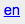

# Locales and Languages {#_b43ca9dd-782a-4fdc-b9c3-f3e9ddd2d8ac .concept}

Acumatica ERP provides functionality that you can use to localize the system in multiple languages. You can maintain the user interface and wikis in multiple languages if you have multiple locales. The default locale of Acumatica ERP is US English.

Localization includes the usage of locale-specific settings and the translation of the strings used on the application interface. You can translate user input to multiple languages and store translations in the database.

In this topic, you will read about how locales and languages are handled in the system.

## Understanding Locales and Languages { .section}

Acumatica ERP uses the list of locales provided by Microsoft.NET. In most cases, a locale identifier has two parts:

-   The ISO code of the language: The system retrieves the language code from the locale identifier to create a new entity language and associates the language with the locale. Note that the system associates multiple locales with a language if the identifiers of these locales contain the same ISO code of a language. For example, the en-US, en-GB, and en-AU locales are all associated with English, the language whose ISO code is en.

    You can use these languages to localize user input. The translations can be further used for printing reports and documents. For details, see [Enabling Multilingual User Input](#section_lqy_4c2_jw).

-   The ISO code of the region \(or country\): The system uses the region code of the identifier to define which resource libraries of the Microsoft .NET Framework to use when it applies region-specific settings, which include the date and time format, the format of numbers \(such as the decimal separator and digit grouping\), and the writing direction. In the previous example, US, GB, and AU are all ISO codes of the country.

In Acumatica ERP, the translations of the user interface and wiki articles are associated with a locale, and the translations of user input are associated with a language.

## Adding New Locales to the System {#section_v2q_4c2_jw .section}

When Acumatica ERP is installed, one locale \(US English\) is present by default. You can add other locales on the [System Locales](SM_20_05_50.md) \(SM200550\) form. For the detailed procedure, see [To Add a New Locale](SM__how_Add_Locale.md). When you activate multiple locales, a user may select his or her preferred locale on the Sign-In page before signing in the system.

A newly added locale is inactive by default, which means the system does not display it in the list of locales on the Sign-In page. For an inactive locale, you can override locale preferences \(region-specific settings\). Also, you can use the Acumatica ERP translation functionality to translate the interface elements for the locale. For details, see [Translation Process](SM__con_Translation_Process.md).

After you activate the locale, it becomes available for selection on the Sign-In page. Once a user selects the locale and signs in to Acumatica ERP, the system displays the localized interface and applies the specified locale preferences by using the resource libraries provided for the selected locale by the Microsoft .NET Framework.

Also, you can print localized versions of reports if you have translated the reports' strings for the locale you are currently signed in with. For details, see [Use of User Input Translations](SM__CON_Usage_of_UserInput_Translations.md).

When a user with a right to edit wiki articles is signed in with a locale, he or she can create locale-specific versions of the wiki articles. For details, see [Translating Wiki Articles](SM__con_Translation_Process.md#section_nq3_n3l_hw) in [Translation Process](SM__con_Translation_Process.md).

## Enabling Multilingual User Input {#section_lqy_4c2_jw .section}

You can translate user input to multiple languages and store translations in the database. For example, you can enter descriptions of General Ledger accounts in multiple languages and then print a localized version of the trial balance report with the descriptions of accounts in the language of the locale you are currently signed in with.

To make this functionality available, you perform the following steps:

1.  If the needed locales are not defined in the system, you add and activate them on the [System Locales](SM_20_05_50.md) form. For step-by-step instructions, see [To Add a New Locale](SM__how_Add_Locale.md). The system retrieves the ISO codes of languages from the locales \(active and inactive\) and forms the initial list of languages that you will use to define a set of languages to translate user input to.

    **Tip:** The system associates multiple locales with a language if the identifiers of these locales contain the same ISO code of a language.

2.  You click the **Select Input Languages** button on the [System Locales](SM_20_05_50.md) \(SM200550\) form toolbar that invokes the **Select Languages for Multilingual Text Boxes** dialog box. In the dialog box, you specify the languages in which you are going to translate user input and define the default language. For details, see the [Setting Up Languages](#section_vkn_2lm_hw) section in this topic.

Once you have finished making the functionality available, you can translate user input for the boxes that have multilanguage support. A link \(for example, \) is displayed next to these text boxes in the system. Clicking this link invokes the **Translations** dialog box. You enter translations for each language, close the dialog box, and click **Save** on the form toolbar.

You can also add translations for text in the rich text editor \(for example, a description of a stock item on the [Stock Items](IN_20_25_00.md) \(IN202500\) form\). On the formatting toolbar, you select languages for which you would like to add a translation one after another, enter a translation, and click **Save** on the form toolbar.

The translation tool that is described in this section can also be used for translating filter tabs \(see [To Translate Filter Tab Captions](SM__how_Translate_Filter_Tabs.md)\) and generic inquiry elements, such as column captions in the results grid \(see [To Translate Column Captions for a Generic Inquiry](SM__how_Translate_GI_Column_Captions.md)\) and parameter display names \(see [To Translate Parameter Display Names for a Generic Inquiry](SM__how_Translate_GI_Parameter_Names.md)\).

For the list of boxes with this support, see [Boxes That Have Multilanguage Support](SM__CON_Boxes_MultiLanguage.md). You can upload translations from a file for those entities \(such as account classes, ledgers, and financial periods\) that support integration with Excel. You can also import values to these text boxes and export values from them by using integration scenarios. For details, see [Multilanguage Fields in Import and Export Scenarios](IS__con_IS_Multi-Language_Fields.md).

## Setting Up Languages {#section_vkn_2lm_hw .section}

In Acumatica ERP, a language can be marked as the default, an alternative, or not used in the localization of user input. When you specify the default language, multilanguage support is enabled for the supported text boxes in the system. The default language and alternative languages form the list of languages for which you can provide translations in the **Translations** dialog box.

To define the set of languages to translate user input to, do the following:

1.  Click the **Select Input Languages** button on the [System Locales](SM_20_05_50.md) form toolbar to invoke the **Select Languages for Multilingual Text Boxes** dialog box. The dialog box contains the list of languages, represented by their ISO codes, that the system retrieved from the list of locales \(active and inactive\).
2.  In the **Default Language** box, select the ISO code of the language that you want to mark as the default. The default language must be associated with an active locale.
3.  In the table below the box, select the unlabeled check box for the languages you want to mark as alternatives and clear this check box for those languages that you want to exclude from the localization of user input.

**Tip:** If a language is associated with an inactive locale, the system does not display it in the **Translations** dialog box.

Once you apply the settings, in the table on the [System Locales](SM_20_05_50.md) form, you can view which locales are associated with languages that are the default, alternatives, or not used in localization by adding to the table the **Alternative Language** and **Default Language** columns, which are hidden by default.

After you set up languages, you can proceed with translating user input for the text boxes that have multilanguage support.

## Disabling Locales and Multilingual User Input { .section}

If you do not need a particular locale anymore, you can clear the **Active** check box for this locale on the [System Locales](SM_20_05_50.md) form. The system then excludes this locale from the list of available locales \(the **Locale** box\) on the following forms:

-   The Sign-In page
-   Report forms
-   [Email Templates](SM_20_40_03.md) \(SM204003\)
-   [Customer Classes](AR_20_10_00.md) \(AR201000\)
-   [Customers](AR_30_30_00.md) \(AR303000\)
-   [Vendor Classes](AP_20_10_00.md) \(AP201000\)
-   [Vendors](AP_30_30_00.md) \(AP303000\)

The system stores the translations you have added for the deactivated locale, so you can activate it again and view the associated translations of the user interface and wiki pages.

If you deactivate all the locales but one, the system will not display the **Locale** box on the forms listed above.

If you do not need to translate user input in a particular language, you do one of the following by using the **Set Up Languages** dialog box on the [System Locales](SM_20_05_50.md) form:

-   If the language was marked as an alternative, you clear the unlabeled check box for the language.
-   If the language was marked as the default, you select another language in the **Default Language** box and clear the unlabeled check box in the table for those languages that you want to exclude from the localization of user input.

The system stores the translations you have added for the excluded language, so you can activate it again and view the associated translations of the user input.

**Parent topic:**[Managing Locales and Languages](../UserGuide/SM__mng_Locales.md)

