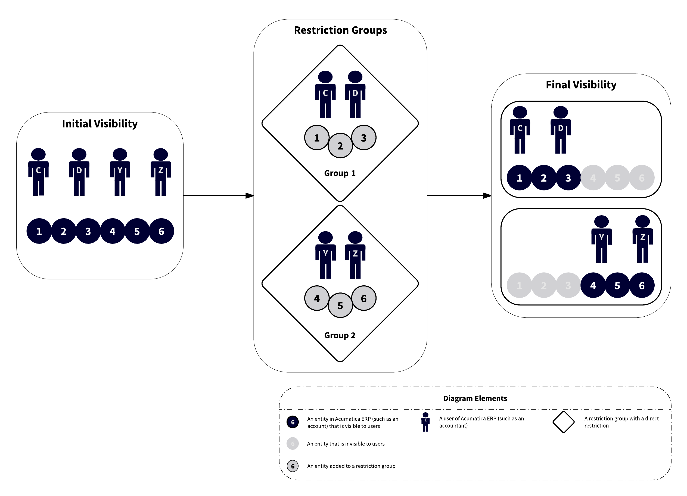

# Restriction Groups in Acumatica ERP {#_ad9a42c1-ff5d-4298-86d9-683039c18512 .concept}

Acumatica ERP provides you with restriction groups, which are flexible tools for limiting the visibility and use of entities, such as general ledger accounts, inventory items, and customer and vendor accounts.

In this topic, you can find information about situations where restriction groups are useful, types of restriction groups, and types of entities that you can include in restriction groups.

## Restriction Groups in Acumatica ERP { .section}

You can use restriction groups to do the following:

1.  Control the visibility of sensitive data for employees of your organization. To do this, you include in a restriction group the entities for which you need to restrict the visibility, and the users who should or should not be able to view these entities. For details, see [Restriction Groups with Users](#_0af57538-82a6-4d16-af40-490af350626d).
2.  To relate entities to one another so that they are used only together on Acumatica ERP forms \(or so that they cannot be used together\). To do this, you include in a group only related entities and do not include users. For more information, see [Restriction Groups Without Users](#_47c5a9b2-7df7-4186-980d-ceee777c8e94).

You can find details on configuring restriction groups in [Configuration of Restriction Groups](RS__con_Configuration_Restriction_Groups.md).

In Acumatica ERP, you can use specific forms to create restriction groups, view the entities included in a group, and manage the list of entities of a particular type in a restriction group. For details on the typical operations you can perform with restriction groups, see [Operations with Restriction Groups](RS__con_Operations_Restriction_Groups.md).

## Restriction Groups with Users {#_0af57538-82a6-4d16-af40-490af350626d .section}

To understand how restriction groups with users are used, consider a typical case with restriction groups that include users and General Ledger \(GL\) accounts. Suppose that a role allows all its users to access all GL accounts, but for two groups of accounts, you want to provide visibility to only particular users.

The diagram above shows how restriction groups can address these security needs. You define Group 1 as a restriction group that includes only appropriate accountants \(User C and User D\) and accounts \(1, 2, and 3\). Similarly, you create Group 2, which includes User Y and User Z, as well as the accounts they should work with \(4, 5, and 6\).

Among all users in the system, only User C and User D will see the first group of sensitive accounts \(1, 2, and 3\), and only User X and User Z will see the second group of sensitive accounts \(4, 5, and 6\). Users who are not assigned to any restriction group will not see the accounts associated with either group.

## Restriction Groups Without Users {#_47c5a9b2-7df7-4186-980d-ceee777c8e94 .section}

If a restriction group does not include users, all users may view the entities that are members of the group \(if their roles provide access to forms with these entities\), but entities included in the group become related in a way that limits their use. For example, suppose that you create two groups with GL accounts and subaccounts as follows:

-   Group 1 includes Account 1, Subaccount K, Subaccount L, and Subaccount M.
-   Group 2 includes Account 2, Subaccount P, Subaccount Q, and Subaccount R.

For simplicity, suppose that there are no other accounts and subaccounts in the system.

The result of these settings is the following:

-   If a user selects Account 1 on an entry form, he or she will be able to select only Subaccount K, Subaccount L, or Subaccount M in a box with subaccounts. The subaccounts included in Group 2 will be hidden from the list.
-   If the user selects Account 2, he or she will see Subaccount P, Subaccount Q, and Subaccount R in the box with subaccounts; the user will not see Subaccount K, Subaccount L, and Subaccount M.

**Tip:** If you are using restriction groups to control the accounts and subaccounts that can be used together, you must create at least two groups and include all subaccounts in either of the groups. For example, suppose that you need to restrict visibility of subaccounts for only one account. To solve this task, you create two restriction groups. In the first group with direct restriction \(type *A* group\), you include a GL account and the list of subaccounts that should be related to this account. In the second group with inverse restriction \(type *B Inverse* group\), you include the same account and subaccounts that should not be displayed after users select this account. As a result, when users select the account on a form, they will see only one of the subaccounts included in the first group.

## Types of Restriction Groups { .section}

Acumatica ERP provides two basic types of restriction groups—A and B. Restriction groups of both types can limit the visibility of system entities in a direct way \(types *A* and *B*\) and an inverse way \(types *A Inverse* and *B Inverse* in the Acumatica ERP user interface\). The differences between *A* and *B* and between *A Inverse* and *B Inverse* are in how these groups work if the same entity is added to multiple groups. For detailed descriptions of each group type, see [Types of Restriction Groups](SM__con_Types_of_Restriction_Groups.md).

## Combinations of Restriction-Group Entities { .section}

Acumatica ERP supports a variety of scenarios of configuring the visibility of entities within the system. With the most common scenarios, you can create restriction groups that include the following system entities:

-   Users and general ledger \(GL\) accounts: With these restriction groups, if your organization has sensitive GL accounts, you can make these accounts visible to a limited number of employees. For details, see [Account and Subaccount Security](../Shared/../UserGuide/RS__con_Account_and_Subaccount_Security.md).
-   Users and subaccounts: As with groups that include users and GL accounts, you can limit the visibility of sensitive subaccounts to employees. For more information, see [Account and Subaccount Security](../Shared/../UserGuide/RS__con_Account_and_Subaccount_Security.md).

    **Attention:** For performance reasons, visibility restrictions by user for subaccounts do not affect analytical \(ARM\) and form-based reports or general inquiries. This means that users who can view the reports and general inquiries that include subaccounts will see the full list of subaccounts.

-   Users and vendor accounts: You can define these restriction groups to make particular vendors visible in the system to only employees who work with these vendors. For details, see [Vendor Security](../Shared/../UserGuide/RS__con_Vendor_Security.md).
-   Users and customer accounts: With these restriction groups, you can make particular customers visible to only employees who work with these customers. For details, see [Customer Security](../Shared/../UserGuide/RS__con_Customer_Security.md).
-   Users and GL budget articles: With these restriction groups, you can limit the visibility of sensitive budget articles so that only particular users can see and work with these articles. For more information, see [Security of GL Budget Articles](../Shared/../UserGuide/RS__con_GL_Budget_Security.md).
-   Users and warehouses: You can create restriction groups to display a particular warehouse \(or a set of warehouses\) for only employees who work with this warehouse \(or this set of warehouses\). For details, see [Warehouse Security](../Shared/../UserGuide/RS__con_Warehouse_Security.md).
-   Users and inventory items: You can define these restriction groups to reduce the number of items shown in lists with inventory items, depending on the particular employee signed in to the system. For more information, see [Inventory Item Security](../Shared/../UserGuide/RS__con_Restriction_Groups_for_Subitems.md).
-   Users, project groups, and projects: You can define these restriction groups so that particular projects or group of projects are visible to only the users responsible for the included project or projects.

    **Important:** Restriction groups configured for branches do not affect the visibility of projects that have these branches specified on the **Summary** tab of the [Projects](../Shared/../UserGuide/PM_30_10_00.md) \(PM301000\) form. You can manage the visibility of projects to particular users by creating restriction groups on the [Project Access](../Shared/../UserGuide/PM_10_20_00.md) \(PM102000\) form. For more information on configuring access for projects, see [Project Security](../Shared/../UserGuide/RS__con_Project_Security.md).

-   Users and account groups: You can define these restriction groups so that particular project transactions that include sensitive data are visible to only particular users. For more information, see [Project Security](../Shared/../UserGuide/RS__con_Project_Security.md).
-   Users and printers: If the *DeviceHub* feature is enabled on the [Enable/Disable Features](../Shared/../UserGuide/CS_10_00_00.md) form \(CS100000\), you can define these restriction groups to configure the visibility of printers to particular users. For more information, see [Printers: Configuration of Printer Access](../Shared/../ImplementationGuide/DeviceHub_Configuration_of_Printer_Access.md).
-   Branches, GL accounts, and users: With these restriction groups, you can allow users to work with only branch-specific accounts. For details, see [Account and Subaccount Security](../Shared/../UserGuide/RS__con_Account_and_Subaccount_Security.md).
-   Branches, subaccounts, and users: You can set up these restriction groups so that the system displays to users only the branch-specific subaccounts. For more information, see [Account and Subaccount Security](../Shared/../UserGuide/RS__con_Account_and_Subaccount_Security.md).
-   Branches and cash accounts: If there are multiple branches in your organization, with these restriction groups, you can allow users in each branch to work with only branch-specific cash accounts. For details, see [Security of Cash Accounts](../Shared/../UserGuide/RS__con_Security_of_Cash_Accounts.md).
-   GL Accounts and Subaccounts: If you have subaccounts that employees must use only with particular GL accounts, by defining these restriction groups, you can set up lists of available subaccounts for each GL account. For more information, see [Account and Subaccount Security](../Shared/../UserGuide/RS__con_Account_and_Subaccount_Security.md).

**Parent topic:**[Managing Visibility with Restriction Groups](../UserGuide/RS__mng_Managing_Restriction_groups.md)

