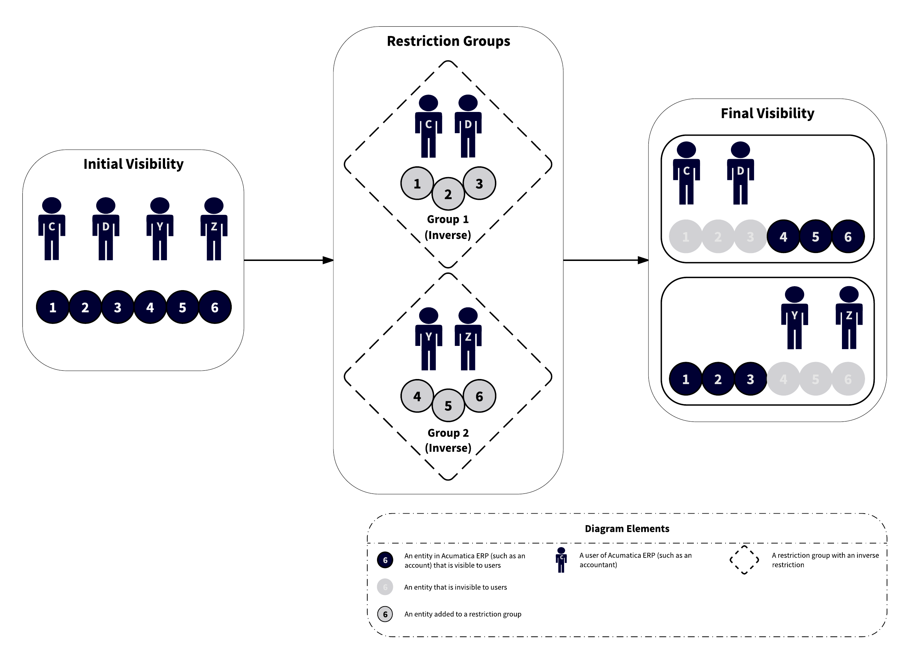
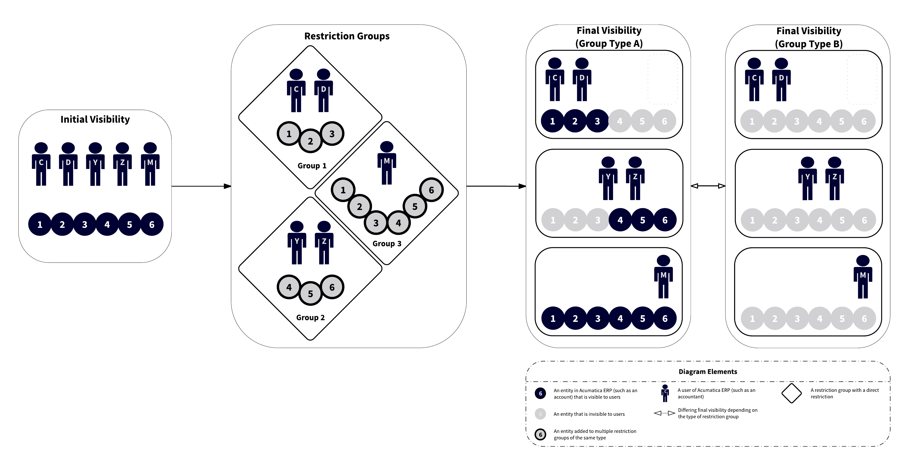
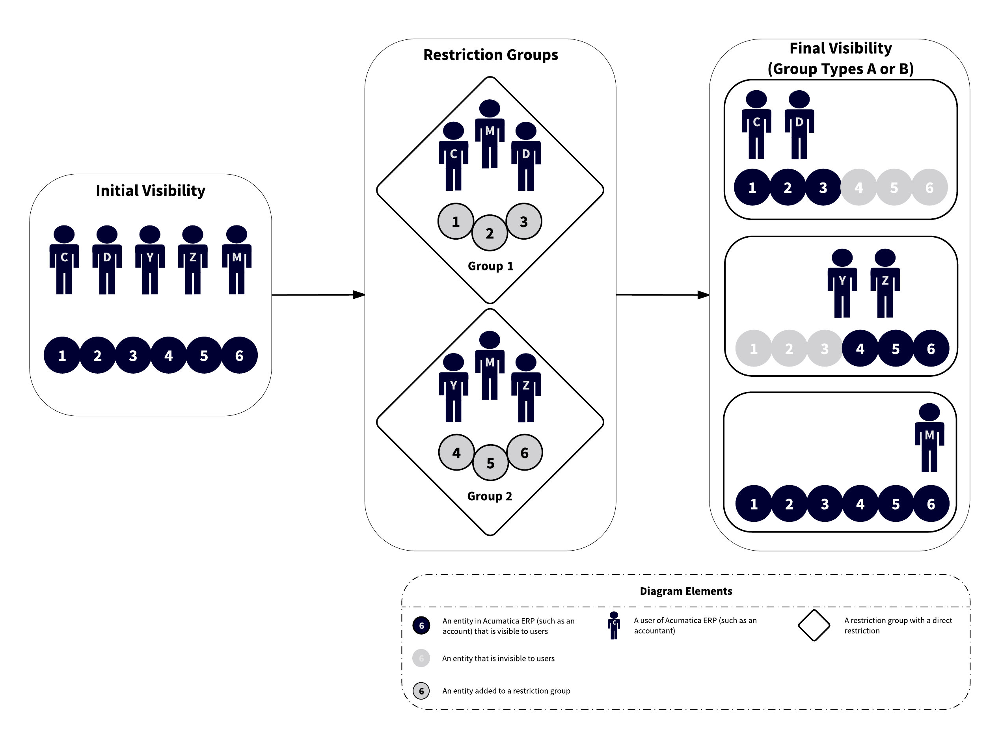
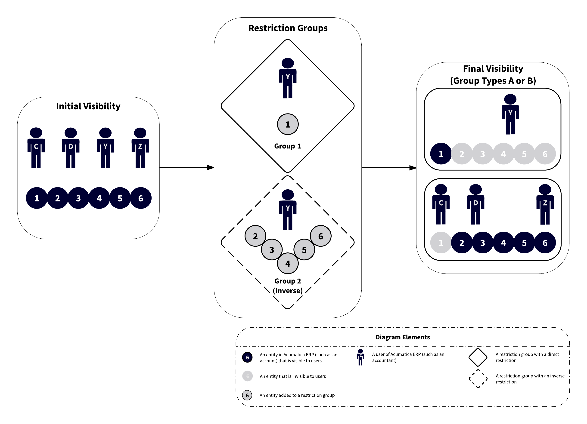
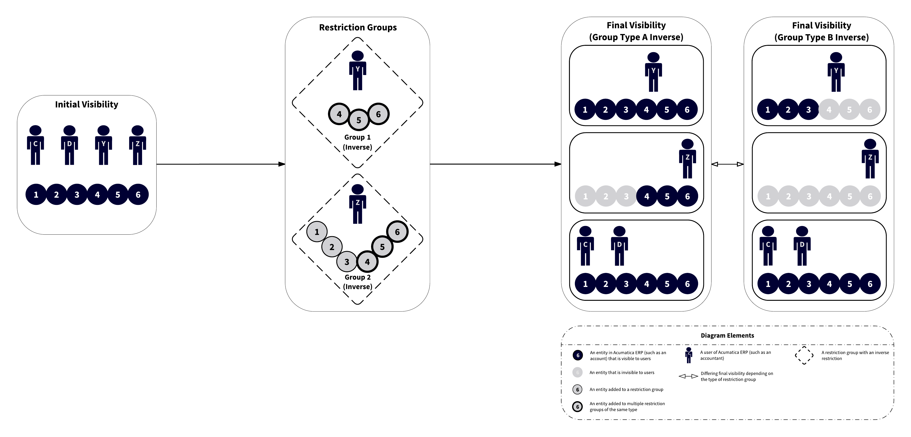
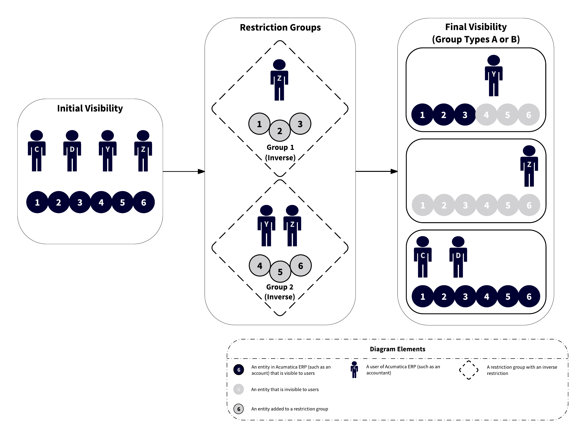

# Types of Restriction Groups {#_a72c11e3-e181-4412-a462-ce333721a1e9 .concept}

Restriction groups in Acumatica ERP provide additional flexibility to the configuration of access rights for suites, modules, and forms. \(For details, see [Managing User Access](SA_Managing_User_Access_Mapref.md).\) You can use restriction groups when users should have access to a form, but on this form they are allowed to see one set of entities and are not allowed to see another set of entities.

With different types of restriction groups, you can configure simple and complicated rules of visibility for entities. In this topic, you will find descriptions of the types of restriction groups, the differences between the types, and usage examples.

**Tip:** In this topic, the restriction groups in the examples contain users and entities, but the same principles apply to groups that contain only entities.

When you add users and entities to a group, the system restricts the visibility of the entities to the users. When you add entities of two different types to the group and don't add users, these entities can be used only with one another when users select values of the entities on forms. For example, if you add a GL account and subaccounts to the group, and a user selects the included account on a form, only the included subaccounts are available for selection.

## Types of Restriction Groups { .section}

Acumatica ERP provides two basic types of restriction groups—A and B. Restriction groups of both types can limit the visibility of system entities in a direct way \(types *A* and *B*\) and an inverse way \(types *A Inverse* and *B Inverse*\). The differences between *A* and *B* and between *A Inverse* and *B Inverse* are in how these groups work if the same entity is added to multiple groups. For detailed descriptions of each group type, see [Table 1](#_ecbb9908-440a-4b11-a163-3d54838b8b85).

You use groups of types *A* or *B*—groups with direct restriction—when you need to make entities visible to users within the group. \(For groups with only entities, the direct restriction group includes entities that must be used together.\) The following diagram shows how groups with direct restriction work. In the diagram, you can see four users \(for example, accountants\) and six entities \(for example, GL accounts\). Initially, all users can see all accounts. Group 1 is defined to include Users С and D and Accounts 1, 2, and 3. These accounts are visible to Users С and D and hidden from Users Y and Z. Group 2 is defined to include Accounts 4, 5, and 6 and Users Y and Z. Users Y and Z can see Accounts 4, 5, and 6, and Users С and D cannot see these accounts.

You use groups of types *A Inverse* or *B Inverse*—groups with inverse restriction—when you need to hide entities from a small number of users. \(For groups without users, an inverse restriction group includes entities that may not be used together.\) See the following diagram, which illustrates how groups with an inverse restriction work. Group 1 is defined to include Users С and D and Accounts 1, 2, and 3. Accounts 1, 2, and 3 become invisible to Users С and D and remain visible to users Y and Z. Group 2 is defined to include Accounts 4, 5, and 6 and Users Y and Z. This hides Accounts 4, 5, and 6 from Users Y and Z, but Users С and D still can see these accounts. The final visibility for groups with inverse restriction is the opposite of the final visibility for groups with direct restriction.

For more examples of using restriction groups of all types, see [Usage Example 1](#_2c295d9e-d1c4-45d7-bc03-2ce9f3360a0f), [Usage Example 2](#_13a4a93a-3489-441d-aa68-106a175a8618), and [Usage Example 3](#_6c0e0845-aab1-4959-bcfd-aca68aeeac84).

The following table summarizes the types of restriction groups and describes how the visibility of entities is affected if a particular entity belongs to multiple groups of the type.

|Group Type|Restriction|Description|
|----------|-----------|-----------|
|*A*|Direct|Makes entities included in the group visible to users who are also included in the group. Other users cannot view these entities.

 When a particular entity belongs to multiple groups of type *A*, if you want a user to see this entity in the system, you add the user to at least one of these groups.

|
|*A Inverse*|Inverse|Hides the entities included in the group from users who are also included in the group. Users who are not assigned to this group can view and use the entities.

 When a particular entity belongs to multiple groups of type *A Inverse*, if you don't want a user to see this entity, you must include this user in each of these groups. If you include the user in only one of the groups, he or she will see the entity in the system.

|
|*B*|Direct|Makes entities included in the group visible to users who are also included in the group. Other users cannot view these entities.

 When a particular entity belongs to multiple groups of type *B*, if you want a user to see this entity in the system, you need to include this user in each of these groups.

|
|*B Inverse*|Inverse|Hides the entities included in the group from users who are also included in the group. Users who are not assigned to this group can view and use the entities.

 When a particular entity belongs to multiple groups of type *B Inverse*, if you don't want a user to see this entity in the system, you include the user in at least one of these groups.

|

## Usage Example 1 {#_2c295d9e-d1c4-45d7-bc03-2ce9f3360a0f .section}

**Problem statement:** Suppose that as a system administrator, you have to configure the visibility of accounts to the appropriate users considering the following:

-   There are four accountants in your organization: User C, User D, User Y, and User Z.
-   User M is the accounting manager who controls work of the accounting department.
-   There are six accounts in the General Ledger module: Account 1, Account 2, Account 3, Account 4, Account 5, and Account 6.
-   Users C and D are allowed to see Accounts 1, 2, and 3.
-   Users Y and Z are allowed to see Accounts 4, 5, and 6.
-   User M is allowed to see all accounts.

So Accounts 1, 2, and 3 should be visible to Users C, D, and M \(and should be hidden from all other users\), and Accounts 4, 5, and 6 should be visible to Users Y, Z, and M \(and should be hidden from all other users\).

You can use either of two solutions \(described below\) to configure the visibility of accounts to users.

**Solution 1:** To address the problem of Usage Example 1, you can create three restriction groups of type *A*—Group 1, Group 2, and Group 3 \(see the diagram below, including the user visibility shown in *Final Visibility \(Group Type A\)*\):

-   Group 1: In this group, you include Accounts 1, 2, and 3 and Users C and D.
-   Group 2: In this group, you include Accounts 4, 5, and 6 and Users Y and Z.
-   Group 3: In this group, you include User M and all six accounts.

**Attention:** If you were to use groups of type *B* instead of type *A*, all accounts would be hidden from the users included in Groups 1, 2, and 3. See *Final Visibility \(Group Type B\)* in the diagram below. \(To make this approach work with groups of type *B*, you would need to include User M in Groups 1, 2, and 3.\)

**Solution 2:** As a second way to address the problem of Usage Example 1, you can create two restriction groups of type *A* or *B*—Group 1 and Group 2 \(see the following diagram\):

-   Group 1: In this group, you include Accounts 1, 2, and 3 and Users C and D.
-   Group 2: In this group, you include Accounts 4, 5, and 6 and Users Y and Z.
-   You include User M in both groups.

## Usage Example 2 {#_13a4a93a-3489-441d-aa68-106a175a8618 .section}

**Problem statement:** Suppose that as a system administrator, you have to configure the visibility of accounts to the appropriate users considering the following:

-   There are four accountants: User C, User D, User Y, and User Z.
-   There are six accounts in the General Ledger module: Account 1, Account 2, Account 3, Account 4, Account 5, and Account 6.
-   User Y works with only one sensitive account, Account 1; User Y is not allowed to see the following accounts: Account 2, Account 3, Account 4, Account 5, and Account 6.
-   The other accountants work with all accounts except Account 1.
-   Only accountants have access to the Finance suite. \(Thus, there is no need to hide accounts from other system users.\)

**Solution:** To address the problem of Usage Example 2, you can create two restriction groups—Group 1 of type *A* or *B*, and Group 2 of type *A Inverse* or *B Inverse*. \(If you select type *A* for Group 1, you should select type *A Inverse* for Group 2. If you select type *B* for Group 1, you should select type *B Inverse* for Group 2.\) These groups are defined as follows:

-   Group 1: In this group, you include User Y and Account 1. \(Other users will not see Account 1.\)
-   Group 2: In this group, you include User Y and Accounts 2 to 6. \(User Y will not see these accounts.\)

The following diagram illustrates the proposed solution.

## Usage Example 3 {#_6c0e0845-aab1-4959-bcfd-aca68aeeac84 .section}

**Problem statement:** Suppose that as a system administrator, you have to configure the visibility of accounts to the appropriate users considering the following:

-   There are four accountants in your organization: User C, User D, User Y, and User Z.
-   There are six accounts in the General Ledger module of your organization: Account 1, Account 2, Account 3, Account 4, Account 5, and Account 6.
-   Users С and D should work with all six accounts.
-   User Y should work with Accounts 1, 2, and 3 but is not allowed to see Accounts 4, 5, and 6.
-   User Z is a junior accountant, so this user is not allowed to see the accounts.

You can use either of two solutions \(described below\) to configure the visibility of accounts to users.

**Solution 1:** To address the problem of Usage Example 3, you can create two groups of type *B Inverse*—Group 1 and Group 2 \(shown in the diagram below, with the user visibility shown in *Final Visibility \(Group Type B Inverse\)*\):

-   Group 1: In this group, you include User Y and Accounts 4, 5, and 6.
-   Group 2: In this group, you add User Z and Accounts 1, 2, 3, 4, 5, and 6.

**Attention:** If you were to use groups of type *A Inverse* instead of *B Inverse* in this example, Accounts 4, 5, and 6 would be visible to all users because they are added in two restriction groups \(see *Final Visibility \(Group Type A Inverse*\) in the following diagram\).

**Solution 2:** As a second way to address the problem of Usage Example 3, you can create two groups of the *A Inverse* or *B Inverse* type—Group 1 and Group 2:

-   Group 1: In this group, you include User Z and Accounts 1, 2, and 3.
-   Group 2: In this group, you include Users Y and Z and Accounts 4, 5, and 6.

The following diagram illustrates Solution 2.

## Recommendations for Selecting the Restriction Group Type { .section}

As you decide which type of restriction group best meets your security needs, consider the following recommendations:

-   When you create multiple groups with entities of the same combination of types \(for example, suppose that you have two restriction groups that include users and customers\), use groups of the same basic type \(either A or B\). \(Otherwise, if you were to add the same entity to multiple groups of different types, the result may not be what you expect.\)
-   To configure the required visibility of entities, you can combine direct and inverse restriction groups of the same basic type \(either A or B\), as was done in the solution of [Usage Example 2](#_13a4a93a-3489-441d-aa68-106a175a8618). Thus, you can combine groups of types *A* and *A Inverse*, and groups of types *B* and *B Inverse*.
-   If you want to hide particular entities from the majority of users, include the entities and the users who should see the entities in a group with direct restriction \(type *A* or *B*\).
-   If you want to hide particular entities from a small number of users, add the entities and the users who shouldn't see the entities to a group with inverse restriction \(type *A Inverse* or *B Inverse*\).

**Parent topic:**[Managing Visibility with Restriction Groups](../UserGuide/RS__mng_Managing_Restriction_groups.md)

