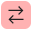

# Sales Orders {#_19e4021c-1b84-49fd-be12-0320c5f1c7e5 .reference}

Form ID: \(SO301000\)

**Attention:** This form is available only if the *Inventory and Order Management* feature is enabled on the [Enable/Disable Features](CS_10_00_00.md) \(CS100000\) form.

You can use this form to create new sales and transfer orders with the order types defined in the system, as well as to view and edit the details of existing sales and transfer orders. You can cancel an order, and you can create a shipment or prepare an invoice for an existing order.

## Form Toolbar { .section}

The form toolbar and More menu include the buttons and commands described below.

|Command|Description|
|-------|-----------|
|**Approve**|Approves the current order.

 When you click this command, the **Enter Reason** dialog box opens if on the **Rule Actions** tab of the [Approval Maps](EP_20_50_15.md) \(EP205015\) form, *Is Optional* or *Is Required* is selected in the **Reason for Approval** box. In the dialog box, you can \(if *Is Optional* is selected\) or must \(if *Is Required* is selected\) enter the reason the order is being approved.

 The command is available if the *Approval Workflow* feature is enabled on the [Enable/Disable Features](CS_10_00_00.md) \(CS100000\) form.

|
|**Cancel Order**|Assigns the *Canceled* status to the sales order.

 This command is available if the sales order has the *On Hold*, *Open*, *Awaiting Payment*, or *Credit Hold* status. The sales order cannot be canceled if any of the following conditions are met:

 -   The sales order has at least one related shipment.
-   The sales order has at least one applied payment, prepayment, prepayment invoice, or credit memo that has been added on the **Payments** tab.
-   The blanket sales order has at least one generated child order.
-   The sales order is linked to a drop-ship purchase order for which a purchase receipt is prepared
-   A purchase return is prepared for the sales order whose type has the *RMA Order* automation behavior on the [Order Types](SO_20_10_00.md) \(SO201000\) form.

 If the sales order is canceled, all allocations and links to purchase orders are removed.

|
|**Complete Order**|Assigns the *Completed* status to the sales order and selects the **Completed** check box in all lines of the order on the **Details** tab of the form.

 This command appears for a sales order whose order type has the *Sales Order*, *RMA Order*, *Transfer Order*, or *Blanket Order* automation behavior specified on the **Template** tab of the [Order Types](SO_20_10_00.md) \(SO201000\) form.

 For a sales order whose order type has the *Sales Order*, *RMA Order*, or *Transfer Order* automation behavior, this command is available if the order has the *Open* or *Back Order* status and if at least one shipment has been confirmed for this sales order on the [Shipments](SO_30_20_00.md) \(SO302000\) form.

 For a sales order whose order type has the *Blanket Order* automation behavior, this command is available if the order has the *Open* or *Expired* status and if at least one child order created for a blanket sales order line with a stock or non-stock item has a processed shipment.

|
|**Copy Order**|Initiates the copying of the order to a new order. When you click this button, the [Copy To](#_472361d5-f7b6-41c3-a346-5c67fdd48970) dialog box opens. In the dialog box, you can indicate to the system whether to recalculate prices and discounts and whether to cancel manual discounts. Note that if a user has specified any line details for any line of the original order by using the **Line Details** dialog box, the system does not copy these details to the lines of the new order.

 **Attention:** If you choose to instead copy the order by using the **Copy/Paste** menu on the form toolbar, while prices and discounts are copied from the original order \(without automatic updating and without the recalculation of discounts\), line details are again not copied to the new order.

 If an order has a type with the *RMA Order*, *Mixed Order*, or *Invoice* automation behavior and the active *Issue* and *Receipt* operations, and you copy the order to create another order whose type meets these criteria, the system does the following for each line of the new order on the **Details** tab:

 -   Inserts the line quantity from the copied order
-   Determines the line operation type based on the inserted line quantity \(positive or negative\) and inserts this type

|
|**Create Child Orders**|Creates a sales order for each group of line splits in a blanket sales order that has a nonzero quantity and a scheduled order date earlier than or equal to the current business date. This command is available for a blanket sales order with the *Open* status.|
|**Create Production Orders**|Opens the [Production Orders](#_2089a3dc-3f17-495d-b10d-e8316aab3b0d) dialog box, in which you select the items for which production orders should be created. For more details, see [Production Processing: Production for Sales](MFG_Production_Order_Processing_Link_to_SO.md).

 Alternatively, you can use the [Create Production Orders](AM_51_00_00.md) \(AM510000\) form to create production orders for multiple sales orders of the same customer.

 **Attention:** You can create a production order for a stock item only if you belong to the product workgroup assigned to this stock item on the [Stock Items](IN_20_25_00.md) \(IN202500\) form.

 This command appears only if the *Manufacturing* feature is enabled on the [Enable/Disable Features](CS_10_00_00.md) \(CS100000\) form.

|
|**Create Purchase Order**|Creates a purchase order if it is necessary to purchase goods in order to fulfill the sales order.

 This command appears on the form only if the *Drop Shipments* or *Sales Order to Purchase Order Link* feature is enabled on the [Enable/Disable Features](CS_10_00_00.md#) \(CS100000\) form.

|
|**Create Receipt**|Initiates the creation of a shipment with the *Receipt* operation for the order if the order involves an authorized customer return. In the [Specify Shipment Parameters](#_7df6042b-fc9b-4449-b369-3c833f3bc80f) dialog box, which opens, you specify the shipment parameters. You click this button when the returned goods are actually received from the customer.|
|**Create Service Order**|Opens the [Create Service Order](#table_cfh_hfp_fdb) dialog box, in which you specify the details of the service order to be created. Only one service order can be created for each sales order.This command appears on the form only if the *Service Management* feature is enabled on the [Enable/Disable Features](CS_10_00_00.md) \(CS100000\) form. The command is available if the **Enable Field Services Integration** check box has been selected for the selected order type on the **General** tab of the [Order Types](SO_20_10_00.md) \(SO201000\) form.

|
|**Create Shipment**|Initiates the creation of the shipment for the order. In the [Specify Shipment Parameters](#_7df6042b-fc9b-4449-b369-3c833f3bc80f) dialog box, which opens, you specify the shipment parameters. You click this button when you want to create a shipment for the order.

 **Attention:** If the sales order includes items to be shipped from multiple warehouses, you can create only one shipment from one warehouse, and then during the shipment confirmation, you will be able to create the next shipment from another warehouse. However, by using the [Process Orders](SO_50_10_00.md) \(SO501000\) form, you can create multiple shipments at once for these orders.

|
|**Create Transfer Order**|Creates a transfer order if it is necessary to transfer goods in order to fulfill the sales order; when you select this command, the system redirects you to the [Create Transfer Orders](SO_50_90_00.md) \(SO509000\) form.|
|**Create Vendor Return**|Creates a purchase return on the [Purchase Receipts](PO_30_20_00.md) \(PO302000\) \(PO302000\) form with line details copied from the sales order.

 The command is available for a sales order with the *RMA Order* automation behavior that contains lines in which the **Mark for PO** check box is selected and at least one line with the *Issue* operation marked for drop-ship.

|
|**Email Blanket Sales Order**|Emails the blanket sales order.

 To email a blanket sales order, an email notification template should be configured for a customer.

 This command appears on the More menu for a sales order whose order type has the *Blanket Order* automation behavior specified on the **Template** tab of the [Order Types](SO_20_10_00.md) \(SO201000\) form. \(The *BL* predefined order type has this behavior.\)

|
|**Email Sales Order**|Initiates the process of sending the sales order as an email.By default, the system sends the sales order to the email address that is specified for the contact selected in the Summary area. If the **Override Contact** check box is selected in the **Ship-To Contact** section on the **Address** tab, the system uses the email address that is specified in this section.

This command appears on the More menu for a sales order whose order type has the *Sales Order*, *Invoice*, *Transfer Order*, or *RMA Order* automation behavior specified on the **Template** tab of the [Order Types](SO_20_10_00.md) \(SO201000\) form. \(The following predefined order types have this automation behavior: *SO*, *SA*, *CR*, *CS*,*IN*, *TR*, *RM*, *RC*, and *RR*.\)

|
|**Email Quote**|Initiates the process of sending the sales order as an email.

 This command appears on the More for a sales order whose order type has the *Quote* automation behavior specified on the **Template** tab of the [Order Types](SO_20_10_00.md) \(SO201000\) form. \(The *QT* predefined order type has this behavior.\)

|
|**Hold**|Changes the status of the order to *On Hold*. You click this button when you want to make changes to the order or to pause its processing.|
|**View Service Order**|Provides a menu command you can click for quick access to the [Service Orders](FS_30_01_00.md) \(FS300100\) form, where you can view the service order related to the sales order.This menu command appears on the form only if the *Service Management* feature is enabled on the [Enable/Disable Features](CS_10_00_00.md) \(CS100000\) form; it is available if a related service order has been created for this sales order on the [Service Orders](FS_30_01_00.md) \(FS300100\) form.

|
|**Open Order**|Changes the status of the order to *Open* from *Back Order*. You click this button when the goods that were back-ordered have been received.|
|**Orchestrate Order**|Starts the order orchestration and opens the **Orchestrate Order** dialog box.

 This command is available only if the sales order meets the following conditions:

 -   The settings of the order type of this order support orchestration.
-   The order type has the *Destination Priority* or *Warehouse Priority* selected as the **Fulfillment Strategy** on the [Order Types](SO_20_10_00.md) \(SO201000\) form.
-   The order's orchestration status is *New* or *Unsuccessful*.
-   The order's status is *On Hold*, *Open*, or *Back Order*.
-   On the **Shipping** tab of the [Sales Orders](SO_30_10_00.md) form, the **Will Call** check box is cleared.

|
|**Place on Back Order**|Changes the status of the sales order to *Back Order*.

 This menu command appears for a sales order whose order type has the *Sales Order* or *Transfer Order* automation behavior specified on the **Template** tab of the [Order Types](SO_20_10_00.md) \(SO201000\) form. \(The *SO*, *SA*, and *TR* predefined types have this behavior.\)

|
|**Prepare Invoice**|Creates an invoice for the order. When you click this button, the system creates an invoice for the customer with the applicable settings filled in and opens it on the [Invoices](SO_30_30_00.md) \(SO303000\) form.

 In blanket sales orders, the system prepares invoices for all shipments in child orders that contain at least one line from the blanket sales order. If a child order has a confirmed shipment that does not contain lines from the blanket sales order, the system does not prepare invoices for those shipments.

 If a sales order contains at least one negative unbilled line with a non-stock item that does not require a shipment, the system will add this line to an invoice on the [Invoices](SO_30_30_00.md) \(SO303000\) form even if it will lead to a negative invoice balance. This invoice will have the *On Hold* status, regardless of the state of the **Hold Orders on Entry** check box on the [Order Types](SO_20_10_00.md) \(SO201000\) form.

|
|**Print Blanket Sales Order**|Prepares the order for printing and opens the [Blanket Sales Order](SO_64_10_40.md) \(SO641040\) report, which is a printable version of the order.This command appears on the More menu for a sales order whose order type has the *Blanket Order* automation behavior specified on the **Template** tab of the [Order Types](SO_20_10_00.md) \(SO201000\) form. \(The *BL* predefined order type has this behavior.\)

|
|**Print Sales Order**|Prepares the sales order for printing and opens the [Sales Order](SO_64_10_10.md) \(SO641010\) report, which has a printable version of the sales order.

 This command appears on the More menu for a sales order whose order type has the *Sales Order*, *Invoice*, *Credit Memo*, *Transfer Order*, or *RMA Order* automation behavior specified on the **Template** tab of the [Order Types](SO_20_10_00.md) \(SO201000\) form. \(The following predefined order types have this behavior: *SO*, *SA*, *CR*, *CS*, *IN*, *CM*, *TR*, *RM*, *RC*, and *RR*.\)

|
|**Print Quote**|Prepares the sales order for printing and opens the [Quote](SO_64_10_00.md) \(SO641000\) report, which is a printable version of the quote.

 This command appears on the More menu for a sales order whose order type has the *Quote* automation behavior specified on the **Template** tab of the [Order Types](SO_20_10_00.md) \(SO201000\) form. \(The *QT* predefined order type has this behavior.\)

|
|**Process CTP**|Opens the [Process Capable to Promise](AM_51_50_00.md) \(AM515000\) form with the lines of the sales order that have the **CTP Item** check box selected on the **Manufacturing** tab of the [Stock Items](IN_20_25_00.md) \(IN202500\) form. You use this command if you want to estimate the projected date when the requested quantity of items can be shipped to the customer.

 This command is available when all of the following is true:

 -   The *Advanced Planning and Scheduling* feature is enabled on the [Enable/Disable Features](CS_10_00_00.md) \(CS100000\) form.
-   The type of the sales order has the **Enable Linking to Production Orders** check box selected and sales order statuses that permit linking to production specified in the **Linkable Sales Order Statuses** list in the **Manufacturing Settings** section of the **General** tab of the [Order Types](SO_20_10_00.md) \(SO201000\) form.
-   The sales order has the *On Hold* or *Open* status.

|
|**Process Expired Order**|Validates a blanket sales order. If the expiration date of the order is earlier than the current business date, the system assigns the *Expired* status to the order. If the expiration date of the order is later then or same as the current business date, the order keeps the current status.|
|**Quick Process**|Opens the [Process Order](#_28303837-4e1a-4016-a12f-e8d7b2e58515) dialog box, in which you can configure and run quick processing of the order that is currently open on this form.

 This button is displayed on the form toolbar if the order type selected in the **Order Type** box allows quick processing—that is, if for the order type, the **Allow Quick Process** check box is selected on the **Template** tab of the [Order Types](SO_20_10_00.md) \(SO201000\) form.

|
|**Reassign**|Opens the [Reassign Approval](#_993702be-938f-455d-8658-d5280f5c9b6e) dialog box, in which you can specify a new approver to reassign the selected record to this approver if the reassignment of approvals is allowed in the related rule of the approval map on the [Approval Maps](EP_20_50_15.md) \(EP205015\) form.

 This command is available if the *Approval Workflow* feature is enabled on the [Enable/Disable Features](CS_10_00_00.md) \(CS100000\) form.

|
|**Recalculate External Tax**|Updates the taxes calculated for the order through integration with an external tax provider, such as AvaTax.

 This command appears only if the *External Tax Calculation Integration* feature is enabled on the [Enable/Disable Features](CS_10_00_00.md) \(CS100000\) form.

|
|**Recalculate Prices**|Opens the [Recalculate Prices](#_b15a5171-276f-45da-a52b-2fa0fbc0c1e0) dialog box, which you use to specify the settings for updating the prices and discounts for the document.|
|**Reject**|Rejects the current order.

 When you click this command, the **Enter Reason** dialog box opens if on the **Rule Actions** tab of the [Approval Maps](EP_20_50_15.md) \(EP205015\) form, *Is Optional* or *Is Required* is selected in the **Reason for Approval** box. In the dialog box, you can \(if *Is Optional* is selected\) or must \(if *Is Required* is selected\) enter the reason the order is being approved.

 After the order has been rejected, you can put it on hold, correct the order, and subject the order to approval again.

 The command is available if the *Approval Workflow* feature is enabled on the [Enable/Disable Features](CS_10_00_00.md) \(CS100000\) form.

|
|**Remove Credit Hold**|Changes the status of the order from *Credit Hold* to *Open*. You click this button when the customer has passed the credit check.|
|**Remove Hold**|Changes the status of the order from *On Hold* to *Open*. You click this button when the order is ready for further processing.|
|**Remove Risk Hold**|Changes the status of the order from *Risk Hold* to *Open* or *Pending Approval*, depending on the workflow configuration. You click this button when the order is ready for further processing.|
|**Reopen Order**|Changes the status of the order based on the order's workflow as follows:

 -   For an order with the *Completed* status, to *Open*, *Awaiting Payment*, or *Back Order*
-   For an order with the *Canceled* status, to *Open*, *Awaiting Payment*, or *Credit Hold*

 You click this button when you need to correct or delete any shipments that have been created for the order.

 If the **Hold Orders on Entry** or **Require Lot/Serial Entry** check box is selected \(or both are selected\) on the [Order Types](SO_20_10_00.md) \(SO201000\) form for the order type, the status of the order will be changed to *On Hold*.

 If approval of sales orders is configured in your system and the sales order has not been approved, the status of the order will be changed to *Pending Approval*.

|
|**Risk Hold**|Changes the status of the order to *Risk Hold*. You click this button when you want to investigate the order imported from your Shopify store before fulfilling it.|
|**Schedule on the Calendar Board**|Opens the [Calendar Board](FS_30_03_00.md) \(FS300300\) form if at least one service is assigned to the service order on the [Service Orders](FS_30_01_00.md) \(FS300100\) form. You can add services directly to the service order on the [Service Orders](FS_30_01_00.md) \(FS300100\) form or add them to the **Details** tab of the current form.

 This command appears on the form only if the *Service Management* feature is enabled on the [Enable/Disable Features](CS_10_00_00.md) \(CS100000\) form. The command is available if the related service order is created for the sales order on the [Service Orders](FS_30_01_00.md) \(FS300100\) form.

|
|**Validate Addresses**|Validates the addresses through integration with a specialized third-party software or service.

 This command appears only if the *Address Validation Integration* feature is enabled on the [Enable/Disable Features](CS_10_00_00.md) \(CS100000\) form.

|

|Element|Description|
|-------|-----------|
|**Reason**|The reason explaining why the order is being approved or rejected.|
|This dialog box has the following buttons.|
|**OK**|Saves the specified reason and closes the dialog box.|
|**Cancel**|Closes the dialog box without saving the specified reason.|

|Element|Description|
|-------|-----------|
|**Warehouse ID**|Specifies the warehouse from which the goods should be shipped.|
|**Shipment Date**|The date to be used for processing of the shipment. Also, the system includes in the created shipment the order line or lines with a **Ship On** date that is earlier than or equal to the selected date. You can select one of the following options:-   *Today*: The current business date.
-   *Tomorrow*: The date immediately after the current business date.
-   *Custom*: The custom date specified in the box next to this option.

|
|The **Printing Settings** section of the dialog box has the following elements.

 This section appears only if the *DeviceHub* feature is enabled on the [Enable/Disable Features](CS_10_00_00.md) \(CS100000\) form, and the **Print Pick List**, **Print Labels**, **Print Shipment Confirmation**, or **Print Invoice** check box is selected.

|
|**Print with DeviceHub**|A check box that indicates \(if selected\) that when quick processing is run for an order, the system generates the preview and prints all documents using the DeviceHub application.|
|**Define Printer Manually**|A check box that indicates that you want to specify the printer to be used for printing documents when quick processing is run for an order. If the check box is cleared, the printer is automatically defined by the system.|
|**Printer**|The identifier of the printer to be used for printing documents when quick processing is run for an order.|
|**Number of Copies**|The number of copies of the document to be printed via DeviceHub.|
|The availability section of the dialog box indicates whether all items in the sales order are available for shipment in the warehouse that is specified in the **Warehouse ID** box.|
|The **Shipping** section of the dialog box has the following check boxes, which specify the operations to be performed during quick processing of the order. The default states of these check boxes are copied from the settings that are specified for the order type in the **Shipping** section on the **Quick Processing** tab of the [Order Types](SO_20_10_00.md) \(SO201000\) form.**Attention:** This section appears only if the **Process Shipments** check box is selected on the **Template** tab for the order type on the [Order Types](SO_20_10_00.md) \(SO201000\) form.

|
|**Create Shipment**|A check box that indicates \(if selected\) that the system will create a shipment for the order.|
|**Print Pick List**|A check box that indicates \(if selected\) that the system will create and print a pick list for the order.|
|**Confirm Shipment**|A check box that indicates \(if selected\) that the system will confirm the shipment generated for the order.|
|**Print Labels**|A check box that indicates \(if selected\) that the system will print labels for packages included in the generated shipment.

 This check box is available for selection only if the **Confirm Shipment** check box is selected.

|
|**Print Shipment Confirmation**|A check box that indicates \(if selected\) that the system will print a shipment confirmation for the shipment generated for the order.

 This check box is available for selection only if the **Confirm Shipment** check box is selected.

|
|**Update IN**|A check box that indicates \(if selected\) that the system will generate the inventory documents for confirmed shipments.

 This check box is available for selection only if the **Confirm Shipment** check box is selected.

|
|The **Invoicing** section of the dialog box has the following check boxes, which specify the operations to be performed during quick processing of the order. The default states of these check boxes are copied from the settings that are specified for the order type in the **Invoicing** section on the **Quick Processing** tab of the [Order Types](SO_20_10_00.md) \(SO201000\) form.**Attention:** This section does not appear if the **AR Document Type** is set to *No Update* on the **Template** tab for the order type on the [Order Types](SO_20_10_00.md) \(SO201000\) form.

|
|**Prepare Invoice**|A check box that indicates \(if selected\) that the system will generate an invoice for the order.

 This check box is available for selection only if the **Confirm Shipment** check box is selected.

|
|**Print Invoice**|A check box that indicates \(if selected\) that the system will print the invoice generated for the order.

 This check box is available for selection only if the **Prepare Invoice** check box is selected.

|
|**Email Invoice**|A check box that indicates \(if selected\) that the system will email the generated invoice to the customer.

 This check box is available for selection only if the **Prepare Invoice** check box is selected.

|
|**Release Invoice**|A check box that indicates \(if selected\) that the system will release the generated invoice.

 This check box is available for selection only if the **Prepare Invoice** check box is selected.

|
|The dialog box has the following button.|
|**Process**|Closes the dialog box, runs the quick processing, and opens the **Processing Results** window, which shows the progress of performed operations and links to generated documents.|

|Column|Description|
|------|-----------|
|**Shipment Date**|The date of the new shipment. By default, it is the current business date.|
|**Warehouse ID**|The warehouse from which the specified quantity of the item will be shipped.|
|This dialog box has the following button.|
|**OK**|Closes the dialog box and applies the selected options to a new shipment.|

|Column|Description|
|------|-----------|
|**Order Type**|The type to be assigned to the new order.|
|**Order Nbr.**|An alphanumeric string that indicates that a new number will be generated.

 When the new sales order is saved for the first time, the system automatically generates this unique reference number by using the numbering sequence that has been assigned to orders of the selected order type on the [Order Types](SO_20_10_00.md) form.

|
|**Recalculate Unit Prices**|A check box that indicates \(if selected\) that when you click **OK**, the system does the following for each line of the new order:

 -   Updates the item price with the current price if the price has been changed on the [Sales Prices](AR_20_20_00.md) \(AR202000\) form.
-   Checks whether the state of the **Ignore Automatic Line Discounts** check box for the item price has been changed on the [Sales Prices](AR_20_20_00.md) \(AR202000\) form. If it has, the system does the following:
    -   If it has been cleared, applies or updates the automatic line discounts
    -   If it has been selected, removes any automatic line discounts that have been applied

|
|**Override Manual Prices**|A check box that indicates \(if selected\) that the system must update the prices that have been modified manually in the **Unit Price** or **Ext. Price** column with the current prices. After the manual prices are overridden in the document, the system clears the **Manual Price** check boxes in the appropriate document lines.

 This check box is available only if the **Recalculate Unit Prices** check box is selected.

|
|**Recalculate Discounts**|A check box that indicates \(if selected\) that when you click **OK**, the system will recalculate and apply automatic line discounts, group discounts, and document discounts in the newly created order. It will recalculate and apply discounts even if prices have not been changed and recalculated, and regardless of the state of the **Recalculate Unit Prices** check box.

 **Note:** If prices were changed and the **Recalculate Unit Prices** check box is selected, the discounts will be recalculated, regardless of the state of the **Recalculate Discounts** check box. If prices were not changed and the **Recalculate Discounts** check box is cleared, the discounts will not be recalculated.

 If the **Recalculate Discounts** check box is selected, the system will recalculate automatic line discounts if the **Ignore Automatic Line Discounts** check box is cleared. If the **Ignore Automatic Line Discounts** check box is selected for any line, the system will not recalculate or apply any automatic line discounts to the line.

 If the **Recalculate Discounts** check box is selected and a manual line discount has been applied to any line of the document, the system will preserve the manual line discounts. The system will update the manual line discount only if the **Override Manual Discounts** check box has also been selected.

 The current check box is visible if the *Customer Discounts* feature has been enabled on the [Enable/Disable Features](CS_10_00_00.md) \(CS100000\) form.

|
|**Override Manual Discounts**|A check box that indicates \(if selected\) that when you click **OK**, the system will remove any manual line discounts and apply the applicable automatic line discounts as follows, depending on the state of the **Ignore Automatic Line Discounts** check box in each line:

-   If the **Ignore Automatic Line Discounts** check box is cleared for a line, the system applies any applicable automatic line discounts.
-   If the **Ignore Automatic Line Discounts** check box is selected for a line, the system does not apply any automatic line discounts.

 If the **Override Manual Discounts** check box is cleared, the system will not recalculate manual line discounts for the newly created sales order.

 This check box is shown in the dialog box if the *Customer Discount* \(CS100000\) feature has been enabled on the [Enable/Disable Features](CS_10_00_00.md) form and is available only if the **Recalculate Discounts** check box is selected.

|
|**Copy/Convert Estimates**|A check box that indicates whether the new order is created with estimate link. When the check box is cleared, the new order is created without any estimate links.

 When the check box is selected, if you are copying to an order of an order type that allows estimates, the new order will include full copies of new estimate IDs on the **Estimates** tab. If you are copying the order to an order type that does not allow estimates, the estimates are converted to document detail lines on the new order with a link to the source estimate. When the system converts the estimates to sales order lines, the estimate item must be a stock item.

 This check box is visible if the order type selected for this sales order supports estimates—that is, if on the **General** tab \(**Order Settings** section\) of the [Order Types](SO_20_10_00.md) form, the **Allow Estimating** check box is selected—and if the *Estimating* feature \(in the *Manufacturing* group of features\) is enabled on the [Enable/Disable Features](CS_10_00_00.md) \(CS100000\) form.

|
|**Copy Configurations**|A check box that indicates whether the new order is created with configuration details. When the check box is cleared, the sales order lines are copied without the configuration details and any supplemental items are detached from their parent line, and you will not be able to configure the copied lines. If the check box is selected, the configuration and any supplemental items are copied appropriately and you can configure the copied lines.

 This check box appears on the form if the following criteria are met: The current order type supports configurations, and the *Product Configurator* feature \(in the *Manufacturing* group of features\) is enabled on the [Enable/Disable Features](CS_10_00_00.md) \(CS100000\) form.

 **Attention:**

-   When the order includes configured items, you must use the **Copy Order** action with the **Copy Configurations** check box selected instead of using the **Copy/Paste** menu on the form toolbar in order to get the needed results.
-   When you copy a configuration, the system compares the feature labels and copies only the matching labels to accommodate changes made by revisions to the configuration. Additionally, only the features or options with the **Results Copy** check box selected are copied.

|
|This dialog box has the following button.|
|**OK**|Closes the dialog box and copies the order to a new order, applying the settings you have specified.|

|Column|Description|
|------|-----------|
|**Recalculate**|The line or lines for which prices and discounts are recalculated. You can select one of the following options:-   *Current Line* To recalculate prices and discounts for the selected line of the document
-   *All Lines*: To recalculate prices and discounts for all lines of the document

|
|**Set Current Unit Prices**|A check box that indicates \(if selected\) that when you click **OK**, the system does the following for the selected line or all lines \(depending on the option selected in the **Recalculate** box\):

 -   Updates the item price with the current price if the price has been changed on the [Sales Prices](../Shared/../UserGuide/AR_20_20_00.md) \(AR202000\) form.
-   Checks whether the state of the **Ignore Automatic Line Discounts** check box for the item price has been changed on the [Sales Prices](../Shared/../UserGuide/AR_20_20_00.md) \(AR202000\) form. If it has, the system does the following:
    -   If it has been cleared, applies or updates the automatic line discounts if the discounts have been changed
    -   If it has been selected, removes any automatic line discounts that have been applied

 With the current check box selected, the system updates document discounts as well as group discounts related to the lines with updated prices. The system updates discounts regardless of the state of the **Recalculate Discounts** check box in this dialog box.

|
|**Override Manual Prices**|A check box that indicates \(if selected\) that the system must override the prices that have been modified manually in the **Unit Price** or **Ext. Price** column with the current prices. After the manual prices are overridden in the document, the system clears the **Manual Price** check boxes in the appropriate document lines.

 This check box is available for selection if the **Set Current Unit Prices** check box is selected.

|
|**Recalculate Discounts**|A check box that indicates \(if selected\) that when you click **OK**, the system will recalculate and apply automatic line discounts, group discounts, and document discounts, even if prices have not been changed for the selected line or lines.

 **Attention:** If prices have been changed and the **Set Current Unit Prices** check box is selected, the discounts will be recalculated, regardless of the state of the **Recalculate Discounts** check box. If prices have not been changed and the **Recalculate Discounts** check box is cleared, the discounts will not be recalculated.

 The system will recalculate automatic line discounts for the line or lines if the **Ignore Automatic Line Discounts** check box is cleared. If the **Ignore Automatic Line Discounts** check box is selected for any line, the system will not recalculate or apply any automatic line discounts to the line.

 If the **Recalculate Discounts** check box is selected and a manual line discount has been applied to any line of the document, the system will preserve the manual line discounts. The system will override the manual line discount only if the **Override Manual Line Discounts** check box has also been selected.

 If the **Recalculate Discounts** check box is selected and manual group or document discounts have been applied, the system will preserve these discounts. The system will override the manual, group, or document discounts only if the **Override Manual Group and Document Discounts** check box has also been selected.

 This check box is shown on the form if the *Customer Discounts* feature has been enabled on the [Enable/Disable Features](../Shared/../UserGuide/CS_10_00_00.md) \(CS100000\) form.

|
|**Override Manual Line Discounts**|A check box that indicates \(if selected\) that when you click **OK**, the system will remove any manual line discounts and will apply the applicable automatic line discounts as follows:

 -   The system removes the manual line discount and applies any automatic line discounts if the **Ignore Automatic Line Discounts** check box is cleared for a line and if the conditions for applying the discount are met for the processed lines.
-   The system removes the manual line discount from the lines and does not apply any automatic line discounts if the **Ignore Automatic Line Discounts** check box is selected for a line.

 If the check box is cleared, the system will preserve the manual line discounts in the processed lines.

 This check box is shown on the form if the *Customer Discounts* feature has been enabled on the [Enable/Disable Features](../Shared/../UserGuide/CS_10_00_00.md) \(CS100000\) form and is available only if the **Recalculate Discounts** check box is selected.

|
|**Override Manual Group and Document Discounts**|A check box that indicates \(if selected\) that when you click **OK**, the system will remove any manual group and document discounts from the document, and will apply the applicable automatic group or document discounts if the conditions for applying these discounts are met.

 If the check box is cleared, the manual group and document discounts will remain unchanged in the document.

 This check box appears on the form if the *Customer Discounts* feature has been enabled on the [Enable/Disable Features](../Shared/../UserGuide/CS_10_00_00.md) \(CS100000\) form and is available only if the **Recalculate Discounts** check box is selected.

|
|This dialog box has the following button.|
|**OK**|Closes the dialog box and recalculates the discounts in the document, applying the settings you have specified.|

|Element|Description|
|-------|-----------|
|The dialog box includes the following boxes.|
|**Service Order Type**|The type of the service order that is created for the sales order.|
|**Assigned To**|The staff member who is a supervisor of the service order.|
|**Deadline - SLA**|The date and time when the services of the service order must be performed.|
|The dialog box contains the following buttons.|
|**OK**|Closes the dialog box and creates the service order.|
|**Cancel**|Closes the dialog box without saving changes.|

|Element|Description|
|-------|-----------|
|Included|A check box that you select to include the item in the production order to be created.|
|**Generate Orders for Subassemblies**|A check box that you select to indicate that a production order should be created for the selected item, along with all required subassembly production orders.|
|**Inventory ID**|The inventory ID of the stock item to be manufactured.|
|**Subitem**|The optional subitem code, which is used to indicate the particular size, color, or other variation of the inventory item.

 This column is available only if the *Inventory Subitems* feature is enabled on the [Enable/Disable Features](CS_10_00_00.md) \(CS100000\) form.

 **Important:** The **Inventory Subitems** check box has been removed from the [Enable/Disable Features](../Shared/../UserGuide/CS_10_00_00.md) \(CS100000\) form because the functionality associated with the *Inventory Subitems* feature will be phased out. If you have this feature enabled in your system, the associated functionality remains available. To disable the feature, contact your Acumatica support provider.

|
|**Quantity**|The quantity of the item in the sales order line.|
|**UOM**|The base unit of measure for the stock item.|
|**Prod. Order Type**|The type of the production order to be created. Only *Regular* order types are displayed in the list. The default order type is specified on the [Production Preferences](AM_10_20_00.md) \(AM102000\) form.|
|**Production Nbr.**|The reference number of the production order that has been created for the item. The number is displayed only if the order has already been created for the item. This number is also a link you can click to open the [Production Order Maintenance](AM_20_15_00.md) \(AM201500\) form and make changes once the order has been created.|
|**Status**|The status of the production order.|
|**Qty. to Produce**|The quantity of the item to be produced in the production order. This quantity is displayed only if the order has already been created for the item.|
|**Qty. Complete**|The completed quantity in the production order. This quantity is displayed only if the order has already been created for the item.|
|**Production UOM**|The unit of measure for the quantity specified in the **Qty. Completed** column.|
|**Completed**|The check box that indicates \(if selected\) that the production order has been completed. That is, the quantity of the item has been produced in full.|
|The dialog box contains the following buttons.|
|**Create**|Creates production orders for the selected items \(if the production orders have not been already created\) and closes the dialog box.|
|**Cancel**|Closes the dialog box without saving your changes.|

|Element|Description|
|-------|-----------|
|The toolbar of the dialog box includes the following boxes:|
|**Fulfillment Strategy**|The strategy of orchestration plans the system will use for fulfilling the current sales order, which can be one of the following options:

 -   *Destination Priority*: The system uses plans with the *Destination Priority* strategy specified and orchestrates the sales order by the customer's shipping zone.
-   *Warehouse Priority*: The system uses plans with the *Warehouse Priority* strategy specified and orchestrates the sales order by the source warehouse in the lines of the order.

|
|**Shipping Zone**|The ID of the shipping zone of the customer.

 This box is available only if the **Destination Priority** option is selected in the **Fulfillment Strategy** box.

|
|The **Order Fulfillment Plan** table includes the following columns:|
|**Inventory ID**|The identifier of the stock item.|
|**Line Description**|The description of the stock item.|
|**Warehouse**|The warehouse where the stock item is stored.|
|**Warehouse Description**|The description of the warehouse.|
|**Quantity**|The ordered quantity of the stock item.|
|**UOM**|The stock item's units of measure.|
|**Nbr. of Warehouses**|The number of warehouses the system suggests for this line of the sales order.|
|**Qty. Available to Orchestrate**|The quantity of the stock item that is available for orchestration in this warehouse.|
|**Orchestration Details**|The warehouse or warehouses from which the stock item was orchestrated and the corresponding quantity.|
|The **Orchestration Details** table includes the following columns:|
|**Warehouse**|The warehouse from which the stock item was orchestrated.|
|**Qty.**|The quantity of the stock item that has been orchestrated from the warehouse.|
|**Allocated**|A check box that indicates \(if selected\) that the specified quantity of the item has been hard allocated or reserved for the sales order.|
|The dialog box contains the following buttons.|
|**Save**|Closes the dialog box and completes the orchestration process.|
|**Cancel**|Closes the dialog box without saving changes.|

## Address Lookup Dialog Box {#_93a0d0fe-ffd9-4cd9-9006-1635604ab99b .section}

|Element|Description|
|-------|-----------|
|Enter a Location|A box for searching for the company's address.

 You can do the following by using this box:

 -   Find a company address by a postal code if no other address details are available: If you enter the postal code into this box, the system displays the address options with the cities and country \(and the state, if the country has states\) that are valid for the postal code.
-   Find a full address by a street address: If you enter the street address into this box and select the address, the system will fill in the country \(and the state, if applicable\), city, and postal code on the form.

 The web service selected as an address provider on the [Site Preferences](../Shared/../UserGuide/SM_20_05_05.md) \(SM200505\) form searches for the information that matches your search criteria and lists all the search results below this box. You can click the needed value in the list, and the web service populates the box with this value and displays the address in the map area.

|
|Map area|The area that displays the map, which takes most of the space of the dialog box. Depending on the address provider, Google Maps or Bing Maps can be used.

In this area, you can view the existing company location. If you click the **Address Lookup** button, the company address is shown in the dialog box as a location on the map.

|
|This dialog box has the following buttons.|
|**Select**|Closes the dialog box and populates the current section with the address details that you have selected in this dialog box.|
|**Cancel**|Closes the dialog box and cancels the selection of the company address.|

## Reassign Approval Dialog Box {#_993702be-938f-455d-8658-d5280f5c9b6e .section}

In this dialog box, you can specify the new approver to whom you want to reassign the selected record or records. The dialog box opens when you click **Reassign**.

|Element|Description|
|-------|-----------|
|**New Approver**|The name of the employee to whom you want to reassign the selected record or records.|
|**Ignore Approver's Delegations**|A check box that indicates \(if selected\) that the system will assign the selected records to the specified new approver but not to their delegate, even if the new approver is unavailable and has a delegate specified for the current business date.

 If the check box is cleared and if the new approver is not available and has a delegate specified for the current date, the system will reassign the selected records to the delegate if they’re available. If the delegate is unavailable, the system will reassign the requests to the delegate of the delegate. The system will continue the search in this way until:

 -   It assigns an approver with no active delegations set up for the current date.
-   It detects a loop in the chain of delegations. In this case, the system will prompt you to specify a different approver.

|
|This dialog box has the following buttons.|
|**Reassign**|Closes the dialog box and reassigns the selected record or records to the specified new approver if the reassignment of approvals is allowed in the related rule of the approval map on the [Approval Maps](../Shared/../UserGuide/EP_20_50_15.md) \(EP205015\) form.|
|**Cancel**|Closes the dialog box and cancels the reassignment of the selected record or records to the new approver.|

## Summary Area {#1 .section}

The Summary area contains general information about the sales order, such as the type of sales order, the reference number, the customer, the currency, and the date.

|Element|Description|
|-------|-----------|
|**Order Type**|The type of the document, which is one of the predefined order types or a custom order type created by using the [Order Types](SO_20_10_00.md) \(SO201000\) form. The predefined order types include the following:

 -   *Blanket Order \(BL\)*: A document used to record planned sales of large quantities of items according to a long-time agreement between the selling and purchasing companies.
-   *Credit Memo \(CM\)*: A document created when goods rejected by the customer are returned.
-   *Cash Sale \(CS\)*: A document created to account for a cash sale that doesn't require shipping.
-   *Cash Return \(CR\)*: A document used to record returns for cash sales.
-   *Invoice \(IN\)*: A document used to bill the customer for the shipped goods.
-   *MO \(Mixed Order\)*: A document used to record both a sale and a return in the same order.
-   *Quote \(QT\)*: An agreement to sell specific goods with a specified price to the customer in the future.
-   *Return for Credit \(RC\)*: A document created to authorize a customer return for credit in the amount of the returned goods only.
-   *Generic Authorized Return \(RM\)*: A document created to authorize a customer return of another type, such as a return with replacement by another inventory item or a return that may require additional charges.
-   *Return with Replacement \(RR\)*: A document created to authorize a customer return for an exact replacement.
-   *Sales Order \(SO\)*: A customer request to buy goods in the specified quantities on the specified date.
-   *Sales Order \(SA\)*: A customer request to buy goods in the specified quantities on the specified date; this request requires the reservation of the requested quantities of the items. Once you save an order of this type, the quantities of items are added to the *SO Allocated* plan types.

This option appears only if on the [Enable/Disable Features](CS_10_00_00.md) form, the *Inventory* feature is enabled, and at least one of the following features is enabled: *Lot and Serial Tracking*, *Inventory Subitems*, *Multiple Warehouse Locations*, or *Sales Order to Purchase Order Link* feature is enabled on the [Enable/Disable Features](CS_10_00_00.md) \(CS100000\) form.

**Important:** The **Inventory Subitems** check box has been removed from the [Enable/Disable Features](../Shared/../UserGuide/CS_10_00_00.md) \(CS100000\) form because the functionality associated with the *Inventory Subitems* feature will be phased out. If you have this feature enabled in your system, the associated functionality remains available. To disable the feature, contact your Acumatica support provider.

-   *Transfer \(TR\)*: \(This option is available only if the *Multiple Warehouse Locations* feature is enabled on the [Enable/Disable Features](CS_10_00_00.md) \(CS100000\) form.\) A document used to account for transferring goods from one warehouse to another for replenishment.

 If an order type does not appear in the list of options, make sure the **Active** check box is selected for it on the [Order Types](SO_20_10_00.md) form. For details about order types, see [Sales Order Types: General Information](../ImplementationGuide/config_Sales_Order_Types_GeneralInfo.md).

|
|**Order Nbr.**|The unique reference number of the order. For a new sales order, the system initially displays an alphanumeric string that indicates that a new number will be generated. When the new sales order is saved for the first time, the system automatically generates this number by using the numbering sequence assigned to orders of the type on the [Order Types](SO_20_10_00.md) form.|
|**Status**|The status of the document, which can be one of the following options:

 -   *Awaiting Payment*: The sum of all payments applied to the sales order is not enough to satisfy the prepayment amount on the **Financial** tab of the current form.

In sales orders with this status, the creation of a shipment is not permitted.

-   *Back Order*: The order cannot be shipped because the specified items are not available.

You can assign this status to an open order manually if when you attempt to create a shipment, the system detects that the order cannot be shipped in full and displays a message about this. This status can be assigned to orders automatically when you run the **Create Shipments** process by using the [Process Orders](SO_50_10_00.md) \(SO501000\) form if the shipping rules specified on the document level and on the line level do not allow shipment creation. If the **Replan Back Orders** check box is selected on the [Inventory Preferences](IN_10_10_00.md) \(IN101000\) form, on release of the appropriate inventory receipts, the requested quantities of items are replanned \(booked\) for back orders, so that you can create shipments for these back orders by running the **Create Shipment** process on the [Process Orders](SO_50_10_00.md) \(SO501000\) form.

This status is available for orders whose order type has the *Sales Order* or *Transfer Order* automation behavior.

-   *Canceled*: The order has been canceled.

An order can be canceled if it has one of the following statuses: *On Hold*, *Open*, *Awaiting Payment*, or *Credit Hold*.

-   *Completed*: The order has been completed. The system assigns this status according to the following settings on the **Template** tab of the [Order Types](SO_20_10_00.md) \(SO201000\) form:

    -   For sales orders whose order type has the **Process Shipments** check box selected, the system assigns this status according to the shipping rule in the order when full or partial quantities of all lines with non-stock items that require shipping and stock items have been shipped and all shipments have been confirmed.
    -   For sales orders whose order type has the **Process Shipments** check box cleared, the system assigns this status when the related invoice is released.
    -   For sales orders whose order type has the *Quote* automation behavior, the system assigns this status when the quote is copied to a sales order of the type that is specified in the **Default Sales Order Type** box on the [Sales Orders Preferences](SO_10_10_00.md) \(SO101000\) form. Completed quotes can be opened again.
    -   For sales orders whose order type has *Blanket Order* automation behavior, the system assigns this status when all blanket order lines are completed. If a blanket sales order includes non-stock items that require shipping and stock items, this happens if the following conditions are met:

        -   Full quantities of all blanket order lines are transferred to its child orders.
        -   All lines with non-stock items that require shipping and stock items in the blanket order are completed in child orders.
If a blanket sales order includes only non-stock items that do not require shipping, it is completed when all items are transferred to child orders.

Also, the system assigns this status to a sales order if you click **Complete Order** on the More menu.

-   *Credit Hold*: The customer has failed the credit check, which the system performed when the order was taken off hold. An order with this status can be saved with only the *Credit Hold* or *On Hold* status if the **Hold Document on Failed Credit Check** check box is selected for the order type on the [Order Types](SO_20_10_00.md) \(SO201000\) form. If there is a prepayment or payment applied for the full balance of the order, the system automatically changes the *Credit Hold* status to the *Open* status for the order.

This status is available for orders whose order type has the *Sales Order*, *Invoice*, *Mixed Order*, or *RMA Order* automation behavior.

**Attention:** The approval of sales orders with the *Credit Hold* status cannot be performed.

-   *Expired*: The date in the **Expires On** box in the Summary area of the form is earlier than the current business date. You cannot make changes in the sales orders with the *Expired* status.
-   *Invoiced*: The order has a generated invoice, but it has not been released yet.

This status is available only for orders whose order type meets the following conditions on the **Template** tab of the [Order Types](SO_20_10_00.md) \(SO201000\) form:

    -   The **Process Shipment** check box is cleared.
    -   The *No Update* option is not selected in the **AR Document Type** box.
-   *On Hold*: The order is on hold, which means that additions and changes can be made and order quantities do not affect the item availability.

You can click **Remove Hold** on the form toolbar to initiate the following operations:

    -   A credit check for the customer \(if it is required for this customer\)
    -   The assignment for approval \(if approval is configured in your system\)
    -   The assignment of the *Open* status to the order if the credit check was successful and if the order was approved automatically
-   *Open*: The sales order has been taken off hold, the customer has passed the credit check, the order has been approved \(if approval is required\), and shipment has not yet occurred.

If approval of sales orders of this type is required in your organization, the open order cannot be edited.

For a particular open order, you can create a shipment by clicking the **Create Shipment** command, or you can create multiple shipments for multiple open orders by using the [Process Orders](SO_50_10_00.md) \(SO501000\) form. When you create shipments for multiple orders, the system checks the availability of each item; if a shipment cannot be created according to the shipping rules \(for details, see [Shipping Rule Combinations](SO__con_Shipping_Rules.md)\), the system assigns the *Back Order* status to the order.

-   *Pending Approval*: The sales order has not yet been approved by each of the assigned approvers and cannot be edited.

This status is available for orders with all order types only if the *Approval Workflow* feature is enabled on the [Enable/Disable Features](CS_10_00_00.md) \(CS100000\) form and approval is configured for the order type. For more details on the approval of sales orders, see [To Set Up the Approval of Sales Orders](../ImplementationGuide/SO__How_Set_Up_Approval.md).

-   *Pending Processing*: The sales order has an applied credit card payment to be validated.
-   *Rejected*: The order was rejected by one of the persons assigned to approve it.

This status is available for orders with all order types only if the *Approval Workflow* feature is enabled on the [Enable/Disable Features](CS_10_00_00.md) \(CS100000\) form and approval is configured for the order type. For more details on the approval of sales orders, see [To Set Up the Approval of Sales Orders](../ImplementationGuide/SO__How_Set_Up_Approval.md).

-   *Risk Hold*: The sales order imported from the Shopify store might be suspicious and requires attention. This status is assigned to sales orders imported from the Shopify store automatically if the import of order risk information is set up for the store on the **Order Settings** tab of the [Shopify Stores](BC_20_10_10.md) \(BC201010\) form and the imported sales order matches the criteria for putting orders on risk hold. You can also assign this status to an open order manually by clicking **Risk Hold** on the form toolbar. Once you have investigated this potentially fraudulent sales order, click **Remove Risk Hold** on the form toolbar to continue processing the order. For details, see [Order Synchronization: Import of Order Risk Information](Commerce_SP_Syncing_Orders_Importing_Order_Risks.md).
-   *Shipping*: The order is being shipped. The order's status changes to *Shipping* after at least one shipment with the *Open* status is created for a sales order.

This status is not available for orders whose order type has the **Process Shipment** check box cleared or the *RMA Order* automation behavior on the **Template** tab of the [Order Types](SO_20_10_00.md) \(SO201000\) form.


|
|**Date**|The date of the document.|
|**Requested On**|The date when the customer wants to receive the goods; this date provides the default values for the **Requested On** dates for order lines. The default value is the current business date.|
|**Expires On**|The expiration date of a blanket sales order. When the date in this box is earlier than the current business date, the system displays a warning message about the expiration of the order in the Summary area, and you cannot make changes in the order.

 By default, this box is empty. The value in this box is not mandatory.

|
|**Customer Order Nbr.**|The reference number of the original customer document that the sales order is based on. A reference number must be specified if the **Require Customer Order Nbr.** check box is selected for the order type on the [Order Types](SO_20_10_00.md) \(SO201000\) form.

This box does not appear if the selected order has the *TR* type.

|
|**External Reference**|The reference number of the sales order in a third-party application if Acumatica ERP is integrated with such an application and imports the sales orders from it.|
|**Customer**|The customer that has ordered the goods or services.

 If the *TR* order type is selected, **Customer** is read-only and displays your company ID and business name.

 If the *Customer and Vendor Visibility Restriction* feature is enabled on the [Enable/Disable Features](../Shared/../UserGuide/CS_10_00_00.md) \(CS100000\) form, the list of customers may be limited based on the branch specified for the document. For more information, see [Customer Visibility: General Information](../Shared/../ImplementationGuide/Finance_Restricting_Customer_Visibility_GeneralInfo.md).

 This box does not appear if the selected order has the *TR* type.

|
|**Location**|The customer location from which the goods or services have been ordered or, if the sales order is created from an opportunity, the customer location specified for the opportunity. If the *Transfer* order type has been selected, use this box to select the company location related to the transfer.

 This box appears only if the *Business Account Locations* feature is enabled on the [Enable/Disable Features](CS_10_00_00.md) \(CS100000\) form.

 This box does not appear if the selected order has the *TR* type.

|
|**Contact**|A contact person for the current customer.

 If you initially specify or change a customer in the **Customer** box of the current form, the system uses the following rules, which are based on the settings of the customer on the [Customers](AR_30_30_00.md) \(AR303000\) form.

 -   If the customer has an active primary contact specified on the **General** tab, this contact is inserted.
-   If the customer has only one active contact specified on the **Contacts** tab, this contact is inserted.
-   If the customer has no active primary contact and no associated active contacts specified on the **Contacts** tab or the customer has more than one active contact, the box is left empty.
-   If the customer has no active primary contact and more than one associated active contact specified on the **Contacts** tab, the box is left empty.

 **Attention:** If a contact is specified in this box, you clear the **Business Account** box, and you save your changes to the form, the contact remains unchanged.

 If the order has the *TR* type, this box is available for editing only if the warehouse has been selected in the **Warehouse** box.

|
|**Currency**|The currency of the document.

 This box appears for all order types except the *TR* order type if the *Multicurrency Accounting* feature is enabled on the [Enable/Disable Features](CS_10_00_00.md) \(CS100000\) form.

|
|**Destination Warehouse**|Required. The warehouse to which the goods should be transferred.

 This box appears only if the order has the *TR* type.

|
|**Project**|The project with which this document is associated. The system initially inserts the default project associated with the customer location. If no default project is associated with the location, the system inserts the non-project code, which indicates this order is not associated with any project. The non-project code is specified on the [Projects Preferences](PM_10_10_00.md) \(PM101000\) form.

 If you change the customer in the order and the default location of this customer has no default project specified, the system preserves the previously specified project. You can override the project, if needed.

 The list of projects that are available for selection in this box depends on the **Restrict Project Selection** setting on the [Projects Preferences](PM_10_10_00.md) \(PM101000\) form: If *All Projects* is selected, the user can select any project, and if *Customer Projects* is selected, the list includes only projects of the customer selected in the order.

 The box is available if the *Projects* feature group is enabled on the [Enable/Disable Features](CS_10_00_00.md) \(CS100000\) form and the **SO** check box is selected in the **Visibility Settings** section on the [Projects Preferences](PM_10_10_00.md) \(PM101000\) form.

 This box does not appear for a blanket sales order.

|
|**Description**|A brief description of the document.|
|**Ordered Qty.**|The total quantity of inventory items in the order.|
|**Detail Total**|The total amount of all lines in the document before deductions, such as discounts.

 This amount is calculated as the sum of the amounts in the **Goods** and **Misc. Charges** boxes on the **Totals** tab.

 This read-only box does not appear if the selected order is a transfer order.

|
|**Line Discounts**|The sum of the amounts in the **Discount Amount** column in the lines on the **Details** tab.

 The box does not appear if the selected order is a transfer order.

|
|**Document Discounts**|The sum of the amounts in the **Discount Amt.** column in the lines with *Group* and *Document* type in the **Type** column on the **Discounts** tab if the *Customer Discounts* feature is enabled on the [Enable/Disable Features](CS_10_00_00.md) \(CS100000\) form.

 If the *Customer Discounts* feature is disabled on the [Enable/Disable Features](CS_10_00_00.md) \(CS100000\) form, you can enter a document-level discount manually. This manual discount has no discount code or sequence and is not recalculated by the system. If the manual discount needs to be changed, you have to correct it manually.

 The box does not appear if the selected order is a blanket sales order or transfer order.

|
|**Freight Total**|The sum of the amounts in the **Freight Price** and **Premium Freight Price** boxes on the **Totals** tab.

 This box does not appear if the selected order is a blanket sales order or transfer order.

|
|**Tax Total**|The sum of amounts in the **Tax Amount** column in the lines on the **Taxes** tab.|
|**Order Total**|The total amount of the document.

 This amount is calculated as follows:

 ```
`Detail Total - Line Discounts - Document Discounts + Freight Total + Tax Total`
```

|
|**Control Total**|A manually entered amount that must match the value, which is the total amount of the order, in the **Order Total** box in the Summary area of the form. You can save the order with the *Open* status only if the control total amount is equal to the order total amount.

 This box is available only if the **Require Control Total** check box is selected on the [Order Types](SO_20_10_00.md) \(SO201000\) form for the order's type.

|

## Details Tab {#2 .section}

This tab has a table that lists all the items included in the sales order. The line numbers are assigned automatically and are changed automatically when you reorder the lines.

Information on the applied manual discounts and the *Line*-level discounts \(if any are configured in your system\) is shown on the tab.

**Tip:** When you are creating a new order, you can enter the data manually or import the order details from a file in `.xlsx` or `.csv` format.

|Button|Description|
|------|-----------|
|**Line Details**|Opens the **Line Details** dialog box so that you can allocate the stock for the order and specify warehouse locations and lot or serial numbers of the items, if required for the order by order type settings.

 This button is available if at least one of the following features is enabled on the [Enable/Disable Features](CS_10_00_00.md) \(CS100000\) form: *Sales Order to Purchase Order Link*, *Multiple Warehouse Locations*, *Inventory Subitems*, and *Lot and Serial Tracking*.

 **Important:** The **Inventory Subitems** check box has been removed from the [Enable/Disable Features](../Shared/../UserGuide/CS_10_00_00.md) \(CS100000\) form because the functionality associated with the *Inventory Subitems* feature will be phased out. If you have this feature enabled in your system, the associated functionality remains available. To disable the feature, contact your Acumatica support provider.

|
|**Add Invoice**|Opens the **Add Invoice Details** dialog box so that you can add a line or multiple lines from the selected invoice to this return order.

 This button is enabled for only return orders. The button is unavailable in intercompany return orders of the *PR* type if the **Disable Adding Items to Orders** check box is selected in the **Intercompany Order Settings** section on the [Sales Orders Preferences](SO_10_10_00.md) \(SO101000\) form \(on the **General** tab\).

|
|**Add Blanket SO Line**|Opens the **Add Blanket Sales Order Line** dialog box, in which you can select lines of blanket sales order to be added to the order.

 This button appears only for a sales order with the *Sales Order* automation behavior.

|
|**Add Items**|Opens the **Inventory Lookup** dialog box, which shows the item availability at various warehouses and locations and lets you add stock items to the sales order.

 The button is unavailable in intercompany sales orders if the **Disable Adding Items to Orders** check box is selected in the **Intercompany Order Settings** section on the [Sales Orders Preferences](SO_10_10_00.md) \(SO101000\) form \(on the **General** tab\).

|
|**Add Matrix Items**|Opens the [Add Matrix Item: Table View](#_88394c7f-4e66-4c85-bdbf-f16073635fde) dialog box, in which you can select matrix items to be added to the order.

 The button is unavailable in intercompany sales orders if the **Disable Adding Items to Orders** check box is selected in the **Intercompany Order Settings** section on the [Sales Orders Preferences](SO_10_10_00.md) \(SO101000\) form \(on the **General** tab\).

|
|**PO Link**|Opens the **Purchasing Details** dialog box, which you use to link the sales order to an existing purchase order that has the required item listed.

 This button is available for only lines that have the **Mark for PO** check box selected.

|
|**Item Availability**|Opens the [Inventory Allocation Details](IN_40_20_00.md) \(IN402000\) form in a new tab of a browser to display availability information about the selected inventory item.|
|**Add Lot/Serial Nbr.**|Opens the **Add Lot/Serial Nbr.** dialog box, which you use to add units of a stock item with particular lot or serial numbers to the order.

 The button is available if the order has the *On Hold* or *Open* status \(if approvals are not configured for the order type\).

 This button is displayed on the table toolbar only if the *Lot/Serial Attributes* feature is enabled on the [Enable/Disable Features](CS_10_00_00.md) \(CS100000\) form.

|
|**Configure**|Opens the [Configuration Entry](AM_30_60_00.md) \(AM306000\) form.

 This button is displayed on the toolbar in the following cases:

 -   The *Product Configurator* feature is enabled on the [Enable/Disable Features](CS_10_00_00.md) \(CS100000\) form.
-   The **Allow Product Configuration** check box is selected on the [Customer Management Preferences](CR_10_10_00.md) \(CR101000\) form.
-   For the stock item in the selected line of the sales order, the active configuration is specified in the **Configuration ID** box on the **Manufacturing** tab of the [Stock Items](IN_20_25_00.md) \(IN202500\) form or on the [Item Warehouse Details](IN_20_45_00.md) \(IN204500\) form if warehouse-specific settings have been specified for the item.

|
|**Link Prod Order**|Opens the [Production Details](#_8620cc84-d713-4bb7-8da1-c1d7cd8c8e31) dialog box, which you can use to link the sales order to a production order that has the required item listed.

 This button is displayed on the table toolbar only if the *Manufacturing* feature is enabled on the [Enable/Disable Features](CS_10_00_00.md#) form.

|

|Column|Description|
|------|-----------|
|**Excluded from Export**|A read-only check box that indicates \(if selected\) that the line item will not be updated in the order in the Shopify store during the synchronization of the order.

 The column appears for orders that have been synchronized with the Shopify store and whose synchronization records have the *Processed* status. The system automatically selects this check box for items added to the order on the **Details** tab after the order has been synchronized with the Shopify store.

|
|**Branch**|The branch that sells the inventory item.|
|**Invoice Nbr.**|A column that holds the reference number of the original invoice \(which lists the goods that were ordered and later returned by the customer\).

 This column appears only for orders of the following return types: *CR*, *RC*, *RR*, and *RM*.

|
|**Operation**|Read-only. The operation to be performed in inventory to fulfill the order. An order of the *MO*, *RR*, or *RM* type includes lines with the *Receipt* operation and lines with the *Issue* operation. Orders of other predefined return types include only lines with the *Receipt* operation.

 This column appears only if the order type of the sales order has both the *Issue* operation and the *Receipt* operation active.

 The operation type is changed automatically if a negative quantity is specified in a sales order line of the order if it has the *MO* or *RM* type. Depending on whether the quantity on the **Details** tab for the line is positive or negative, the value in the **Operation** column of the line may be affected as follows:

 -   If you specify a positive quantity for the line \(that is, the quantity should be issued for sale\), the *Issue* operation remains unchanged. The amount in a line with the *Issue* operation increases the balance of the order.
-   If you specify a negative quantity for the line \(that is, the quantity should be returned from a customer\), the operation is automatically changed from *Issue* to *Receipt*. The amount in a line with the *Receipt* operation decreases the balance of the order.

|
|**Inventory ID**|The identifier of a stock or non-stock item that you sell.

 Stock items are maintained on the [Stock Items](IN_20_25_00.md) \(IN202500\) form, while non-stock items are maintained on the [Non-Stock Items](IN_20_20_00.md) \(IN202000\) form.

 You can also enter an alternate ID in this box; the system will search for the corresponding stock or non-stock item, and replace the alternate ID you entered with the inventory ID. You can enter an alternate ID of the *Customer Part Number*, *Global*, *Barcode*, or *GTIN/EAN/UPC/ISBN* type. The alternate ID must comply with the *INVENTORY* segmented key defined on the [Segmented Keys](CS_20_20_00.md) \(CS202000\) form.

 For more details on alternate IDs, see [Managing Item Cross-References](IN__mng_Managing_Item_Cross_References.md).

|
|**Related Items**|A button indicating that a related item exists for the original item specified in the current line. The button can be one of the following:

 -   : There is at least one item with the *Cross-Sell* or *Other* type of relation that is marked as required for the original item. That is, the **Required** check box is selected for a line with a related item on the **Related Items** tab of the [Stock Items](IN_20_25_00.md) \(IN202500\) or [Non-Stock Items](IN_20_20_00.md) \(IN202000\) form. When this button appears, you can process the sales order to completion even if the original item has not been replaced and no extra items have been added to the sales order.
-   : There are related items of any relation type for the original item, and the substitution or cross-selling is not mandatory. That is, the **Required** check box is not selected for all lines with related items on the **Related Items** tab of the [Stock Items](IN_20_25_00.md) \(IN202500\) or [Non-Stock Items](IN_20_20_00.md) \(IN202000\) form. When this button appears, you can process the sales order to completion without replacing the original item.
-   : There are substitute items for the original item, and the substitution is mandatory. That is, the **Required** check box is selected for at least one line with the *Substitute* type selected in the **Relation** column on the **Related Items** tab of the [Stock Items](IN_20_25_00.md) \(IN202500\) or [Non-Stock Items](IN_20_20_00.md) \(IN202000\) form.

 If you click one of these buttons, the **Add Related Items** dialog box opens.

 This column appears if the *Related Items* feature is enabled on the [Enable/Disable Features](CS_10_00_00.md) \(CS100000\) form.

|
|**Substitution Required**|A check box that indicates \(if selected\) that the item selected in the current line has to be replaced with the related item that is specified on the [Non-Stock Items](IN_20_20_00.md) \(IN202000\) or [Stock Items](IN_20_25_00.md) \(IN202500\) form. You cannot create a shipment for the original item if this check box is selected.

 This column appears if the *Related Items* feature is enabled on the [Enable/Disable Features](CS_10_00_00.md) \(CS100000\) form.

 By default, the **Substitution Required** check box is available for editing, but the availability of the check box may be restricted by user roles. For example, a user with administrative rights can select the *View Only* option for the **Substitution Required** column for specific roles on the [Access Rights by Screen](SM_20_10_20.md) \(SM201020\) form.

|
|**Equipment Action**|The equipment-related action that is performed by a staff member \(or multiple staff members\). The following options are available:-   *Selling Model Equipment*: Registers a sale of the stock item of the *Model Equipment* type whose identifier is selected in the **Inventory ID** column. When the related invoice is released, a target equipment entity corresponding to the stock item is created in the system.
-   *Replacing Target Equipment*: Registers the replacement of the target equipment entity specified in the next column with a new stock item of the *Model Equipment* type whose identifier is selected in the **Inventory ID** column.
-   *Selling Optional Component*: Registers a sale of the optional stock item of the *Component* type. When the related invoice is released, on the **Components and Warranties** tab of the [Equipment](../Shared/../UserGuide/FS_20_50_00.md) \(FS205000\) form, the system adds a new component of the previously added target equipment entity \(which you specify in the **Target Equipment ID** column\) or of the model equipment entity \(which you specify in the **Model Equipment Ref. Nbr.** column\) that is being sold within the same order.
-   *Upgrading Component*: Registers the upgraded component \(which replaces the default component\) of a piece of model equipment \(which you specify in the **Model Equipment Ref. Nbr.** column\) during a sale of the model equipment.
-   *Replacing Component*: Registers the replacement of a component of the piece of target equipment specified in the **Target Equipment ID** column. You specify the applicable component in the **Component Ref. Nbr.** column.
-   *N/A*: Registers the sale of an inventory item in the system to the customer. If model equipment, target equipment, or a component is specified for the line, the record will not be created or modified on the [Equipment](../Shared/../UserGuide/FS_20_50_00.md) form.

This column is available only if the *Equipment Management* feature is enabled on the [Enable/Disable Features](CS_10_00_00.md) \(CS100000\) form and the **Enable Field Services Integration** check box is selected for the selected order type on the [Order Types](SO_20_10_00.md) \(SO201000\) form.

|
|**Target Equipment ID**|The target equipment related to the item. Depending on the action selected in the **Equipment Action** column, you select the target equipment as follows:-   If the *Replacing Target Equipment* action is selected, the target equipment is the equipment entity that is replaced with the stock item that is sold.
-   If the *Selling Optional Component* action is selected, the target equipment is the equipment entity to which the optional component \(which you specify in the **Component ID**column\) is added \(the stock item that is sold\).
-   If the *Replacing Component* action is selected, the target equipment is the equipment entity for which a component \(which you specify in the **Component ID**column\) is replaced with the stock item that is sold.
-   If the *N/A* action is selected, the target equipment is the equipment entity for which the stock item is sold.

This column is available only if the *Equipment Management* feature is enabled on the [Enable/Disable Features](CS_10_00_00.md) \(CS100000\) form and the **Enable Field Services Integration** check box is selected for the selected order type on the [Order Types](SO_20_10_00.md) \(SO201000\) form.

|
|**Model Equipment Line Nbr.**|The line number of model equipment related to the item. Depending on the action selected in the **Equipment Action** column, you select the model equipment as follows:-   If the *Selling Optional Component* action is selected, the line reference number of the model equipment for which the optional component is sold \(which you specify in the **Component ID**column\).
-   If the *Upgrading Component* action is selected, the line reference number of the model equipment for which the default component is replaced \(which you specify in the **Component ID**column\).
-   If the *N/A* action is selected, the line reference number of the model equipment for which the stock item is sold.

This column is available only if the *Equipment Management* feature is enabled on the [Enable/Disable Features](CS_10_00_00.md) \(CS100000\) form and the **Enable Field Services Integration** check box is selected for the selected order type on the [Order Types](SO_20_10_00.md) \(SO201000\) form.

|
|**Component ID**|The component that is sold, if a component-related action is selected in the **Equipment Action** column.

 This column is available only if the *Equipment Management* feature is enabled on the [Enable/Disable Features](CS_10_00_00.md) \(CS100000\) form and the **Enable Field Services Integration** check box is selected for the selected order type on the [Order Types](SO_20_10_00.md) \(SO201000\) form.

|
|**Component Line Nbr.**|The line reference number of the component that is replaced if the *Replacing Component* action selected in the **Equipment Action** column.

 This column is available only if the *Equipment Management* feature is enabled on the [Enable/Disable Features](CS_10_00_00.md) \(CS100000\) form and the **Enable Field Services Integration** check box is selected for the selected order type on the [Order Types](SO_20_10_00.md) \(SO201000\) form.

|
|**Require Appointment**|A check box that indicates \(if selected\) that an appointment is needed for the line item. Before scheduling an appointment, you must create a service order by clicking **Create Service Order** on the **More** menu on the current form. Only the detail lines with this check box selected will be copied to the service order.

 This check box is available only if the *Service Management* feature is enabled on the [Enable/Disable Features](CS_10_00_00.md) \(CS100000\) form and the **Enable Field Services Integration** check box is selected for the selected order type on the [Order Types](SO_20_10_00.md) \(SO201000\) form.

|
|**Subitem**|The optional subitem code, which is used to indicate the particular size, color, or other variation of the inventory item.

 This column is available only if the *Inventory Subitems* feature is enabled on the [Enable/Disable Features](CS_10_00_00.md) \(CS100000\) form.

 **Important:** The **Inventory Subitems** check box has been removed from the [Enable/Disable Features](../Shared/../UserGuide/CS_10_00_00.md) \(CS100000\) form because the functionality associated with the *Inventory Subitems* feature will be phased out. If you have this feature enabled in your system, the associated functionality remains available. To disable the feature, contact your Acumatica support provider.

|
|**Auto-Create Issue**|A check box that indicates \(if selected\) that a line of the *Issue* type will be created automatically for each order line of the *Receipt* type if the order is of the *RR* type.|
|**Free Item**|A check box that indicates \(if selected\) that the inventory item specified in the row is a free item. You can add a free item manually, or it can be added automatically as a result of application of a group-level discount configured on the [Discounts](AR_20_95_00.md) \(AR209500\) form.

 If you select this check box for the item, the system updates the **Unit Price**, **Discount Percent**, **Discount Amount**, and **Ext. Price** amounts with 0 and selects the **Manual Discount** check box.

|
|**Warehouse**|The warehouse from which the specified quantity of the item should be delivered.

 This column appears only if the *Multiple Warehouses* feature is enabled on the [Enable/Disable Features](CS_10_00_00.md) \(CS100000\) form.

|
|**Line Description**|The description provided for the stock item.|
|**Orig. Order Type**|The type of the original order in which this item was sold,

 The column is shown if the line has the *Receipt* operation.

 The system inserts the type of the original order in the column if the number of the original invoice is specified in the **Invoice Nbr.** column.

|
|**Orig. Order Nbr.**|The number of the original order in which this item was sold,

 The column is shown if the line has the *Receipt* operation.

 The system inserts the number of the original order in the column if the number of the original invoice is specified in the **Invoice Nbr.** column.

|
|**UOM**|The unit of measure \(UOM\) used for the item with this inventory ID.|
|**Quantity**|The quantity of the item sold in the unit of measure specified in the **UOM** column.

 If a sales order has a type with the *RMA Order*, *Invoice*, or *Mixed Order* automation behavior and with both the *Issue* operation and the *Receipt* operation active, a user can specify a negative line quantity if the line has a stock item or a non-stock item.

|
|**Qty. On Orders**|The quantity of a stock or non-stock item in a blanket sales order line distributed among child orders that are generated for this line.

 This column appears only for a blanket sales order.

|
|**Blanket Open Qty.**|The quantity of a stock or non-stock item in a blanket sales order line that has not been transferred to child orders. This value is calculated as the difference between the line quantity and the quantity on child orders.

 This column appears only for a blanket sales order.

|
|**Unshipped Qty.**|The quantity of the blanket sales order line that have not been shipped yet in child orders.

 This column appears only for a blanket sales order.

|
|**Sched. Order Date**|The date on which a child order should be generated for the line of the blanket sales order. By default, the system inserts the current business date to this column.

 The value in this column can be empty. The value cannot be earlier than the date of the blanket sales order and later than the expiration date of the blanket sales order.

 If different scheduled order dates are specified for the splits of the line in the **Line Details** dialog box, the system displays the *&lt;SPLIT&gt;* value in this column.

 This column appears only for a blanket sales order.

|
|**Customer Order Nbr.**|The customer order number, which the system inserts into the **Customer Order Nbr.** box in the Summary area of this form for a generated child order.

 This column appears only for a blanket sales order.

|
|**Ship-To Location**|The customer location. By default, the system copies the value that was specified for a blanket sales order in the **Location** box in the Summary area of the form. The system inserts this value into the **Location** box in the Summary area of this form for child orders generated from a blanket sales order.

 This column appears only for a blanket sales order. The column cannot be empty.

|
|**Location Name**|The description of the customer location.

 This column appears only for a blanket sales order. The column cannot be empty.

|
|**Ship Via**|The ship via code that represents the carrier and its service to be used for shipping the ordered goods. The system inserts this value into the **Ship Via** box on the **Shipping** tab of this form for child orders generated from a blanket sales order.

 This column appears only for a blanket sales order. The column cannot be empty.

|
|**FOB**|The point where ownership of the goods is transferred to the customer. The system inserts this value into the **FOB Point** box on the **Shipping** tab of this form for child orders generated from a blanket sales order.

 This column appears only for a blanket sales order. The column cannot be empty.

|
|**Shipping Terms**|The shipping terms used for the customer. The system inserts this value into the **Shipping Terms** box on the **Shipping** tab of this form for child orders generated from a blanket sales order.

 This column appears only for a blanket sales order. The column cannot be empty.

|
|**Shipping Zone**|The ID of the shipping zone of the customer to be used to calculate freight. The system inserts this value into the **Shipping Zone** box on the **Shipping** tab of this form for child orders generated from a blanket sales order.

 This column appears only for a blanket sales order. The column cannot be empty.

|
|**Sched. Shipment Date**|The planned date of the shipment. If the date is specified for a line of a blanket sales order, the system inserts it into the **Ship On** column for a corresponding line of a child order generated from the blanket sales order.

 The date in this column cannot be earlier than the date of the blanket sales order and the date specified in the **Sched. Order Date** column for the line. The value in this column cannot be later than the expiration date of the blanket sales order.

 This column appears only for a blanket sales order. By default, the column is empty.

|
|**Tax Zone**|The tax zone associated with the customer location in the **Ship-To Location** column of the line of a blanket sales order. The system inserts this value into the **Tax Zone** box on the **Financial** tab of this form for child orders generated from a blanket sales order.

 This column appears only for a blanket sales order. The value in this column is not required.

|
|**PO Creation Date**|The planned date for creation of a purchase order.

 This column appears only for a blanket sales order. By default, the system inserts the current business date to this column.

|
|**Blanket SO Ref. Nbr.**|The reference number of the blanket sales order from which the child order has been generated.

 This number is a link to the blanket sales order. You can click the link to open the blanket sales order on the current form.

|
|**Qty. On Shipments**|A read-only column that displays the quantity of the stock item being prepared for shipment and already shipped for this order.|
|**Open Qty.**|The quantity of the item to be shipped; that is, the total quantity minus the quantity shipped according to closed shipment documents.|
|**Unit Cost**|The unit cost at which the item is issued from inventory when it is sold. By default, this column is displayed only for orders of the following predefined order types:

-   *CM*
-   *CR*
-   *MO*
-   *RC*
-   *RM*
-   *RR*

 For the return lines added with a link to an original invoice, this is the cost specified in the inventory issue transaction that was generated on release of the original invoice. For the return lines not linked to an invoice, the unit cost specified in this column depends on the item's valuation method and the settings of the warehouse specified in the line. For more information, see the descriptions of the **Average Default Cost** and **FIFO Default Cost** boxes on the [Warehouses](IN_20_40_00.md) \(IN402000\) form.

 For more information on calculation of item costs, see [Item Costs and Valuation Methods: General Information](Item_Costs_Valuation_Methods_GeneralInfo.md).

|
|**Unit Price**|The price for a single unit \(the unit of measure is specified in the **UOM** column\) of the item. If you had entered the unit price manually and saved the document, the value will not be updated by the system when you change the document date. If you want to replace this price with the sales price currently available for the item, use the **Recalculate Prices** command.The box is unavailable for editing in intercompany sales orders if the **Disable Editing Prices and Discounts** check box is selected in the **Intercompany Order Settings** section on the [Sales Orders Preferences](SO_10_10_00.md) \(SO101000\) form \(on the **General** tab\).

|
|**Manual Price**|A check box that indicates \(if selected\) that the unit price in this line has been corrected or specified manually. If you clear this check box, the system updates the unit price in the document line with the current price \(if one is specified\).

 If you change the order date or customer ID in the order or warehouse ID, quantity, or UOM in the order line, the system does not update unit prices in the lines for which this check box is selected. For more information on changing the customer ID in a sales order, see [Changing the Customer in a Sales Order](SO__con_Changing_Customer.md).

 The box is unavailable for editing in intercompany sales orders if the **Disable Editing Prices and Discounts** check box is selected in the **Intercompany Order Settings** section on the [Sales Orders Preferences](SO_10_10_00.md) \(SO101000\) form \(on the **General** tab\).

|
|**Ext. Price**|The extended price, which the system calculates as the unit price multiplied by the quantity.

 If you manually entered the extended price and saved the document, the value will not be updated by the system if you change the document date. If you want this extended price to be recalculated automatically based on the applicable sales price, use the **Recalculate Prices** action.

 If the **Free Item** check box is selected for this inventory item, the system sets the extended price to 0.

 The box is unavailable for editing in intercompany sales orders if the **Disable Editing Prices and Discounts** check box is selected in the **Intercompany Order Settings** section on the [Sales Orders Preferences](SO_10_10_00.md) \(SO101000\) form \(on the **General** tab\).

|
|**Discount Code**|The code of the discount that has been applied to this line.

 The column is available only if the *Customer Discounts* feature is enabled on the [Enable/Disable Features](CS_10_00_00.md) \(CS100000\) form, and it is not available for orders of the *Transfer* type.

 The box is unavailable for editing in intercompany sales orders if the **Disable Editing Prices and Discounts** check box is selected in the **Intercompany Order Settings** section on the [Sales Orders Preferences](SO_10_10_00.md) \(SO101000\) form \(on the **General** tab\).

|
|**Discount Sequence**|The identifier of the discount sequence that has been applied to this line.

 The column is hidden by default and available only if the *Customer Discounts* feature is enabled on the [Enable/Disable Features](CS_10_00_00.md) \(CS100000\) form.

|
|**Discount Percent**|The percent of the line-level discount that has been applied manually or automatically to this line item \(if the item is not a free item\).

 A selected **Manual Discount** check box indicates that the percent of the discount is specified by the line discount that has been applied manually, or has been entered manually or calculated based on the discount amount entered manually for this line item.

 If the **Manual Discount** check box is selected, you can enter the percent manually and the discount amount will be calculated automatically.

|
|**Discount Amount**|The amount of the line-level discount that has been applied manually or automatically to this line item \(if the item is not a free item\).

 The selected **Manual Discount** check box indicates that the amount of the discount is based on the line discount that has been applied manually, or has been specified manually or calculated based on the discount percent entered manually for this line item.

 If the **Manual Discount** check box is selected, you can enter the amount manually and the discount percent will be calculated automatically.

 The box is unavailable for editing in intercompany sales orders if the **Disable Editing Prices and Discounts** check box is selected in the **Intercompany Order Settings** section on the [Sales Orders Preferences](SO_10_10_00.md) \(SO101000\) form \(on the **General** tab\).

|
|**Manual Discount**|A check box that indicates \(if selected\) that the discount has been applied manually. With this check box selected, you can enter either the discount percent or the discount amount, or you can select the discount code of one of the discounts intended for manual application. If you select the **Free Item** check box for the line item, the **Manual Discount** check box is selected automatically.

 If you change the customer ID in the sales order or return order, the system does not update the line-level discounts in the lines for which this check box is selected. For more information on changing the customer ID in a sales order, see [Changing the Customer in a Sales Order](SO__con_Changing_Customer.md).

|
|**Disc. Unit Price**|The unit price, which has been recalculated after the application of discounts.|
|**Amount**|The amount of the line, which the system calculates as the extended price minus the line-level discount.|
|**Est. Margin \(%\)**|The estimated margin percent for the line. The system calculates the value by using the following formula.```
`Est. Margin (%) = (Line Net Sales - Line Cost) / Line Net Sales * 100`
```

The parameters used in this formula have the following meanings:

-   `Line Net Sales` is the line amount with line, document, and group discounts applied and the inclusive tax amount excluded.
-   `Line Cost` is the unit cost multiplied by the item's quantity.

The column contains *0* in a line if the **Ext. Price** value is *0*.

The column is empty in a line with a **Unit Cost** of *0* and in a line for which the **Mark for PO** check box is selected and the *Drop-Ship* or *Blanket for Drop-Ship* option is selected in the **PO Source** column.

|
|**Est. Margin Amount**|The estimated margin amount for the line. The system calculates the value based on the formula `Line Net Sales - Line Cost` when a new line is added to the document and the **Unit Cost**, **Unit Price**, and **Quantity** boxes have nonzero values.

 If `Line Net Sales` is greater than `Line Cost`, an estimated margin has the following values:

 -   A positive value in a line with the *Issue* operation type
-   A negative value in a line with the *Receipt* operation type

 The column contains *0* if the **Ext. Price** value in the line is *0*.

 The column is empty in a line with a **Unit Cost** of *0* and in a line for which the **Mark for PO** check box is selected and the *Drop-Ship* or *Blanket for Drop-Ship* option is selected in the **PO Source** column.

|
|**Term Start Date**|The date when the process of deferred revenue recognition should start for the selected item; this date can be specified manually if the deferral code assigned to the item is based on the *Flexible by Periods, Prorate by Days* or *Flexible by Days in Period* recognition method.

 This column appears only if the *Deferred Revenue Management* feature is enabled on the [Enable/Disable Features](CS_10_00_00.md) \(CS100000\) form.

|
|**Term End Date**|The date when the process of deferred revenue recognition should finish for the selected item; this date can be specified manually if the deferral code assigned to the item is based on the *Flexible by Periods, Prorate by Days* or *Flexible by Days in Period* recognition method.

 This column appears only if the *Deferred Revenue Management* feature is enabled on the [Enable/Disable Features](CS_10_00_00.md) \(CS100000\) form.

|
|**Unbilled Amount**|The unbilled amount for a stock item with the *Goods for Inventory* line type or a non-stock item with the *Non-Inventory Goods* line type is calculated as the quantity in the sales order minus the quantity in the invoice or invoices generated for this order, multiplied by discounted unit price in the order.

 The unbilled amount for a non-stock item with the *Misc. Charge* line type is calculated as the line amount minus the line discount \(if applicable\), and minus the line amount in the invoice or invoices generated for this order.

 This column is not available for orders of the *Transfer* type.

|
|**Requested On**|The date when the customer wants to receive the goods; the default value is specified in the **Requested On** box in the Summary area. These dates can be different for different lines if the order-level shipping rule is *Back Order Allowed*.

 For information on shipping rules, see [Shipping Rule Combinations](SO__con_Shipping_Rules.md).

|
|**Ship On**|The date when the item should be shipped. By default, this date is calculated as the **Requested On** date for this line minus the number of lead days. If the calculated date is earlier than the current business date, the system inserts the current date. You can modify this date directly in this column only if the order-level shipping rule is set to the *Back Order Allowed* option on the **Shipping** tab.

 **Attention:** The system prompts you to select whether you want to keep the dates specified for each line or to update the respective dates with the new date if the *Back Order Allowed* shipping rule is selected on the **Shipping** tab for the sales order and you change the dates in one of the following boxes:

-   **Requested On** in the Summary area
-   **Sched. Shipment** on the **Shipping** tab

 If you specify a new date in the **Sched. Shipment** box on the **Shipping** tab, the system will insert this date in the **Ship On** column for incomplete and new lines of the sales order.

|
|**Shipping Rule**|The way the line item should be shipped. Select one of the following options:

 -   *Cancel Remainder*: The ordered quantity should be delivered in one shipment, but if the ordered quantity is not available, the available quantity is shipped and the remainder is canceled.
-   *Back Order Allowed*: The ordered quantity can be delivered in multiple shipments. If the ordered quantity is not available, the available quantity is shipped, and the remaining quantity \(open quantity\) can be shipped later. The line is not completed until it has a nonzero open quantity. The order gets the *Back Order* status.
-   *Ship Complete*: The ordered quantity should be delivered in one shipment. If the ordered quantity is not available for shipping, the order with this line gets the *Back Order* status.

 For more information, see [Shipping Rule Combinations](SO__con_Shipping_Rules.md).

|
|**Undership Threshold \(%\)**|The minimum percentage of goods shipped \(with respect to the ordered quantity\) for the system to mark the order as completely shipped. This setting is not applicable to items with serial or lot numbers specified; these items should be shipped in the precise quantities in which they are ordered.|
|**Overship Threshold \(%\)**|The maximum percentage of goods shipped \(with respect to the ordered quantity\) allowed by the customer. This setting is not applicable to items with serial or lot numbers specified; these items should be shipped in the precise quantities in which they are ordered.|
|**Completed**|A check box that can be selected to indicate to the system that this line is completed.|
|**Mark for PO**|A check box that indicates \(if selected\) that the order line was marked for purchasing \(if it has not been shipped completely\). If you select this check box, a purchase request for this line becomes available for creation of a purchase order on the [Create Purchase Orders](PO_50_50_00.md) \(PO505000\) form.

 The **Mark for PO** check box should be selected for a line that contains a non-stock item with both the **Require Shipment** and **Require Receipt** check boxes selected on the [Non-Stock Items](IN_20_20_00.md) \(IN202000\) form or a stock item.

 This column is available only if the *Drop Shipments* or *Sales Order to Purchase Order Link* feature is enabled on the [Enable/Disable Features](CS_10_00_00.md#) \(CS100000\) form.

 For more details, see [Sales with Drop Shipping: General Information](OrderMgmt_Drop_Shipment_Sale_GeneralInfo.md).

|
|**PO Source**|The source to be used to fulfill this line, which can be one of the following options:

 -   *Drop-Ship*: This option appears only if the *Drop Shipments* feature is enabled on the [Enable/Disable Features](CS_10_00_00.md) \(CS100000\) form.
-   *Blanket for Drop-Ship*: This option appears only if the *Drop Shipments* and *Blanket and Standard Purchase Orders* features are enabled on the [Enable/Disable Features](CS_10_00_00.md) \(CS100000\) form.
-   *Purchase to Order*: This option appears only if the *Sales Order to Purchase Order Link* feature is enabled on the [Enable/Disable Features](CS_10_00_00.md) \(CS100000\) form.
-   *Blanket for Normal*: This option appears only if the *Sales Order to Purchase Order Link* feature is enabled on the [Enable/Disable Features](CS_10_00_00.md) \(CS100000\) form.

 For a line of a blanket or intercompany sales order, only the *Purchase to Sale* option is available. The system automatically inserts this option when you select the **Mark for PO** check box for this line.

 This column is available only if at least one of the following features is enabled on the [Enable/Disable Features](CS_10_00_00.md#) \(CS100000\) form: *Drop Shipments* and *Sales Order to Purchase Order Link*.

|
|**Lot/Serial Nbr.**|The lot or serial number of the item for returns.

 This column appears only if the *Lot and Serial Tracking* feature is enabled on the [Enable/Disable Features](CS_10_00_00.md) \(CS100000\) form and available for orders of the *RR* type.

|
|**Expiration Date**|The expiration date for the item with the specified lot number. The column appears for only orders of the *RR* type.|
|**Reason Code**|The reason code to be used for creation or cancellation of the order, if applicable. A reason code is required on creation of orders of the *CR* predefined order type. Only *Not Used in Inventory* reason codes can be used.|
|**Salesperson ID**|The salesperson associated with the sale of the line item.

 This column appears only if the *Commissions* feature is enabled on the [Enable/Disable Features](CS_10_00_00.md) \(CS100000\) form and is not available for orders of the *TR* type.

 By default, the system populates this column with the salesperson ID specified as the default one on the **Salespersons** tab of the [Customers](AR_30_30_00.md) \(AR303000\) form for the selected customer, but you can override this setting.

 For each salesperson with an ID specified in this column, you can specify the salesperson's commission in the **Commission %** column on the **Commissions** tab of the current form.

|
|**Tax Category**|The tax category of the goods mentioned in this line.

 This column is not available for orders of the *TR* type.

|
|**Tax Exemption Type**|The tax exemption type of the customer location if sales to this location are tax-exempt. By default, in a newly added line, the system inserts the tax exemption type specified on the **Financial** tab.

 This column is available only when the *External Tax Calculation Integration* feature is enabled on the [Enable/Disable Features](CS_10_00_00.md) \(CS100000\) form. This column does not appear for a transfer order.

|
|**Commissionable**|A check box that indicates that this line is subject to sales commission. The details of commissions are shown on the **Commissions** tab.

 This column is available only if the *Commissions* feature is enabled on the [Enable/Disable Features](CS_10_00_00.md) \(CS100000\) form and is not available for orders of the *TR* type.

|
|**Alternate ID**|An alternate ID of the item specified on the **Cross-Reference** tab of the [Stock Items](IN_20_25_00.md) \(IN202500\) or [Non-Stock Items](IN_20_20_00.md) \(IN202000\) form. The system can insert alternate IDs of the *Customer Part Number*, *Global*, or *Barcode* type in this column.

 If there are several alternate IDs specified for the item, the system displays an alternate ID with the highest priority. The system determines the priority of alternate IDs as follows:

 1.  The first alternate ID with the *Customer Part Number* type that has the same customer as the customer specified in the document and the same UOM as the UOM specified in the **UOM** column on the **Details** tab of the current form for this item.
2.  The first alternate ID with the *Customer Part Number* type that has the same customer as the customer specified in the document and no UOM specified.
3.  The first alternate ID with the *Global* type that has the same UOM as the UOM specified in the **UOM** column on the **Details** tab of the current form for this item.
4.  The first alternate ID with the *Global* type that has no UOM specified.
5.  The first alternate ID with the *Barcode* type that has the same UOM as the UOM specified in the **UOM** column on the **Details** tab of the current form for this item.
6.  The first alternate ID with the *Barcode* type that has no UOM specified.

 The alternate IDs of the *Barcode* type are shown in this column only if the **Display Barcodes in Order Lines** is selected on the **General** tab of the [Inventory Preferences](IN_10_10_00.md) \(IN101000\) form. If the check box is cleared, the **Alternate ID** column will remain empty when the barcode would otherwise be displayed.

 For more information on using alternate IDs, see [Item Cross-References](IN__con_Item_Cross-References.md).

|
|**Project Task**|The particular task of the project with which this document is associated. If you select a project that has the default project task, this task is automatically populated in the column.

 The column is available if the following conditions are met:

 -   The *Projects* feature group is enabled on the [Enable/Disable Features](CS_10_00_00.md) \(CS100000\) form.
-   The integration of projects and sales orders has been enabled. That is, the **SO** check box is selected in the **Visibility Settings** section on the [Projects Preferences](PM_10_10_00.md) \(PM101000\) form.

|
|**Related Svc. Doc. Nbr.**|The reference number of a service document \(an appointment, a service order or a service contract\) from which the sales order has been originated. This reference number is a link, which you can click to view document details on the applicable form.

 This column is available only if the *Service Management* feature is enabled on the [Enable/Disable Features](CS_10_00_00.md) \(CS100000\) form and the **Enable Field Services Integration** check box is selected for the selected order type on the **General** tab of the [Order Types](SO_20_10_00.md) \(SO201000\) form. For a service contract, the *Equipment Management* feature should be enabled on the [Enable/Disable Features](CS_10_00_00.md) \(CS100000\) form.

|
|**Cost Code**|The cost code with which this document is associated to track project costs and revenue.

 The column is available if the *Cost Code* feature is enabled on the [Enable/Disable Features](CS_10_00_00.md) \(CS100000\) form and the **SO** check box is selected in the **Visibility Settings** section on the [Projects Preferences](PM_10_10_00.md) \(PM101000\) form.

|
|**Order Type**|The type of sales order in which this line item is listed.|
|**Order Nbr.**|The reference number of the sales order in which this line item is listed.|
|**Line Nbr.**|The line number of the document.|
|**Line Order**|The order number of the document line. The system regenerates this number automatically when you reorder the lines in the table.|
|**Drop-Ship PO Nbr.**|The number of the drop-ship purchase order to which the sales order line is linked. When you click the link, the system opens the document on the [Purchase Orders](PO_30_10_00.md) \(PO301000\) form.

 The system automatically specifies this number when you create a drop-ship purchase for a sales order or a sales order for a drop-ship purchase order.

 This column is available only if the *Drop Shipments* feature is enabled on the [Enable/Disable Features](CS_10_00_00.md#) \(CS100000\) form.

|
|**Drop-Ship PO Status**|The status of the drop-ship purchase order to which the sales order line is linked.

 This column is available only if the *Drop Shipments* feature is enabled on the [Enable/Disable Features](CS_10_00_00.md#) \(CS100000\) form.

|
|**Drop-Ship PO Line Nbr.**|The number of the drop-ship purchase order line to which the sales order line is linked.

 The system automatically specifies this number when you create a drop-ship purchase for a sales order or a sales order for a drop-ship purchase order.

 This column is available only if the *Drop Shipments* feature is enabled on the [Enable/Disable Features](CS_10_00_00.md#) \(CS100000\) form.

|
|**PO Linked**|A check box that indicates whether this line of the sales order has an active link to a line of the drop-ship purchase order. The system selects this check box \(and thus considers the link active\) when you create a drop-ship purchase order for the sales order.When a line of a drop-ship purchase order is linked to a line of a sales order—that is, the **PO Linked** check box is selected—you cannot change the details of this line.

This column is available only if the *Drop Shipments* feature is enabled on the [Enable/Disable Features](CS_10_00_00.md#) \(CS100000\) form.

|
|**Base Order Qty.**|The quantity of the item sold, expressed in the base unit of measure. This quantity is used for calculating discounts if the *Base UOM* option is selected in the **Apply Quantity Discounts To** box on the **Price/Discount Settings** tab of the [Accounts Receivable Preferences](AR_10_10_00.md) \(AR101000\) form.|
|**Production Nbr.**|The production order that has been created for this sales order line, if applicable. You can click the link in this column to view this production order on the [Production Order Maintenance](AM_20_15_00.md) \(AM201500\) form.

 This element is displayed only if the *Material Requirements Planning* or *Distribution Requirements Planning* feature is enabled on the [Enable/Disable Features](../Shared/../UserGuide/CS_10_00_00.md#) \(CS100000\) form.

|
|**Estimate ID**|The estimate used for this sales order line, if applicable. You can click the link in this column to view this estimate on the [Estimate](AM_30_30_00.md) \(AM303000\) form.

 This element is displayed only if the *Material Requirements Planning* or *Distribution Requirements Planning* feature is enabled on the [Enable/Disable Features](../Shared/../UserGuide/CS_10_00_00.md#) \(CS100000\) form.

|
|**Est. Revision**|The revision number of the estimate used for this sales order line.

 This element is displayed only if the *Material Requirements Planning* or *Distribution Requirements Planning* feature is enabled on the [Enable/Disable Features](../Shared/../UserGuide/CS_10_00_00.md#) \(CS100000\) form.

|
|**Configurable**|A check box that indicates \(if selected\) that the sales order line is a configurable item.

 This element is displayed only if the *Material Requirements Planning* or *Distribution Requirements Planning* feature is enabled on the [Enable/Disable Features](../Shared/../UserGuide/CS_10_00_00.md#) \(CS100000\) form.

|
|**Is Supplemental**|A check box that indicates \(if selected\) that the sales order line is a supplemental item. The **Parent Line Nbr.** column contains the link to the parent sales order.

 This element is displayed only if the *Material Requirements Planning* or *Distribution Requirements Planning* feature is enabled on the [Enable/Disable Features](../Shared/../UserGuide/CS_10_00_00.md#) \(CS100000\) form.

|
|**Parent Line Nbr.**|The number of the parent sales order line for the supplemental item. This column should be used when printing sales documents so that supplemental items will be listed under their parent items.

 The configured parent sales order line number for the supplemental item. This column should be used when printing sales documents so that supplemental items will be listed under their parent items.

 This element is displayed only if the *Material Requirements Planning* or *Distribution Requirements Planning* feature is enabled on the [Enable/Disable Features](../Shared/../UserGuide/CS_10_00_00.md#) \(CS100000\) form.

|
|**Config. Key**|The configuration key of the item in the sales order line. A configuration key is a user-specified identifier for a configuration. The format of the key is specified on the [Configuration Maintenance](AM_20_75_00.md) \(AM207500\) form. The selection of the configuration key is available only for lines where the configuration is not completed or finished.

 This element is displayed only if the *Material Requirements Planning* or *Distribution Requirements Planning* feature is enabled on the [Enable/Disable Features](../Shared/../UserGuide/CS_10_00_00.md#) \(CS100000\) form.

|
|**Mark for Production**|A check box that indicates \(if selected\) that the production order for this line can be created by using the [Create Production Orders](AM_51_00_00.md) \(AM510000\) form. This check box is selected automatically when the item in this sales order line has the **Make to Order Item** check box selected on the **Manufacturing** tab of the [Stock Items](IN_20_25_00.md) \(IN202500\) form and the **MTO Order** check box is selected for the order type of this sales order on the [Order Types](SO_20_10_00.md) \(SO201000\) form.

 This element is displayed only if the *Material Requirements Planning* or *Distribution Requirements Planning* feature is enabled on the [Enable/Disable Features](../Shared/../UserGuide/CS_10_00_00.md#) \(CS100000\) form.

|
|**Line Type**|The type of the sales order line, which can be one of the following options:

 -   *Goods for Inventory*: The system automatically selects this type for lines with stock items.
-   *Non-Inventory Goods*: The system automatically selects this type for lines with non-stock items that have the **Require Shipment** check box selected on the [Non-Stock Items](IN_20_20_00.md) \(IN202000\) form.
-   *Misc. Charge*: The system automatically selects this type for lines with non-stock items that have the **Require Shipment** check box cleared on the [Non-Stock Items](IN_20_20_00.md) \(IN202000\) form.

 **Attention:** This column is hidden by default. You can display this column in the table by using the **Column Configuration** dialog box. For details, see [Adjustment of the Acumatica ERP UI: To Personalize a View of a Form](../Shared/../UserGuide/GS_ModernUI_User_Interface_Personalization_Activity.md).

|
|**Ignore Automatic Line Discounts**|A read-only check box that indicates \(if selected\) that automatic line discounts are turned off \(that is, not calculated\) for the price in this line. The system copies the state of this check box from the [Sales Prices](AR_20_20_00.md) \(AR202000\) form.

 The column is available if the *Customer Discounts* feature is enabled on the [Enable/Disable Features](CS_10_00_00.md) \(CS100000\) form.

 **Attention:** This column is hidden by default. You can display this column in the table by using the **Column Configuration** dialog box. For details, see [Adjustment of the Acumatica ERP UI: To Personalize a View of a Form](../Shared/../UserGuide/GS_ModernUI_User_Interface_Personalization_Activity.md).

|
|**Gift Message**|The gift message that was added to the item purchased in the BigCommerce store along with the gift wrapping.

 This column is available in the **Column Configuration** dialog box if the *BigCommerce Connector* feature is enabled on the [Enable/Disable Features](../Shared/../UserGuide/CS_10_00_00.md) \(CS100000\) form. This column is hidden by default.

|
|**Associated Order Line Nbr.**|The order line number of the item purchased in the BigCommerce store to which the gift wrapping in the current line pertains.

 This column is available in the **Column Configuration** dialog box if the *BigCommerce Connector* feature is enabled on the [Enable/Disable Features](../Shared/../UserGuide/CS_10_00_00.md) \(CS100000\) form. This column is hidden by default.

|
|**Orchestrated**|A check box indicating \(if selected\) that the line has been orchestrated.|
|**Orchestration Plan**|The orchestration plan used for orchestration of the sales order.|

|Element|Description|
|-------|-----------|
|The dialog box includes a table with the following columns.

 The table toolbar has only standard buttons.

|
|**Subitem**|The subitem for the stock item. To specify a multi-segment subitem, click F3 to open the list of subitem segment values.

 This column is available only if the *Inventory Subitems* feature is enabled on the [Enable/Disable Features](../Shared/../UserGuide/CS_10_00_00.md) \(CS100000\) form.

 **Important:** The **Inventory Subitems** check box has been removed from the [Enable/Disable Features](../Shared/../UserGuide/CS_10_00_00.md) \(CS100000\) form because the functionality associated with the *Inventory Subitems* feature will be phased out. If you have this feature enabled in your system, the associated functionality remains available. To disable the feature, contact your Acumatica support provider.

|
|**Ship On**|The date of shipping for the item's quantity specified for this allocation line. It can be different from the date specified on the first allocation line if you need to back order the partial quantity of the item. This column is available only for order lines with *Back Order Allowed* selected as the **Shipping Rule**.

|
|**Sched. Order Date**|The date on which a child order should be generated for the line split of the blanket sales order. By default, the system inserts the current business date to this column.

 This column appears only for a blanket sales order.

|
|**Sched. Shipment Date**|The planned date of the shipment for a child order generated from the line split of the blanket sales order.

 This column appears only for a blanket sales order.

|
|**Customer Order Nbr.**|The customer order number, which the system inserts into the **Customer Order Nbr.** box in the Summary area of this form for a generated child order.

 This column is not mandatory. This column appears only for a blanket sales order.

|
|**Quantity**|The quantity of the item in the line split.|
|**Qty. on Orders**|The quantity of a stock or non-stock item in a blanket sales order line split distributed among child orders that are generated for this line.|
|**Blanket Open Qty.**|The quantity of the stock or non-stock item in the blanket sales order line split that has not been transferred to child orders.|
|**PO Creation Date**|The planned date for creation of a purchase order.

 This column appears only for a blanket sales order.

|
|**Allocated**|A check box that indicates \(if selected\) that the specified quantity of the item has been hard allocated or reserved for the sales order.

 With this check box selected, you can select the warehouse where you want to allocate the specified quantity in the **Alloc. Warehouse** column; you must also select this check box to split the item quantity by lot or serial numbers.

 If only a partial quantity is available for allocation and the item is either lot tracked or not tracked by lot, the system checks whether the sales unit of the item is divisible. That is, it checks the state of the **Divisible Unit** check box that is right of the **Sales Unit** box on the **General** tab of the [Stock Items](../Shared/../UserGuide/IN_20_25_00.md) \(IN202500\) form.

 Consider an item whose sales unit is not divisible and that has a non-base UOM with the *Multiply* operation on the [Stock Items](../Shared/../UserGuide/IN_20_25_00.md) \(IN202500\) form. If the item's quantity is specified in the order line in the non-base UOM and you select the **Allocated** check box, the system splits the line as follows:

 1.  In the first line split, the system changes the quantity to the integer quantity in the order line's UOM if this quantity is available in a warehouse. \(That is, it inserts this quantity in the **Quantity** column for the line split.\)
2.  If the available quantity in the order line's UOM is not sufficient in the warehouse but a few more item units in the base UOM are available, the system adds another line split for this quantity. For this line split, the system selects the **Allocated** check box.
3.  For any integer quantity in the order line's UOM that is not sufficient in the warehouse, the system adds another line split. For this line split, the **Allocated** check box is cleared.
4.  For the remaining quantity in the base UOM \(the quantity that is not available in the warehouse\), the system adds another line split. For this line split, the **Allocated** check box is cleared.

 Consider an item whose sales unit is divisible and that has a conversion rule to a non-base UOM on the [Stock Items](../Shared/../UserGuide/IN_20_25_00.md) \(IN202500\) form. If the item's quantity is specified in the order line in the non-base UOM and you select the **Allocated** check box, the system splits the line in the line's UOM.

 If an item is serial-tracked, the system always splits the lines in the base UOM during allocation.

 If the order has a type whose automation behavior is *Blanket Order* on the [Order Types](../Shared/../UserGuide/SO_20_10_00.md) \(SO201000\) form, the system always uses the UOM of the order line when the line is partially allocated and split.

|
|**Alloc. Warehouse**|By default, the warehouse from which the item is sold. If the **Allocated** check box is selected, you can select the warehouse where the specified quantity of the item is hard allocated or reserved.This column is available only if the *Multiple Warehouses* feature is enabled on the [Enable/Disable Features](../Shared/../UserGuide/CS_10_00_00.md) \(CS100000\) form. This column is unavailable for a blanket sales order.

|
|**Completed**|A check box that \(if selected\) indicates that all required actions have been performed for this line \(for example, the line have been shipped at full extent\).

 In blanket sales orders, the check box in this column is automatically selected when the following conditions are met:

 -   For line splits with stock and non-stock items, the check box is selected when the lines of child orders generated for the splits have the **Completed** check box selected and zero in the **Open Qty.** column on the **Details** tab of this form.
-   For line splits with miscellaneous items, the check box is selected when a child order is created for the split.

|
|**Lot/Serial Nbr.**|The serial number of the unit of the stock item, or the lot number of the specified quantity of the stock item to be allocated. Click to select the lot or serial number. Once you specify the number, the line quantity is updated and a new line with the remaining quantity is added automatically.This column is available only if the *Lot and Serial Tracking* feature is enabled on the [Enable/Disable Features](../Shared/../UserGuide/CS_10_00_00.md) \(CS100000\) form and does not appear for a blanket sales order.

**Tip:** The value is required for the order only if for the order type the **Require Lot/Serial Entry** check box is selected on the [Order Types](../Shared/../UserGuide/SO_20_10_00.md) \(SO201000\) form.

|
|**Quantity**|The quantity of the stock item on allocation \(shipping schedule\): in the specified warehouse with the specified subitem code or the specified lot or serial number, or with the specified shipping date. The quantity is *1* for items with a serial number.|
|**Qty. on Shipments**|The quantity of the stock item that has been shipped.|
|**Qty. Received**|The quantity of the stock item that has been received from other warehouses if a transfer has occurred or from a vendor if the requested quantity was back ordered.|
|**UOM**|The unit of measure for the requested quantity of the item.

 The unit of measure is copied from the **UOM** column of the sales order line on the **Details** tab of the [Sales Orders](../Shared/../UserGuide/SO_30_10_00.md) \(SO301000\) form.

 If the **Require Lot/Serial Entry** check box is selected on the **Template** tab of the [Order Types](../Shared/../UserGuide/SO_20_10_00.md) \(SO201000\) form for the order type of the sales order, the unit of measure is copied from the **Base Unit** box on the **General** tab \(**Unit of Measure** section\) of the [Stock Items](../Shared/../UserGuide/IN_20_25_00.md) \(IN202500\) form.

|
|**Mark for PO**|A check box that is automatically selected for the lines with non-allocated items if the **Mark for PO** check box is selected for the corresponding order line. This check box is cleared for completed and canceled purchase order lines that are linked to a sales order.

This column is available only if the *Drop Shipments* or *Sales Order to Purchase Order Link* feature is enabled on the [Enable/Disable Features](../Shared/../UserGuide/CS_10_00_00.md#) \(CS100000\) form.

|
|**Related Document**|The reference number of a related document—for example, a shipment that fulfills or partially fulfills the sales order line, a transfer for allocation from other warehouses, or a purchase order if the order line was marked as a back order. **Tip:** To view all the related documents \(including those for completed schedules\), clear the *Active* filter set for the table by default.

|
|**Inventory ID**|The inventory ID of the stock item specified on the document line. You can split the item quantity between different subitems and specify lot or serial numbers if relevant for the item.|
|The dialog box has the following button.|
|**OK**|Saves the processed records.|

|Element|Description|
|-------|-----------|
|The table toolbar has only standard buttons.|
|The table of this dialog box contains the following columns.|
|Selected|A check box that you select to add the line of the blanket sales order to the sales order.|
|**Order Type**|The type of the blanket sales order.|
|**Order Nbr.**|The reference number of the blanket sales order.|
|**Sched. Order Date**|The scheduled order date of the line or line split of the blanket sales order.|
|**Inventory ID**|The inventory ID of the stock or non-stock item in the line of the blanket sales order.|
|**Description**|The description provided for the stock or non-stock item.|
|**Customer Order Nbr.**|The customer order number specified in the line or line split of the blanket sales order.|
|**UOM**|The base unit of measure for the item in the line of the blanket sales order.|
|**Blanket Open Qty.**|The quantity of the stock or non-stock item in the blanket sales order line that has not been transferred to child orders.|
|**Ship-To Location**|The customer location, to which the item should be shipped, in the line of the blanket sales order.|
|**Tax Zone**|The tax zone specified in the line of the blanket sales order.|
|The dialog box has the following buttons.|
|**Add**|Adds the selected line or lines to the order.|
|**Add &amp; Close**|Adds the selected line or lines to the order and closes the dialog box.|
|**Cancel**|Cancels the changes and closes the dialog box.|

|Element|Description|
|-------|-----------|
|The Selection area of the dialog box has the following elements.|
|**AR Doc. Type**|The type of documents available for selection in the dialog box, which can be one of the following: *Invoice* \(default\), *Cash Sale*, *Debit Memo*, or *Credit Memo*.|
|**AR Doc. Nbr.**|The reference number of the document whose lines you want to add to the return order. In the lookup table, the system displays only documents of the selected document type.

 If you have filled in the current box, the system displays the lines of the selected AR document regardless of whether the lines fall within the specified date range. If the dates of the applicable AR documents are outside the range between the **Start Date** and **End Date**, the system will automatically clear these boxes.

|
|**Order Type**|The type of the order \(created on the current form\) whose goods are being returned.|
|**Order Nbr.**|The reference number of the order whose goods are being returned.

 If you have filled in the current box, the system displays the lines of the selected document. It does not check whether the date of the sales order is within the specified date range. If the dates of AR documents related to the selected sales order are outside the range between the **Start Date** and **End Date**, the system will automatically clear these boxes.

|
|**Inventory ID**|The inventory ID of an item to be included in the return order.

 If you fill in this box, we recommend that you specify a starting or ending date \(or both\) to expedite the search.

 If you specify an inventory ID, lines in the table will be shown in either of the following cases:

 -   The date of the AR document in which the item was sold belongs to the date range between the **Start Date** and **End Date**.
-   The dates of the AR documents related to a sales order in which the item was sold belong to the date range between the **Start Date** and **End Date**.

|
|**Lot/Serial Nbr.**|The lot or serial number of the item to be included in the return order. This box is available if the item to be returned is selected in the **Inventory ID** box and is lot- or serial-tracked.

 This box is shown if the *Lot and Serial Tracking* feature is enabled on the [Enable/Disable Features](CS_10_00_00.md) \(CS100000\) form.

 If you fill in this box, we recommend that you specify a starting or ending date \(or both\) to make the search faster.

 If you need to find a kit component that is a stock item by its lot or serial number, you should use the Sorting and Filtering Settings dialog box for the **Lot/Serial Nbr.** table column. In the dialog box, you can specify the needed filter condition.

|
|**Show Non-Stock Kits by Components**|A check box that you select for the table to display the stock item components of non-stock kits if there are any in the selected document. If this check box is cleared, non-stock kits are displayed as is.

 This check box is shown only if the *Kit Assembly* feature is enabled on the [Enable/Disable Features](CS_10_00_00.md) \(CS100000\) form.

|
|**Date Range**|The date range of the AR documents whose lines will be listed in the table.

 By default, the system inserts the date that is 90 days before the current business date in the left box and the current business date in the right box.

|
|**End Date**|The end date of the date range of the AR documents whose lines will be listed in the table. By default, the system inserts the current business date, but you can select another date.|
|The table of this dialog box contains the following columns.|
|Included|A check box that you select to add this document line to the return order.|
|**Inventory ID**|The inventory ID of the stock item or kit specified in the document line.|
|**Warehouse**|The warehouse from which the specified quantity of the item was sold.|
|**Location**|The warehouse location from which the specified quantity of the item was sold.|
|**UOM**|The unit of measure used for the item.|
|**Available for Return**|The quantity of the item that is available for return, which is the quantity originally sold in the line minus the quantity that has been returned in other return orders and invoices in which the item's return can be processed.

 **Tip:** An item's return can be processed on the [Invoices](SO_30_30_00.md) \(SO303000\) form only if the *Advanced SO Invoices* feature is enabled on the [Enable/Disable Features](CS_10_00_00.md) \(CS100000\) form.

|
|**Qty. to Return**|The quantity of the item to be returned in this order. The default value is *0*. You can change the quantity as follows:

 -   Select the unlabeled check box for a table line, which causes the system to automatically set the **Qty. to Return** to be the same as the **Available for Return**. You can specify another quantity.
-   Manually specify the **Qty. to Return** in a table line, which causes the system to automatically select the unlabeled check box in the line.

|
|**Original Qty.**|The quantity of the item specified in the document line. For a component of a non-stock kit, this column shows the total quantity, which is the quantity of the non-stock kit specified in the document line multiplied by the quantity of this component assembled in the non-stock kit.

 Suppose that in the system a non-stock kit, *NSKIT1*, includes 5 *NSKITITEM1* stock items, and you have processed a sale of 2 *NSKIT1* kits. If you select the **Show Non-Stock Kits by Components** check box in the Selection area of this dialog box, the table will show the document line with the *NSKITITEM1* ID and an original quantity of 10.

|
|**Lot / Serial Nbr.**|The lot or serial number assigned to the specified quantity of the item.

 If you need to find a kit component that is a stock item by its lot or serial number, you should use the Sorting and Filtering Settings dialog box for this column. In the dialog box, you can specify the needed filter condition.

|
|**Line Description**|The description provided for the line in the original document.|
|**Component ID**|The inventory ID of the non-stock kit component. The column is shown if both of the following conditions are met in the Selection area:

 -   The non-stock item selected in the **Inventory ID** box is a non-stock kit.
-   The **Show Non-Stock Kits by Components** check box is selected.

|
|**Component Description**|The description of the non-stock kit component. The column is shown if both of the following conditions are met in the Selection area:

 -   The non-stock item selected in the **Inventory ID** box is a kit.
-   The **Show Non-Stock Kits by Components** check box is selected.

|
|**Order Date**|The date of the order whose item is shown in the line.|
|**Order Nbr.**|The reference number of the order whose item is shown in the line.

 This number is also a link that you can click to view the document on the current form in a pop-up window.

|
|**AR Doc. Date**|The date of the AR document related to the order specified in this line.|
|**AR Doc. Nbr.**|The reference number of the AR document related to the order specified in this line. This number is also a link that you can click to open the document on the [Invoices and Memos](AR_30_10_00.md) \(AR301000\) form in a pop-up window.|
|**Drop Ship**|The check box which indicates \(if selected\) that the item in the line has been drop-shipped.|
|The dialog box has the following buttons.|
|**Add**|Adds the selected line or lines to the order.|
|**Add &amp; Close**|Adds the selected line or lines to the order and closes the dialog box.|
|**Cancel**|Cancels the changes and closes the dialog box.|

|Element|Description|
|-------|-----------|
|The Selection area of the dialog box includes the following elements.|
|**Inventory**|The identifier or description of the stock or non-stock item that you want to find.

 You can type a string from the item's alternate ID of the *Global* or *Customer Part Number* type specified for the item on the **Cross-Reference** tab of the [Stock Items](IN_20_25_00.md) \(IN202500\) or [Non-Stock Items](IN_20_20_00.md) \(IN202000\) form. You can also leave the box blank to filter items by other criteria.

 For more details on alternate IDs, see [Managing Item Cross-References](IN__mng_Managing_Item_Cross_References.md).

|
|**Barcode**|An alternate ID of a stock or non-stock item that you want to find.

 You can type a string from the item's alternate ID of the *Barcode* or *GTIN/EAN/UPC/ISBN* type specified for the item on the **Cross-Reference** tab of the [Stock Items](IN_20_25_00.md) \(IN202500\) or [Non-Stock Items](IN_20_20_00.md) \(IN202000\) form. You can also leave the box blank to filter items by other criteria.

 For more details on alternate IDs, see [Managing Item Cross-References](IN__mng_Managing_Item_Cross_References.md).

|
|**Warehouse**|The warehouse where the items are stored. You can leave the box blank to view items in all warehouses to which you have access. This column is available only if the *Multiple Warehouses* feature is enabled on the [Enable/Disable Features](CS_10_00_00.md) \(CS10000\) form.

|
|**Item Class ID**|The item class of the item to be listed.|
|**Subitem**|The subitem code.

 This column is available only if the *Inventory Subitems* feature is enabled on the [Enable/Disable Features](CS_10_00_00.md) form.

 **Important:** The **Inventory Subitems** check box has been removed from the [Enable/Disable Features](../Shared/../UserGuide/CS_10_00_00.md) \(CS100000\) form because the functionality associated with the *Inventory Subitems* feature will be phased out. If you have this feature enabled in your system, the associated functionality remains available. To disable the feature, contact your Acumatica support provider.

|
|**Show Available Items Only**|A check box that indicates \(if selected\) that only items whose available quantities are greater than 0 will be listed.|
|**Selection Mode**|The way the system shows items in this dialog box. You can select one of the following options:

 -   *All Items*: All items matching other specified criteria will be shown.
-   *Sold Since*: Only items sold to the sales order's customer since the particular date are shown. You specify this date in the adjacent date selection box, which appears as soon as you select this option. By default, the system inserts the date that is three months earlier than the current business date.

|
|**Ship-To Location**|The customer location, to which the item should be shipped. By default, the system inserts the customer location specified in the **Location** box in the Summary area of the form.

 When you add the item to the blanket sales order, the system copies the value in this box to the **Ship-To Location** column on the **Details** tab.

 This box appears only for a sales order with the *BL \(Blanket Order\)* type.

|
|The table contains the following columns.|
|Included|An unlabeled check box that you select to include the item among the items to be added to the sales order.|
|**Qty. Selected**|The quantity of sales units of the inventory item \(with the specified inventory ID and subitem code\) that you want to add to the order.|
|**Inventory ID**|The item by its inventory ID.|
|**Subitem**|The subitem code for the particular size, color, or other variation of the stock item.

 This column is available only if the *Inventory Subitems* feature is enabled on the [Enable/Disable Features](CS_10_00_00.md) form.

 **Important:** The **Inventory Subitems** check box has been removed from the [Enable/Disable Features](../Shared/../UserGuide/CS_10_00_00.md) \(CS100000\) form because the functionality associated with the *Inventory Subitems* feature will be phased out. If you have this feature enabled in your system, the associated functionality remains available. To disable the feature, contact your Acumatica support provider.

|
|**Description**|The description of the item.|
|**Sales Unit**|The unit of measure used as a sales unit for the inventory item.|
|**Qty. Available**|The available quantity of this item at the warehouse specified in the line.|
|**Qty. On Hand**|The quantity on hand of this item at the warehouse specified in the line.|
|**Alternate ID**|An alternate ID of the item specified on the **Cross-Reference** tab of the [Stock Items](IN_20_25_00.md) \(IN202500\) or [Non-Stock Items](IN_20_20_00.md) \(IN202000\) form. If both the **Inventory** box and the **Barcode** box are empty in this dialog box, the system displays the alternate ID with the highest priority. The system determines the priority of alternate IDs as follows:

1.  The first alternate ID with the *Customer Part Number* type that has the same customer as the customer specified in the document and the same UOM as the UOM specified in the **Sales Unit** column for this item
2.  The first alternate ID with the *Customer Part Number* type that has the same customer as the customer specified in the document and no UOM specified
3.  The first alternate ID with the *Global* type that has the same UOM as the UOM specified in the **Sales Unit** column for this item
4.  The first alternate ID with the *Global* type that has no UOM specified
5.  The first alternate ID with the *Barcode* type that has the same UOM as the UOM specified in the **Sales Unit** column for this item
6.  The first alternate ID with the *Barcode* type that has no UOM specified
7.  The first alternate ID with the *GTIN/EAN/UPC/ISBN* type that has the same UOM as the UOM specified in the **Sales Unit** column for this item
8.  The first alternate ID with the *GTIN/EAN/UPC/ISBN* type that has no UOM specified
9.  The first alternate ID with the *Vendor Part Number* type that has the same UOM as the UOM specified in the **Sales Unit** column for this item
10. The first alternate ID with the *Vendor Part Number* type that has no UOM specified.

|
|**Alternate Type**|The type of alternative codification used for the item or the subitem of the item if applicable. The type can be one of the following options: *Customer Part Number*, *Vendor Part Number*, *Global*, or *Barcode*.|
|**Alternate Description**|The description provided for the alternate ID.|
|**Warehouse**|The warehouse in which the items are stored.

 This column is available only if the *Multiple Warehouses* feature is enabled on the [Enable/Disable Features](CS_10_00_00.md) form.

|
|**Qty. Last Sales**|The quantity of the item last sold to the customer.

 This column is hidden by default; it appears and is populated if the **Sold Since** check box is selected.

|
|**Currency**|The currency of the price.

 This column is hidden by default; it appears and is populated if the **Sold Since** check box is selected.

|
|**Last Unit Price**|The price used for the last sale.

 This column is hidden by default; it appears and is populated if the **Sold Since** check box is selected.

|
|**Last Sales Date**|The date of the last sale.

 This column is hidden by default; it appears and is populated if the **Sold Since** check box is selected.

|
|**Item Class ID**|The item class of the stock item.|
|**Item Class Description**|The description provided for the item class.|
|**Price Class ID**|The price class of the stock item.|
|The dialog box has the following buttons.|
|**Add**|Adds the selected items.|
|**Add &amp; Close**|Adds the selected items and closes the dialog box.|
|**Cancel**|Cancels the changes you have made and closes the dialog box.|

|Element|Description|
|-------|-----------|
|The Selection area of the dialog box has the following elements.|
|**PO Source**|The source to be used to fulfill this line, which can be one of the following options:

 -   *Drop-Ship*: This option appears only if the *Drop Shipments* feature is enabled on the [Enable/Disable Features](CS_10_00_00.md) \(CS100000\) form.
-   *Blanket for Drop-Ship*: This option appears only if the *Drop Shipments* and *Blanket and Standard Purchase Orders* features are enabled on the [Enable/Disable Features](CS_10_00_00.md) \(CS100000\) form.
-   *Purchase to Order*: This option appears only if the *Sales Order to Purchase Order Link* feature is enabled on the [Enable/Disable Features](CS_10_00_00.md) \(CS100000\) form.
-   *Blanket for Normal*: This option appears only if the *Sales Order to Purchase Order Link* feature is enabled on the [Enable/Disable Features](CS_10_00_00.md) \(CS100000\) form.

 The *Drop-Ship*, *Blanket for Drop-Ship*, and *Blanket for Normal* options do not appear for lines of a blanket sales order.

|
|**Vendor**|The vendor from which the goods have been ordered. Select a particular vendor, or leave the box blank to view orders for different vendors.|
|**Purchase Warehouse**|The destination warehouse for the items to be purchased.

 This box appears only if the *Multiple Warehouses* feature is enabled on the [Enable/Disable Features](CS_10_00_00.md) \(CS100000\) form.

|
|The Documents table of this dialog box contains the following columns.|
|Selected|A check box that you select to add the purchase order to the sales order.|
|**PO Type**|The type of purchase order.|
|**PO Nbr.**|The reference number of the purchase order, which is a link to the purchase order.|
|**Vendor Ref.**|The reference number used by the vendor.|
|**Line Type**|The line type of the purchase order, which can be one of the following options: *Goods for IN* or *Goods for SO*.|
|**Inventory ID**|The stock item by its inventory ID.|
|**Subitem**|The subitem code for this particular size, color, or other variation of the item.

 This column is available only if the *Inventory Subitems* feature is enabled on the [Enable/Disable Features](CS_10_00_00.md) \(CS100000\) form.

 **Important:** The **Inventory Subitems** check box has been removed from the [Enable/Disable Features](../Shared/../UserGuide/CS_10_00_00.md) \(CS100000\) form because the functionality associated with the *Inventory Subitems* feature will be phased out. If you have this feature enabled in your system, the associated functionality remains available. To disable the feature, contact your Acumatica support provider.

|
|**Vendor**|The vendor that will supply the item, by its ID.|
|**Vendor Name**|The name of the vendor that will supply the item.|
|**Promised**|The date when the items should be shipped, according to the purchase order.|
|**UOM**|The unit of measure used for purchases.|
|**Order Qty.**|The quantity of items ordered.|
|**Open Qty.**|The quantity of items that were not shipped.|
|**Line Description**|The description provided for the line in the purchase order.|
|The dialog box has the following buttons.|
|**Save**|Adds the selected lines to the order and closes the dialog box.|
|**Cancel**|Cancels the changes and closes the dialog box.|

|Element|Description|
|-------|-----------|
|Selection Area|
|**Template ID**|The identifier of the template item whose attributes are displayed in the table columns.|
|**Description**|The description of the template item.

 The value of this box is read-only and copied from the **Description** box of the [Template Items](../Shared/../UserGuide/IN_20_30_00.md) \(IN203000\) form.

|
|**Warehouse**|The warehouse where the items are stored.

 This box is available only if the *Multiple Warehouses* or *Multiple Warehouse Locations* feature is enabled on the [Enable/Disable Features](../Shared/../UserGuide/CS_10_00_00.md) form \(or both features are enabled\).

|
|In the table, you can select matrix items by specifying attribute values and enter the quantity for each item. The table contains columns displayed for any template item selected in the **Template ID** box and columns with attribute values that are specific for the template item.

 The table toolbar has only standard buttons.

|
|**UOM**|The UOM of the matrix item.

 If the *Multiple Units of Measure* feature is not enabled on the [Enable/Disable Features](../Shared/../UserGuide/CS_10_00_00.md) \(CS100000\) form, the system copies the unit of measure that is specified for the matrix item in the **Base Unit** box on **General** tab \(**Unit of Measure** section\) of the [Stock Items](../Shared/../UserGuide/IN_20_25_00.md) \(IN202500\) or [Non-Stock Items](../Shared/../UserGuide/IN_20_20_00.md) \(IN202000\) form.

 If the *Multiple Units of Measure* feature is enabled on the [Enable/Disable Features](../Shared/../UserGuide/CS_10_00_00.md) form and you open this dialog box on the [Sales Orders](../Shared/../UserGuide/SO_30_10_00.md) \(SO301000\), [Opportunities](../Shared/../UserGuide/CR_30_40_00.md) \(CR304000\), or [Sales Quotes](../Shared/../UserGuide/CR_30_45_00.md) \(CR304500\) forms, the system inserts the sales unit of measure that is specified for the matrix item. This default value is copied from the **Sales Unit** box on the [Stock Items](../Shared/../UserGuide/IN_20_25_00.md) or [Non-Stock Items](../Shared/../UserGuide/IN_20_20_00.md) form.

 If the *Multiple Units of Measure* feature is enabled on the [Enable/Disable Features](../Shared/../UserGuide/CS_10_00_00.md) form and you open this dialog box on the [Purchase Orders](../Shared/../UserGuide/PO_30_10_00.md) \(PO301000\) forms, the system inserts the purchase unit of measure that is specified for the matrix item. This default value is copied from the **Purchase Unit** box on the [Stock Items](../Shared/../UserGuide/IN_20_25_00.md) or [Non-Stock Items](../Shared/../UserGuide/IN_20_20_00.md) form.

|
|**Quantity**|The quantity of the matrix item to be added to the document.|
|**Inventory ID**|The identifier of the matrix item.

 For an existing item, this value is copied from the **Inventory ID** box of the [Stock Items](../Shared/../UserGuide/IN_20_25_00.md) \(IN202500\) or [Non-Stock Items](../Shared/../UserGuide/IN_20_20_00.md) \(IN202000\) form \(depending on whether the item is a stock or non-stock item\). For a new item, the identifier is generated based on the settings specified on the **Attribute Configuration** tab of the [Template Items](../Shared/../UserGuide/IN_20_30_00.md) form.

|
|**Description**|The description of the matrix item.

 For an existing item, this value is copied from the **Description** box of the [Stock Items](../Shared/../UserGuide/IN_20_25_00.md) \(IN202500\) or [Non-Stock Items](../Shared/../UserGuide/IN_20_20_00.md) \(IN202000\) form \(depending on whether the item is a stock or non-stock item\). For a new item, the description is generated based on the settings specified on the **Attribute Configuration** tab of the [Template Items](../Shared/../UserGuide/IN_20_30_00.md) form.

|
|**New**|A read-only check box that indicates \(if selected\) that the item with the selected combination of attribute values does not exist in the system and will be created automatically when you click **Add and Close**.|
|**Stock Item**|A read-only check box that indicates \(if selected\) that the matrix item is a stock item. If the check box is cleared, the matrix item is a non-stock item.|
|**Default Price**|The default price of the matrix item.

 For an existing item, this value is copied from the **Default Price** box of the **Price/Cost Info** tab of the [Stock Items](../Shared/../UserGuide/IN_20_25_00.md) or [Non-Stock Items](../Shared/../UserGuide/IN_20_20_00.md) form \(depending on whether the item is a stock or non-stock item\). For a new item, the default price is based on the settings on the **Price/Cost Info** tab of the [Template Items](../Shared/../UserGuide/IN_20_30_00.md) form.

|
|**Item Class**|The item class to which the matrix item is assigned.

 The value of this box is copied from the **Item Class** box of the **General** tab on the [Template Items](../Shared/../UserGuide/IN_20_30_00.md) form.

|
|**Tax Category**|The tax category to which the matrix item is assigned.

 The value of this box is copied from the **Tax Category** box of the **General** tab on the [Template Items](../Shared/../UserGuide/IN_20_30_00.md) form.

|
|The dialog box has the following buttons.|
|**Open Matrix View**|Opens the **Add Matrix Item: Matrix View** dialog box.**Important:** You must use either the table view or matrix view to select the matrix items to be added to the document. If you select the items in the table view and then switch to the matrix view, the selection of items in the table view will be discarded.

|
|**Add and Close**|Adds the selected matrix items to the document and closes the dialog box.|
|**Cancel**|Cancels the changes and closes the dialog box.|

|Element|Description|
|-------|-----------|
|The Selection area of the dialog box has the following elements.|
|**Template ID**|The identifier of the template item whose matrix items are displayed in the Matrix table.|
|**Column Attribute ID**|The attribute identifier to be used in matrix columns. By default, the system copies the value of the **Default Column Attribute ID** box on the [Template Items](../Shared/../UserGuide/IN_20_30_00.md) \(IN203000\) form to this box.|
|**Row Attribute ID**|The attribute identifier to be used in matrix rows. By default, the system copies the value of the **Default Row Attribute ID** box on the [Template Items](../Shared/../UserGuide/IN_20_30_00.md) \(IN203000\) form to this box.|
|**Display Availability Details**|A check box that you select to display the availability details of each matrix item in the footer of the Matrix table. To view the details, you click the cell of the matrix item.|
|**Warehouse**|The warehouse where matrix items are stored.

 This box appears only if the *Multiple Warehouses* feature is enabled on the [Enable/Disable Features](../Shared/../UserGuide/CS_10_00_00.md) \(CS100000\) form.

|
|Additional Attributes table|A table that displays attributes that were assigned to the template item in the **Attributes** table on the **Attribute Configuration** tab of the [Template Items](../Shared/../UserGuide/IN_20_30_00.md) \(IN203000\) form and were not selected as column or row attributes. For each attribute, you select the value that the system will use to display matrix items.|
|Matrix table|A table that displays the values of the attributes that you have selected in the **Column Attribute ID** and **Row Attribute ID** boxes in columns and rows of the matrix correspondingly. In the cells of the matrix that display the *0.00* value and the UOM of the matrix item by default, you can specify the quantity of the matrix item to be added to the document. An empty cell value means that the item does not exist in the system.|
|The dialog box has the following buttons.|
|**Open Table View**|Opens the **Add Matrix Item: Table View** dialog box.|
|**Add and Close**|Adds the selected matrix items to the document and closes the dialog box.|
|**Cancel**|Cancels the changes and closes the dialog box.|

|Element|Description|
|-------|-----------|
|The Selection area of the dialog box has the following elements.|
|**Order Type**|The type of the production orders to be listed. You can select a particular order type to view only orders of this type in the table or leave the box blank to view production orders of any type.|
|**Production Nbr.**|The reference number of the production order to be listed. You can select a particular production order to view it in the table or leave the box blank to view production orders with any reference numbers.|
|**Status**|The status of the production orders to be listed. You can select a particular status of the production orders to be displayed in the table or leave the box blank to view production orders with any status.|
|The Documents table of this dialog box contains the following columns.

 The table toolbar has only standard buttons.

|
|Selected|A check box that you select to link this production order to the sales order line if you click **Save**.|
|**Order Type**|The type of the production order.|
|**Production Nbr.**|The reference number of the production order.|
|**Status**|The status of the production order.|
|**Qty. to Produce**|The quantity of the item to be produced by using the production order.|
|**Qty. Complete**|The quantity of the stock item that has already been produced and received in the warehouse.|
|**UOM**|The unit of measure used for the item quantities.|
|The dialog box has the following buttons.|
|**Save**|Links the selected production order to the sales order line and closes the dialog box.|
|**Cancel**|Closes the dialog box without linking the production order to any sales order line.|

|Element|Description|
|-------|-----------|
|The Selection area of the dialog box has the following elements, which you can use to narrow the units listed in the table.|
|**Lot/Serial Class**|The lot or serial class of the stock items whose units you want to view in the table.You can select a lot or serial class only if the tracking method of the class is either *Track Serial Numbers* or *Track Lot Numbers* and the assignment method is *When Received*.

|
|**Inventory Item**|The stock item whose units you want to view in the table.You can select units of a stock item whose lot or serial class has the *Track Serial Numbers* or *Track Lot Numbers* tracking method and *When Received* assignment method.

|
|**Search**|A box that you can use to search for units by entering text that may be specified in the searchable table columns. You enter a text string, and the system narrows the listed units to show only those in which it finds the string in a column.

 The system searches for the entered text in the following columns: **Inventory ID**, **Description**, **Lot/Serial Nbr.**, **Manufacturer Lot/Serial Nbr.**, and the columns with lot or serial attributes \(if any are shown\).

|
|**Show Available Items Only**|A check box that indicates \(if selected\) that the table shows only items whose quantity on hand in the warehouse is greater than 0. You clear the check box to view units of all items.

 By default, the check box is selected.

|
|The dialog box has a table with the units of the stock item that meet the selection criteria you have entered. The system adds one row per unit for serial numbers, and for lot numbers, one row for all units of a particular lot number.

 The table toolbar has only standard buttons.

 The table of this dialog box contains predefined columns, as well as one column for each lot or serial attribute that has been defined for a listed item. These columns are described below.

|
|Included|An unlabeled check box that you select to add the unit or units of a stock item to the document if you click **Add** or **Add and Close**.|
|**Qty. Selected**|The quantity of the stock item units to be added to the document expressed in the base unit of measure. By default, the column contains *0.00*, but you can override this value.|
|**Inventory ID**|The identifier of the stock item.|
|**Lot/Serial Nbr.**|The serial number for the unit of a stock item or the lot number for the units of the stock item.|
|**Manufacturer Lot/Serial Nbr.**|The manufacturer's serial number for the unit of a stock item or lot number for the units of the stock item.|
|**Description**|The short description of the unit or units of the stock item in the line. This description is copied from the [Lot/Serial Details](../Shared/../UserGuide/IN_20_96_00.md) \(IN209600\) form.|
|**Warehouse**|The warehouse of the unit or units of the stock item in the line.|
|**Location**|The location of the unit or units of the stock item.|
|**Base Unit**|The base unit of measure for the unit or units of the stock item in the line.|
|**Qty. On Hand**|The quantity on hand of this item at the warehouse specified in the line.|
|**Qty. Available**|The available quantity of this item at the warehouse specified in the line.|
|**Qty. Available for Shipping**|The quantity available for shipping of this item at the warehouse specified in the line.|
|Attribute columns|Columns that the system dynamically adds for all of the active lot or serial attributes that have been defined on the [Stock Items](../Shared/../UserGuide/IN_20_25_00.md) \(IN202500\) form for the stock items selected in the table. In each row, you can see the value specified for the unit or units with the particular lot or serial number.

 The column name of each column is the description specified for the attribute on the [Attributes](../Shared/../UserGuide/CS_20_50_00.md) \(CS205000\) form.

|
|The dialog box has the following buttons.|
|**Add**|Adds the selected items.|
|**Add &amp; Close**|Adds the selected items and closes the dialog box.|
|**Cancel**|Cancels the changes you have made and closes the dialog box.|

|Element|Description|
|-------|-----------|
|The Selection area of the dialog box has the following elements.|
|**Inventory ID**|The inventory ID and description of the original item. This box cannot be edited.|
|**Unit Price**|The unit price and currency of the original item, which is copied from the order line. This box cannot be edited.|
|**Quantity**|The quantity and UOM of the original item that will be replaced or to which the cross-sell items will be added. By default, the system inserts the quantity that is specified in the sales order, and you can change it.|
|**Ext. Price**|The extended price of the original item. By default, the system copies the value specified for the original line. If the quantity is changed in this dialog box, the system recalculates the extended price proportionally. If the quantity is not specified for the original line and you specify the quantity in the dialog box, the system calculates this value as the unit price multiplied by the quantity.|
|**Qty. Available**|The quantity and UOM of the original item that is available at the warehouse specified in the sales order.|
|**Warehouse**|The warehouse specified in the sales order for the original item. This box appears only if the *Warehouses* feature is enabled on the [Enable/Disable Features](CS_10_00_00.md) \(CS100000\) form.|
|**Keep Original Price**|A check box that indicates \(if selected\) that the original item will be replaced, but its price will be kept. That is, the value in the **Ext. Price** column on the **Details** tab of the current form will not be overridden when the item is replaced. By default, this check box is cleared.

 The check box is available for selection only if a related item with the *Substitute* relation type is selected for the original item on the tab or tabs of the **Add Related Items** dialog box. If the original item is substituted partially, the extended price is recalculated proportionally to the substituted quantity.

|
|**Show Only Available Items**|A check box that indicates \(if selected\) that only non-stock items and stock items with an available quantity greater than zero are shown on the tab or tabs of the dialog box. The state of this check box is copied from the **Show Only Available Items** check box on the [Sales Orders Preferences](SO_10_10_00.md) \(SO101000\) form.|
|**Show for All Warehouses**|A check box that indicates \(if selected\) that for each warehouse in which the related stock item is available, the system shows a separate line on the tab or tabs of the dialog box.

 If the check box is cleared, the system shows only one line for the warehouse of the original item.

 By default, the check box is cleared.

|
|This dialog box can have up to five tabs, one for each type of items related to the original item, based on the relations specified for the original item on the [Non-Stock Items](IN_20_20_00.md) \(IN202000\) or [Stock Items](IN_20_25_00.md) \(IN202500\) form:

 -   **All Related Items**: This tab appears if the original item has two or more related items with different relation types.
-   **Substitute Items**: This tab appears if the original item has a related item with the *Substitute* relation type.
-   **Up-Sell Items**: This tab appears if the original item has a related item with the *Up-Sell* relation type.
-   **Cross-Sell Items**: This tab appears if the original item has a related item with the *Cross-Sell* relation type.
-   **Other Related Items**: This tab appears if the original item has a related item with the *Other* relation type.

 The tables on these tabs contain the following columns.

|
|Selected|A check box that you select to replace the original item with the related item in this row.|
|**Qty. Selected**|The selected quantity of the related item that will replace or be added to the original item.

 If the original item in the sales order line has the base UOM specified—that is, the UOM specified in the **Base Unit** box on the **General** tab \(the **Unit of Measure** section\) of the [Non-Stock Items](IN_20_20_00.md) \(IN202000\) or [Stock Items](IN_20_25_00.md) \(IN202500\) form—then the system calculates the value in the **Qty. Selected** column as the product of the quantity of the sales order line and the quantity in the **Related Item Qty.** column on the **Related Items** tab of the [Non-Stock Items](IN_20_20_00.md) \(IN202000\) or [Stock Items](IN_20_25_00.md) \(IN202500\) form.

 If the original item in the sales order line has a non-base UOM specified, then the system first converts the quantity in the non-base UOM to the quantity in the base UOM. After that the system calculates the value in the **Qty. Selected** column as the product of the quantity of the sales order line in the base UOM and the quantity in the **Related Item Qty.** column on the **Related Items** tab of the [Non-Stock Items](IN_20_20_00.md) \(IN202000\) or [Stock Items](IN_20_25_00.md) \(IN202500\) form.

 **Tip:** A non-base UOM is a UOM that has a rule of conversion to the base UOM on the **General** tab of the [Non-Stock Items](IN_20_20_00.md) \(IN202000\) or [Stock Items](IN_20_25_00.md) \(IN202500\) form.

|
|**Rank**|The order in which the item in the row is displayed among the listed related items. The system copies values for the item from the **Rank** column on the **Related Items** tab of the [Non-Stock Items](IN_20_20_00.md) \(IN202000\) or [Stock Items](IN_20_25_00.md) \(IN202500\) form specified for the original item.|
|**Relation**|The type of relation between the original item and the related item, which is one of the following options:

 -   *Cross-Sell*
-   *Up-Sell*
-   *Substitute*
-   *Other*

|
|**Tag**|The additional characteristics of the relation type of the item in the row.|
|**Inventory ID**|The identifier of the stock or non-stock item related to the original item.|
|**Description**|The description of the item, which the system copies into this column from the settings of the item on the [Non-Stock Items](IN_20_20_00.md) \(IN202000\) or [Stock Items](IN_20_25_00.md) \(IN202500\) form.|
|**UOM**|The unit of measure of the related item, which is specified in the settings of the item on the [Non-Stock Items](IN_20_20_00.md) \(IN202000\) or [Stock Items](IN_20_25_00.md) \(IN202500\) form.|
|**Unit Price**|The price for a single unit of the related item, which is specified in the **Default Price** box on the **Price/Cost** tab of the [Non-Stock Items](IN_20_20_00.md) \(IN202000\) or [Stock Items](IN_20_25_00.md) \(IN202500\) form.|
|**Ext. Price**|The extended price of the related item, which the system calculates as the unit price of this row multiplied by the quantity of this row.|
|**Ext. Price Difference**|The extended price of the related item \(specified in the table column\) minus the extended price of the original item. A negative value means that the related item is cheaper than the original item. A positive value means that the related item is more expensive than the original item.

 This column appears on all tabs except the **Cross-Sell Items** tab.

|
|**Qty. Available**|The available quantity of the related stock item. This column is always empty for non-stock items.|
|**Warehouse**|The warehouse in which the related item is stored. This column appears only if the *Warehouses* feature is enabled on the [Enable/Disable Features](CS_10_00_00.md) \(CS100000\) form.|
|**Customer Approval Not Needed**|A check box that indicates \(if selected\) that the item can be changed without discussion with the customer. The system copies the state of this column from the **Related Items** tab of the [Non-Stock Items](IN_20_20_00.md) \(IN202000\) or [Stock Items](IN_20_25_00.md) \(IN202500\) form.|
|**Required**|A check box that indicates that the related item is required to replace the original item \(if selected for the substitute item\) or that the related item is required for the original item to work properly \(if selected for the cross-sell or the item with the *Other* relation type\). The system copies the state of this box from the **Related Items** tab of the [Non-Stock Items](IN_20_20_00.md) \(IN202000\) or [Stock Items](IN_20_25_00.md) \(IN202500\) form.|
|The dialog box has the following buttons.|
|**Add &amp; Close**|Replaces the original item in the sales order or adds an extra item to the order and closes the dialog box.|
|**Cancel**|Cancels the changes and closes the dialog box.|

## Taxes Tab {#3 .section}

This tab is not available for orders of the *Transfer* type. The columns in this tab, which the system fills out automatically when you click **Save**, contain information on all individual taxes applied to the document lines. The taxes listed on the tab are those that are included in both the tax categories of line items and the tax zone of the customer or the customer's shipping location. For details on assigning the tax zone, see [Tax Application in Sales Documents](SO__con_Sales_Taxes_on_Sales_Orders.md).

If the **Disable Automatic Tax Calculation** check box is selected on the **Financial** tab of this form for a sales order, the taxes are not calculated for this order and this tab is empty.

The table toolbar has only standard buttons.

|Column|Description|
|------|-----------|
|**Customer Tax Zone**|The tax zone to be used for the calculation of taxes.

 This column appears only for a blanket sales order.

|
|**Tax ID**|The identifier of the specific tax applied to the document.|
|**Tax Rate**|The tax rate used for the tax.|
|**Taxable Amount**|The taxable amount for the specific tax calculated through the document.|
|**Tax Amount**|The tax amount for the specific tax.|

|Element|Description|
|-------|-----------|
|**Disable Automatic Tax Calculation**|A check box that indicates \(if selected\) that the taxes on the current tab are not automatically calculated when you create a sales order manually or recalculated when the lines of the sales order are updated \(for example, when you adjust the quantities in the lines of a sales order or create an invoice or shipment for this order\).

 The default state of this check box is defined by the state of the **Disable Automatic Tax Calculation** check box on the **General** tab \(**Order Settings** section\) of the [Order Types](SO_20_10_00.md) \(SO201000\) form for the order type of the sales order. You can change the state of the check box manually.

 If integration with an external tax provider is configured, the order has the external tax provider specified as the customer tax zone, and this check box is selected, Acumatica ERP does not send API requests for taxes to the tax service.

 For more information on disabling tax calculation, see [Tax Application in Sales Documents](SO__con_Sales_Taxes_on_Sales_Orders.md).

|
|**Override Tax Zone**|A check box that indicates \(if selected\) that the specified customer tax zone will not be overridden if any location-related information is changed for the sales order.|
|**Customer Tax Zone**|The tax zone to be used to process customer sales orders.

 The system inserts the tax zone by using the first applicable rule it finds from the following:

 1.  If the sales order was created from an opportunity that has a tax zone specified, the system copies the tax zone specified for this opportunity on the [Opportunities](CR_30_40_00.md) \(CR304000\) form.
2.  If the sales order was created from a sales quote that has a tax zone specified, the system copies the tax zone specified for this sales quote on the [Sales Quotes](CR_30_45_00.md) \(CR304500\) form.
3.  If the sales order is related to a particular project \(that is, if a project is selected in the Summary area of the current form\) and the **Calculate Project-Specific Taxes** check box is selected on the [Projects Preferences](PM_10_10_00.md) \(PM101000\) form, the system copies the tax zone from the **Revenue Tax Zone** box on the **Addresses** tab of the [Projects](PM_30_10_00.md) \(PM301000\) form.
4.  If the system has not yet found an applicable rule, the system searches for a tax zone that matches the range of postal codes specified on the [Tax Zones](TX_20_60_00.md) \(TX206000\) form. If no tax zone is found, the system continues searching for a tax zone that matches the state in the shipping address. If no tax zone is found, the system searches for a tax zone that matches the country in the shipping address. The postal codes included in a particular tax code are specified on the **Ship-To Addresses** tab of the [Tax Zones](TX_20_60_00.md) \(TX206000\) form. For details, see [Tax Zones and Categories: Automatic Assignment of a Tax Zone in Documents](../ImplementationGuide/TaxZones_and_Categories_Automatic_Assignment_of_Tax_Zone.md).

If the order will not be shipped by a common carrier, the customer tax zone is the tax zone assigned to the selling branch. The tax zone of the branch is specified on the **Delivery Settings** tab of the [Branches](CS_10_20_00.md) \(CS102000\) form

**Tip:** A common carrier is used if the **Ship Via** box on the **Shipping** tab of the current form is filled in and the **Common Carrier** check box is selected for the selected ship via code on the **Details** tab of the [Ship via Codes](CS_20_75_00.md) \(CS207500\) form. If both of these conditions are not met, a common carrier was not used.


 **Attention:** If the **Override Tax Zone** check box is selected, the system will not change the specified customer tax zone if you change any location-related information in the sales order.

 This box is not available for a transfer order.

|
|**Tax Exemption Number**|The exemption certificate number of the selected customer, which is used if your system is integrated with an external tax provider. By default, the value is pulled from the customer's location, but you can override it at the document level, if needed. The box appears if the *External Tax Calculation Integration* feature has been enabled on the [Enable/Disable Features](../Shared/../UserGuide/CS_10_00_00.md) \(CS100000\) form.|
|**Tax Calculation Mode**|The tax calculation mode to be used for the sales order.

 This box contains one of the following options:

-   *Tax Settings* \(default\): The record uses the settings of the selected customer, or of the customer's location if the *Business Account Locations* feature has been enabled on the [Enable/Disable Features](../Shared/../UserGuide/CS_10_00_00.md) \(CS100000\) form.
-   *Gross*: The tax amount is included in the item price.
-   *Net*: The tax amount is not included in the item price.

This box appears on the form if the *Net/Gross Entry Mode* feature has been enabled on the [Enable/Disable Features](../Shared/../UserGuide/CS_10_00_00.md) form.

|
|**Tax Exemption Type**|The tax exemption type of the customer location if sales to this location are tax-exempt. The default value in this box depends on the *Business Account Locations* feature on the [Enable/Disable Features](CS_10_00_00.md) \(CS100000\) form:

 -   If the feature is enabled, the system inserts the tax exemption type specified on the **Shipping** tab of the [Customer Locations](AR_30_30_20.md) \(AR303020\) form for the location of the order's customer.
-   If the feature is disabled, the system inserts the tax exemption type specified on the **Shipping** tab of the [Customers](AR_30_30_00.md) \(AR303000\) form for the order's customer.

 This box is available only when the *External Tax Calculation Integration* feature is enabled on the [Enable/Disable Features](CS_10_00_00.md) \(CS100000\) form.

 This box does not appear for a transfer order.

|

|Element|Description|
|-------|-----------|
|**Tax Exempt**|The document total that is exempt from VAT. This total is calculated as the taxable amount for the tax with the **Include in VAT Exempt Total** check box selected on the [Taxes](TX_20_50_00.md) \(TX205000\) form.

 This box appears only if the *VAT Reporting* feature is enabled on the [Enable/Disable Features](CS_10_00_00.md) \(CS100000\) form.

|
|**Taxable Total**|The document total that is subject to VAT. The VAT taxable amount is displayed in this box only if the **Include in VAT Taxable Total** check box is selected for the applicable tax on the [Taxes](TX_20_50_00.md) \(TX205000\) form. If the check box is cleared, this box is empty.

 **Attention:** If the document contains multiple transactions with different taxes applied and each of the applied taxes has this check box selected, the taxable amount calculated for each line of the document is added to the **VAT Taxable** box of the document.

 This box appears only if the *VAT Reporting* feature is enabled on the [Enable/Disable Features](CS_10_00_00.md) \(CS100000\) form.

|
|**Tax Total**|The sum of amounts in the **Tax Amount** column.|

## Commissions Tab {#5 .section}

On the **Commissions** tab of the form, you can view the commissions calculated for this sales order. This tab appears only if the *Commissions* feature is enabled on the [Enable/Disable Features](CS_10_00_00.md) \(CS100000\) form and this tab is not available for orders of the *Transfer* type.

The table toolbar has only standard buttons.

|Column|Description|
|------|-----------|
|**Salesperson ID**|Read-only. The salesperson who participated in this sale. A salesperson is listed if they have been specified in the **Salesperson ID** column on the **Details** tab of the current form.|
|**Commission %**|The percentage of the commission that is applied to this document. You can override this value.

 **Tip:** The percent generally earned by this salesperson is specified on the **Salespersons** tab of the [Customers](AR_30_30_00.md) \(AR303000\) form and is inserted into this column by default for all the documents associated with the customer location.

|
|**Commission Amt.**|Read-only. The commission amount calculated for the salesperson on this document based on the **Commission %**.|
|**Commissionable Amount**|Read-only. The amount used to calculate the commission.|

|Element|Description|
|-------|-----------|
|**Default Salesperson**|The identifier of a salesperson to be used by default for each sales order line.|

## Financial Tab {#6 .section}

The **Financial** tab of the form holds the customer's financial and payment information for the sales order.

|Element|Description|
|-------|-----------|
|**Branch**|The branch with which this order is associated.|
|**Bill Separately**|A check box that indicates \(if selected\) that this document should be billed separately \(that is, it requires a separate invoice\).

 This check box does not appear for a transfer order.

|
|**Invoice Nbr.**|The reference number of the invoice generated for this order. This box is available only for orders of the *Invoice \(IN\)* type if the **Bill Separately** check box is selected on the [Order Types](SO_20_10_00.md) \(SO201000\) form for the order type. You can enter a reference number for the invoice \(before you click **Prepare Invoice** on the **Actions** menu on the form toolbar\) if the numbering sequence assigned to invoices on the [Order Types](SO_20_10_00.md) \(SO201000\) form is configured for manual numbering.

 This box does not appear for a transfer order.

|
|**Invoice Date**|The date of the invoice generated for the order. You can enter the date manually if the **Bill Separately** check box is selected for the order type on the [Order Types](SO_20_10_00.md) \(SO201000\) form.

 This box does not appear for a transfer order.

|
|**Terms**|The credit terms used in relations with the customer.

 This box does not appear for a transfer order.

 If the **Order Type** of the current order is *CM \(Credit Memo\)*, the system fills in the credit terms for a new sales order of this type as follows:

 -   If the **Use Credit Terms in Credit Memos** check box is selected on the [Accounts Receivable Preferences](AR_10_10_00.md) \(AR101000\) form, the system inserts the default credit terms \(if any\) copied from the customer's settings. You can override these terms.
-   If the **Use Credit Terms in Credit Memos** check box is cleared, this box is empty and unavailable for editing.

|
|**Due Date**|The due date of the document according to the credit terms.

 This box does not appear for a transfer order.

 For a credit memo, this box appears on the form if the **Use Credit Terms in Credit Memos** check box is selected on the [Accounts Receivable Preferences](AR_10_10_00.md) \(AR101000\) form and terms are selected in the **Terms** box.

|
|**Cash Discount Date**|The date when the cash discount is available for the document based on the credit terms.

 This box does not appear for a transfer order.

 For a credit memo, this box appears on the form if the **Use Credit Terms in Credit Memos** check box is selected on the [Accounts Receivable Preferences](AR_10_10_00.md) \(AR101000\) form and terms are selected in the **Terms** box.

|
|**Post Period**|The period to post the transactions generated by the invoice.|

|Element|Description|
|-------|-----------|
|**Workgroup**|The workgroup responsible for the sales order.|
|**Owner**|The employee in the workgroup who is responsible for the sales order.|

|Element|Description|
|-------|-----------|
|**Override Prepayment**|A check box that indicates \(if selected\) that the **Prepayment Percent** and **Prepayment Amount** boxes in this section are available for editing.

 This check box appears only if the following conditions are met:

 -   The **Prepayment Required** check box is selected on the [Credit Terms](CS_20_65_00.md) \(CS206500\) form for the credit terms specified in the **Terms** box on the current tab.
-   For the order type of the sales order, one of the following conditions is met on the **Template** tab of the [Order Types](SO_20_10_00.md) \(SO201000\) form:
    -   The *Sales Order* automation behavior is selected.
    -   The following settings are specified: the *RMA Order* automation behavior, the *Issue* default operation, and the *Invoice* or *Debit Memo* AR document type.

|
|**Prepayment Percent**|The prepayment percent—that is, the percent of the total amount of this sales order that the customer has to pay before the user can proceed to shipping the ordered items and preparing an invoice for the sales order.

 If you change the **Prepayment Amount** value, this amount is updated automatically to the appropriate percent based on the amount you enter. Similarly, if you change this value, the system automatically updates the **Prepayment Amount** value to the appropriate amount based on the percent you enter.

 This box appears only if the following conditions are met:

 -   The **Prepayment Required** check box is selected on the [Credit Terms](CS_20_65_00.md) \(CS206500\) form for the credit terms specified in the **Terms** box on the current tab.
-   For the order type of the sales order, one of the following conditions is met on the **Template** tab of the [Order Types](SO_20_10_00.md) \(SO201000\) form:
    -   The *Sales Order* automation behavior is selected.
    -   The following settings are specified: the *RMA Order* automation behavior, the *Issue* default operation, and the *Invoice* or *Debit Memo* AR document type.

 By default, the system inserts the value specified in the **Prepayment Percent** box on the [Credit Terms](CS_20_65_00.md) \(CS206500\) form for the credit terms in the order.

 The box becomes available for editing only if the **Override Prepayment** check box is selected.

|
|**Prepayment Amount**|The amount the customer has to pay before the user can proceed to shipping the ordered items and preparing an invoice for the sales order.

 If you change the **Prepayment Percent** value, this amount is updated automatically based on the percent you enter. Similarly, if you change this value, the system automatically updates the **Prepayment Percent** value to the appropriate percent based on the amount you enter.

 This box appears only if the following conditions are met:

 -   The **Prepayment Required** check box is selected on the [Credit Terms](CS_20_65_00.md) \(CS206500\) form for the credit terms specified in the **Terms** box on the current tab.
-   For the order type of the sales order, one of the following conditions is met on the **Template** tab of the [Order Types](SO_20_10_00.md) \(SO201000\) form:
    -   The *Sales Order* automation behavior is selected.
    -   The following settings are specified: the *RMA Order* automation behavior, the *Issue* default operation, and the *Invoice* or *Debit Memo* AR document type.

 The box becomes available for editing only if the **Override Prepayment** check box is selected.

|
|**Prepayment Requirements Satisfied**|A read-only check box that the system selects automatically when the amount of the prepayment or prepayments applied to the sales order and listed on the **Payments** tab is greater than or equal to the value specified in the **Prepayment Amount** box.

 This box appears only if the following conditions are met:

 -   The **Prepayment Required** check box is selected on the [Credit Terms](CS_20_65_00.md) \(CS206500\) form for the credit terms specified in the **Terms** box on the current tab.
-   For the order type of the sales order, one of the following conditions is met on the **Template** tab of the [Order Types](SO_20_10_00.md) \(SO201000\) form:
    -   The *Sales Order* automation behavior is selected.
    -   The following settings are specified: the *RMA Order* automation behavior, the *Issue* default operation, and the *Invoice* or *Debit Memo* AR document type.

 The box is unavailable for editing.

|
|**Payment Method**|The payment method to be used to pay for the sales order. By default, it is the customer's default payment method, but you can select another method for the order.|
|**Card/Account Nbr.**|The default card or account number for the payment method \(for payment methods that require card or account numbers\). If the customer has more than one card or account number, you can select one from the list of cards or accounts available for the customer.|
|**Cash Account**|The cash account associated with the customer payment method. The box is filled in automatically with the cash account specified as the default for the selected method.|
|**Payment Ref.**|The reference number of the payment.

 This box appears only for a sales order of the *Cash Sales* or *Cash Return* type.

|

|Element|Description|
|-------|-----------|
|**Orig. Order Type**|The type of the original order. This box is available only for return orders.|
|**Orig. Order Nbr.**|The reference number of the original sales order. This box is available only for return orders.|
|**Emailed**|A read-only check box that indicates \(if selected\) that the order was emailed.|
|**Printed**|A read-only check box that indicates \(if selected\) that the order was printed.|

## Shipping Tab {#8 .section}

The **Shipping** tab of the form contains shipping information, including the customer's shipping terms and zone. Also, you can specify the boxes to be used for the order. If integration between Acumatica ERP and the carrier is configured, you can update the carrier rates for the scheduled shipment by clicking the **Shop for Rates** button.

The system does not display this tab for orders of the *Blanket Order* type.

|Element|Description|
|-------|-----------|
|**Ship Via**|The ship via code that represents the carrier and its service to be used for shipping the ordered goods. For this ship via code, if *Manual* is specified as the freight calculation method, the freight amount must be specified in the **Freight Price** box on the **Totals** tab \(on this form\).

 **Attention:** Changing the **Ship Via** code for an open sales order may update the customer tax zone specified in the **Customer Tax Zone** box on the **Financial** tab. To prevent the selected customer tax zone from being overridden if the ship via code is changed, select the **Override Tax Zone** check box on the **Financial** tab.

|
|**Will Call**|A read-only check box that indicates, if selected, that the customer picks the goods from the warehouse \(will call\); if cleared, the check box means that the common carrier is to be used for shipping goods.

 If the **Ship Via** box is empty, the check box is selected. If a **Ship Via** code is specified, the state of this check box directly corresponds to the state of the **Common Carrier** check box specified for the selected ship via code on the [Ship via Codes](CS_20_75_00.md) \(CS207500\) form.

|
|**Shop for Rates**|Opens the **Shop for Rates** dialog box, so you can manually select the boxes for the order or view the automatically suggested packages if the *Automatic Packaging* feature is enabled on the [Enable/Disable Features](CS_10_00_00.md) \(CS100000\) form. Additionally, if the *Shipping Carrier Integration* feature is enabled, you can compare current rates for the sales order offered by integrated carriers and select the carrier with the lowest freight charges.

 **Attention:** The button is available only if the *Shipping Carrier Integration* feature is enabled on the [Enable/Disable Features](CS_10_00_00.md) \(CS100000\) form.

|
|**FOB Point**|The point where ownership of the goods is transferred to the customer.|
|**Delivery Confirmation**|The delivery confirmation type.

 This column appears if the following conditions are met:

 -   The *EasyPost*, *ShipEngine*, or *Stamps.com* feature is enabled on the [Enable/Disable Features](CS_10_00_00.md) \(CS100000\) form.
-   A ship via code with an EasyPost, Shipengine, or Stamps.com carrier is specified in the **Ship Via** box on the **Shipping** tab \(**Delivery Settings** section\).
    -   An EasyPost carrier is a carrier for which the *PX.EasyPostCarrier.EasyPostCarrier* plug-in is selected in the **Plug-In** box on the [Carriers](CS_20_77_00.md) \(CS207700\) form.
    -   A ShipEngine carrier is a carrier for which the *PX.ShipEngineCarrier.ShipEngineCarrier* plug-in is selected in the **Plug-In** box on the [Carriers](CS_20_77_00.md) \(CS207700\) form.
    -   A Stamps.com carrier is a carrier for which the *PX.StampsCarrier.StampsCarrier* plug-in is selected in the **Plug-In** box on the [Carriers](CS_20_77_00.md) \(CS207700\) form.

 The confirmation can be one of the following options:

 -   *None*: No confirmation is requested. This option appears for the EasyPost, Shipengine, or Stamps.com carrier.
-   *No Signature*: Delivery confirmation is requested without a signature. This option appears for the EasyPost or ShipEngine carrier.
-   *Signature*: A non-authorized signature \(from someone at the delivery address\) is required for the shipment to be delivered. This option appears for the EasyPost, ShipEngine, or Stamps.com carrier.
-   *Adult Signature*: Delivery requires a signature of the addressee only, who must be 21 years of age or older. This option appears for the EasyPost, ShipEngine, or Stamps.com carrier.
-   *Adult Signature Restricted Delivery*: Delivery requires a signature of the specific addressee only, who must be 21 years of age or older. This option appears for the Stamps.com carrier.
-   *USPS Delivery Confirmation*: USPS delivery confirmation is required for the shipment to be delivered. This option appears for the Stamps.com carrier.
-   *Direct Signature*: Delivery requires a signature from someone at the delivery address. This option appears for the ShipEngine carrier.

|
|**Endorsement**|The endorsement service that a customer can request upon a failed delivery of an order.

 The following options of the service are possible:

 -   *No Endorsement Service*: No service is provided
-   *Address Service Requested*: Provides forwarding and address correction services for the order when possible.
-   *Forwarding Service Requested*: Provides new address notification with returns of the order
-   *Change Service Requested*: Provides address correction services without forwarding or return of the order
-   *Return Service Requested*: Provides address correction services and always returns the order
-   *Leave if No Response*: Provides a service of leaving the order if there is no response from a customer

 This box appears only if the following conditions are met:

 -   The *EasyPost* feature is enabled on the [Enable/Disable Features](CS_10_00_00.md) \(CS100000\) form.
-   A ship via code with an EasyPost carrier is specified in the **Ship Via** box on the **Shipping** tab \(**Delivery Settings** section\). An EasyPost carrier is a carrier for which the *PX.EasyPostCarrier.EasyPostCarrier* plug-in is selected in the **Plug-In** box on the [Carriers](CS_20_77_00.md) \(CS207700\) form.

|
|**Priority**|The level of priority for processing orders of this customer, which can be either of the following:

 -   The priority used for orders of this customer, as specified for the customer on the **Shipping** tab of the [Customers](AR_30_30_00.md) \(AR303000\) form.
-   The priority for the sales order on the current tab.

 By default, the system uses the priority specified for the customer, but that default value can be overridden for the order.

|
|**Shipping Terms**|The shipping terms used for this customer.|
|**Shipping Zone**|The identification of the shipping zone of the customer to be used to calculate freight.|
|**Residential Delivery**|A check box that you select to indicate that the shipment should be delivered to a residential area.|
|**Saturday Delivery**|A check box that indicates \(if selected\) that the order may be delivered on Saturday.|
|**Insurance**|A check box that you select to indicate that insurance is required for this order.|
|**Use Customer's Account**|A check box that you select to indicate to the system that the customer account with the carrier should be billed for the shipping of this order.

 This check box is available only if the *Shipping Carrier Integration* feature is enabled on the [Enable/Disable Features](CS_10_00_00.md) \(CS100000\) form.

|
|**Ground Collect**|A check box that you select to use the FedEx Ground Collect option.

 This check box is available if the *Shipping Carrier Integration* feature is enabled on the [Enable/Disable Features](CS_10_00_00.md) \(CS100000\) form \(CS100000\) and if in the **Ship Via** box on the **Shipping** tab, a ship via code with one of the following carrier services specified on the [Ship via Codes](CS_20_75_00.md) \(CS207500\) form has been selected:

 -   ShipEngine carrier service with a FedEx carrier
-   EasyPost carrier service with a FedEx carrier
-   FedEx carrier service

 For more details on the FedEx Ground Collect program, see [FedEx Ground® Collect](https://www.fedex.com/en-ca/shipping-services/ground-collect.html).

|
|**Additional Handling**|A check box indicating \(if selected\) that additional handling is required for the shipment. The check box may be useful if your items have non-standard packages, fragile parts, or irregular shapes.|

|Element|Description|
|-------|-----------|
|**Lift Gate**|A check box indicating \(if selected\) that a lift gate is required for the shipment.|
|**Inside Delivery**|A check box indicating \(if selected\) that the shipment must be delivered inside the customer’s location.|
|**Limited Access**|A check box indicating \(if selected\) that the delivery location has limited access|

|Element|Description|
|-------|-----------|
|**Related Order Type**|The type of the purchase order for which the sales order has been created. The box is visible for orders with the *Invoice* and *Sales Orders* automation behavior.|
|**Related Order Nbr.**|The link to the purchase order for which the sales order has been created. When you click the link, the system opens the document on the [Purchase Orders](PO_30_10_00.md) \(PO301000\) form. The box is visible for orders with the *Invoice* and *Sales Orders* automation behavior.|
|**Related PO Return Nbr.**|The link to the purchase return for which the return order has been created. When you click the link, the system opens the document on the [Purchase Receipts](PO_30_20_00.md) \(PO302000\) form. The box is visible for orders with the *RMA Order* automation behavior.|

|Element|Description|
|-------|-----------|
|**Sched. Shipment**|The date when the ordered goods are scheduled to be shipped. By default, it is the date that is specified in the **Requested On** box minus the number of lead days, but it is not earlier than the current business date. You can set this date manually.

 This box appears on the form only if the *Inventory* feature is enabled on the [Enable/Disable Features](CS_10_00_00.md) \(CS100000\) form.

|
|**Ship Separately**|A check box that indicates \(if selected\) that a separate shipment will be created for this sales order when you create shipments for the order's customer on the [Process Orders](SO_50_10_00.md) \(SO501000\) form.

 **Tip:** Orders for which the **Ship Separately** check box is selected can still be consolidated to a single shipment if you manually add them by clicking **Add Order** on the table toolbar of the **Details** tab of the [Shipments](SO_30_20_00.md) \(SO302000\) form.

 The check box appears on the form only if the *Inventory* feature is enabled on the [Enable/Disable Features](CS_10_00_00.md) \(CS100000\) form.

|
|**Shipping Rule**|An option that controls whether incomplete and partial shipments for the order are allowed. Select one of the following options:

 -   *Ship Complete*: The first shipment for the order should include all lines of the order.
-   *Back Order Allowed*: The first shipment for the order should include at least one order line.
-   *Cancel Remainder*: The first shipment for the order should include at least one order line.

 For more information on processing sales orders with different shipping rules, see [Shipping Rule Combinations](SO__con_Shipping_Rules.md).

 This box appears on the form only if the *Inventory* feature is enabled on the [Enable/Disable Features](CS_10_00_00.md) \(CS100000\) form.

|
|**Cancel By**|The expiration date of the order, by which the order can be selected for canceling on the [Process Orders](SO_50_10_00.md) \(SO501000\) form.

 The date is calculated based on the value in the **Days to Keep** box on the [Order Types](SO_20_10_00.md) \(SO201000\) form for orders of the type. If the value is *0*, this date is equal to the current business date.

|
|**Canceled**|A check box that indicates \(if selected\) that the order has been canceled on the date specified in **Cancel By**.|
|**Preferred Warehouse ID**|The warehouse from which the goods should be shipped; the warehouse specified here appears as the default ship-from warehouse in the **Shop for Rates** dialog box for all the packages.

 This box appears on the form only if the *Inventory* feature is enabled on the [Enable/Disable Features](CS_10_00_00.md) \(CS100000\) form.

|

|Element|Description|
|-------|-----------|
|**Freight Cost**|The freight cost calculated for the document.

 This box does not appear for a transfer order.

|
|**Refresh Freight Cost**|Initiates the updating of the freight cost for the sales order.

 This button is appears only if the *Shipping Carrier Integration* feature is enabled on the [Enable/Disable Features](CS_10_00_00.md) \(CS100000\) form.

|
|**Override Freight Price**|A check box that indicates \(if selected\) that users can manually enter a freight price and select the price if this sales order meets either of the following conditions:

 -   The **Shipping Terms** box on the **Shipping** tab is empty.
-   The shipping terms selected in the **Shipping Terms** box on the **Shipping** tab contain *Sales Order* in the **Invoice Freight Price Based On** box on the [Shipping Terms](CS_20_80_00.md) \(CS208000\) form.

 The system will preserve the manually entered **Freight Price** value in the sales order and will not recalculate the value if the quantity, extended price, or amount is modified in order lines.

 This check box does not appear for a blanket sales order.

|
|**Invoice Freight Price Based On**|The document from which the system extracts data to calculate the freight price in the sales order invoice created for the current sales order.

 The default value of this box is *Shipment*. If the shipping terms are selected in the **Shipping Terms** box of the **Shipping Setting** tab, the system fills in this box automatically, based on the value of the **Invoice Freight Price Based On** box on the [Shipping Terms](CS_20_80_00.md) \(CS208000\) form.

 This check box does not appear for a blanket sales order.

|
|**Freight Price**|The freight amount calculated in accordance with the shipping terms. For details, see [Freight Calculation](CS__con_Freight_Calculation.md).

 This check box does not appear for a blanket sales order and transfer order.

|
|**Premium Freight Price**|Any additional freight charges for handling the order.

 This check box does not appear for a blanket sales order and transfer order.

 **Tip:** To correct the excessive freight charges in a previous order of the customer, you can manually adjust the premium freight amount in the current order. When entering a negative freight amount, make sure that the total amount in the order is greater than or equal to zero—otherwise, an invoice that is generated for the order cannot be released.

|
|**Freight Tax Category**|The tax category that applies to the total freight amount. By default, it is the tax category associated with the ship via code selected for the order.

 This box does not appear for a blanket sales order and transfer order.

|

|Element|Description|
|-------|-----------|
|**Orchestration Status**|The status of order orchestration for the current order. It can be one of the following options:

 -   *New*: The order has not been orchestrated yet.
-   *Unsuccessful*: The orchestration of the order failed.
-   *Processed*: The order has been orchestrated in full.

|
|**Fulfillment Strategy**|The strategy of orchestration plans the system will use for fulfilling the current sales order, which can be one of the following options:

 -   *Destination Priority*: The system uses plans with the *Destination Priority* strategy specified and orchestrates the sales order by the customer's shipping zone.
-   *Warehouse Priority*: The system uses plans with the *Warehouse Priority* strategy specified and orchestrates the sales order by the source warehouse in the lines of the order.
-   *Do Not Orchestrate* \(default\): The system doesn’t orchestrate this order.

|
|**Limit Number of Fulfillment Warehouses**|You select this check box to specify the maximum number of fulfillment warehouses for order orchestration.|
|**Number of Fulfillment Warehouses**|The maximum number of warehouses the system can use to fulfill this sales order during order orchestration.

 This box becomes available for editing only if the **Limit Number of Fulfillment Warehouses** check box is selected.

|

|Element|Description|
|-------|-----------|
|**Order Weight**|The total weight of the goods according to the document.|
|**Order Volume**|The total volume of goods according to the document.|
|**Package Weight**|The total \(gross\) weight of the packages for this sales order, including the weight of the boxes used for packages. You can modify the gross weight of the packages in the **Packages** table of the **Shop For Rates** dialog box, which you can open on the **Shipping** tab by clicking the button of the same name.|

## Shop for Rates Dialog Box {#125 .section}

By using this dialog box \(which appears when you click the **Shop for Rates** button\), you can manually select the boxes and specify their gross weight.

If the *Shipping Carrier Integration* feature is enabled on the [Enable/Disable Features](CS_10_00_00.md) \(CS100000\) form, you can compare up-to-date freight charges by different carriers that are integrated with the system. You can select the carrier with the lowest charges and then adjust packages to minimize the charges further.

If the *Automatic Packaging* feature is enabled on the [Enable/Disable Features](CS_10_00_00.md) \(CS100000\) form, the system automatically calculates the optimal set of packages for each order or shipment, and you can view and adjust them, if needed. If the *Automatic Packaging* feature is disabled, you have to define at least one package manually, otherwise the carrier would not be able to return you a valid rate.

**Attention:** The particular packages defined with the help of the **Shop for Rates** dialog box will be used for shipment only if you select the **Manual Packaging** check box in this dialog box; if you do not, the system may recalculate the packages when it creates a consolidated shipment or the order is changed.

|Element|Description|
|-------|-----------|
|**Order Weight**|The total weight of the order in the base UOM—that is, the weight of the items specified in the sales order.|
|**Package Weight**|The gross weight of the order in the base UOM, which includes the order weight and the weights of the boxes selected for order packaging.|
|**Manual Packaging**|A check box that indicates \(if selected\) that the packages selected for the order in this dialog box will be used for shipping. You can select this check box and then select the boxes for the order manually in the **Packages** table, or you can review the suggested packages and then select the **Manual Packaging** check box. If you select this check box, the packages will not be automatically recalculated to further optimize the cost even if the order is included in a consolidated shipment.

 **Attention:** The check box appears on the dialog box only if the *Automatic Packaging* feature is enabled on the [Enable/Disable Features](CS_10_00_00.md) \(CS100000\) form.

|

|Button|Description|
|------|-----------|
|**Refresh Rates**|Refreshes the rates available through integration with the carrier system.|

|Column|Description|
|------|-----------|
|Selected|A check box you can use to select the ship via code \(associated with the carrier\) for the sales order.|
|**Code**|The ship via code associated with the carrier|
|**Description**|The description provided for the ship via code of the carrier.|
|**Amount**|The amount to be paid for the sales order shipped via this ship via code.|
|**Days in Transit**|The number of days in transit for the shipment.|
|**Delivery Date**|The date of the planned delivery of the shipment.|

|Button|Description|
|------|-----------|
|**Refresh Packages**|Recalculates packages for the carrier selected in the **Packages** table.|

|Column|Description|
|------|-----------|
|**Box ID**|The box used for the package.|
|**Description**|The description provided for the box.|
|**Editable Dimensions**|A check box that indicates \(if selected\) that the dimensions of the box can be changed—that is, you can change the values in the **Length**, **Height**, and **Width** columns of the current dialog box.

 The state of this check box is copied from the state of the **Editable Dimensions** check box specified for the box on the [Boxes](CS_20_76_00.md) \(CS207600\) form and cannot be edited.

|
|**Ship from Warehouse**|The warehouse from which the current package should be shipped. By default, it is the warehouse selected as the **Preferred Warehouse** on the **Shipping** tab of this form.|
|**Length**|The length of a box of the type, expressed in the unit of measure specified in the **Linear UOM** column. The length, along with the width and height, defines the three-dimensional shape of the box.|
|**Width**|The width of a box of the type, expressed in the unit of measure specified in the **Linear UOM** column. The width, along with the length and height, defines the three-dimensional shape of the box.|
|**Height**|The height of a box of the type, expressed in the unit of measure specified in the **Linear UOM** column. The height, along with the width and height, defines the three-dimensional shape of the box.|
|**Linear UOM**|The unit of measure in which the box dimensions are specified. The system copies this UOM from the **Linear UOM** box on the [Boxes](CS_20_76_00.md) \(CS207600\) form.

 **Attention:** The measurement system that is used by the integrated carrier is specified in the **Carrier Units** box on the [Carriers](CS_20_77_00.md) \(CS207700\) form. If the linear UOM specified for the carrier differs from the company’s linear UOM, you must define the conversion rules between these units of measure on the [Units of Measure](CS_20_35_00.md) \(CS203500\) form so that shipping rates can be calculated correctly.

|
|**Weight UOM**|The unit of measure for the weight of the box.

 This box is read-only. The box displays the value specified in the **Weight UOM** box on the **Company Details** tab of the [Companies](CS_10_15_00.md) \(CS101500\) form.

|
|**Net Weight**|The net weight of the package, excluding the weight of the box.

 This column appears on the form only if the *Shipping Carrier Integration* feature is enabled on the [Enable/Disable Features](CS_10_00_00.md) \(CS100000\) form.

|
|**Box Weight**|The weight of the box used for the package.

 This column appears on the form only if the *Shipping Carrier Integration* feature is enabled on the [Enable/Disable Features](CS_10_00_00.md) \(CS100000\) form.

|
|**Gross Weight**|The gross weight of the package, including the weight of the box. For an automatically created package, the weight of the box is added automatically. For manual packages, you can enter the gross weight.|
|**Declared Value**|The estimated value of the package to be used for insurance calculation. The shipment's insurance is calculated if the **Insurance** check box in the **Delivery Settings** section \(**Shipping** tab\) of the current form is selected.

 **Attention:** If you need to adjust the declared values for the packages, select the **Manual Packaging** check box to prevent automatic recalculation of packages on any changes to the order or on automatic creation of shipments \(which might reset the declared values to 0\).

|
|**C.O.D**|A check box that indicates \(if selected\) that the package should be paid for on delivery.

 **Attention:** If you need to change this setting \(COD\) for the package, select the **Manual Packaging** check box to prevent automatic recalculation of packages on any changes to the order or on automatic creation of shipments \(which might reset the COD check box to the default value\).

|

|Button|Description|
|------|-----------|
|**OK**|Closes the dialog box and saves the information specified about the packages for the order.|

## Child Orders Tab { .section}

This tab contains the list of child orders that are generated for the blanket sales order.

The tab appears only for orders of the *Blanket Order* type.

|Column|Description|
|------|-----------|
|**Ship-To Location**|The customer location specified in the **Location** box in the Summary area of this form for the child order.|
|**Order Nbr.**|The references number of the child order.

 This reference number is a link, which you can click to view the document on the current form.

|
|**Order Date**|The date of the child order.|
|**Order Status**|The status of the child order.|
|**Ordered Qty.**|The summarized quantity of all items that have been added to the child order from the blanket sales order.

 If any items that are not from the current blanket sales order have been added to the child order, their quantity is not summed up to the value in this column.

|
|**Ordered Amount**|The summarized amount of all items that have been added to the child order from the blanket sales order.

 If any items that are not from the current blanket sales order have been added to the child order, their amount is not summed up to the value in this column.

|
|**Shipment Type**|The type of the shipment prepared for the child order.|
|**Document Nbr.**|The references number of the shipment prepared for the child order.

 This reference number is a link, which you can click to view the document on the [Shipments](SO_30_20_00.md) \(SO302000\) form.

|
|**Shipment Date**|The date of the shipment prepared for the child order.|
|**Shipment Status**|The status of the shipment prepared for the child order.|
|**Shipped Qty.**|The quantity of goods on the shipment prepared for the child order.|
|**Invoice Type**|The type of the invoice prepared for the child order.|
|**Invoice Nbr.**|The references number of the invoice prepared for the child order.

 This reference number is a link, which you can click to view the document on the [Invoices](SO_30_30_00.md) \(SO303000\) form.

|
|**Invoice Date**|The date of the invoice prepared for the child order.|
|**Invoice Status**|The status of the invoice prepared for the child order.|

## Discounts Tab {#9 .section}

This tab has a table showing the *Document*- and *Group*-level discounts that were applied to the document. This tab appears only if the *Customer Discounts* feature is enabled on the [Enable/Disable Features](CS_10_00_00.md) \(CS100000\) form; the system does not display this tab for orders of the *Transfer* and *Blanket Order* types.

**Attention:** Manual document discounts and group discounts are not recalculated when a new line is added to the sales order or when an existing line is updated or deleted.

|Element|Description|
|-------|-----------|
|**Disable Automatic Discount Update**|A check box that indicates \(if selected\) that the system treats discounts that have already been applied to the selected sales order as manual. When a user runs discount recalculation or adds new lines to the order, the system preserves the set of applied discounts; it checks whether these discounts are still applicable for the order but does not apply any other new discounts to the order. If a user manually changes any of the discountable amounts or quantities in the order, the system recalculates the preserved set of applied discounts based on these changes.

 If the check box is cleared for the sales order, the system updates all automatic line, group, and document discounts when users run discount recalculation or add new lines to the order.

 The default state of this check box is the same as the state of the **Disable Automatic Discount Update** check box on the **General** tab of the [Order Types](SO_20_10_00.md) \(SO201000\) form for the applicable order type.

|

|Column|Description|
|------|-----------|
|**Skip Discount**|A check box that you select to cancel a *Group*- or *Document*-level discount for the sales order. Selecting the check box updates the document total and the line amounts, but does not remove the record of the canceled discount from the **Discounts** table.|
|**Discount Code**|The identifier \(code\) of the discount applied to the document.|
|**Sequence ID**|The identifier of the discount sequence applied to the document.|
|**Type**|The type of discount whose sequence was applied to the document \(*Group* or *Document*\).|
|**Manual Discount**|A check box that indicates \(if selected\) that the discount shown in this row has been applied manually \(one of the *Group-* or *Document-*level discounts marked as *Manual* on the [Discount Codes](AR_20_90_00.md) \(AR209000\) form\).|
|**Discountable Amt.**|The amount used as a base for discount calculation if the discount is based on the amount.|
|**Discountable Qty.**|The quantity used as a base for discount calculation if the discount is based on the item quantity.|
|**Discount Amt.**|The amount of the discount. This column is available for editing for document discounts and external discounts.|
|**Discount Percent**|The discount percent if the discount is defined to be calculated as a percentage. This column is available for editing for document discounts and external discounts.|
|**Free Item**|The inventory ID of the free item, if one is specified by the discount applied to the document.|
|**Free Item Qty.**|The quantity of the free item to be added as the discount.|
|**External Discount Code**|The code of an external discount. You can enter this code for informational purposes when you manually enter an external discount in the sales order.|
|**Description**|A brief description of the discount, which helps users to identify it.|

## Addresses Tab { .section}

The **Addresses** tab incorporates the contact information of the sales order's customer and vendor.

The system does not display this tab for orders of the *Blanket Order* type.

|Element|Description|
|-------|-----------|
|**Override Contact**|A check box that you select to override the default contact information.|
|**Account Name**|The legal business name of the customer to appear on the documents.|
|**Attention**|The attention line as it is used in your company's business letters. This line would be used to direct the letter to the proper person if the letter is not addressed to any specific person. The box may contain something like *Purchase Orders Department* or *To whom it may concern*.|
|**Email**|The email address of the customer as a business entity.|
|**Business 1**|The customer's primary number.|
|**Cell**|The customer's cell number .|

|Element|Description|
|-------|-----------|
|**Override Address**|A check box that you select if this is not the default address of the customer.|
|**Address Lookup**|Opens the **Address Lookup** dialog box.

 For the description of the dialog box, see [Address Lookup Dialog Box](#_93a0d0fe-ffd9-4cd9-9006-1635604ab99b).

 This button is displayed on the form if the *Address Lookup Integration* feature is enabled on the [Enable/Disable Features](../Shared/../UserGuide/CS_10_00_00.md) \(CS100000\) form and integration with web map services has been set up, as described in [Integrating Acumatica ERP with Web Map Services](../Shared/../UserGuide/config_Web_Map_Services_Mapref.md). If the integration is not set up, the **View on Map** button is displayed instead.

|
|**Address Line 1**|The first line of the shipping address.|
|**Address Line 2**|The second line of the shipping address.|
|**City**|The customer's city.|
|**Country**|The customer's country.|
|**State**|The state or province of the customer.|
|**Postal Code**|The postal code. An input mask for the postal code can be set by using the [Countries/States](CS_20_40_00.md) \(CS204000\) form.|
|**Latitude**|The latitude coordinates, which are entered for a customer location if there is no postal address or the postal address cannot be validated. The system uses the coordinates to identify the tax jurisdiction if the postal code is not available.

 This box is displayed if the *External Tax Calculation Integration* feature is enabled on the [Enable/Disable Features](../Shared/../UserGuide/CS_10_00_00.md) \(CS100000\) form and the automatic calculation of taxes is configured through the integration of Acumatica ERP with the AvaTax service by Avalara or the Vertex Tax service by Vertex. For details, see [Integrating Acumatica ERP with Avalara Avatax](../Shared/../UserGuide/config_Avalara_Integration_Mapref.md) and [Integrating Acumatica ERP with Vertex Tax Provider](../Shared/../UserGuide/config_Vertex_Integration_Mapref.md).

|
|**Longitude**|The longitude coordinates which are entered for a customer location if there is no postal address or the postal address cannot be validated. The system uses the coordinates to identify the tax jurisdiction if the postal code is not available.

 This box is displayed if the *External Tax Calculation Integration* feature is enabled on the [Enable/Disable Features](../Shared/../UserGuide/CS_10_00_00.md) \(CS100000\) form and the automatic calculation of taxes is configured through the integration of Acumatica ERP with the AvaTax service by Avalara or the Vertex Tax service by Vertex. For details, see [Integrating Acumatica ERP with Avalara Avatax](../Shared/../UserGuide/config_Avalara_Integration_Mapref.md) and [Integrating Acumatica ERP with Vertex Tax Provider](../Shared/../UserGuide/config_Vertex_Integration_Mapref.md).

|
|**Validated**|A check box that indicates \(if selected\) that the address has been validated through integration with a specialized third-party software or service. This column appears only if the *Address Validation* feature is enabled on the [Enable/Disable Features](CS_10_00_00.md) \(CS100000\) form.|

|Element|Description|
|-------|-----------|
|**Override Contact**|A check box that you select to override the default contact information.|
|**Account Name**|The legal business name of the customer to appear on the documents.|
|**Attention**|The attention line as it is used in your company's business letters, which would be used to direct the letter to the proper person if the letter is not addressed to any specific person. The box may contain something like *Purchase Orders Department* or *To whom it may concern*.|
|**Email**|The email address of the customer as a business entity.|
|**Business 1**|The customer's primary number.|
|**Cell**|The customer's cell number.|

|Element|Description|
|-------|-----------|
|**Override Address**|A check box that you select to override the default address information.|
|**Address Lookup**|Opens the **Address Lookup** dialog box.

 For the description of the dialog box, see [Address Lookup Dialog Box](#_93a0d0fe-ffd9-4cd9-9006-1635604ab99b).

 This button is displayed on the form if the *Address Lookup Integration* feature is enabled on the [Enable/Disable Features](../Shared/../UserGuide/CS_10_00_00.md) \(CS100000\) form and integration with web map services has been set up, as described in [Integrating Acumatica ERP with Web Map Services](../Shared/../UserGuide/config_Web_Map_Services_Mapref.md). If the integration is not set up, the **View on Map** button is displayed instead.

|
|**Address Line 1**|The first line of the billing address.|
|**Address Line 2**|The second line of the billing address.|
|**City**|The customer's city.|
|**Country**|The customer's country.|
|**State**|The state or province of the customer.|
|**Postal Code**|The customer's postal code. An input mask for the postal code can be set on the [Countries/States](CS_20_40_00.md) \(CS204000\) form.|
|**Validated**|A check box that indicates \(if selected\) that the address has been validated through integration with a specialized third-party software or service.

 This element appears only if the *Address Validation* feature is enabled on the [Enable/Disable Features](CS_10_00_00.md) \(CS100000\) form.

|

## Shipments Tab {#10 .section}

The **Shipments** tab has a table showing the billed shipments for the order.

The system does not display this tab for orders of the *Blanket Order* type.

The table toolbar has only standard buttons.

|Column|Description|
|------|-----------|
|**Document Nbr.**|The reference number of a shipment created to fulfill the sales order.

 This column appears on the form only if the *Inventory* feature is enabled on the [Enable/Disable Features](CS_10_00_00.md) \(CS100000\) form.

|
|**Shipment Type**|The type of the shipment.

 This column appears on the form only if the *Inventory* feature is enabled on the [Enable/Disable Features](CS_10_00_00.md) \(CS100000\) form.

|
|**Status**|The status of the shipment.|
|**Shipment Date**|The date of the shipment.|
|**Shipped Qty.**|The quantity of goods on the shipment.|
|**Shipped Weight**|The weight of the shipped goods in the shipment \(net weight\).|
|**Shipped Volume**|The volume of the shipment.|
|**Invoice Type**|The type of the invoice.|
|**Invoice Nbr.**|The reference number of the invoice generated for the shipment.|
|**Inventory Doc Type**|The type of inventory document generated for the shipment.

 This column appears on the form only if the *Inventory* feature is enabled on the [Enable/Disable Features](CS_10_00_00.md) \(CS100000\) form.

|
|**Inventory Ref. Nbr.**|The reference number of the inventory document generated for the shipment.

 This column appears only if the *Inventory* feature is enabled on the [Enable/Disable Features](CS_10_00_00.md) \(CS100000\) form.

|

## Payment Links Tab { .section}

On this tab, you can create and process a payment link for the sales order.

This tab appears on the form if the *Acumatica Payments* feature is enabled on the [Enable/Disable Features](CS_10_00_00.md) \(CS100000\) form and the **Exclude from Payment Link Processing** check box is cleared on the [Customer Classes](AR_20_10_00.md) \(AR201000\) form for the class of the selected customer.

|Element|Description|
|-------|-----------|
|**Processing Center**|The processing center for which a payment link can be created. This box is available if no payment link has been created yet for the sales order.

 If a payment link has been created for the sales order, this box is read-only and specifies the processing center for the link.

|
|**Link Delivery Method**|The delivery method for the payment link. This box is available if no payment link has been created yet for the sales order and the **Enable Delivery Method Override** check box is selected on the **General** tab of the [Customer Classes](AR_20_10_00.md) \(AR201000\) form for the customer class of the customer.

 One of the following options can be selected:

 -   *None*: Payment links will not be automatically sent to the customer.
-   *Email*: Payment links will be sent via email.

 If a payment link has been created, this box is read-only.

|
|**Payment Link**|Read-only. The URL of the payment link generated for the sales order. If this box is empty, no payment link has been generated yet for the sales order.|
|**Link Status**|The status of the payment link.

 The system inserts one of the following statuses:

 -   *Open*: The sales order can be paid via the payment link.
-   *Closed*: The payment link is closed and cannot be used for the payment or the payment link has been fully paid.

|
|**Create Payment Link**|Creates a payment link for the sales order.

 This button is available if all of the following conditions are met:

 -   The **Processing Center** box is filled in on the current tab.
-   The status of the sales order is *On Hold*, *Credit Hold*, *Awaiting Payment*, *Open*, *Pending Processing*, *Back Order*, or *Shipping*.
-   The sales order has a positive unpaid balance.
-   No open payment link exists for the sales order.
-   No payment link exists for the sales invoices created for this sales order. If a payment link has been created for the related sales invoice, the system will display an error message after you click this button, but the button will still be available.

|
|**Sync Payment Link**|Synchronizes the payment link by comparing the payments or prepayments in Acumatica ERP with the payments or prepayments made by using the current payment link from the processing center and creating any payments that are missing in the system.

 **Attention:** The type of document that the system creates for payment links in sales orders depends on the following setting of the processing center on the **Payment Links** tab of the [Processing Centers](CA_20_50_00.md) \(CA205000\) form:

-   If *Payment* is selected in the **Create from SO Payment Link** box, a payment is created from the link.
-   If *Prepayment* is selected in the **Create from SO Payment Link** box, a prepayment is created from the link.

 The system also checks whether the sales order requires synchronization—that is, if the **Order Date** has been changed or the **Unpaid Amount** has changed due to some payments or prepayments that have not been made by using this payment link. If an update is required, the system updates the payment link.

 This button is available if the link has been created and is open.

|
|**Close Payment Link**|Closes the payment link for the sales order. This button is available if an open payment link exists for the sales order.

 When you click this button, the system checks whether any payments or prepayments have been made for the payment link in the processing center and are not yet created in Acumatica ERP; it then creates the missing payments or prepayments, and closes the payment link.

 **Important:** You must close the payment link before canceling the sales order, deleting it, or changing its currency.

|
|**Resend Payment Link**|Sends an email from Acumatica ERP. This button is available only if *Email* is selected in the **Link Delivery Method** box for the current sales order.|

## Payments Tab {#11 .section}

On this tab, you can create a prepayment, payment, or refund for this sales or return order. You can also link the order to existing payments, prepayments, or refunds to reserve them for the order.

You can create a payment or prepayment for a sales order with any of the following statuses: *On Hold*, *Credit Hold*, *Awaiting Payment*, *Pending Processing*, *Open*, *Shipping*, or *Back Order*. Also, payments and prepayments cannot be created for a sales order with multiple-installment credit terms specified. For more information, see [Reserving Payments for Sales Orders](SO__con_Payment_Reservation.md).

You can create a refund for a return order with the *RMA Order*, *Mixed Order*, or *Credit Memo* automation behavior and with the *Open* status.

This tab does not appear on the form if the sales order has the *TR \(Transfer\)*, *CS \(Cash Sale*\), or *CR \(Cash Return\)* type.

This tab has a table that shows the prepayments, payments, and refunds reserved for this sales order.

|Button|Description|
|------|-----------|
|**Create Prepayment Invoice**|Opens the **Create Prepayment Invoice** dialog box, which you use to create a prepayment invoice for the selected sales order. This button appears on the form if the *VAT Recognition on Prepayments* feature is enabled on the [Enable/Disable Features](CS_10_00_00.md) \(CS100000\) form.

**Attention:** A prepayment invoice cannot be created for the sales order if the selected customer has multiple-installment credit terms specified.

Also, a prepayment invoice cannot be created for a blanket sales order.

|
|**Create Payment**|Opens the **Create Payment** dialog box, where you can create a payment document for the sales order.

 This button is not available if the sales order has the *Canceled* status. If the approval of sales orders is configured in your system, this button is not available if the order has the *Pending Approval* or *Rejected* status.

 If the *Acumatica Payments* feature is enabled on the [Enable/Disable Features](CS_10_00_00.md) \(CS100000\) form and you create a payment for a payment method that has *Credit Card* as the means of payment, the system fetches the total tax amount calculated for the document from the **Tax Total** box in the Summary area of the form. The system then calculates the subtotal amount and sends the data to the payment gateway. For details, see [Level 2 Data Transmission During Card Payments](AR__con_Data_Transmission_Acumatica_Payments.md).

 For a blanket sales order, this button is unavailable if at least one child order has been created for this order.

|
|**Delete Payment**|Deletes the selected payment.

 This button is unavailable if the payment has been released and is assigned the *Open* status.

|
|**Create Prepayment**|Opens the **Create Prepayment** dialog box, where you can create a prepayment document for the sales order.

 This button is not available if the sales order has the *Canceled* status. If the approval of sales orders is configured in your system, this button is not available if the order has the *Pending Approval* or *Rejected* status.

 If the *Acumatica Payments* feature is enabled on the [Enable/Disable Features](CS_10_00_00.md) \(CS100000\) form and you create a prepayment for a payment method that has *Credit Card* as the means of payment, the system fetches the total tax amount calculated for the document from the **Tax Total** box in the Summary area of the form. The system then calculates the subtotal amount and sends the data to the payment gateway. For details, see [Level 2 Data Transmission During Card Payments](AR__con_Data_Transmission_Acumatica_Payments.md).

 For a blanket sales order, this button is unavailable if at least one child order has been created for this order.

|
|**Capture**|Captures the pre-authorized payment or prepayment applied to the sales order. The system assigns the captured payment or prepayment the *Open* status.

 The button appears on the form if the *Integrated Card Processing* feature has been enabled on the [Enable/Disable Features](CS_10_00_00.md) \(CS100000\) form. The button is available if you have first selected a row with a pre-authorized credit card payment—that is, a row with *Pre-Authorized* in the **Proc. Status** column

 You cannot click the **Capture** button to capture the following:

 -   A credit card payment that is applied to multiple sales orders or invoices. This credit card payment can instead be captured on the [Payments and Applications](AR_30_20_00.md) \(AR302000\) form.
-   A credit card payment with the *Pre-Authorized* in the **Proc. Status** column that has been partially transferred to an invoice. This credit card payment can instead be captured on the **Applications** tab of the [Invoices](SO_30_30_00.md) \(SO303000\) form or on the [Payments and Applications](AR_30_20_00.md) \(AR302000\) form.


|
|**Void Card Payment**|Voids a pre-authorized or captured payment or prepayment that has been applied to the sales order. The captured payment or prepayment is assigned the *Voided* status.

 The button appears on the form if the *Integrated Card Processing* feature has been enabled on the [Enable/Disable Features](CS_10_00_00.md) \(CS100000\) form. The button is available only if you have first selected a row with a pre-authorized or captured credit card payment—that is, a row with *Pre-Authorized* or *Captured* in the **Proc. Status** column.

 You cannot click the **Void Card Payment** button to void the following:

 -   A credit card payment with multiple applications to sales orders. This credit card payment can instead be voided on the [Payments and Applications](AR_30_20_00.md) \(AR302000\) form.
-   A credit card payments that has been partially transferred to an invoice—that is, the value of the **Transferred to Invoice** column is greater than zero for this row. This credit card payment can instead be voided on the **Applications** tab of the [Invoices](SO_30_30_00.md) \(SO303000\) form or on the [Payments and Applications](AR_30_20_00.md) \(AR302000\) form.

|
|**Import Card Payments**|Opens the **Import CC Payment** dialog box, where you can enter an external credit card transaction to apply it to the sales order.

 This button appears on the form if the *Integrated Card Processing* feature has been enabled on the [Enable/Disable Features](CS_10_00_00.md) \(CS100000\) form. The button is not available if the sales order has the *Canceled* status. If approval of sales orders is configured in your system, this button is not available if the order has the *Pending Approval* or *Rejected* status.

|
|**Create Refund**|Opens the **Create Refund** dialog box, where you can create a refund document for the order.

 The **Create Refund** button appears if the sales order has a type with the *RMA Order*, *Mixed Order*, and *Credit Memo* automation behavior specified on the [Order Types](SO_20_10_00.md) \(SO201000\) form. The button is available if the order has the *Open* status and the **Allow Refund Before Return** check box is selected on the **General** tab of the [Order Types](SO_20_10_00.md) \(SO201000\) form for the order type of the sales order.

|
|**Delete Refund**|Deletes the selected refund.

 This button is unavailable if the refund has been released and is assigned the *Open* status.

|
|**Increase Authorized Amount**|Increases the authorized amount of the order payment. When you select a row with a payment and click this button, the system opens the **Increase Authorized Amount** dialog box.

 This button appears on the form only if the order type of the sales order has one of the following behaviors on the [Order Types](SO_20_10_00.md) \(SO201000\) form: *Blanket Order*, *RMA Order*, *Sales Order*, and *Invoice*.

 The button becomes available if all of the following conditions are met:

 -   The sales order has an unpaid balance.
-   The payment method of the selected payment has the *Credit Card* means of payment specified on the [Payment Methods](CA_20_40_00.md) \(CA204000\) form.
-   The processing center used for the selected payment has the **Allow Increasing Authorized Amounts** check box selected on the [Processing Centers](CA_20_50_00.md) \(CA205000\) form.
-   The processing status of the payment \(shown on the current tab\) is *Pre-authorized*.

 For details, see [Sales with Payments and Prepayments: Increasing of the Authorized Amount](Order_Mgmt_Sales_Orders_with_Payments_and_Prepayments_Increasing_Auth_Amount.md).

|

|Element|Description|
|-------|-----------|
|**Payment Amount**|The total of the payment. By default, the system fills this box with the value of the **Unpaid Balance** box on the pane that is on the right of the table on the **Payments** tab of the current form.|
|**Description**|A user-defined description of the payment.

 By default, the description of the sales order is copied to this box.

|
|**Payment Method**|The payment method to be used. By default, the system inserts the payment method specified in the **Payment Information** section on the **Financial** tab of the current form, but you can select another method.|
|**New Card**|A check box that indicates \(if selected\) that a new card \(that is, one that is unregistered in the system\) will be used.

 If the check box is selected, when you click the **Authorize** or **Capture** button in this dialog box, the **Add Payment** hosted form opens, where you fill in the customer’s credit card details; these details will be sent directly to the processing center via an encrypted channel.

|
|**Save Card**|A check box that indicates \(if selected\) that the credit card will be added to the list of the customer's credit cards on the [Customer Payment Methods](AR_30_30_10.md) \(AR303010\) form.

 This check box appears only if the *Upon Confirmation* option is selected in the **Save Payment Profiles** box on the [Customer Classes](AR_20_10_00.md) \(AR201000\) form.

|
|**Card/Account Nbr.**|The card or account number to be used. By default, the system inserts the number specified in the **Payment Information** section on the **Financial** tab of the current form, but you can select another number.|
|**Cash Account**|The cash account to be used. By default, the system inserts the cash account specified in the **Payment Information** section on the **Financial** tab of the current form, but you can select another account.|
|**Payment Ref.**|The reference number of the payment.

 This box appears if the payment method selected in this dialog box does not have the *Credit Card* or *POS Terminal* means of payment specified.

|
|**Proc. Center ID**|The identifier of the plug-in used for integration with the processing center.

 This box appears if the payment method selected in this dialog box has the *Credit Card* or *POS Terminal* means of payment specified.

|
|**Terminal**|The display name of the POS terminal that will be used for processing the payment.

 This box appears if the payment method selected in this dialog box has the *POS Terminal* means of payment specified.

 If you are creating a POS transaction for the first time and you select a terminal, such as *Terminal 01*, the system saves this value in the database for the current user account and defines it as the default terminal for the account. In subsequent sign-ins for this account, when you are creating a record on the current form, this default terminal will be automatically inserted in this box.

|
|The dialog box has the following buttons.|
|**OK**|Creates the payment based on the settings you have specified in this dialog box and applies it to the sales order.

 This button appears if the payment method selected in this dialog box does not have the *Credit Card* or *POS Terminal* means of payment specified.

|
|**Capture**|Creates the payment based on the settings you have specified in this dialog box, applies it to the sales order, and then creates a transaction by authorizing and capturing the payment amount on the customer card. If the creation of the new transaction is successful, the system assigns the *Open* status to the payment.

 This button appears if the payment method selected in this dialog box has the *Credit Card* or *POS Terminal* means of payment specified.

|
|**Authorize**|Initiates the credit card processing to secure the payment amount on the card, creates the payment with the *Pending Processing* status, and applies this payment to the sales order.

 This button appears if the payment method selected in this dialog box has the *Credit Card* or *POS Terminal* means of payment specified.

|
|**Cancel**|Closes the dialog box without saving the payment.|

|Element|Description|
|-------|-----------|
|**Prepayment Percent**|The percent of the order's total that should determine the amount of the prepayment invoice.

 If the **Prepayment Required** check box is selected on the [Credit Terms](CS_20_65_00.md) \(CS206500\) form for the customer’s credit terms and a percent is specified in the **Prepayment Percent** box of that form, then this percent is specified in this box by default. If the **Prepayment Required** check box is cleared on the [Credit Terms](CS_20_65_00.md) \(CS206500\) form for the customer's credit terms, then *100* is specified by default in this box. You can change the percentage to the needed one.

|
|**Prepayment Amount**|The prepayment amount to be paid by the prepayment invoice. This amount will be inserted in the **Unpaid Balance** box of the Summary area of the [Invoices and Memos](AR_30_10_00.md) \(AR301000\) form once you click **Create** in the current dialog box.

 By default, the order's total is specified in this box if the **Prepayment Required** check box is cleared on the [Credit Terms](CS_20_65_00.md) \(CS206500\) form for the customer's credit terms. If this check box is selected, then the amount calculated based on the prepayment percent specified in the credit terms is inserted in this box by default.

 You can specify a value in this box manually. If you do, the system will calculate the percentage of the specified amount and insert it in the **Prepayment Percent** box. If you change a value in the **Prepayment Percent** box, the system calculates and inserts the prepayment amount accordingly.

|
|**Create**|Creates a document of the *Prepmt. Invoice* type on the [Invoices and Memos](AR_30_10_00.md) \(AR301000\) form with the boxes populated with the settings of this sales order.|
|**Cancel**|Cancels the process of prepayment invoice creation and closes the dialog box.|

|Element|Description|
|-------|-----------|
|**Payment Amount**|The total of the prepayment. By default, the system fills this box with the value of the **Unpaid Balance** box on the pane that is on the right of the table on the **Payments** tab of the current form.|
|**Description**|A user-defined description of the prepayment.

 By default, the description of the sales order is copied to this box.

|
|**Payment Method**|The payment method to be used. By default, the system inserts the payment method specified in the **Payment Information** section on the **Financial** tab of the current form, but you can select another method.|
|**New Card**|A check box that indicates \(if selected\) that a new card \(that is, one that is unregistered in the system\) will be used.

 If the check box is selected, when you click the **Authorize** or **Capture** button in this dialog box, the **Add Payment** hosted form opens, where you fill in the customer’s credit card details; these details will be sent directly to the processing center via an encrypted channel.

|
|**Save Card**|A check box that indicates \(if selected\) that the credit card will be added to the list of the customer's credit cards on the [Customer Payment Methods](AR_30_30_10.md) \(AR303010\) form.

 This check box appears only if the *Upon Confirmation* option is selected in the **Save Payment Profiles** box on the [Customer Classes](AR_20_10_00.md) \(AR201000\) form.

|
|**Card/Account Nbr.**|The card or account number to be used. By default, the system inserts the number specified in the **Payment Information** section on the **Financial** tab of the current form, but you can select another number.|
|**Cash Account**|The cash account to be used. By default, the system inserts the cash account specified in the **Payment Information** section on the **Financial** tab of the current form, but you can select another account.|
|**Payment Ref.**|The reference number of the prepayment.

 This box appears if the payment method selected in this dialog box does not have the *Credit Card* or *POS Terminal* means of payment specified.

|
|**Proc. Center ID**|The identifier of the plug-in used for integration with the processing center.

 This box appears if the payment method selected in this dialog box has the *Credit Card* or *POS Terminal* means of payment specified.

|
|**Terminal**|The display name of the POS terminal that will be used for processing the prepayment.

 This box appears if the selected payment method has *POS Terminal* selected in the **Means of Payment** box on the [Payment Methods](CA_20_40_00.md) \(CA204000\) form.

 If you are creating a POS transaction for the first time and select a terminal, such as *Terminal 01*, the system saves this value in the database for the current user account and defines it as the default terminal for the account. In subsequent sign-ins for this account, when you are creating a record on the current form, the default terminal will be automatically inserted in this box.

|
|The dialog box has the following buttons.|
|**Create**|Creates the prepayment based on the settings you have specified in this dialog box and applies it to the sales order.

 This button appears if the payment method selected in this dialog box does not have the *Credit Card* or *POS Terminal* means of payment specified.

|
|**Capture**|Creates the prepayment based on the settings you have specified in this dialog box, applies the prepayment to the sales order, and then creates a transaction by authorizing and capturing the payment amount on the customer card. If the creation of the new transaction is successful, the system assigns the *Open* status to the payment.

 This button appears if the payment method selected in this dialog box has the *Credit Card* or *POS Terminal* means of payment specified.

|
|**Authorize**|Initiates the credit card processing to secure the prepayment amount on the card, creates a payment with the *Pending Processing* status, and applies the payment to the sales order.

 This button appears if the payment method selected in this dialog box has the *Credit Card* or *POS Terminal* means of payment specified.

|
|**Cancel**|Closes the dialog box without saving the prepayment.|

|Element|Description|
|-------|-----------|
|**External Tran. ID**|The identification number of the external transaction.|
|**Proc. Center ID**|The identifier of the plug-in used for integration with the processing center.|
|The dialog box has the following buttons.|
|**Create**|Creates a payment and applies it to the sales order.|
|**Cancel**|Closes the dialog box without importing the external transaction.|

|Element|Description|
|-------|-----------|
|**Refund Amount**|The amount of the refund, which is the same as the total amount of the return order by default.|
|**Description**|The description of the refund. This box is always empty by default.|
|**Payment Method**|The payment method used to create the payment to be refunded.|
|**Cash Account**|The cash account used to create the payment to be refunded.|
|**Payment Ref.**|The reference number of the refund. The system automatically inserts this number if the **AR -Suggest Next Number** check box is selected on the **Allowed Cash Accounts** tab of the [Payment Methods](CA_20_40_00.md) \(CA204000\) form for the payment method specified in the dialog box.|
|**Orig. Transaction**|The reference number of the payment's original credit card transaction. If the payment has more than one transaction, the box is empty by default.

 This box is mandatory if the **Allow Unlinked Refunds** check box is cleared in the Summary area of the [Processing Centers](CA_20_50_00.md) \(CA205000\) form for the default processing center of the selected payment method.

|
|**Card/Account Nbr.**|The card or account number used to create the payment to be refunded.|
|**Proc. Center ID**|The identifier of the plug-in used for integration with the processing center.|
|The dialog box has the following buttons.|
|**Refund**|Creates a refund with the original transaction specified in the dialog box. If the transaction is not specified, the system generates a new refund transaction for the refund being created.|
|**Cancel**|Closes the dialog box without saving the refund.|

|Element|Description|
|-------|-----------|
|**Type**|The type of the payment selected in the table of the current tab.|
|**Reference Nbr.**|The reference number of the selected document.|
|**Currency**|The currency of the selected document.|
|The **Current Amounts** section|
|**Authorized**|Read-only. The amount currently authorized for the payment.|
|**Applied to Document**|Read-only. The amount currently applied to the sales order.|
|The **Increased Amounts** section|
|**Authorized**|The increased amount to be authorized.

 The default and maximum value of this box is the sum of the currently authorized amount and the unpaid balance of the sales order. If you enter an amount that exceeds this default value, the system will display an error message.

|
|**Applied to Document**|Read-only. The updated applied amount after you click **Increase** to boost the authorized amount. This amount will be recalculated automatically if you change the default value in the **Authorized** box.|
|The dialog box has the following buttons.|
|**Increase**|Increases the authorized amount and closes this dialog box.|
|**Cancel**|Cancels your changes and closes the dialog box.|

|Column|Description|
|------|-----------|
|**Doc. Type**|The type of payment document that can be applied to the sales order. The available types are *Payment*, *Prepayment*, *Credit Memo*, and *Refund*.|
|**Reference Nbr.**|The reference number of the payment document. If you click this number, the system opens the [Payments and Applications](AR_30_20_00.md) \(AR302000\) form in a pop-up window so you can view the details of the payment or prepayment.|
|**Blanket SO Ref. Nbr.**|The reference number of a blanket sales order from which a payment application was transferred to the child order.

 This column appears only for a child order that has a payment application transferred from a blanket sales order.

|
|**Applied to Order**|The amount of the payment or prepayment to be applied to the order.

 For a blanket sales order, this column becomes unavailable for editing when a child order is created for this blanket sales order, and part of the payment's amount is transferred to the child order.

|
|**Transferred to Child Orders**|The amount of a payment that was applied to a blanket sales order and then transferred to child orders.

 This column appears on the form only for a blanket sales order.

|
|**Transferred to Invoice**|The amount of a payment that was applied to a sales order and then transferred to a related invoice or invoices.|
|**Balance**|The balance of the order.|
|**Status**|The status of the payment, prepayment, or refund, which is one of the following:-   *On Hold*: This status indicates that the payment or prepayment has been created but it has not been saved yet which means that additions and changes can be made and order quantities do not affect the item availability.
-   *Pending Processing*: This status indicates that the payment or prepayment has a credit card payment method and a credit card transaction in the **Pre-Authorized** status. The document maintains this status until the credit card transactions is captured, at which point the document status changes to *Balanced*.
-   *Balanced*: This status indicates that the payment or prepayment can be released.
-   *Open*: This status indicates that the payment or prepayment is released, but the application amount is less than the payment amount.
-   *Closed*: This status indicates that the payment or prepayment has been released and closed \(application amount is equal to the payment amount\).
-   *Voided*: This status indicates that the payment or prepayment has been voided.

|
|**Payment Ref.**|The reference number of the payment, prepayment, or refund.|
|**Payment Method**|The payment method used for the payment, prepayment, or refund.|
|**Cash Account**|The cash account associated with the payment method.|
|**Payment Amount**|The amount of the payment, prepayment, or refund.|
|**Currency**|The currency of the payment or prepayment.|
|**Proc. Status**|The processing status of the credit card transaction.

 This column appears on the form if the *Integrated Card Processing* feature has been enabled on the [Enable/Disable Features](CS_10_00_00.md) \(CS100000\) form. The column is empty if the payment method of the payment or prepayment does not use credit cards.

|

|Element|Description|
|-------|-----------|
|**Not Released**|The sum of the payments, prepayments, and refunds that have been applied to the sales order and that have the following status:-   *On Hold*
-   *Pending Approval*
-   *Pending Processing*

Only credit card payments and prepayments can have this status. These payments and prepayments also have additional processing statuses. This box includes amounts of payments and prepayments with all processing statuses except for *Authorized* and *Captured*.

-   *Balanced*

|
|**Authorized**|The sum of all credit card payments that have been applied to the sales order and that have the *Pending Processing* status and the *Authorized* processing status.

 This box appears on the form if the *Integrated Card Processing* feature has been enabled on the [Enable/Disable Features](CS_10_00_00.md) \(CS100000\) form.

|
|**Released**|The sum of all released payments, prepayments, refunds, and credit memos that have been applied to the sales order and that have the **Open** status|
|**Total Paid**|The sum of values in the **Not Released**, **Authorized**, and **Released** boxes.|
|**Total Transferred to Child Orders**|The total amount of payments that were applied to a blanket sales order and then transferred to child orders.

 This box appears on the form only for a blanket sales order.

|
|**Total Transferred to Invoices**|The total amount of payments that were applied to a sales order and then transferred to a related invoice or invoices.|
|**Unpaid Balance**|The amount of the sales order that has not been paid yet.|
|**Unrefunded Balance**|The amount of the sales order that has not been refunded yet.

 The box appears on the form only if the order type of the order has the *Mixed Orders* automation behavior.

|
|**Unbilled Balance**|The unbilled balance of the sales order, which is calculated as the sum of the unbilled line amounts \(in the **Unbilled Amount** column on the **Details** tab\), the unbilled amount of the freight price and premium freight price, and the unbilled amount of all taxes, minus all line, group, and document discounts of the order.|

## Relations Tab { .section}

You can use this tab to indicate the one-way and two-way relations between the selected sales order and each record associated with it. The type of each relation is determined by the relational role selected in the **Role** column for the listed record.

**Attention:** This tab is shown on the form only if the *Customer Management* feature is enabled on the [Enable/Disable Features](CS_10_00_00.md) \(CS100000\) form.

One-way relations are shown only on the **Relations** tab of the form where the relation was initially added to the selected record. Bidirectional relations are shown on this tab of the forms of both the record where the relation was initially added and the associated record. For details, see [Managing Relations](../Shared/../UserGuide/CRM_Managing_Relations_Mapref.md).

If the *Row-Level Security* feature is enabled on the [Enable/Disable Features](https://quillbot.com/CS_10_00_00.dita) \(CS100000\) form, you may not have access to a particular record on this tab. For records that have business accounts specified in their settings, this may occur if access to the business account that is related to the record is restricted for your current user account. This may also occur if your user account does not have access to the particular record due to other security rules that have been established in the system.

|Column|Description|
|------|-----------|
|**Role**|Required. The relational role of the associated record, which describes the way it relates to the sales order selected on the current form. The one-way *Related Entity* role is available for selection, as are bidirectional roles.

 The *Related Entity* role indicates that the record in the row is related to the sales order selected on the form in some way that does not fit the other roles. When you select this role, you need to select the record type in the **Type** column and then select a particular record of the type in the **Document** column; the appropriate settings of the record are inserted in the row.

 You can select any of the following bidirectional roles:

 -   *Source*: The record in the row is the one from which the relation comes.
-   *Derivative*: The record in the row is the associated record selected for the relation.
-   *Parent*: The record in the row is the primary record in the hierarchical parent-child relation.
-   *Child*: The record in the row is the subordinate record in the hierarchical parent-child relation.

 For a one-way role, the row that has the information about the relations is shown only on this tab of the current form.

 For a bidirectional role, the row is shown on both this tab and the **Relations** tab of the creation form of the associated record \(if the associated record has the **Relations** tab\).

 After a row with a relation has been added and the changes to the form have been saved, this column is unavailable for editing.

|
|**Primary**|A check box that indicates \(if selected\) that the current row is considered the primary relation of the selected role.

 This check box can be selected for multiple listed relations, but only one relation can be primary for each role.

 This check box is informational; no system functionality is connected to its use.

|
|**Type**|Required. The type of the associated record.

 This box contains one of the following options:

 -   *AP Invoice*: An AP invoice created on the [Bills and Adjustments](AP_30_10_00.md) \(AP301000\) form
-   *AR Invoice*: An AR invoice created on the [Invoices and Memos](AR_30_10_00.md) \(AR301000\) form
-   *Business Account*: A business account created on the [Business Accounts](CR_30_30_00.md) \(CR303000\) form
-   *Campaign*: A marketing campaign created on the [Marketing Campaigns](CR_20_20_00.md) \(CR202000\) form
-   *Case*: A case created on the [Cases](CR_30_60_00.md) \(CR306000\) form
-   *Contact*: A contact created on the [Contacts](CR_30_20_00.md) \(CR302000\) form
-   *Customer*: A customer created on the [Customers](AR_30_30_00.md) \(AR303000\) form
-   *Employee*: An employee created on the [Employees](EP_20_30_00.md) \(EP203000\) form
-   *Expense Receipt*: An expense receipt created on the [Expense Receipts](EP_30_10_10.md) \(EP301010\) form
-   *Lead*: A lead created on the [Leads](CR_30_10_00.md) \(CR301000\) form
-   *Opportunity*: An opportunity created on the [Opportunities](CR_30_40_00.md) \(CR304000\) form
-   *Purchase Order*: A purchase created on the [Purchase Orders](PO_30_10_00.md) \(PO301000\) form
-   *Sales Order*: A sales order created on the current form
-   *Sales Quote*: A sales quote created on the [Sales Quotes](CR_30_45_00.md) \(CR304500\) form
-   *Vendor*: A vendor created on the [Vendors](AP_30_30_00.md) \(AP303000\) form

 After a row with the relation has been added and the changes to the form have been saved, this column is unavailable for editing.

|
|**Document**|The identifier or display name \(or both\) of the document \(that is, record\) related to the sales order. The lookup table includes the records of the type that is selected in the *Type* column of this row. Once this column has been filled in, the specified document becomes a link that you can click to open the record on its creation form in a pop-up window.

 If the selected type is *Customer* or *Vendor*, the list of customers or vendors available for selection may be limited based on the role or roles assigned to the user account to which you are signed in if the *Customer and Vendor Visibility Restriction* feature is enabled on the [Enable/Disable Features](CS_10_00_00.md) \(CS100000\) form. For details, see [Visibility of Customer Records](../ImplementationGuide/Finance_Restricting_Customer_Visibility_Mapref.md) and [Visibility of Vendor Records](../ImplementationGuide/Finance_Restricting_Vendor_Visibility_Mapref.md).

|
|**Description**|A brief description of the record whose identifier or display name is specified in the **Document** column of the table.

 The system copies the description of the record to this column from the data entry form on which the record has been created. If the data entry form does not contain a description for the record, this column is empty.

|
|**Status**|The status of the record whose identifier or display name is specified in the **Document** column of the table.

 The system copies the status of the record to this column from the data entry form on which the record has been created.

|
|**Owner**|The owner of the record whose identifier or display name is specified in the **Document** column of the table.

 The system copies the owner of the record to this column from the data entry form on which the record has been created. If the **Owner** box isn't filled in for this record or if the data entry form does not have this box, this column is empty.

|
|**Account**|The identifier of the business account associated with the associated record \(if a record has the associated business account\).

 The specified identifier becomes a link that can be clicked to open the business account on the [Business Accounts](CR_30_30_00.md) \(CR303000\) form in a pop-up window.

|
|**Name**|The name of the business account.

 The name is inserted by the system if a business account is selected for the row.

|
|**Contact**|The contact associated with the role \(if the **Type** is *Contact*\) or the contact associated with the record selected in the **Document** column.

 The specified contact becomes a link that you can click to open the contact on the [Contacts](CR_30_20_00.md) \(CR302000\) form in a pop-up window.

|
|**Email**|The email address of the contact person.|
|**Add to CC**|A check box that indicates \(if selected\) that the contact in this row should receive a copy of emails about the sales order.

 If a bidirectional role is selected in the **Role** column of a row, on the **Relations** tab of the creation form of the associated record, the check box is cleared for the corresponding row that the system adds.

|
|**Document Date**|The date associated with the record specified in the **Document** column. By default, this column is hidden.

 Depending on the type of record, this date can vary as follows:

 -   If the type is *AP Invoice*, *AR Invoice*, *Expense Receipt*, *Purchase Order*, *Sales Quote*, or *Sales Order*, the system inserts the document date.
-   If the type is *Campaign*, the system inserts the campaign’s start date.
-   If the type is *Case*, the system inserts the date the case was reported.
-   If the type is any of the following, this column is left blank because the record has no associated date: *Business Account*, *Contact*, *Customer*, *Employee*, *Lead*, *Opportunity*, or *Vendor*.

 When the system inserts a date in this column, it copies this date from the box that holds the record’s date on the data entry form where the record was created.

|

## Risks Tab { .section}

This tab holds risk analysis information about the order, which was imported to Acumatica ERP from Shopify. The overall order risk appears in the **Risk Status** box in the Summary area of the tab. The table lists the fraud analysis indicators that Shopify used to assign this risk status to the order. For details, see [Order Synchronization: Import of Order Risk Information](Commerce_SP_Syncing_Orders_Importing_Order_Risks.md).

The tab is displayed if the **Import Order Risks** check box is selected for the store on the **Orders** tab of the [Shopify Stores](BC_20_10_10.md) \(BC201010\) form and the risk information about the order was passed from Shopify.

|Element|Description|
|-------|-----------|
|**Risk Status**|The risk status of the sales order. This status corresponds to the overall risk level assigned to the order in the Shopify store. The status can be any of the following:

 -   *Low*: The order is unlikely to be fraudulent. This status corresponds to the Shopify risk level of *None* or *Accept*.
-   *Medium*: There is a possibility that the order is fraudulent. This status corresponds to the Shopify risk level of *Investigate*.
-   *High*: The order is highly likely to be fraudulent. This status corresponds to the Shopify risk level of *Cancel*.

|

The table toolbar has only standard buttons.

|Column|Description|
|------|-----------|
|**Score %**|The risk score \(a percent value\) that was assigned to the fraud analysis indicator and imported to Acumatica ERP. The score may have been assigned in the Shopify store by Shopify's fraud analysis tool or a third-party app.|
|**Risk Level**|The risk level that indicates the action recommended by Shopify for the corresponding order based on the fraud analysis indicator. The risk level can be one of the following:

 -   *None*: There is no risk that the order is fraudulent, so the order can be accepted.
-   *Accept*: There is a low risk that the order is fraudulent, so the order can be accepted.
-   *Investigate*: There is a medium level of risk that the order is fraudulent, so the order must be reviewed before processing.
-   *Cancel*: There is a high risk that the order is fraudulent, so you should cancel the order.

|
|**Message**|The message imported from Shopify for the fraud analysis indicator. This message might be a generic message or a specific indicator of fraud, such as a fake email address being specified in the order, the IP address associated with the order not matching the geographical location, or the phone number not matching the billing address.|

## Totals Tab {#12 .section}

The **Totals** tab of the form displays the totals calculated for the document.

|Element|Description|
|-------|-----------|
|**Order Weight**|The total weight of the goods according to the document.|
|**Order Volume**|The total volume of goods according to the document.|
|**Package Weight**|The total \(gross\) weight of the packages for this sales order, including the weight of the boxes used for packages. You can modify the gross weight of the packages in the **Packages** table of the **Shop For Rates** dialog box, which you can open on the **Shipping** tab by clicking the button of the same name.|
|**Freight Cost**|The freight cost calculated for the document.

 This box does not appear for a transfer order.

|
|**Refresh Freight Cost**|Initiates the updating of the freight cost for the sales order.

 This button is appears only if the *Shipping Carrier Integration* feature is enabled on the [Enable/Disable Features](CS_10_00_00.md) \(CS100000\) form.

|
|**Override Freight Price**|A check box that indicates \(if selected\) that users can manually enter a freight price and select the price if this sales order meets either of the following conditions:

 -   The **Shipping Terms** box on the **Shipping** tab is empty.
-   The shipping terms selected in the **Shipping Terms** box on the **Shipping** tab contain *Sales Order* in the **Invoice Freight Price Based On** box on the [Shipping Terms](CS_20_80_00.md) \(CS208000\) form.

 The system will preserve the manually entered **Freight Price** value in the sales order and will not recalculate the value if the quantity, extended price, or amount is modified in order lines.

 This check box does not appear for a blanket sales order.

|
|**Invoice Freight Price Based On**|The document from which the system extracts data to calculate the freight price in the sales order invoice created for the current sales order.

 The default value of this box is *Shipment*. If the shipping terms are selected in the **Shipping Terms** box of the **Shipping Setting** tab, the system fills in this box automatically, based on the value of the **Invoice Freight Price Based On** box on the [Shipping Terms](CS_20_80_00.md) \(CS208000\) form.

 This check box does not appear for a blanket sales order.

|
|**Freight Price**|The freight amount calculated in accordance with the shipping terms. For details, see [Freight Calculation](CS__con_Freight_Calculation.md).

 This check box does not appear for a blanket sales order and transfer order.

|
|**Premium Freight Price**|Any additional freight charges for handling the order.

 This check box does not appear for a blanket sales order and transfer order.

 **Tip:** To correct the excessive freight charges in a previous order of the customer, you can manually adjust the premium freight amount in the current order. When entering a negative freight amount, make sure that the total amount in the order is greater than or equal to zero—otherwise, an invoice that is generated for the order cannot be released.

|
|**Freight Tax Category**|The tax category that applies to the total freight amount. By default, it is the tax category associated with the ship via code selected for the order.

 This box does not appear for a blanket sales order and transfer order.

|

|Element|Description|
|-------|-----------|
|**Goods**|The sum of the amounts in the **Ext. Price** column of the **Details** tab for the lines with stock items or with non-stock items that have the **Require Shipment** check box selected on the [Non-Stock Items](IN_20_20_00.md) \(IN202000\) form. These are the lines that have *Goods for Inventory* or *Non-Inventory Goods* specified in the **Line Type** column on the **Details** tab. This box contains the total amount before any deductions, such as discounts and taxes.

 This box does not appear for a transfer order.

 This box appears only if the *Inventory* feature is enabled on the [Enable/Disable Features](CS_10_00_00.md) \(CS100000\) form.

|
|**Misc. Charges**|The sum of the amounts in the **Ext. Price** column of the **Details** tab for the lines with non-stock items that have the **Require Shipment** check box cleared on the [Non-Stock Items](IN_20_20_00.md) \(IN202000\) form. These are the lines that have *Misc. Charge* specified in the **Line Type** column on the **Details** tab. This box contains the total amount before any deductions, such as discounts and taxes.This box does not appear for a transfer order.

This box appears only if the *Inventory* feature is enabled on the [Enable/Disable Features](CS_10_00_00.md) \(CS100000\) form.

|
|**Line Discounts**|The sum of the amounts in the **Discount Amount** column in the lines on the **Details** tab.

 The box does not appear for a transfer order.

|
|**Document Discounts**|The sum of the amounts in the **Discount Amt.** column in the lines with *Group* and *Document* type in the **Type** column on the **Discounts** tab if the *Customer Discounts* feature is enabled on the [Enable/Disable Features](CS_10_00_00.md) \(CS100000\) form.

 If the *Customer Discounts* feature is disabled on the [Enable/Disable Features](CS_10_00_00.md) \(CS100000\) form, this box shows the discount that you manually enter in the **Document Discounts** box in the Summary area of the form.

 The box does not appear for a blanket sales order and transfer order.

|
|**Est. Margin \(%\)**|Read-only. The estimated margin percent for the document.

 The estimated margin percent is calculated according to the following formula.

 ```
`Est. Margin (%) = (Order Net Sales - Order Costs)/Order Net Sales *100`
```

 The parameters used in this formula have the following meanings:

 -   For an order of a type with the *Issue* default operation:
    -   `Order Net Sales` is the sum of the line amounts \(with line, document, and group discounts applied and the inclusive tax amount excluded\) plus the **Total Freight Price** \(**Totals** tab\) of the order with the inclusive tax amount excluded.
    -   `Order Costs` is the sum of the line costs plus **Freight Cost** \(**Totals** tab\).
-   For an order of a type with the *Receipt* default operation:
    -   `Order Net Sales` is the sum of the line amounts \(with line, document, and group discounts applied and the inclusive tax amount excluded\) minus the **Total Freight Price** of the order with the inclusive tax amount excluded.
    -   `Order Costs` is the sum of the line costs minus **Freight Cost**.

 The value is calculated when one of the following conditions has been met:

 -   Lines have been added to the **Details** tab.
-   The **Shipping Terms** or **Ship Via** code has been specified or changed \(or both settings have been specified or changed\) on the **Shipping** tab.
-   **Freight Price** or **Premium Freight Price** has been specified or changed on the **Totals** tab.

|
|**Est. Margin Amount**|Read-only. The estimated margin amount for the document, which is calculated according to the following formula: `Order Net Sales - Order Net Costs`.

 The value is calculated when at least one of the following conditions has been met:

 -   Lines have been added to the **Details** tab.
-   The **Shipping Terms** or **Ship Via** code has been specified or changed \(or both settings have been specified or changed\) on the **Shipping** tab.
-   **Freight Price** or **Premium Freight Price** have been specified or changed on the **Totals** tab.

 **Attention:** When the system calculates the margin for the order, it does not consider sales order lines that have a **Unit Cost** of *0* or that have *Drop-Ship* or *Blanket for Drop-Ship* selected in the **PO Source** column. The system does consider the costs of sales order lines with a **Unit Price** of *0*.

|

|Element|Description|
|-------|-----------|
|**Unshipped Quantity**|The quantity of the stock items not yet shipped according to the sales order. The unshipped quantity for each line is specified in the **Open Qty.** column.

 This box appears only if the *Inventory* feature is enabled on the [Enable/Disable Features](CS_10_00_00.md) \(CS100000\) form.

|
|**Unshipped Amount**|The sum of unshipped amounts calculated for the lines with nonzero unshipped quantities of stock items. The unshipped amount for each line is calculated as the amount in the **Ext. Price** column \(after *Line*-level discounts were applied\) divided by the line quantity \(the **Qty.** column\) and multiplied by the unshipped quantity \(the **Open Qty.** column\). At the moment of order creation when no item quantities are shipped, the amount is equal to **Goods**; this total does not include any freight amount.

 This box appears only if the *Inventory* feature is enabled on the [Enable/Disable Features](CS_10_00_00.md) \(CS100000\) form.

|
|**Unbilled Quantity**|The quantity of stock and non-stock items that were not yet billed.

 This box does not appear if the selected order is a transfer order.

|
|**Unbilled Balance**|The unbilled balance of the sales order, which is calculated as the sum of the unbilled line amounts, the unbilled amount of the freight price and premium freight price, and the unbilled amount of all taxes, minus all line, group, and document discounts of the order.

 This box does not appear if the selected order is a transfer order.

|
|**Total Paid**|The total amount that has been paid for this sales order.

 This box does not appear if the selected order is a transfer orders.

|
|**Unpaid Balance**|The unpaid amount of the sales order. When the order is created, this amount is equal to the total amount of the order in the **Order Total** box in the Summary area.

 This amount is decreased by the amount of the payments created for the order or applied to the order on the **Payments** tab and by the amount of invoices on the [Invoices](SO_30_30_00.md) \(SO303000\) form that are prepared for the order. The amounts of payments and invoices are not summed. For example, if two payments with a total amount of *700* have been created for the order and three invoices with a total amount of *500* have been prepared for the same order, the unpaid balance of the order will be decreased by *700*.

 If the *Advanced SO Invoices* feature is enabled on the [Enable/Disable Features](CS_10_00_00.md) \(CS100000\) form and the sales order lines have been added to an invoice created on the [Invoices](SO_30_30_00.md) \(SO303000\) form, the unpaid balance of the sales order will be decreased by the invoice amount only after the release of this invoice.

|
|**Unrefunded Balance**|The unrefunded amount of the order.

 The box appears on the form only if the order type of the order has the *Mixed Orders* automation behavior.

 When a credit memo for the unrefunded amount is generated, the unrefunded balance becomes *0*.

|

## Approvals Tab { .section}

The tab displays approval details for the sales order. Authorized users can approve sales orders on the current form by using the **Approve** command on the form toolbar, or they can use the [Approvals](EP_50_30_10.md) \(EP503010\) form to approve sales orders along with documents of other types.

This tab displays the approval entries associated with the selected record. If the record has existing *Approved* or *Rejected* entries and is put on hold for editing, these entries are preserved on the tab and the **Obsolete** check box is selected for them. Approval entries with a *Pending* decision are deleted. When the record is resubmitted for approval, new approval entries are created for this approval cycle.

This tab is available only if the *Approval Workflow* feature is enabled on the [Enable/Disable Features](CS_10_00_00.md) \(CS100000\) form and if, on the **Approval** tab of the [Sales Orders Preferences](SO_10_10_00.md) \(SO101000\) form, an approval map is specified for the selected order type in a row of the **Sales Orders** table and the **Active** check box is selected in the row with this approval map.

The table toolbar has only standard buttons.

|Column|Description|
|------|-----------|
|**Assignee**|The identifier of the employee who is assigned to approve the record.|
|**Assignee Name**|The name of the employee who is assigned to approve the record.|
|**Workgroup**|The workgroup of the employee who is assigned to approve the record.|
|**Reviewer**|The identifier of the employee who actually reviewed the record.|
|**Reviewer Name**|The name of the employee who actually reviewed of the record.|
|**Date**|The review date.|
|**Decision**|The approval decision made for the record, which can be *Pending*, *Approved*, or *Rejected*, depending on the approval action performed.|
|**Reason**|The reason the record has been approved or rejected \(if applicable\).|
|**Obsolete**|A check box that indicates \(if selected\) that the approval decision belongs to a previous approval cycle. The system selects the check box for all *Approved* and *Rejected* approval entries when the record is put on hold for editing.|

## Estimates Tab { .section}

On this tab, you can create a new estimate, add an existing unreferenced estimate, or remove an estimate from the selected document on the form.

**Attention:** This tab is displayed only if the *Estimating* feature is enabled on the [Enable/Disable Features](../Shared/../UserGuide/CS_10_00_00.md) \(CS100000\) form, the **Allow Estimating** check box is selected on the [Customer Management Preferences](../Shared/../UserGuide/CR_10_10_00.md) \(CR101000\) form, and the number sequence is specified on the [Estimate Preferences](../Shared/../UserGuide/AM_10_30_00.md) \(AM103000\) form.

The table toolbar includes the buttons described below.

|Button|Description|
|------|-----------|
|**Add**|Opens the [Add Estimate](#_cab23021-f5e7-40d8-ae73-3aa1f5c74a87) dialog box, which you can use to create a new estimate or select an existing estimate that does not already have a link to an opportunity, sales quote, or sales order.|
|**Quick Estimate**|Opens the [Quick Estimate](#_6ef1f33a-abe3-4366-b6f5-0318a9ab05c0) dialog box, which you can use to view the summary of the estimate selected in the table, including cost breakdowns, or update its key settings.**Note:** Only the primary revision of the estimate can be edited.

|
|**Remove**|Removes the link between the selected estimate or estimate revision and the document selected on the current form. When you click this button, the system deletes the estimate line and removes the links from the estimate.|

|**Element**|**Description**|
|-----------|---------------|
|**Add Existing**|A check box that indicates \(if selected\) that the **Estimate ID** box is editable and the value from the existing estimate is used.|
|**Estimate ID**|The estimate identifier. This box is read-only when you are adding a new estimate. Only existing estimates that do not reference a sales order, quote, or opportunity are displayed in the selection list. For new estimations, IDs are incremented automatically based on the numbering sequence specified in the **Estimate Number Sequence** box on the [Estimate Preferences](../Shared/../UserGuide/AM_10_30_00.md) \(AM103000\) form.|
|**Revision**|The estimate revision. For a new estimate, the default starting revision is copied automatically from the **Default Revision** box of the [Estimate Preferences](../Shared/../UserGuide/AM_10_30_00.md) form. For an existing estimate, you can select a revision.|
|**Inventory ID**|The inventory ID of an existing or new inventory item. In the box, you can select a stock item or type the ID of a new item, which will be regarded as non-inventory. You can change the inventory ID in an estimate at any time; that is, you can enter a new inventory ID or select a different stock item.|
|**Non-Inventory**|A check box that indicates \(if selected\) that the entered inventory ID represents a non-inventory item. The system selects this check box automatically when you have entered a new inventory ID in the **Inventory ID** box. If this check box is cleared, the item selected in the **Inventory ID** box is a stock item.

 This check box is read-only.

|
|**Subitem**|The subitem to be used with the inventory ID.

 This column is visible only if the *Inventory Subitems* feature is enabled on the [Enable/Disable Features](../Shared/../UserGuide/CS_10_00_00.md) \(CS100000\) form.

 **Important:** The **Inventory Subitems** check box has been removed from the [Enable/Disable Features](../Shared/../UserGuide/CS_10_00_00.md) \(CS100000\) form because the functionality associated with the *Inventory Subitems* feature will be phased out. If you have this feature enabled in your system, the associated functionality remains available. To disable the feature, contact your Acumatica support provider.

|
|**Warehouse**|The warehouse to be used with the estimate. If you have selected an existing estimate, the warehouse is copied from the estimate settings. You can select another warehouse if necessary.|
|**Item Description**|The description of the item.|
|**Estimate Class**|The class of the estimate. For a new estimate, you select the class from the list. For en existing estimate, the system copies the value of this box from the estimate settings.|
|**Item Class**|The item class of the selected inventory item. The box is optional, and its default value is provided by the selected estimate class. If the item is a stock item, this box is unavailable and the item class is copied from the item settings.|
|**UOM**|The unit of measure related to the order quantity. The default value is provided by the stock inventory item; for a non-inventory item, it is copied from the item class, if one is specified. All estimates must have a unit of measure.|
|**Branch**|The branch related to the estimate in the reference.|
|The dialog box has the following buttons.|
|**OK**|Adds the estimate and closes the dialog box.|
|**Cancel**|Cancels the changes and closes the dialog box.|

|**Element**|**Description**|
|-----------|---------------|
|**Estimate ID**|The system-maintained identifier of the estimate.|
|**Revision**|The revision of the estimate.

**Note:** Only the primary revision of the estimate can be edited.

|
|**Inventory ID**|The inventory ID of an existing or new inventory item. In the box, you can select a stock item or type the ID of a new item, which will be regarded as non-inventory. You can change the inventory ID in an estimate at any time; that is, you can enter a new inventory ID or select a different stock item.|
|**Non-Inventory**|A check box that indicates \(if selected\) that the entered inventory ID represents a non-inventory item. The system selects this check box automatically when you have entered a new inventory ID in the **Inventory ID** box. If this check box is cleared, the item selected in the **Inventory ID** box is a stock item.|
|**Subitem**|The subitem to be used with the inventory ID.

 This box is only visible if the *Inventory Subitems* feature is enabled on the [Enable/Disable Features](../Shared/../UserGuide/CS_10_00_00.md) \(CS100000\) form.

 **Important:** The **Inventory Subitems** check box has been removed from the [Enable/Disable Features](../Shared/../UserGuide/CS_10_00_00.md) \(CS100000\) form because the functionality associated with the *Inventory Subitems* feature will be phased out. If you have this feature enabled in your system, the associated functionality remains available. To disable the feature, contact your Acumatica support provider.

|
|**Warehouse**|The warehouse of the item. This default value is copied from the estimate but can be edited.|
|**Item Description**|The item description for the entered inventory ID. If a stock item is selected, this box contains the description entered for the item.|
|**Estimate Class**|The required estimate class, which is used for classifying estimates for reporting and field defaults.|
|**Fixed Labor Cost**|The total estimated fixed labor cost. This is a calculated value based on the routing and work center rates. It can be overridden when the **Override** check box is selected. The box is unavailable when the **Override** check box is cleared. If the **Override** check box is selected, the system no longer calculates the total estimated fixed labor cost.|
|**Var. Labor Cost**|The total estimated variable labor cost. This is a calculated value based on the routing and work center rates. It can be overridden when the **Override** check box is selected. The box is unavailable when the **Override** check box is cleared. If the **Override** check box is selected, the system no longer calculates the total estimated variable labor cost.|
|**Machine Cost**|The total estimated machine cost. This is a calculated value based on the routing, work center, and machine rates. It can be overridden when the **Override** check box is selected. The box is unavailable when the **Override** check box is cleared. Once the **Override** check box is selected, the system no longer calculates the total estimated machine cost.|
|**Material Cost**|The total estimated material cost. This is a calculated value based on the total entered material and the associated cost. It can be overridden when the **Override** check box is selected. The box is unavailable when the **Override** check box is . Once the **Override** check box is selected, the system no longer calculates the total estimated material cost.|
|**Tool Cost**|The total estimated tool cost. This is a calculated value based on the total entered tools and the associated cost. It can be overridden when the **Override** check box is selected. The box is unavailable when the **Override** check box is cleared. Once the **Override** check box is selected, the system no longer calculates the total estimated tool cost.|
|**Fixed Overhead Cost**|The total estimated fixed overhead cost. This is a calculated value based on the entered overheads and the associated cost of fixed overhead types. It can be overridden when the **Override** check box is selected. The box is unavailable when the **Override** check box is cleared. Once the **Override** check box is selected, the system no longer calculates the total estimated fixed overhead cost.|
|**Var. Overhead Cost**|The total estimated variable overhead cost. This is a calculated value based on the entered overheads and the associated cost of variable overhead types. It can be overridden when the **Override** check box is selected. The box is unavailable when the **Override** check box is cleared. Once the **Override** check box is selected, the system no longer calculates the total estimated variable overhead cost.|
|**Total Cost**|The sum of the cost elements, which is calculated automatically.|
|**Order Qty**|The estimated order quantity to manufacture. The quantity is used to apportion fixed costs and to set up cost and fixed overhead. The default value is provided by the estimate class.|
|**Price Breaks**|A non-editable check box that indicates whether the estimate record has price breaks. If price breaks are available for the estimate record, you can review the information displayed in the dialog box but cannot modify it to perform another quick estimate.|
|**UOM**|The unit of measure related to the order quantity. The default value is provided by the stock inventory item; for a non-inventory item, the default value is provided by the item class, if one has been selected. All estimates must have a unit of measure.|
|**Unit Cost**|A cost that is calculated by dividing the total cost by the order quantity. Calculating this way allows for cost efficiencies with fixed cost types, such as labor and overhead spread over the order quantity.|
|**Markup Percent**|The price markup percentage over the unit cost applied to the unit price when the unit price override is not checked. The default value is provided by the estimate class.|
|**Unit Price**|The unit sales price. If the **Override** check box is selected, this box is available for editing. If the **Override** check box is cleared, this box is unavailable and the price is calculated from the unit cost and markup percent by using the following formula:

 ```
Unit Cost * (1 + Markup Percent/100)
```

 This value will be the selling price on any quotes or sales orders.

|
|**Total Price**|The total price of the estimate, which is the unit price multiplied by the order quantity.|
|The dialog box has the following buttons.|
|**OK**|Saves your changes and closes the dialog box.|
|**Cancel**|Cancels your changes and closes the dialog box.|

|Column|Description|
|------|-----------|
|**Branch**|The branch related to the estimate on the reference.|
|**Inventory ID**|The inventory item or non-inventory item on the estimate.|
|**Subitem**|The subitem value to be used with the inventory ID.

 This column is visible only if the *Inventory Subitems* feature is enabled on the [Enable/Disable Features](../Shared/../UserGuide/CS_10_00_00.md) \(CS100000\) form.

 **Important:** The **Inventory Subitems** check box has been removed from the [Enable/Disable Features](../Shared/../UserGuide/CS_10_00_00.md) \(CS100000\) form because the functionality associated with the *Inventory Subitems* feature will be phased out. If you have this feature enabled in your system, the associated functionality remains available. To disable the feature, contact your Acumatica support provider.

|
|**Item Description**|The item description for the entered inventory ID. If a stock item is selected, this column will contain the item's description.|
|**Warehouse**|The ship-from warehouse, if it is specified on the estimate.|
|**UOM**|The unit of measure related to the order quantity. The default value is provided by the stock inventory item; for a non-inventory item, it is copied from the item class, if entered. All estimates must have a unit of measure.|
|**Order Qty**|The estimate order quantity to manufacture. The quantity is used to apportion fixed costs and to set up cost and fixed overhead. The default value is copied from the estimate class.|
|**Unit Price**|The unit selling price.|
|**Total Price**|The total price of the estimate, which is the unit price multiplied by the order quantity.|
|**Estimate ID**|The identifier of the estimate.|
|**Revision**|The revision of the estimate.|
|**Tax Category**|The tax category of the estimate. This column is filled in with the setting specified in the **Tax Category** box on the **General** tab of the [Stock Items](../Shared/../UserGuide/IN_20_25_00.md) \(IN202500\) or [Non-Stock Items](../Shared/../UserGuide/IN_20_20_00.md) \(IN202000\) form for the selected inventory item.|
|**Owner**|The owner of the estimate, which is a user. The selector shows all usernames. By default, this column contains the user creating the estimate. The value can be changed at any time.|
|**Engineer**|The engineer user ID of the estimate. The default value is provided by the estimate class. The selector shows all user IDs.|
|**Request Date**|A user-enterable estimated request date.|
|**Promise Date**|A user-enterable estimated promise date.|
|**Estimate Class**|The required estimate class, which is used for classifying estimates for reporting and field defaults.|

## Side Panel { .section}

By using the side panel, you can view the sales order you have opened on the form while simultaneously viewing information related to the sales order.

The side panel has multiple tabs, each of which you can view by clicking the tab's icon. These tabs are described below.

|Tab|Description|
|---|-----------|
|**Invoices and Memos**|The Invoices for Sales Orders \(SO4050SP\) inquiry form, which shows a list of the financial documents linked to the sales order and to the orders related to the selected sales order.

 For example, for a return order that was created for a sales order, the system will display the credit memo related to the return order and the invoice related to the sales order. If the selected order is a blanket order, the financial documents related to its child orders are displayed. If the selected order is a blanket order, the financial documents related to its child orders are displayed.

 This tab is not displayed if the selected sales order has a type with the *Transfer Order* or *Quote* automation behavior.

|
|**Customer Details**|The [Customer Details](AR_40_20_00.md) \(AR402000\) inquiry form, which shows the details of the customer specified in the order selected on the form.

 This tab is not displayed if the sales order has a type with the *Transfer Order* automation behavior.

|
|**Related Return Documents**|The Return Documents Related to Sales Order \(SO4010SP\) inquiry form, which shows the selected sales order's related return orders, their related shipments, and return invoices. The form also shows AP documents for drop-ship returns.

 **Tip:** You cannot open this form by searching for its form name or form ID in Acumatica ERP because the form is hidden.

 The **Related Return Documents** tab is hidden in the side panel if the selected sales order has a type with any of the following automation behaviors specified on the [Order Types](SO_20_10_00.md) \(SO201000\) form:

 -   *Quote*
-   *Blanket Order*
-   *Transfer Order*
-   *Credit Memo*
-   *RMA Order* if the *Issue* operation is inactive for the order type

 If the order type has the *Issue* and *Receipt* active operations, the form shows information about only lines with the *Issue* operation.

|

**Parent topic:**[Sales Orders Forms](../UserGuide/SO__SO_Form_Reference.md)

