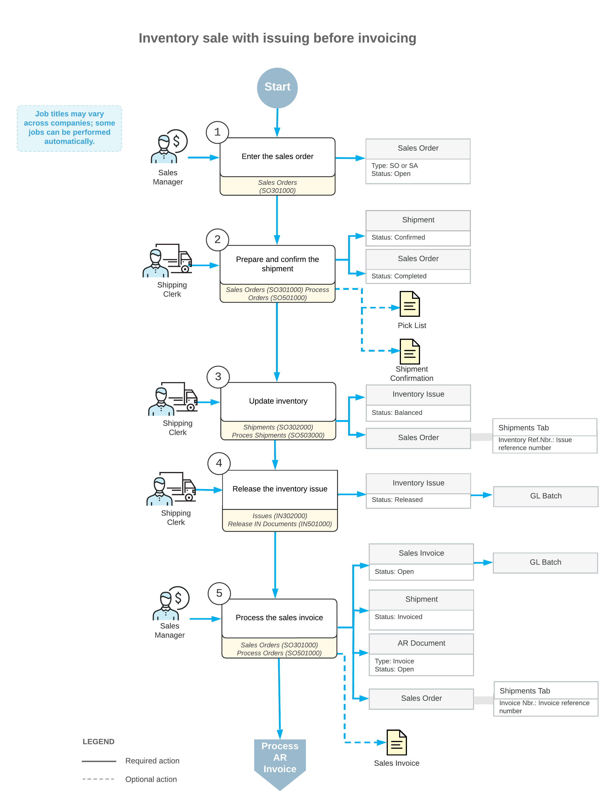

# Shipment Process Variations {#_d623ee69-6037-436f-b5fa-6585d37916b3 .concept}

Due to shipment policies, your organization may process customer invoices later than it does inventory issues. In this case, you can first create issues, then generate invoices, and finally release invoices and issues.

The processing of a sales order with issues created before invoices includes the steps and generated documents shown in the following diagram.

The following sections describe in detail the processing steps shown in the diagram.

## 1. Enter the Sales Order { .section}

You create a new sales order on the [Sales Orders](SO_30_10_00.md) \(SO301000\) form. If the order is created with the *On Hold* status, you should click **Remove Hold** on the form toolbar to process the order further.

## 2. Prepare and Confirm the Shipment { .section}

For a particular order, you can create a shipment by clicking **Create Shipment** on the form toolbar of the [Sales Orders](SO_30_10_00.md) \(SO301000\) form. Then you need to confirm the shipment. For more details, see [Shipment Processing Steps](SO__con_Shipment_Processing.md).

## 3. Update Inventory { .section}

To manually create the inventory issue for a shipment, you can click **Create Shipment** on the form toolbar of the [Shipments](SO_30_20_00.md) \(SO302000\) form, or you can create inventory issues for multiple selected shipments by executing the *Update IN* action on the [Process Shipments](SO_50_30_00.md) \(SO503000\) form.

## 4. Release the Inventory Issue { .section}

To release the inventory issue \(and thus, to update the item availability information in inventory\), you click **Release** on the form toolbar of the [Issues](IN_30_20_00.md) \(IN302000\) form. When the inventory issue is released, the batch of General Ledger transactions is generated.

## 5. Process the Sales Invoice { .section}

You can prepare a sales invoice for a particular order by clicking **Prepare Invoice** on the form toolbar of the [Shipments](SO_30_20_00.md) \(SO302000\) form, or you can create invoices for multiple selected shipments by executing the *Prepare Invoice* action on the [Process Shipments](SO_50_30_00.md) \(SO503000\) form.

To release the sales invoice, you click **Release** on the form toolbar of the [Invoices](SO_30_30_00.md) \(SO303000\) form after reviewing its details. When the sales invoice is released, the batch of GL transactions is generated.

To adjust the dates in the invoices generated for confirmed shipments, you can use the **Use Shipment Date for Invoice Date** check box on the [Sales Orders Preferences](SO_10_10_00.md) \(SO101000\) form as follows:

-   Select this check box to set the shipment date as the invoice date.
-   Clear the check box to use the current business date as the default date for the invoice.

**Parent topic:**[Processing Partial Shipments](../UserGuide/SO__con_Shipments.md)

