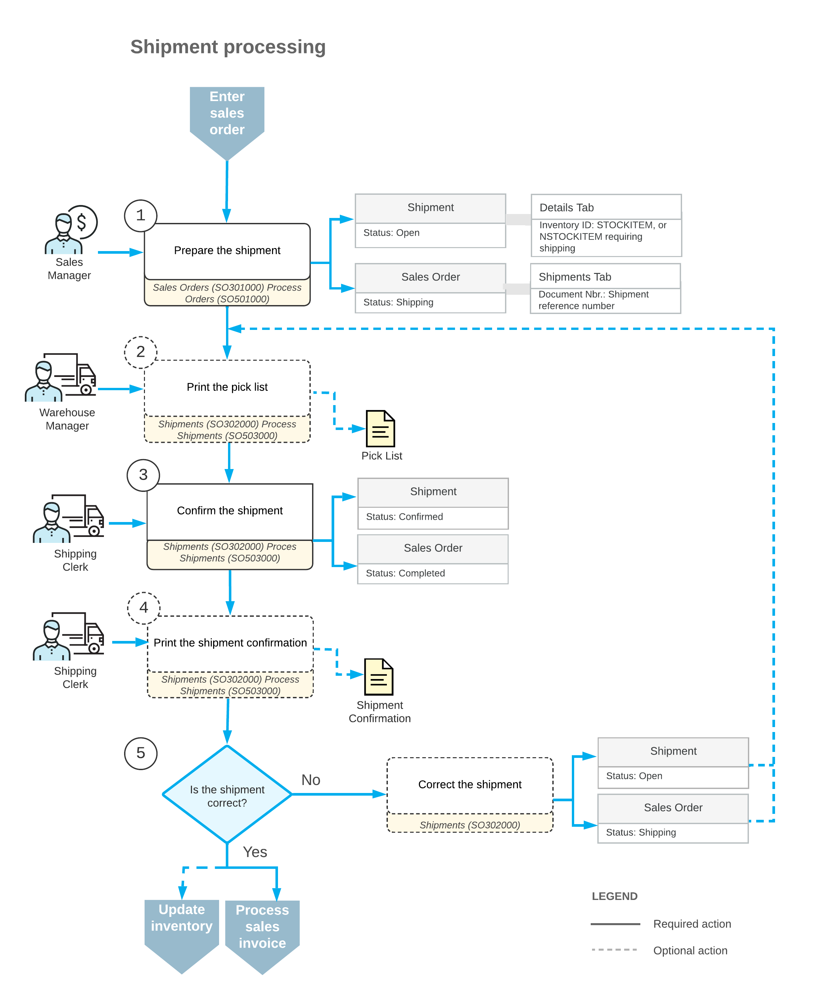

# Shipment Processing Steps {#_0f034d3c-9b7d-41c6-ae2b-98fec85f8cc1 .concept}

Shipments, which are a key part of the order fulfillment process, can be incoming or outgoing. This topic discusses the outgoing shipments \(based on the *Issue* operation\) that are generated when a user processes a sale of items and ships the items to a customer; further we will refer to them as *shipments*. The processing of incoming shipments \(which are based on the *Receipt* operation, and thus are called *receipts*\) involve customer returns based on return orders and is described in the topics of the [Returns for Replacement at the Same Price: General Information](OrderMgmt_Return_for_Replacement_Same_Price_GeneralInfo.md) section.

For a shipment prepared for a sales order, the typical processing involves the actions and generated documents shown in the following diagram.

The following sections describe in detail the processing steps shown in the diagram.

## 1. Prepare the Shipment { .section}

You can directly create a shipment document for a particular sales order on the [Sales Orders](SO_30_10_00.md) \(SO301000\) form by selecting **Create Shipment** on the form toolbar; this brings up the [Shipments](SO_30_20_00.md) \(SO302000\) form with the new shipment document that includes the lines with items to be shipped. Alternatively, by using the [Shipments](SO_30_20_00.md) form as a starting point, you can create a new shipment document and add one order or multiple orders of the same customer.

To create multiple shipments for multiple sales orders of multiple customers, you use the [Process Orders](SO_50_10_00.md) \(SO501000\) form. The system automatically assigns reference numbers to the created shipment documents, in accordance with the numbering sequence assigned to shipments on the [Sales Orders Preferences](SO_10_10_00.md) \(SO101000\) form.

If you use the [Sales Orders](SO_30_10_00.md) form to create shipments for a sales order that includes items to be shipped from multiple warehouses, you can create only one shipment at a time. Because an order with the *Shipping* status is read-only, there can be only one open shipment for the order from a particular warehouse. Once you confirm the open shipment, you can create a shipment to be sent from another warehouse. However, by using the [Process Orders](SO_50_10_00.md) form, you can create multiple shipments for these orders at once.

## 2. Print the Pick List { .section}

You can print a pick list for a particular shipment by using the [Shipments](SO_30_20_00.md) \(SO302000\) form. For multiple shipments with the *On Hold* or *Open* status, you can print pick lists by using the [Process Shipments](SO_50_30_00.md) \(SO503000\) form. For more details, see [Shipment Processing Steps](SO__con_Shipment_Processing.md).

## 3. Confirm the Shipment { .section}

After all the required goods are picked and packed, you can confirm the shipment by clicking **Confirm Shipment** on the form toolbar of the [Shipments](SO_30_20_00.md) \(SO302000\) form. You can confirm multiple shipments by executing the *Confirm Shipment* action for the selected shipments on the [Process Shipments](SO_50_30_00.md) \(SO503000\) form. Shipment confirmation updates the available quantities and changes the status of the associated sales order. During shipment confirmation, the system checks that for all items for which lot or serial numbers are tracked, the appropriate numbers were specified.

## 4. Print Shipment Confirmation { .section}

If authorization is required before the shipment is confirmed, you can print a shipment confirmation document to be signed by the authorized person by clicking **Reports &gt; Print Shipment Confirmation** on the form toolbar of the [Shipments](SO_30_20_00.md) \(SO302000\) form. For multiple shipments, you can print shipment confirmations by using the [Process Shipments](SO_50_30_00.md) \(SO503000\) form.

To complete the sale, you must generate sales invoices and inventory issues and release these documents. The general workflow for most organizations is to first generate sales invoices and then release them; on release of these invoices, inventory issues are generated automatically. Another shipment processing workflow, in which an organization updates inventory and processes inventory issues before generating and processing customer invoices, is described in [Shipment Process Variations](SO__con_Shipment_Process_Variations.md).

## 5. Correct the Shipment { .section}

If you need to correct a shipment that has already been confirmed, click **Correct Shipment** on the More menu of the [Shipments](SO_30_20_00.md) \(SO302000\) form to reopen the shipment and make the required corrections. The associated order's status is changed to *Shipping* once you reopen the shipment.

If an order that has a confirmed shipment has been canceled, you can reopen the order by clicking **Reopen Order** on the More menu of the [Sales Orders](SO_30_10_00.md) \(SO301000\) form. You can then delete or correct the shipment by using the [Shipments](SO_30_20_00.md) form.

If a shipment includes a sales order line that is also included in any subsequent shipments, you have to correct the subsequent shipments prior to correcting the preceding one. After you have completed all needed corrections, you can confirm the shipment or shipments that you have reopened.

**Parent topic:**[Processing Partial Shipments](../UserGuide/SO__con_Shipments.md)

