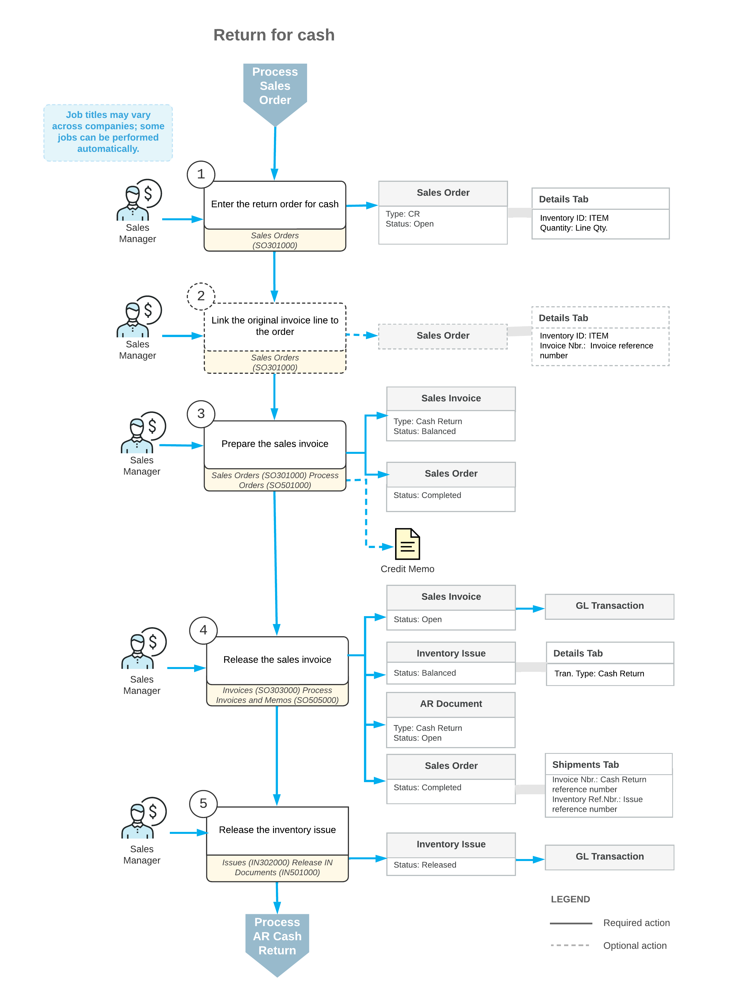

# Processing Returns for Cash {#_371b99b7-4a4a-459b-8d60-d819c0027f1a .concept}

Acumatica ERP gives you the flexibility to manage various types of customer returns. Depending on your company's return policies, you may need to perform a return of an inventory item for cash. This topic describes the processing steps you need to perform and the transactions generated during these steps.

To process a return for cash, you can use a return order for cash \(that is, an order with the *CR* predefined order type\). The processing of a return for cash involves the actions and generated documents shown in the following diagram.

The following sections describe in detail the processing steps shown in the diagram.

## 1. Enter the Return Order for Cash { .section}

You create a new return order for cash on the [Sales Orders](SO_30_10_00.md) \(SO301000\) form. A reference number for the new return order for cash is generated according to the numbering sequence assigned to this order type on the [Order Types](SO_20_10_00.md) \(SO201000\) form. If the order is created with the *On Hold* status, you should click **Remove Hold** on the form toolbar to process the order further.

## 2. Link the Original Invoice Line to the Order { .section}

Each line in the order of the *CR* order type can include a link to the original invoice for which the return is performed. To add an item to be returned with a link to the original invoice, on the [Sales Orders](SO_30_10_00.md) \(SO301000\) form, you can click **Add Invoice** on the table toolbar of the **Details** tab and select the line of the needed invoice in the **Add Invoice Details** dialog box \(which opens\). If an item to be returned has a specific lot or serial number, you should select this particular item from the list of invoice lines.

**Note:** You can also add a stock item to be returned without linking it to an invoice. To do this, click **Add Items** on the table toolbar of the **Details** tab, and select an item in the **Inventory Lookup** dialog box \(which opens\).

In each line added on the **Details** tab for an order of the *CR* type, you must specify a reason code. Also, the payment information on the **Payment Settings** tab is required for the cash return.

## 3. Prepare the Sales Invoice { .section}

You can prepare the sales invoice by clicking **Prepare Invoice** on the More menu of the [Sales Orders](SO_30_10_00.md) \(SO301000\) form, or you can create multiple invoices by selecting the *Prepare Invoice* action and performing this action for multiple orders on the [Process Orders](SO_50_10_00.md) \(SO501000\) form.

The prepared document or documents of the *Cash Return* type can be reviewed on the [Invoices](SO_30_30_00.md) \(SO303000\) form. You can print a sales invoice by clicking **Reports &gt; Print Invoice** on the form toolbar of the [Invoices](SO_30_30_00.md) \(SO303000\) form.

## 4. Release the Sales Invoice { .section}

When the sales invoice of the *Cash Return* type is released, the system automatically generates an inventory issue with the *Credit Memo* transaction type that adds the returned item to inventory; you can review the generated issue on the [Issues](IN_30_20_00.md) \(IN302000\) form. Also, the related AR cash return with the same reference number becomes available for reviewing on the [Cash Sales](AR_30_40_00.md) \(AR304000\) form. The document updates the appropriate sales and cash accounts.

## 5. Release the Inventory Issue { .section}

The generated inventory issue is released automatically if the **Automatically Release IN Documents** check box is selected on the [Sales Orders Preferences](SO_10_10_00.md) form. If this check box is cleared, you have to release the inventory issue manually by clicking **Release** on the form toolbar of the [Issues](IN_30_20_00.md) \(IN302000\) form. On release of the inventory issue, a batch of GL transactions is generated.

-   **[To Create a Cash Return Order \(CR\)](../UserGuide/SO__How_Enter_CR_Order.md)**  

-   **[To Process a Cash Return Order \(CR\)](../UserGuide/SO__How_Process_CR_Order.md)**  

