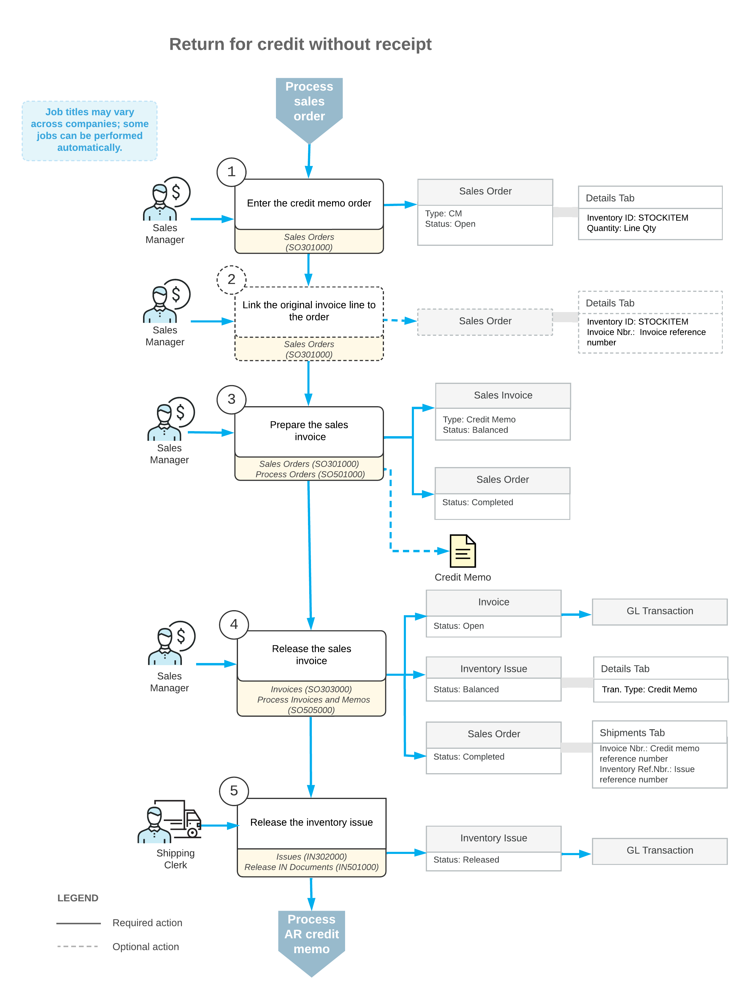

# Processing Returns for Credit Without Receipts {#_7251c08c-2dc9-4c25-9193-6bb81568e541 .concept}

Acumatica ERP gives you the flexibility to manage various types of customer returns. Depending on your company's return policies, you may need to perform a return for credit when shipping of returned items to inventory is not needed. This topic describes the processing steps you need to perform, and the transactions generated during these steps.

To process an unauthorized return without a purchase receipt and shipment, you can use a credit memo \(*CM*\) order. The processing of a return for credit involves the actions and generated documents shown in the following diagram.

The following sections describe in detail the processing steps shown in the diagram.

## 1. Enter the Credit Memo { .section}

You create a new credit memo order on the [Sales Orders](SO_30_10_00.md) \(SO301000\) form. A reference number for the new return order is generated according to the numbering sequence assigned to this order type on the [Order Types](SO_20_10_00.md) \(SO201000\) form. If the order is created with the *On Hold* status, you should click **Remove Hold** on the form toolbar to process the order further.

## 2. Link the Original Invoice Line to the Order { .section}

Each line in the order of the *CM* order type can include a reference to the original invoice for which the return is performed. To add an item to be returned and include a link to original invoice, on the [Sales Orders](SO_30_10_00.md) \(SO301000\) form, you can click **Add Invoice** on the table toolbar of the **Details** tab and select the line of the needed invoice in the **Add Invoice Details** dialog box \(which opens\).

**Note:** You can also add a stock item to be returned without linking it to an invoice. To do this, click **Add Items** on the table toolbar of the **Details** tab, and select the item in the **Inventory Lookup** dialog box \(which opens\).

## 3. Prepare the Sales Invoice { .section}

You can prepare the sales invoice by clicking **Prepare Invoice** on the More menu of the [Sales Orders](SO_30_10_00.md) \(SO301000\) form, or you can create any number of invoices by selecting the *Prepare Invoice* action and processing multiple orders on the [Process Orders](SO_50_10_00.md) \(SO501000\) form.

The prepared document or documents of the *Credit Memo* type can be reviewed on the [Invoices](SO_30_30_00.md) \(SO303000\) form. You can print a sales invoice by clicking **Print Invoice** \(under **Printing and Emailing**\) on the More menu of this form.

## 4. Release the Sales Invoice { .section}

For the credit memo order, the released sales invoice acts as a shipment does: On release of the invoice, the system updates the **Qty. on Shipments** value in the order lines based on the quantity specified in the credit memo lines, and inserts the reference number of the SO credit memo on the **Shipments** tab of the [Sales Orders](SO_30_10_00.md) \(SO301000\) form.

When the sales invoice is released, a batch of GL transactions is generated, and the system automatically generates an inventory issue with the *Credit Memo* transaction type that adds the returned item to inventory. Also, a corresponding AR credit memo is generated and becomes available for review on the [Invoices and Memos](AR_30_10_00.md) \(AR301000\) form.

## 5. Release the Inventory Issue { .section}

The generated inventory issue is released automatically if the **Automatically Release IN Documents** check box is selected on the [Sales Orders Preferences](SO_10_10_00.md) \(SO101000\) form. If this check box is cleared, you have to release the inventory issue manually by clicking **Release** on the form toolbar of the [Issues](IN_30_20_00.md) \(IN302000\) form. On release of the inventory issue, a batch of GL transactions is generated.

**Note:** To finish the return process, you need to process the AR credit memo to completion. You can apply the credit memo to the original invoice, or process the refund if the original invoice was already paid. For details on credit memo application, see [AR Invoice Correction: To Create a Credit Memo](Finance_CorrectingARInvoices_Process_Activity.md). For details on the processing of a refund, see [Refunds: To Create a Refund and Apply a Credit Memo to It](Finance_ProcessingCustomerRefunds_Activity1.md).

-   **[To Create a Credit Memo Order \(CM\)](../UserGuide/SO__How_Enter_CM_Order.md)**  

-   **[To Process a Credit Memo Order \(CM\)](../UserGuide/SO__How_Process_CM.md)**  

