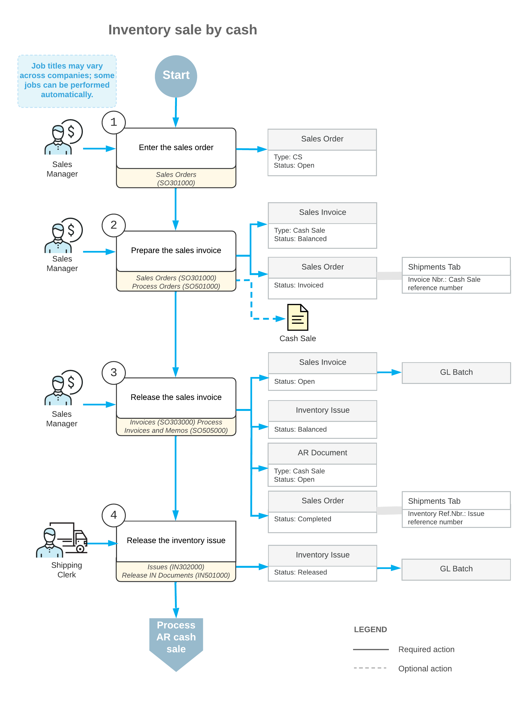

# Processing Cash Sales of Stock Items {#_633b37db-d968-41f1-a499-d35c8f9a422b .concept}

To process a sale of items directly to the customer when you are receiving payment at that time \(by cash or check\), you can create a cash sale order of the *CS* order type by using the [Sales Orders](SO_30_10_00.md) \(SO301000\) form. The processing of cash sales orders involves the actions and generated documents shown in the following diagram.

**Attention:** If quick processing is configured for the *CS* order type, you can perform complete processing of the order directly from the [Sales Orders](SO_30_10_00.md) \(SO301000\) form. For more information, see [Sales Order Types: Quick Processing of Sales Orders](../ImplementationGuide/config_Sales_Order_Types_Quick_Process_Workflow.md).

The following sections describe in detail the processing steps shown in the diagram.

## 1. Enter the Sales Order { .section}

You create a new sales order of the *CS* type on the [Sales Orders](SO_30_10_00.md) \(SO301000\) form. You can save the order of the *CS* type only after you specify the payment information, including the payment method, cash account, and payment reference number.

The reference number for a new order is generated according to the numbering sequence assigned to this order type on the [Order Types](SO_20_10_00.md) \(SO201000\) form. If the order is created with the *On Hold* status, you should click **Remove Hold** on the form toolbar to process the order further.

## 2. Prepare the Sales Invoice { .section}

You can prepare a sales invoice by clicking **Prepare Invoice** on the More menu of the [Sales Orders](SO_30_10_00.md) \(SO301000\) form, or you can create invoices by specifying the *Prepare Invoice* action on the [Process Orders](SO_50_10_00.md) \(SO501000\) form and processing multiple selected orders. For the cash sale order, a sales invoice of the *Cash Sale* type is prepared.

Any prepared sales invoice can be reviewed on the [Invoices](SO_30_30_00.md) \(SO303000\) form.

## 3. Release the Sales Invoice { .section}

To release the sales invoice, you click **Release** on the More menu of the [Invoices](SO_30_30_00.md) form. When a sales invoice of the *Cash Sale* type is released, a batch of GL transactions is generated. Also, when the sales invoice is released, the system automatically generates a corresponding inventory issue with the date and posting period of the sales invoice. The related AR cash sale with the same reference number becomes available for reviewing on the [Cash Sales](AR_30_40_00.md) \(AR304000\) form. For more information on processing AR cash sales, see [Cash Sales and Cash Returns: Process Activity](Finance_Cash_Sales_Activity.md).

## 4. Release the Inventory Issue { .section}

The generated inventory issue is released automatically if the **Automatically Release IN Documents** check box is selected on the [Sales Orders Preferences](SO_10_10_00.md) \(SO101000\) form. If this check box is cleared, you have to release the inventory issue manually by clicking **Release** on the form toolbar of the [Issues](IN_30_20_00.md) \(IN302000\) form. On release of the inventory issue, a batch of GL transactions is generated.

## Important Notes { .section}

Note the following about the processing of cash sales orders:

-   If you process a cash sales order with only non-stock items, no inventory issue is generated when the sales invoice of the *Cash Sale* type is released.
-   For non-stock items and services, you can enter a process a cash sale directly on the[Cash Sales](AR_30_40_00.md) \(AR304000\) form without creating and processing a cash sale order.
-   For items that have lot or serial numbers tracked in Acumatica ERP, you can specify these numbers, thus indicating that these particular items have been delivered to the customer.

-   **[To Enter a Cash Sale Order \(CS\)](../UserGuide/SO__How_Enter_CS_Order.md)**  

-   **[To Process a Cash Sale Order \(CS\)](../UserGuide/SO__How_Process_CS.md)**  

