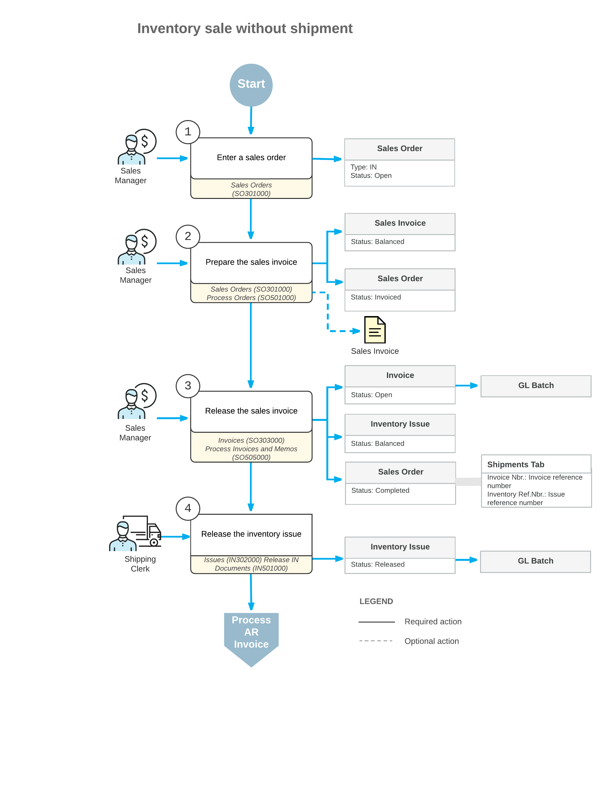

# Processing Sales of Stock Items Without a Shipment {#_982f9783-cfb0-45b1-bd39-04f1c624b768 .concept}

An invoice order, which has the *IN* order type selected on the [Sales Orders](SO_30_10_00.md) \(SO301000\) form, is a special type of sales order that you create when the goods requested by a customer have been shipped or delivered already, and thus the order does not require a shipment to be processed. The processing of an invoice order involves the actions and generated documents shown in the following diagram.

**Note:** If quick processing is configured for the *IN* order type, you can perform complete processing of the order directly from the [Sales Orders](SO_30_10_00.md) form. For more information, see [Sales Order Types: Quick Processing of Sales Orders](../ImplementationGuide/config_Sales_Order_Types_Quick_Process_Workflow.md).

The following sections describe in detail the processing steps shown in the diagram.

## 1. Enter the Sales Order { .section}

A new sales order of the *IN* type is created on the [Sales Orders](SO_30_10_00.md) \(SO301000\) form. The reference numbers for a new order is generated according to the numbering sequence assigned to this order type on the [Order Types](SO_20_10_00.md) \(SO201000\) form. If the order is created with the *On Hold* status, you should click **Remove Hold** on the form toolbar to process the order further.

**Note:** For items that have lot or serial numbers tracked in Acumatica ERP, you can specify these numbers in the document lines, thus indicating that these particular items have been delivered to the customer.

## 2. Prepare the Sales Invoice { .section}

You can prepare a sales invoice for an order by clicking **Prepare Invoice** on the More menu of the [Sales Orders](SO_30_10_00.md) \(SO301000\) form, or you can create multiple invoices by specifying the *Prepare Invoice* action on the [Process Orders](SO_50_10_00.md) \(SO501000\) form and processing multiple selected orders.

Any prepared sales invoice can be reviewed on the [Invoices](SO_30_30_00.md) \(SO303000\) form.

## 3. Release the Sales Invoice { .section}

To release the sales invoice, you click **Release** on the form toolbar of the [Invoices](SO_30_30_00.md) \(SO303000\) form. When the sales invoice is released, a batch of GL transactions is generated. Also, when the sales invoice is released, the system automatically generates a corresponding inventory issue with the date and posting period of the invoice. Also, the sales invoice becomes visible on the [Invoices and Memos](AR_30_10_00.md) \(AR301000\) form as an AR invoice. The AR invoice and sales invoice have the same reference number. For more information on processing AR invoices, see [Processing AR Invoices](Finance_ARInvoices_Mapref.md).

## 4. Release the Inventory Issue { .section}

The generated inventory issue is released automatically if the **Automatically Release IN Documents** check box is selected on the [Sales Orders Preferences](SO_10_10_00.md) \(SO101000\) form. If this check box is cleared, you have to release the inventory issue manually by clicking **Release** on the form toolbar of the [Issues](IN_30_20_00.md) \(IN302000\) form. On release of the inventory issue, a batch of GL transactions is generated.

-   **[To Enter an Invoice Order \(IN\)](../UserGuide/SO__How_Enter_IN_Order.md)**  

-   **[To Process an Invoice Order](../UserGuide/SO__How_Process_IN_Order.md)**  

