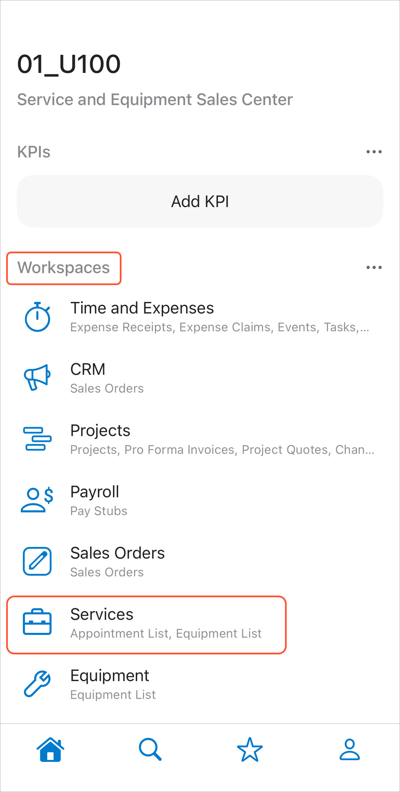
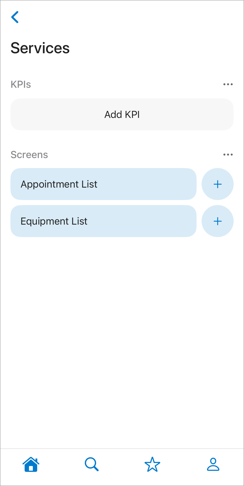
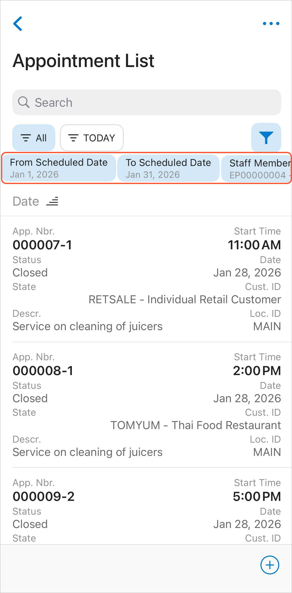
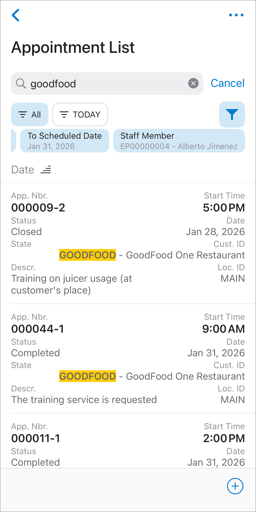
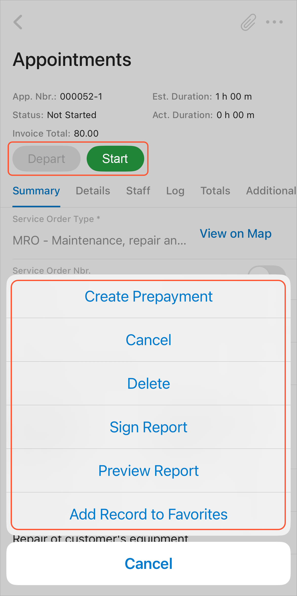
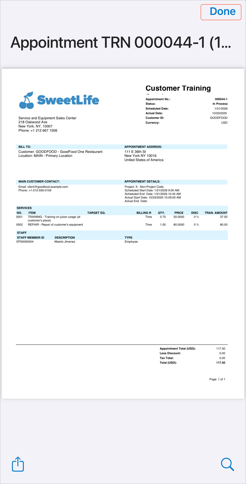
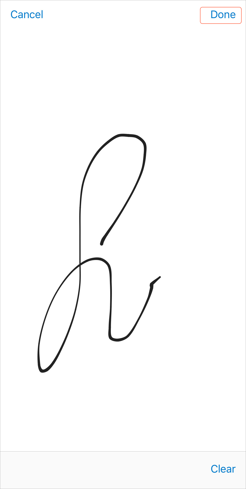

# Appointments in the Mobile App: Basic Operations {#_b1bfc884-b24f-469a-9222-ede99cf01c63 .concept}

The Acumatica mobile app is an out-of-the-box solution that empowers the staff members of your company to access Acumatica ERP from mobile devices to manage their work documents, including appointments.

**Tip:** The appearance and functionality of the Acumatica mobile app UI may vary slightly between iOS and Android devices.

## Opening the List of Appointments { .section}

In the Acumatica mobile app, you access the list of appointments by tapping **Services** on the main menu and then tapping **Appointment List** \(see below\).

**Tip:** The list of available workspaces and screens depends on the features included in your license and enabled on the [Enable/Disable Features](CS_10_00_00.md#) \(CS100000\) form.

When you tap **Appointment List**, the Appointment List screen opens.

To find and view the needed appointment, specify the following filter criteria \(see below\):

-   **From Scheduled Date**: Select the start date of the scheduled appointments to be displayed.
-   **To Scheduled Date**: Select the end date of the scheduled appointments to be displayed.
-   **Staff Member** \(optional\): Specify the staff member whose appointments you want to view. By default, the signed-in staff member is selected.

## Creating a New Appointment { .section}

In the mobile app, you can create a new appointment directly from the Appointment List screen. To do this, tap the **plus \(+\)** icon or **Create New** \(depending on your mobile operating system\) at the bottom of the list. Then, specify the required settings and details for the new appointment in the form view. When finished, save the appointment.

## Searching for an Appointment { .section}

In the Acumatica mobile app, you can find a specific appointment by entering a search string in the search box. The results are displayed in a list, with the words matching your search string highlighted, as shown in the screenshot below.

## Working with a Particular Appointment { .section}

By tapping an appointment in the list, you open its form view, which displays the settings of the selected appointment. You can process the appointment by using the buttons and commands available on the **More** menu \(see below\).

The following buttons and commands are available: **Start**, **Complete** \(for started appointments\), **Close** \(for completed appointments\), **Depart**, **Create Prepayment**, **Cancel**, **Delete**, **Sign Report**, **Preview Report**, and **Add Record to Favorites**.

## Reviewing and Signing the Report { .section}

Before completing an appointment, tap **Preview Report** on the More menu to open and review the report \(see below\). Then, show the report to the customer.

Then, tap **Sign Report** to open the signature screen, where the customer can sign the report \(see below\).

After the customer provides the signature, close the view by tapping **Done**.

**Parent topic:**[Managing Appointments in Mobile App](../UserGuide/ServMgmt_Appointments_in_Mobile_App_mapref.md)

