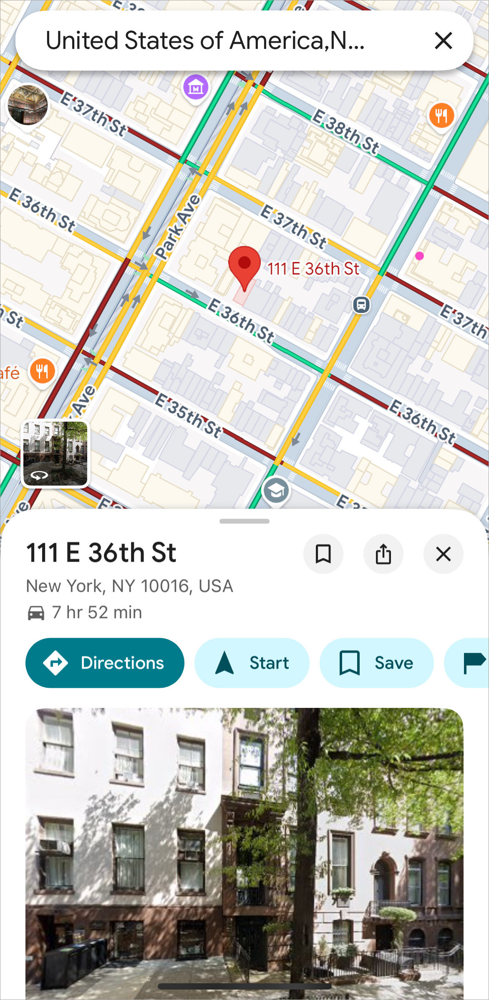
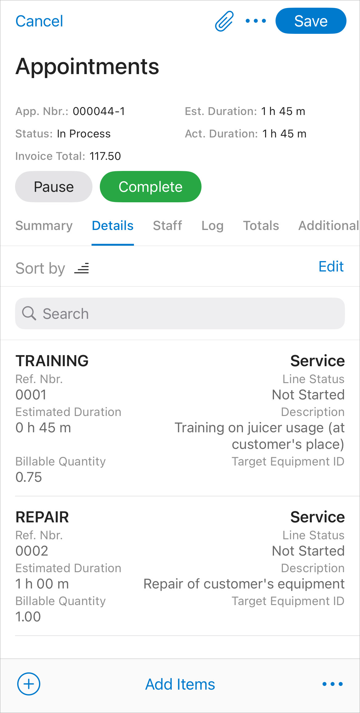
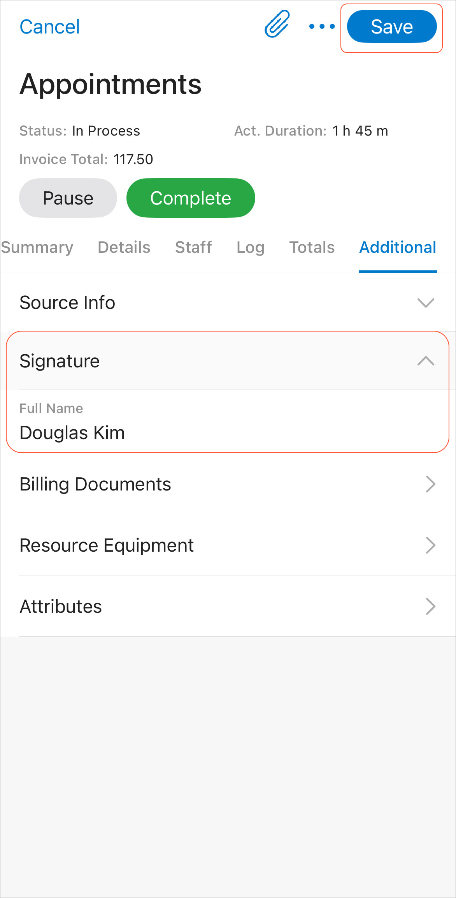
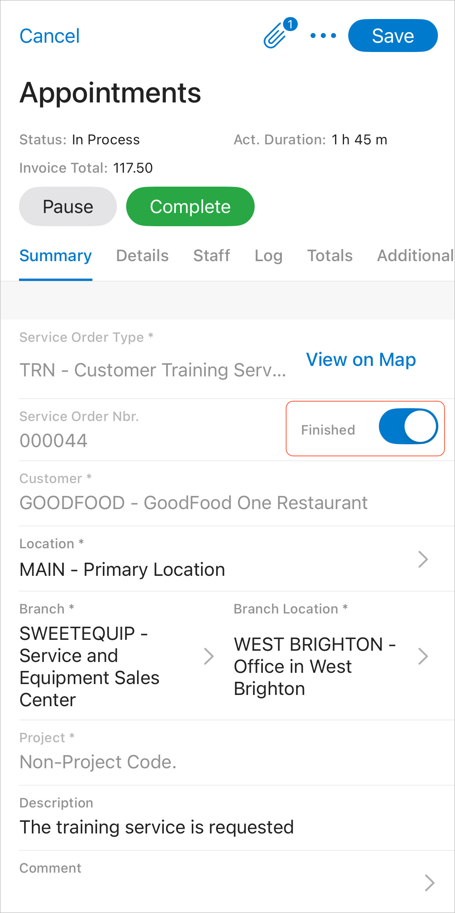

# Appointments in the Mobile App: To Process an Appointment Assigned to a Staff Member {#_dbd6e37b-93d1-4949-a76f-644342b07766 .task}

This activity will walk you through the process of starting and completing an appointment that requires additional service to be added during the appointment, and a customer signature in the Acumatica mobile app.

**Attention:** This activity is based on the *U100* dataset. If you are using another dataset or if any system settings have been changed in *U100*, these changes can affect the workflow of the activity and the results of the processing. To avoid issues, restore the *U100* dataset to its initial state.

**Tip:** The appearance and functionality of the Acumatica mobile app UI may slightly differ for iOS and Android devices.

## Story { .section}

Suppose that Alberto Jimenez uses the Acumatica mobile app to process the appointments he attends. On January 31, 2026, he arrives at a customer location and processes the appointment by using the mobile app. He starts the appointment, adds one more service, and shows the appointment report to the customer. The customer signs the report in the app. Alberto Jimenez then completes the appointment and sends the signed appointment to the customer.

Acting as Alberto Jimenez, you will perform these actions in the mobile app.

## Configuration Overview { .section}

In the *U100* dataset, which you'll use to complete this lesson, the following setup has been configured. These settings ensure that the environment is ready for performing the activity:

-   The minimum system configuration, which is described in [Company with Branches that Do Not Require Balancing: General Information](../ImplementationGuide/config_Company_with_Branches_No_Balancing_GeneralInfo.md), has been performed.
-   The *SWEETLIFE* company has been created on the [Companies](CS_10_15_00.md) \(CS101500\) form. This company has multiple branches created on the [Branches](CS_10_20_00.md#) \(CS102000\) form, including *SWEETEQUIP \(Service and Equipment Sales Center\)*.
-   On the [Service Management Preferences](FS_10_01_00.md) \(FS100100\) form, the minimum settings have been specified, including specifying the numbering sequences and work calendar, for the service management functionality to be used.
-   On the [Users](SM_20_10_10.md) \(SM201010\) form, the *jimenez* account has been created. For the *jimenez* user account, in the **Linked Entity** box of the Summary area of the form, the *Alberto Jimenez* employee account has been specified.
-   On the [Branch Locations](FS_20_25_00.md#) \(FS202500\) form, the *WEST BRIGHTON* branch location of the *SWEETEQUIP* \(*Service and Equipment Sales Center*\) branch has been created.
-   On the [Service Order Types](FS_20_23_00.md#) \(FS202300\) form, the *TRN* service order type has been configured to generate AR invoices to bill customers for provided services. That is, *AR Invoices* has been selected under **Generated Billing Documents** in the **Billing Settings** section \(**General** tab\).
-   On the [Appointments](FS_30_02_00.md#) \(FS300200\) form, the *000044-1* appointment has been created.

## Process Overview { .section}

In the Acumatica mobile app, you will open the Appointment List screen and specify the filter criteria to find the needed appointment assigned to Alberto Jimenez. You will then start the appointment, add an additional service on the **Details** tab, review the appointment report, obtain the customer's signature by tapping **Sign Report**, complete the appointment, and send the signed report to the customer.

## Preparation { .section}

Sign in to the mobile app as follows:

**Important:** Before you proceed, ensure that GPS location recording is enabled on your mobile device.

1.  Launch the app.
2.  Enter your Acumatica ERP instance \(for example, *http://my.site.acumatica.com*\).

    **Important:** The *U100* dataset must be installed on your instance before you can perform the instructions in this activity.

3.  Sign in as staff member Alberto Jimenez by using the *jimenez* username and the *123* password.

## Step 1: Viewing Appointments Assigned to a Staff Member { .section}

You will start by viewing the appointments assigned to *Alberto Jimenez*, the staff member whose actions you are performing in the mobile app.

In the mobile app, do the following:

1.  On the main screen, tap **Services**, and then tap **Appointment List**.
2.  Specify the filter criteria so that the scheduled date range includes the 1/31/2026 date. You can set the filter options as follows:
    -   **From Scheduled Date**: 1/1/2026
    -   **To Scheduled Date**: 1/31/2026
    -   **Staff Member**: Alberto Jimenez \(selected by default, because you signed-in with Alberto Jimenez’s credentials\).
3.  In the list of appointments assigned to Alberto Jimenez, tap the *000044-1* appointment to open it.
4.  On the Summary tab, tap **View on Map**. A map showing the location of the appointment opens, as shown below.

    

5.  Close the map and return to the appointment.

## Step 2: Starting the Appointment and Adding an Additional Service { .section}

To start the appointment and add an additional service, do the following:

1.  Return to the appointment in the mobile app.
2.  Tap **Start**.
3.  Tap the **Details** tab.
4.  Tap the **plus \(+\)** sign.

    The Details screen opens.

5.  Specify the following settings:
    -   **Line Type**: *Service*
    -   **Inventory ID**: *REPAIR*
    -   **Description**: *Repair of customer's equipment*
    -   **Actual Quantity**: 1 \(inserted by default\)
6.  Tap **Update** and save your changes on the Details screen. The additional *REPAIR* service has been added to the appointment, as shown below.

    

## Step 3: Obtaining the Customer's Signature and Completing the Appointment { .section}

Sign the appointment on behalf of the customer and complete it, acting as *Alberto Jimenez*, as follows:

1.  While you are still viewing the appointment in the mobile app, on the More menu, tap **Preview Report**.

    The report appears on the screen \(see below\). *Alberto Jimenez* would now show this report to the customer to verify that all information has been entered correctly.

    

2.  Close the report, and tap the **Additional** tab \(see below\).
3.  In the **Signature** section, in the **Full Name** box, specify `Douglas Kim`, and tap **Save**.

    

4.  On the More menu, tap **Sign Report**.
5.  In the form view of the appointment, leave a signature \(see below\) and tap **Done**. \(In this exercise, you are signing the appointment on behalf of the customer. In actual use, the customer would sign the appointment.\)

    The image containing the signature is now attached to the appointment.

    

6.  On the **Summary** tab, in the **Date and Time** section, specify the actual start date and time and actual end date and time.
7.  In the Summary area, select **Finished** \(see below\).

    

8.  Tap the **Complete** button.

    The signed report is attached to the appointment in the Files section. You can tap the attached report to view it.

9.  On the More menu, tap **Email Appointment**.

    An email with the signed report attached is sent to the customer assigned to the appointment.

**Parent topic:**[Managing Appointments in Mobile App](../UserGuide/ServMgmt_Appointments_in_Mobile_App_mapref.md)

