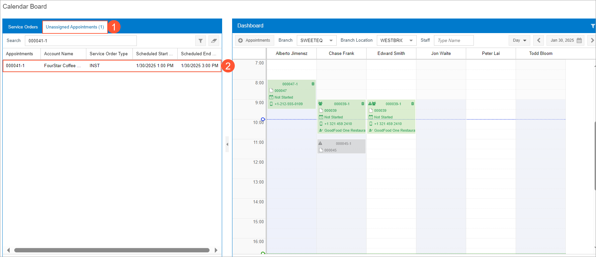
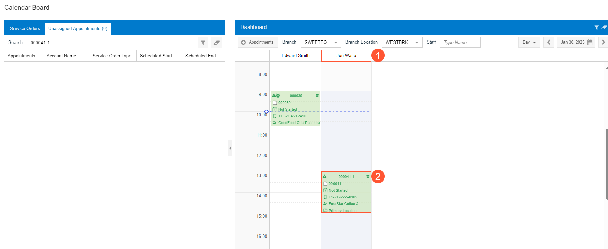

# Staff Assignment: From Service Order to Calendar Board {#_ff0eb830-5e84-4bff-93f9-8bc4c718906d .task}

In this activity, you’ll learn how to schedule an appointment for a service order and assign it to an employee available on the selected date on the calendar board.

**Important:** This activity is based on the Acumatica ERP Classic UI.

**Attention:** This activity is based on the *U100* dataset. If you are using another dataset or if any system settings have been changed in *U100*, these changes can affect the workflow of the activity and the results of the processing. To avoid issues, restore the *U100* dataset to its initial state.

## Story { .section}

The *COFFEESHOP - FourStar Coffee &amp; Sweets Shop* customer has contacted the SweetLife Service and Equipment Sales Center to request a juicer installation service. The customer requires that the employee performing the service hold specific licenses and skills to ensure the highest quality of work. A service order for this request has already been entered in the system.

As the service manager \(Maia Davis\), you task is to create an appointment and assign it to a staff member, taking into account the staff member's working hours, licenses, and skills.

## Configuration Overview { .section}

In the *U100* dataset, which you'll use to complete this lesson, the following setup has been configured. These settings ensure that the environment is ready for performing the activity:

-   The minimum system configuration, which is described in [Company with Branches that Do Not Require Balancing: General Information](../ImplementationGuide/config_Company_with_Branches_No_Balancing_GeneralInfo.md), has been performed.
-   The *SWEETLIFE* company has been created on the [Companies](CS_10_15_00.md) \(CS101500\) form. This company has multiple branches created on the [Branches](CS_10_20_00.md#) \(CS102000\) form, including *SWEETEQUIP \(Service and Equipment Sales Center\)*.
-   On the [Service Management Preferences](FS_10_01_00.md) \(FS100100\) form, the minimum settings have been specified, including specifying the numbering sequences and work calendar, for the service management functionality to be used.
-   On the [Users](SM_20_10_10.md) \(SM201010\) form, the *davis* and *waite* user accounts have been created. The *EP00000040 - Maia Davis* employee has been associated with the *davis* user account; that is, *Maia Davis* has been selected in the **Linked Entity** box of the Summary area of the form. The *EP00000003 - Jon Waite* employee has been associated with the *waite* user account; that is, *Jon Waite* has been selected in the **Linked Entity** box of the Summary area of the form.
-   On the [Branch Locations](FS_20_25_00.md#) \(FS202500\) form, the *WEST BRIGHTON* branch location of the *SWEETEQUIP* \(*Service and Equipment Sales Center*\) branch has been created.
-   On the [User Profile](SM_20_30_10.md#) \(SM203010\) form, for the *davis* user, *WEST BRIGHTON* has been specified as the default branch location.
-   On the [Skills](FS_20_06_00.md#) \(FS200600\) form, the *INSTALLING* skill has been created.
-   On the [License Types](FS_20_09_00.md#) \(FS200900\) form, the *INST&amp;REP* license type has been created.
-   On the [Licenses](FS_20_10_00.md) \(FS201000\) form, the *FSL00002* license has been created. This license has the *INST&amp;REP* license type and was created for the *EP00000003 - Jon Waite* employee.
-   On the [Employees](EP_20_30_00.md#) \(EP203000\) form, the *EP00000003 - Jon Waite* employee has been created. On the **General** tab \(**Employee Settings** section\), the **Staff Member in Service Management** check box has been selected. The *INSTALLING* skill has been listed on the **Skills** tab, and license *FSL00002* of the *INST&amp;REP* type has been listed on the **Licenses** tab.
-   On the [Staff Schedule Rules](FS_20_20_01.md) \(FS202001\) form, a work schedule rule has been defined for the *EP00000003 - Jon Waite* employee, and the work schedule has been generated for this employee on the [Generate Staff Schedules](FS_50_04_00.md) \(FS500400\) form.
-   On the [Non-Stock Items](IN_20_20_00.md) \(IN202000\) form, the *INSTALL* service \(that is, an item of the *Service* type\) has been created. For this service, *INSTALLING* has been listed on the **Service Skills** tab, and *INST&amp;REP* has been listed on the **Service License Types** tab.
-   On the [Service Orders](FS_30_01_00.md) \(FS300100\) form, the service order with the *000041* reference number has been created.

## Process Overview { .section}

You will create an appointment on the [Service Orders](FS_30_01_00.md) \(FS300100\) form. Then, on the [Calendar Board](FS_30_03_00.md) \(FS300300\) form, you will assign a staff member to an appointment, taking into account the staff member’s available working hours.

## System Preparation {#section_tcf_bry_1hc .section}

Before you start this activity, do the following:

1.  Sign in to Acumatica ERP to a company with the *U100* dataset preloaded as a service manager by using the *davis* username and the *123* password.
2.  In the Date box in the upper-right corner of the top pane, specify *1/30/2026*. For simplicity, you'll create and process all documents in this activity by using this business date.
3.  After signing in, make sure that the *Service Management* feature is enabled on the [Enable/Disable Features](CS_10_00_00.md#) \(CS100000\) form.

## Step 1: Creating an Appointment from the Service Orders Form { .section}

To create and assign this appointment, perform the following instructions:

1.  On the [Service Orders](FS_30_01_00.md) \(FS300100\) form, open the *000041* service order.
2.  On the form toolbar, click **Create Appointment**.

    The [Appointments](FS_30_02_00.md) \(FS300200\) form opens.

3.  On the **Settings** tab, in the **Scheduled Date and Time** section, set **Scheduled Start Date** to *1/30/2026* *1:00 PM*.
4.  Ensure that the **Handle Manually** check box is cleared.
5.  On the form toolbar, click **Save**.

## Step 2: Assigning a Staff Member on the Calendar Board { .section}

To assign a staff member to the appointment by using the calendar board, do the following:

1.  While you are still viewing the appointment on the [Appointments](FS_30_02_00.md) \(FS300200\) form, on the More menu, click **Schedule on Calendar**.

    The [Calendar Board](FS_30_03_00.md) \(FS300300\) form opens in a new window. The left part of the form contains two tabs—**Service Orders** and **Unassigned Appointments \(n\)**. *n* is replaced with the quantity of unassigned appointments for the currently selected date.

2.  On the **Unassigned Appointments \(n\)** tab \(Item 1 in the following screenshot\), ensure that the *000041-1* appointment \(Item 2\), which was created in Step 1, is listed.

    

3.  Right-click the appointment, and then click **Filter Staff**. The list of staff members on the dashboard is filtered to match the skills and licenses of the services in the appointment.
4.  Drag the *000041-1* appointment from the **Unassigned Appointments \(n\)** tab to any time interval during Jon Waite's work hours. The appointment is now assigned to Jon Waite \(Item 1 in the next screenshot\) at the scheduled start time that was specified when you created the appointment \(Item 2\). Note that you can change the time of the appointment by dragging the appointment box.

    

5.  Click the *000041-1* appointment link in the calendar. The [Appointments](FS_30_02_00.md) form is opened with the details of the appointment. On the **Staff** tab, confirm that Jon Waite is assigned to the appointment.

**Parent topic:**[Creating Appointments](../UserGuide/ServMgmt_Processing_Appointments_Mapref.md)

