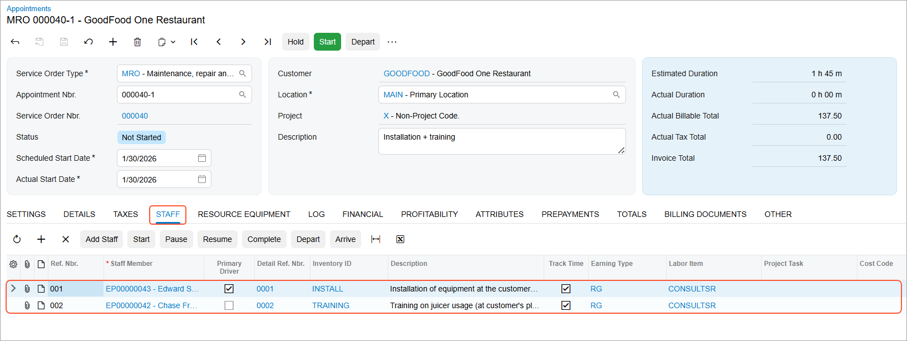

# Staff Assignment: To Assign Staff To Services in an Appointment {#_f2d26164-e485-41b3-9712-803d33742952 .task}

This activity guides you through the process of assigning a staff member to a specific service in an appointment.

**Attention:** This activity is based on the *U100* dataset. If you are using another dataset or if any system settings have been changed in *U100*, these changes can affect the workflow of the activity and the results of the processing. To avoid issues, restore the *U100* dataset to its initial state.

## Story { .section}

Suppose that the GoodFood One Restaurant customer has contacted the SweetLife Service and Equipment Sales Center to request a **juicer installation** service, followed by a **training** service once the installation is complete. The customer requires that each employee performing these services hold specific licenses and skills to ensure the highest quality of work. The service manager, **Maia Davis**, has already created an appointment for this request in the system.

Acting as the service manager, you now need to assign a staff member to each service in the appointment, based on the staff members’ skills and licenses and the requirements defined for the services.

## Configuration Overview { .section}

In the *U100* dataset, which you'll use to complete this lesson, the following setup has been configured. These settings ensure that the environment is ready for performing the activity:

-   The minimum system configuration, which is described in [Company with Branches that Do Not Require Balancing: General Information](../ImplementationGuide/config_Company_with_Branches_No_Balancing_GeneralInfo.md), has been performed.
-   The *SWEETLIFE* company has been created on the [Companies](CS_10_15_00.md) \(CS101500\) form. This company has multiple branches created on the [Branches](CS_10_20_00.md#) \(CS102000\) form, including *SWEETEQUIP \(Service and Equipment Sales Center\)*.
-   On the [Service Management Preferences](FS_10_01_00.md) \(FS100100\) form, the minimum settings have been specified, including specifying the numbering sequences and work calendar, for the service management functionality to be used.
-   On the [Users](SM_20_10_10.md) \(SM201010\) form, the *davis* account has been created. In the **Linked Entity** box of the Summary area of the form, the Maia Davis employee account has been specified.
-   On the [Branch Locations](FS_20_25_00.md#) \(FS202500\) form, the *WEST BRIGHTON* branch location of the *SWEETEQUIP* \(*Service and Equipment Sales Center*\) branch has been created.
-   On the [User Profile](SM_20_30_10.md#) \(SM203010\) form, for the *davis* user, *WEST BRIGHTON* has been specified as the default branch location.
-   On the [Skills](FS_20_06_00.md#) \(FS200600\) form, the *INSTALLING* and *TRAINING* skills have been created.
-   On the [License Types](FS_20_09_00.md#) \(FS200900\) form, the *INST&amp;REP* and *TRAINING* license types have been created.
-   On the [Licenses](FS_20_10_00.md) \(FS201000\) form, the following licenses have been created:
    -   *FSL00006*, which has the *TRAINING* license type and was created for the *EP00000042 \(Chase Frank\)* employee
    -   *FSL00004*, which has the *INST&amp;REP* license type and was created for the *EP00000043 \(Edward Smith\)* employee
-   On the [Employees](EP_20_30_00.md#) \(EP203000\) form, the following employees have been created:
    -   *EP00000042 \(Chase Frank\)*: On the **General** tab \(**Employee Settings** section\), the **Staff Member in Service Management** check box has been selected. Also, the *TRAINING* skill has been listed on the **Skills** tab, and license *FSL00006* of the *TRAINING* license type has been listed on the **Licenses** tab.
    -   *EP00000043 \(Edward Smith\)*: On the **General** tab \(**Employee Settings** section\), the **Staff Member in Service Management** check box has been selected. Also, the *INSTALLING* skill has been listed on the **Skills** tab, and license *FSL00004* of the *INST&amp;REP* type has been listed on the **Licenses** tab.
-   On the [Non-Stock Items](IN_20_20_00.md) \(IN202000\) form, the following services \(that is, items of the *Service* type\) have been created:
    -   *INSTALL*: For this service, *INSTALLING* has been listed on the **Service Skills** tab, and *INST&amp;REP* has been listed on the **Service License Types** tab.
    -   *TRAINING*: For this service, *TRAINING* has been listed on the **Service Skills** tab, and *TRAINING* has been listed on the **Service License Types** tab.
-   On the [Appointments](FS_30_02_00.md) \(FS300200\) form, the *000040-1* appointment has been created.

## Process Overview { .section}

On the [Appointments](FS_30_02_00.md) \(FS300200\) form, you will assign a staff member to each service of an appointment by using the **Add Staff** dialog box.

## System Preparation { .section}

Before you start this activity, do the following:

1.  Launch the Acumatica ERP website, and sign in to a company with the *U100* dataset preloaded; you should sign in as a service manager by using the *davis* username and the *123* password.
2.  In the Date box in the upper-right corner of the Acumatica ERP screen, specify the business date *1/30/2026*. For simplicity, you will use this business date to create and process all documents in this activity.
3.  After signing in, make sure that the *Service Management* feature is enabled on the [Enable/Disable Features](CS_10_00_00.md#) \(CS100000\) form.

## Step: Assigning Staff Members to Services { .section}

Do the following to assign a staff member to each service to be provided in the appointment:

1.  Open the *000040-1* appointment on the [Appointments](FS_30_02_00.md) \(FS300200\) form.
2.  On the **Details** tab, click line *0001*, which has the installation service \(that is, *INSTALL* is in the **Inventory ID** column\).
3.  On the table toolbar, click **Add Staff**. The **Add Staff** dialog box opens, where you do the following:
    -   In the Selection area, ensure that *0001* \(the reference number of the installation service\) is selected in the **Service Ref. Nbr.** box.
    -   On the **Skills** tab, make sure that the check box is selected in the row with *INSTALLING* in the **Skill ID** column.
    -   On the **Licenses** tab, make sure that the check box is selected in the row with *INST REP* in the **License Type ID** column.
    -   In the **Staff** table, which lists employees whose skills and license type satisfy the selection criteria, select the check box in the row with *EP00000043 \(Edward Smith\)*.
    -   Click **Add** at the bottom of the dialog box.

        As a result, the system specifies *EP00000043 \(Edward Smith\)* in the **Staff Member ID** column for the row with the installation service on the **Details** tab.

4.  Click line *0002*, which has the training service \(that is, *TRAINING* is in the **Inventory ID** column\).
5.  On the table toolbar, click **Add Staff** to assign a staff member to the training service. The **Add Staff** dialog box opens, where you do the following:
    -   In the Selection area of the **Add Staff** dialog box, which opens, ensure that *0002* is selected in the **Service Ref. Nbr.** box.
    -   On the **Skills** tab, make sure that the check box is selected in the row with *TRAINING* in the **Skill ID** column.
    -   On the **Licenses** tab, make sure that the check box is selected in the row with *TRAINING* in the **License Type ID** column.
    -   In the **Staff** table, which lists the employees whose skills and license type satisfies the selection criteria, select the check box in the row with *EP00000042 \(Chase Frank\)*.
    -   Click **Add** to close the dialog box.

        As a result, the system specifies *EP00000042 \(Chase Frank\)* in the **Staff Member ID** column for the row with the training service on the **Details** tab.

6.  On the form toolbar, click **Save**.
7.  Review the **Staff** tab. Notice that two staff members have been added to the appointment; each is assigned to a particular service.

**Parent topic:**[Creating Appointments](../UserGuide/ServMgmt_Processing_Appointments_Mapref.md)

