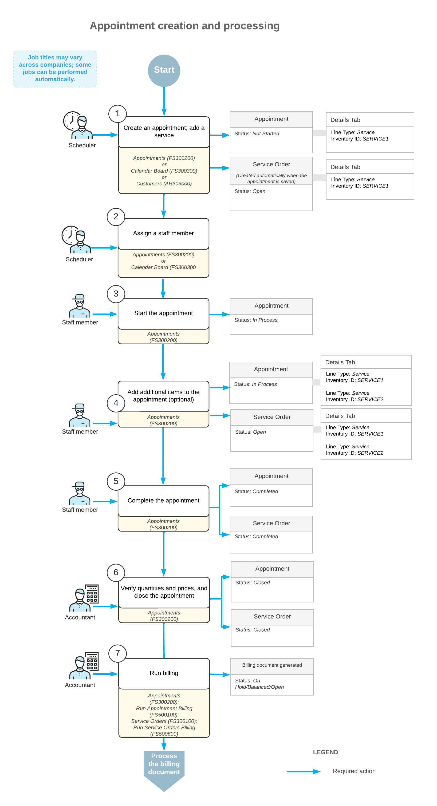

# Appointment Creation: General Information {#_5dc9b087-77f5-4d80-b47c-f53f627de0bd .concept}

In Acumatica ERP, an *appointment* is a document that represents a single in-person visit to perform one or multiple services. You can create an appointment either from a service order or independently. When an appointment is created separately, the system automatically generates a related service order once the appointment is saved.

Typically, you first create a service order and specify the services to be provided to the customer. Based on the details of the service order, you then create the required appointments and schedule the date and time for service delivery.

In some situations, such as an urgent repair request, the need for service may arise unexpectedly, often from a customer call. In these cases, you can quickly create and schedule an appointment without first creating a service order.

In this chapter, you will create and schedule an appointment without first creating a service order. You will learn to do this in several ways.

## Learning Objectives { .section}

In this chapter, you will learn how to do the following:

-   Create an appointment directly on the [Appointments](FS_30_02_00.md#) \(FS300200\) form, add a service to the appointment, assign a staff member to the appointment.
-   Assign staff member to specific services in an existing appointment.
-   Create an appointment on the [Calendar Board](FS_30_03_00.md#) \(FS300300\) form and assign it to a staff member whose skills meet the appointment requirements. You'll review how the system alerts you when a staff member’s skills don’t match.

## Applicable Scenarios { .section}

You create an appointment in a wide variety of scenarios. In the most common scenario, you receive a call from your customer informing your company of a problem for which your company's services are requested. The service manager of your company creates the appointment and assigns an appropriate staff member to perform the service or services.

## The Steps of the Workflow { .section}

In general, the processing of an appointment consists of the following steps \(for simplicity, these steps describe one appointment with one staff member assigned and without a service order being created first\):

1.  Creating the appointment: The service manager creates an appointment in the system. The system automatically creates a related service order, and copies information from the appointment to the service order.
2.  Adding additional information: The service manager assigns the appropriate staff member to the appointment. The appointment is ready to be attended.
3.  Starting the appointment: On the day of the appointment at the agreed-on appointment location, the staff member starts the appointment in the system.
4.  Adding additional items \(optional\): The staff member adds extra items that have been sold during the appointment.
5.  Completing the appointment: After all the work on the appointment is done and all information is entered into the system and checked, the staff member specifies that all the work is finished and completes the appointment in the system.
6.  Closing the appointment: An accountant verifies the information entered for the completed appointment, such as quantities and prices, and closes the verified appointment.
7.  Generating a billing document for the customer \(if the customer's billing cycle settings indicate that billing documents should be generated by appointment\): An accountant generates billing documents and processes them in the system.

After each step has been performed, you can notify the customer and the staff member about appointment details by sending them notification emails. Before an appointment has been assigned, you can also send notification emails to staff members of the service area where the appointment takes place.

## Workflow of Appointment Creation and Processing { .section}

The typical process of creating and processing an appointment that does not have an existing service order involves the actions and generated documents shown in the following diagram.

**Parent topic:**[Creating Appointments](../UserGuide/ServMgmt_Processing_Appointments_Mapref.md)

