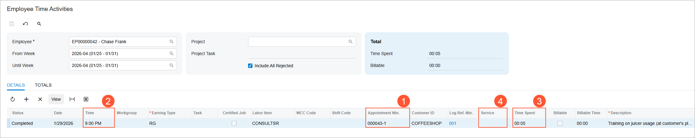

# Staff Time in Appointments: To Record Staff Time Spent in an Appointment {#_2179deb2-fc0b-4469-b353-2203dbad3900 .task}

The following activity will walk you through the process of recording in Acumatica ERP the time that a staff member spends at an appointment. That is, you will learn about how to record time if the staff member works during the whole appointment.

**Attention:** This activity is based on the *U100* dataset. If you are using another dataset or if any system settings have been changed in *U100*, these changes can affect the workflow of the activity and the results of the processing. To avoid issues, restore the *U100* dataset to its initial state.

## Story { .section}

Suppose that the management of the SweetLife Service and Equipment Sales Center has decided to track the time activities of its employees. Further suppose that for the GoodFood One Restaurant customer, staff members of the SweetLife Service and Equipment Sales Center attend regular appointments to deliver training services. Only one staff member attends each appointment, and this staff member works during the whole appointment. Thus, the time activity should be created for the whole duration of the appointment.

Acting as a staff member \(Chase Frank\), you will start and complete an appointment, and then review the time activity that has been created for the appointment.

## Configuration Overview { .section}

In the *U100* dataset, which you'll use to complete this lesson, the following setup has been configured. These settings ensure that the environment is ready for performing the activity:

-   The minimum system configuration, which is described in [Company with Branches that Do Not Require Balancing: General Information](../ImplementationGuide/config_Company_with_Branches_No_Balancing_GeneralInfo.md), has been performed.
-   The *SWEETLIFE* company has been created on the [Companies](CS_10_15_00.md) \(CS101500\) form. This company has multiple branches created on the [Branches](CS_10_20_00.md#) \(CS102000\) form, including *SWEETEQUIP \(Service and Equipment Sales Center\)*.
-   On the [Service Management Preferences](FS_10_01_00.md) \(FS100100\) form, the minimum settings have been specified, including specifying the numbering sequences and work calendar, for the service management functionality to be used.
-   On the [Enable/Disable Features](CS_10_00_00.md#) \(CS100000\) form, the *Time Management* feature, which provides the ability to track employees' time activities in the system, has been enabled.
-   On the [Employees](EP_20_30_00.md#) \(EP203000\) form, *EP00000042 \(Chase Frank\)* has been defined. On the **General** tab \(**Employee Settings** section\), the **Staff Member in Service Management** check box has been selected, so you can assign this employee to perform services.
-   On the [Users](SM_20_10_10.md) \(SM201010\) form, the *frank* user account has been created, and the *EP00000042 \(Chase Frank\)* employee has been associated with the user account. That is, the employee name has been specified in the **Linked Entity** box.
-   On the [User Profile](SM_20_30_10.md#) \(SM203010\) form, for the *frank* user, the *WEST BRIGHTON* branch location has been specified as the default branch location.
-   On the [Service Management Preferences](FS_10_01_00.md#) \(FS100100\) form, the basic service management functionality has been configured, including specification of the numbering sequences and the work calendar. Also, on the **General** tab \(**General Settings** section\), the **Enable Time &amp; Expenses Integration** check box has been selected.
-   On the [Service Order Types](FS_20_23_00.md#) \(FS202300\) form, the *DEV* service order type has been defined as follows:
    -   On the **General** tab \(**Integrating with Time &amp; Expenses** section\), the following settings have been specified:
        -   **Automatically Create Time Activities from Appointments**: Selected
        -   **Default Earning Type**: *RG*
    -   On the **Time Behavior** tab, the following settings have been specified:
        -   **Set Start Time in Appointment:** Selected
        -   **Start Logging for Unassigned Staff:** Selected
        -   **Set End Time in Appointment:** Selected
        -   **Status to Set for In Process Items**: *Completed*
-   On the [Appointments](FS_30_02_00.md#) \(FS300200\) form, the *000043-1* appointment has been created.

## Process Overview { .section}

To enter the staff time of an appointment, on the [Appointments](FS_30_02_00.md#) \(FS300200\) form, you will start and complete an appointment that was created based on a service order type designed to create time activities. Then you will review the time activity created in the system on the [Employee Time Activities](EP_30_70_00.md#) \(EP307000\) form for the staff member assigned to this appointment.

## System Preparation { .section}

Before you begin performing the steps of this activity, do the following:

1.  Launch the Acumatica ERP website, and sign in to a company with the *U100* dataset preloaded; you should sign in as a staff member by using the *frank* username and the *123* password.
2.  In the company to which you are signed in, enable the *Service Management* feature on the [Enable/Disable Features](CS_10_00_00.md#) \(CS100000\) form.
3.  In the Date box in the upper-right corner of the Acumatica ERP screen, specify the business date *1/29/2026*. For simplicity, you will use this business date to create and process all documents in this activity.

## Step 1: Attending an Appointment { .section}

To attend an appointment and process it through completion \(while acting as Chase Frank\), do the following:

1.  On the [Appointments](FS_30_02_00.md#) \(FS300200\) form, open the *000043-1* appointment, which has the *DEV* service order type.

    **Tip:** This service order type has been designed for recording staff time spent on an appointment. See the Configuration Overview section for details on its key settings.

2.  On the form toolbar, click **Start**.

    Now wait at least one minute \(because the business time is recorded when at least one minute has passed after the start of the appointment\).

3.  On the form toolbar, click **Complete**.
4.  Review the **Log** tab, and notice that the system has automatically inserted one log line.

## Step 2: Reviewing the Time Activity { .section}

To review the time activity that has been created for the appointment, do the following:

1.  Open the [Employee Time Activities](EP_30_70_00.md) \(EP307000\) form.
2.  Ensure that the following settings are specified in the Selection area:
    -   **Employee**: *EP00000042 - Chase Frank* \(Since you are signed in as this user, the system automatically inserts the corresponding employee ID.\)
    -   **From Week**: *2026-04 \(01/25 - 01/31\)*
    -   **Until Week**: *2026-04 \(01/25 - 01/31\)*
3.  In the table, review the time activity record for the *000043-1* appointment \(Item 1 below\).

    The **Time** \(Item 2\) in this row is the same as the **Actual Start Time** of the appointment on the [Appointments](FS_30_02_00.md#) \(FS300200\) form, and the **Time Spent** \(Item 3\) in this row is the difference between the appointment's **Actual Start Time** and **Actual End Time**.

4.  Verify that the **Service** column is empty \(Item 4\), meaning that this time activity is not associated with any particular service of the appointment.

**Parent topic:**[Recording Staff Time in Appointments](../UserGuide/ServMgmt_Managing_Staff_Times_Mapref.md)

