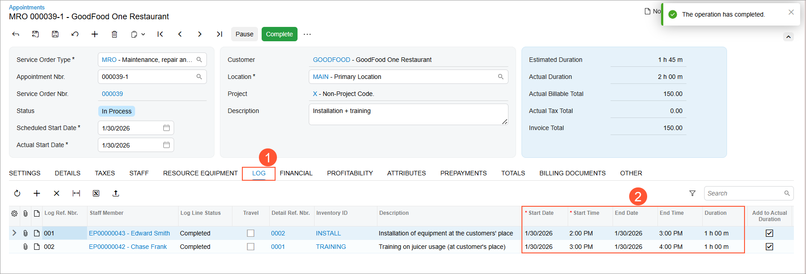
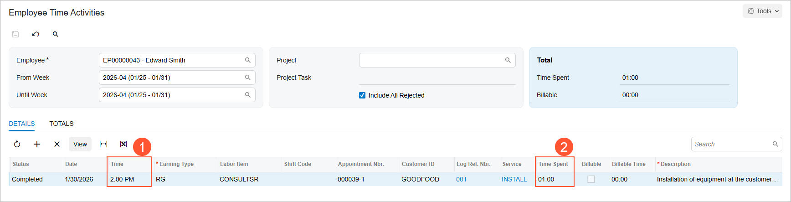

# Staff Time in Appointments: To Record Staff Time Spent on a Particular Service {#_33013904-66b2-42af-9233-b38b86106ff8 .task}

The following activity will walk you through the process of recording in Acumatica ERP the time that a staff member spends providing a particular service. That is, you will learn how to record time if the staff member works on a particular service but not during the whole appointment.

**Attention:** This activity is based on the *U100* dataset. If you are using another dataset or if any system settings have been changed in *U100*, these changes can affect the workflow of the activity and the results of the processing. To avoid issues, restore the *U100* dataset to its initial state.

## Story { .section}

Suppose that the management of the SweetLife Service and Equipment Sales Center has decided to track the time activities of its employees based on service duration. Each staff member must keep accurate records on what service has been performed and enter the actual start and end times of the provided services in appointments.

Acting as staff member Edward Smith, you will record the start and completion times of the service assigned to you and the service assigned to Chase Frank. You will then review the time activities that have been created for the appointment.

## Configuration Overview { .section}

In the *U100* dataset, which you'll use to complete this lesson, the following setup has been configured. These settings ensure that the environment is ready for performing the activity:

-   The minimum system configuration, which is described in [Company with Branches that Do Not Require Balancing: General Information](../ImplementationGuide/config_Company_with_Branches_No_Balancing_GeneralInfo.md), has been performed.
-   The *SWEETLIFE* company has been created on the [Companies](CS_10_15_00.md) \(CS101500\) form. This company has multiple branches created on the [Branches](CS_10_20_00.md#) \(CS102000\) form, including *SWEETEQUIP \(Service and Equipment Sales Center\)*.
-   On the [Service Management Preferences](FS_10_01_00.md) \(FS100100\) form, the minimum settings have been specified, including specifying the numbering sequences and work calendar, for the service management functionality to be used.
-   On the [Employees](EP_20_30_00.md#) \(EP203000\) form, for the *EP00000042 \(Chase Frank\)* and *EP00000043 \(Edward Smith\)* employees, the **Staff Member in Service Management** check box has been selected for both employees \(on the **General** tab in the **Employee Settings** section\), so you can assign them to perform services.
-   On the [Users](SM_20_10_10.md) \(SM201010\) form, the *frank* and *smith* user accounts have been defined in the system, and the *EP00000042 \(Chase Frank\)* and *EP00000043 \(Edward Smith\)* employees, respectively, have been associated with the user accounts defined for these employees in the system. That is, the employee name has been specified in the **Linked Entity** box.
-   On the [Enable/Disable Features](CS_10_00_00.md#) \(CS100000\) form, the *Time Management* feature, which provides the ability to track employees' time activities in the system, has been enabled.
-   On the [Service Management Preferences](FS_10_01_00.md#) \(FS100100\) form, the basic service management functionality has been configured, including specification of the numbering sequences and the work calendar. Also, the **Enable Time &amp; Expenses Integration** check box has been selected on the **General** tab \(**General Settings** section\).
-   On the [Service Order Types](FS_20_23_00.md#) \(FS202300\) form, the *MRO* service order type has been defined.
    -   On the **General** tab \(**Integrating with Time &amp; Expenses** section\), the following settings have been specified:
        -   **Require Time Approval to Close/Bill Appointments**: Cleared
        -   **Automatically Create Time Activities from Appointments**: Selected
        -   **Default Earning Type**: *RG*
    -   On the **Time Behavior** tab, the **Set Start Time in Appointment** check box has been selected
-   On the [Appointments](FS_30_02_00.md) \(FS300200\) form, the *000039-1* appointment has been created.

## Process Overview { .section}

On the [Appointments](FS_30_02_00.md) \(FS300200\) form, you will enter the start and end times spent on the installation and training services of an existing appointment; you will then complete it. Then on the [Employee Time Activities](EP_30_70_00.md) \(EP307000\) form, you will review the time activities created for staff members for the services that were provided.

## System Preparation { .section}

Before you begin performing the steps of this activity, do the following:

1.  Launch the Acumatica ERP website, and sign in to a company with the *U100* dataset preloaded; you should sign in as a staff member by using the *smith* username and the *123* password.
2.  In the company to which you are signed in, ensure that the *Service Management* feature has been enabled on the [Enable/Disable Features](CS_10_00_00.md#) \(CS100000\) form.
3.  In the Date box in the upper-right corner of the Acumatica ERP screen, specify the business date *1/30/2026*. For simplicity, you will use this business date to create and process all documents in this activity.

## Step 1: Recording Staff Time Spent on Services { .section}

Acting as Edward Smith, you will record the time that you and Chase Frank spend on the services of an existing appointment. To record this staff time, do the following:

1.  On the [Appointments](FS_30_02_00.md) \(FS300200\) form, open the *000039-1* appointment, which has the *MRO* service order type.
2.  On the form toolbar, click **Start**.
3.  On the **Staff** tab, do the following:
    1.  Click the line with the *INSTALL* service. Notice that *EP00000043 \(Edward Smith\)* is specified in the **Staff Member** column.
    2.  On the table toolbar, click **Start**.
    3.  In the **Perform Action** dialog box, which has opened, specify *2:00 PM* in the **Time** box.
    4.  In the table, verify that the check box is selected in the line with the *INSTALL* service.
    5.  Click **OK** at the bottom of the dialog box, which closes it.
4.  On the **Log** tab, ensure that the *001* log line with the *INSTALL* service has been added. Check the start time of the service. Notice that the status of the service \(in the **Log Line Status** column\) is *In Process*.
5.  On the **Staff** tab, do the following:
    1.  Again click the line with *INSTALL* service.
    2.  On the table toolbar, click **Complete**.
    3.  In the **Perform Action** dialog box, specify *3:00 PM* in the **Time** box.
    4.  Click **OK** at the bottom of the dialog box.
6.  On the **Log** tab, ensure that in the *001* log line with the *0002* *INSTALL* service, the status of the service \(in the **Log Line Status** column\) has changed to *Completed*.
7.  On the **Staff** tab, begin recording the staff time spent on the training service as follows:
    1.  Click the line with the *TRAINING* service. Notice that *EP00000042 \(Chase Frank\)* specified in the **Staff Member** column.
    2.  On the table toolbar, click **Start**.
    3.  In the **Perform Action** dialog box, which has opened, specify *3:00 PM* in the **Time** box.
    4.  In the table, verify that the check box is selected in the line with the *TRAINING* service.
    5.  Click **OK** to close the dialog box.
8.  On the **Log** tab, ensure that the *002* log line with the *TRAINING* service has been created. Notice that the status of the service is *In Process*.
9.  On the **Staff** tab, do the following:
    1.  Again click the line with *TRAINING* service.
    2.  On the table toolbar, click **Complete**.
    3.  In the **Perform Action** dialog box, specify *4:00 PM* in the **Time** box.
    4.  Click **OK** to close the dialog box.
10. On the **Log** tab, ensure that the *002* log line with the *TRAINING* service has been updated. Check the end time of the service. Notice that the status of the service is *Completed*.
11. On the **Settings** tab, specify the following settings:
    -   **Actual Start Date** \(second box\): *2:00 PM*
    -   **Actual End Date** \(second box\): *4:00 PM*
    -   **Finished**: Selected
12. On the form toolbar, click **Save**.
13. On the form toolbar, click **Complete**.

    The following screenshot shows the **Log** tab \(Item 1\) with the staff time spent on services \(Item 2\).

    

## Step 2: Reviewing the Employee Time Activities Form { .section}

To review the staff members' time, do the following:

1.  Open the [Employee Time Activities](EP_30_70_00.md) \(EP307000\) form.
2.  In the **Employee** box of the Summary area, ensure that *EP00000043 \(Edward Smith\)* is specified—the staff member who has performed the installation service. \(Because you are signed in as this user, the system automatically inserts the corresponding employee ID.\)
3.  In the **From Week** and **Until Week** boxes, make sure that *2026-04 \(01/25 - 01/31\)* is specified. This is the week that includes the date of the appointment: 1/30/2026.

    In the table, you can view the row representing the time activity related to the installation service performed in the appointment. In the **Time** column \(Item 1\), you can view the start time of the appointment; in the **Time Spent** column \(Item 2\), you can view the duration of the service provided. That is, for the *INSTALL* service, one hour was spent, starting at 2:00 PM.

    

4.  In the **Employee** box of the Summary area, select *EP00000042 \(Chase Frank\)*.
5.  In the table, make sure a time activity is listed for the *TRAINING* service: one hour spent starting at 3:00 PM for the *GOODFOOD* customer.

**Parent topic:**[Recording Staff Time in Appointments](../UserGuide/ServMgmt_Managing_Staff_Times_Mapref.md)

