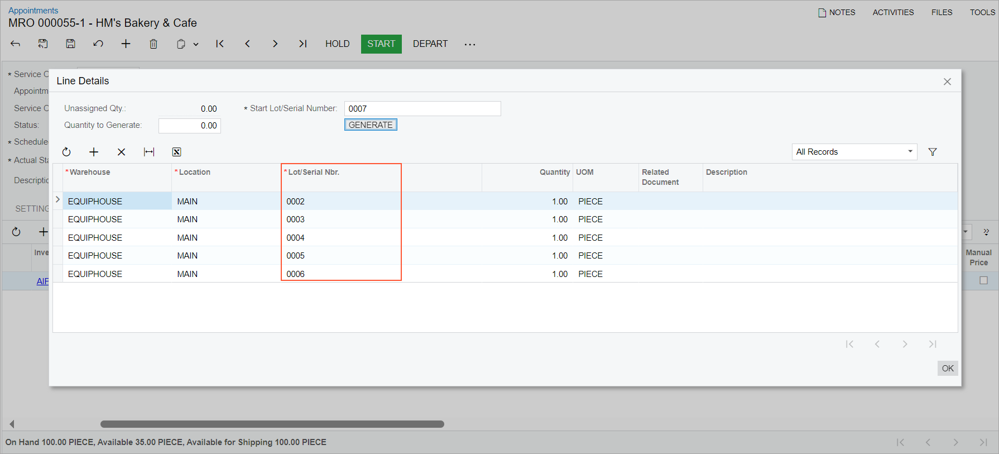

# Assigning Lot and Serial Numbers in Appointments {#_75296e58-be30-41ae-8edb-2bcc2907ae1b .concept}

In Acumatica ERP, you can assign lot or serial numbers to stock items directly in an appointment on the [Appointments](FS_30_02_00.md) \(FS300200\) form. This is useful when the specific unit to be installed or used at a customer site is not known until the technician performs the work.

## Before You Begin { .section}

To assign lot or serial numbers in appointments, the following conditions must be met:

-   The *Lot and Serial Tracking* feature is enabled on the [Enable/Disable Features](https://training.acumatica.com/2025R1/(W(2))/Wiki/ShowWiki.aspx?wikiname=HelpRoot_FormReference&PageID=c1555e43-1bc5-4f6f-ba9d-b323f94d8a6b) \(CS100000\) form.
-   The stock item’s lot or serial class \(on the [Lot/Serial Classes](IN_20_70_00.md) \(IN207000\) form\) is configured with:
    -   *Track Serial Numbers* or *Track Lot Numbers* selected as the tracking method.
    -   *When Used* selected as the assignment method.
-   The functionality applies only if the customer has a billing cycle set up to process billing for appointments.

## Methods for Generating Lot or Serial Numbers on the Appointments Form { .section}

On the [Appointments](FS_30_02_00.md) \(FS300200\) form, you can view or generate lot or serial numbers for a stock item by clicking the item on the **Details** tab and then clicking **Lot/Serial Nbrs.** on the table toolbar. Lot or serial numbers for stock items can be generated either manually or automatically, depending on the state of the **Auto-Generate Next Number** check box in the stock item's lot or serial class on the [Lot/Serial Classes](IN_20_70_00.md) \(IN207000\) form:

-   If the check box is selected, the system automatically generates lot or serial numbers for each unit of the selected stock item on the **Details** tab of the [Appointments](FS_30_02_00.md) form. The lot or serial number or numbers are displayed in the **Lot/Serial Nbr.** column in the **Line Details** dialog box.

    If the lot or serial class settings of the selected stock item require auto-generation of the lot or serial number, the **Unassigned Qty.** and **Quantity to Generate** boxes in the dialog box contain *0* by default. This is because the lot or serial numbers are automatically generated by the system when the appointment is saved.

-   If the check box is cleared, you must manually generate lot or serial numbers by clicking the **Generate** button in the **Line Details** dialog box.

    When you click **Generate**, the system generates lot or serial numbers for the specified quantity of the stock item and displays the numbers in the **Lot/Serial Nbr.** column. In the following screenshot, serial numbers have been generated. \(Note that the system generates a single lot number for all units of the selected item and lists it in the only row.\)

    

    If a serial number is generated for a single unit of the stock item, the system creates one serial number and inserts it in the **Lot/Serial Nbr.** column of the item's line on the **Details** tab of the [Appointments](FS_30_02_00.md) form.

    If serial numbers are generated for multiple units of the item, the **Lot/Serial Nbr.** column in the item's line on the **Details** tab remains empty. However, when the appointment is billed each unit of the stock item will be listed in its own row in the invoice with its serial number in the **Lot/Serial Nbr.** column.

**Attention:** For stock items with the *When Used* assignment method, lot or serial numbers cannot be generated and assigned in service orders on the [Service Orders](FS_30_01_00.md) \(FS300100\) form. Additionally, the serial or lot numbers for stock items with the *When Used* assignment method generated in appointments on the [Appointments](FS_30_02_00.md) form are not copied to the related service orders.

**Parent topic:**[Working with Lot and Serial Numbers](../UserGuide/ServMgmt_Working_with_Lot_Serial_Numbers_mapref.md)

