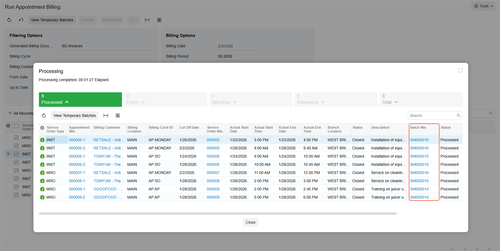
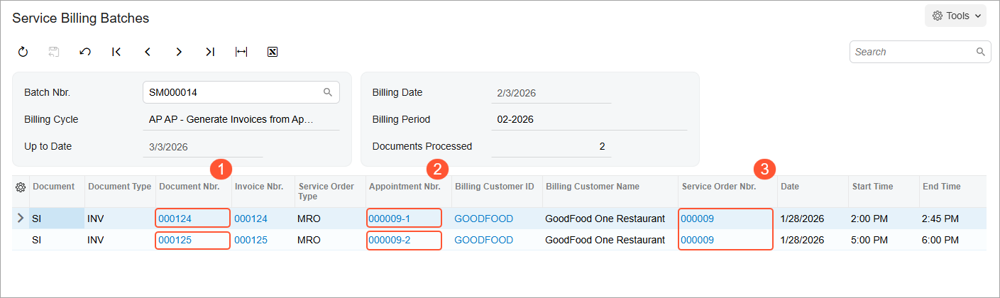
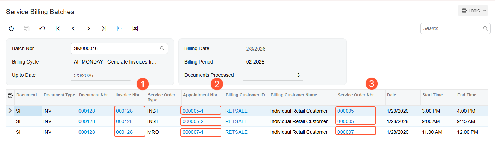
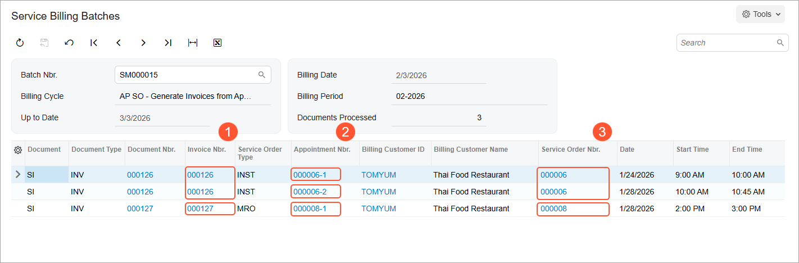

# Billing of Multiple Appointments: Process Activity {#_236a26a4-043b-4ff2-876d-0a59ca34e531 .task}

The following activity will walk you through the process of generating invoices for multiple appointments. You will also review the invoices that have been generated for customers with different billing cycles assigned.

**Attention:** This activity is based on the *U100* dataset. If you are using another dataset or if any system settings have been changed in *U100*, these changes can affect the workflow of the activity and the results of the processing. To avoid issues, restore the *U100* dataset to its initial state.

## Story { .section}

The accountant of the SweetLife Service and Equipment Sales Center generates billing documents every day. On February 3, 2026, the accountant \(Yona Jones\) has to run billing for appointments for the following customers:

-   *GOODFOOD \(GoodFood One Restaurant\)*: For this customer, a billing document is generated for each appointment.
-   *RETSALE \(Individual Retail Customer\)*: For this customer, a billing document is generated each Monday.
-   *TOMYUM \(Thai Food Restaurant\)*: For this customer, one billing document is generated for each service order; it includes all appointments of the service order.

By filtering the appointments by customer and billing cycle, Yona can quickly review which appointments are ready for billing and process them together in a single run.

The service order type of each appointment is defined to generate sales invoices as billing documents. In this activity, you will act as the accountant and run the billing process for these customers.

## Configuration Overview { .section}

In the *U100* dataset, which you'll use to complete this lesson, the following setup has been configured. These settings ensure that the environment is ready for performing the activity:

-   The minimum system configuration, which is described in [Company with Branches that Do Not Require Balancing: General Information](../ImplementationGuide/config_Company_with_Branches_No_Balancing_GeneralInfo.md), has been performed.
-   The *SWEETLIFE* company has been created on the [Companies](CS_10_15_00.md) \(CS101500\) form. This company has multiple branches created on the [Branches](CS_10_20_00.md#) \(CS102000\) form, including *SWEETEQUIP \(Service and Equipment Sales Center\)*.
-   On the [Service Management Preferences](FS_10_01_00.md) \(FS100100\) form, the minimum settings have been specified, including specifying the numbering sequences and work calendar, for the service management functionality to be used.
-   On the [Users](SM_20_10_10.md) \(SM201010\) form, the *jones* account has been created. For the user account, in the **Linked Entity** box of the Summary area of the form, the *Yona Jones* employee account has been specified.
-   On the [Branch Locations](FS_20_25_00.md#) \(FS202500\) form, the *WEST BRIGHTON* branch location of the *SWEETEQUIP* \(*Service and Equipment Sales Center*\) branch has been created.
-   On the [User Profile](SM_20_30_10.md#) \(SM203010\) form, for the *jones* user, *WEST BRIGHTON* has been specified as the default branch location.
-   On the [Order Types](SO_20_10_00.md) \(SO201000\) form, the *SO* and *IN* sales order types have been created. On the **General** tab \(**Field Services Settings** section\), the **Enable Field Services Integration** check box has been selected.
-   On the [Service Order Types](FS_20_23_00.md#) \(FS202300\) form, the *INST* and *MRO* service order types have been defined. On the **General** tab \(**Billing Settings** section\), *SO Invoices* has been selected in the **Generated Billing Documents** box.
-   On the [Billing Cycles](FS_20_60_00.md#) \(FS206000\) form, the following billing cycles have been created:
    -   *AP AP*: For this billing cycle, **Appointments** is selected under **Run Billing For**, and **Appointments** is selected under **Group Billing Documents By**.
    -   *AP MONDAY*: For this billing cycle, **Appointments** is selected under **Run Billing For**, **Time Frame** is selected under **Group Billing Documents By**, and *Monday* has been selected as the **Fixed Day of Week** \(in the **Time Frame Grouping Settings** section, under **Prepare On**\).
    -   *AP SO*: For this billing cycle, **Appointments** is selected under **Run Billing For**, and **Service Orders** is selected under **Group Billing Documents By**.
-   On the [Customers](AR_30_30_00.md#) \(AR303000\) form, the following customers have been defined with the noted billing cycles selected in the **Billing Cycle** box \(**Service Management** section\) of the **Billing** tab:
    -   *GOODFOOD \(GoodFood One Restaurant\)*, which has the *AP AP* billing cycle
    -   *RETSALE \(Individual client\)*, which has the *AP MONDAY* billing cycle
    -   *TOMYUM \(Thai Food Restaurant\)*, which has the *AP SO* billing cycle
-   On the [Appointments](FS_30_02_00.md#) \(FS300200\) form, multiple appointments have been created for the purposes of this activity.

## Process Overview { .section}

You will review closed appointments on the [Run Appointment Billing](FS_50_01_00.md#) \(FS500100\) form and specify the settings required for the system to generate invoices. After the billing process is completed, you will review the generated billing documents on the [Service Billing Batches](FS_30_58_00.md#) \(FS305800\) form.

## System Preparation {#section_rr1_ggf_bhc .section}

Before you start this activity, do the following:

1.  Launch the Acumatica ERP website, and sign in to a company with the *U100* dataset preloaded; you should sign in as an accountant by using the *jones* username and the *123* password.
2.  In the Date box in the upper-right corner of the Acumatica ERP screen, specify the business date *2/3/2026*. For simplicity, you will use this business date to create and process all documents in this activity.
3.  On the Company and Branch Selection menu on the top pane of the Acumatica ERP screen, make sure that the *Service and Equipment Sales Center* branch is selected.
4.  After signing in, make sure that the *Service Management* feature is enabled on the [Enable/Disable Features](CS_10_00_00.md#) \(CS100000\) form.

## Step 1: Reviewing the Closed Appointments { .section}

To review the list of closed appointments for customers awaiting billing, do the following:

1.  Open the [Run Appointment Billing](FS_50_01_00.md#) \(FS500100\) form.
2.  In the **Generated Billing Documents** box of the Selection area, select *SO Invoices*.
3.  In the **From Date** box, select *1/20/2026*.
4.  In the **Up to Date** box, select *2/3/2026*.

**Tip:** For convenient review of the table, click the header of the **Billing Customer** column and select *Sort Ascending*. The appointments in the table will be sorted by customer name.

In the table, notice the following:

-   For *GOODFOOD*, two appointments of one service order were closed on *1/28/2026* \(see the **Actual End Date** column\).
-   For *RETSALE*, two appointments of one service order and one appointment of another service order were closed.
-   For *TOMYUM*, two appointments of one service order and one appointment of another service order were closed.

    All customers have different billing cycles assigned \(see the **Billing Cycle ID** column\). In the **Cut-Off Date** column, you can see the date when the billing document can be generated for each appointment.

## Step 2: Generating and Reviewing Invoices { .section}

To generate multiple invoices for the appointments, do the following:

1.  Once the list of appointments is opened on the [Run Appointment Billing](FS_50_01_00.md#) \(FS500100\) form, on the form toolbar, click **Process All**.

    The system opens the **Processing** dialog box, in which you can see the status of the processing.

2.  After the processing has successfully completed, click the **Processed** tab in the dialog box.

    The table with the processed records is displayed. A batch of invoices has been generated for each customer. Move the scroll bar to the right until you reach the **Batch Nbr.** column \(see below\).

    

3.  In the **Batch Nbr.** column, click the batch link for *GOODFOOD \(GoodFood One Restaurant\)*. Notice that the same batch number is displayed in both *GOODFOOD \(GoodFood One Restaurant\)* rows, so you click either of them\).

    The [Service Billing Batches](FS_30_58_00.md#) \(FS305800\) form opens in a pop-up window with the batch of generated invoices.

    Notice that **a separate invoice** \(Item 1 below\) has been generated **for each appointment** \(Item 2\) **of one service order** \(Item 3\). This is because the billing cycle of the customer has been defined to run billing for appointments and group them by appointments.

    

4.  Close the window with the [Service Billing Batches](FS_30_58_00.md#) form.
5.  Return to the **Processing** dialog box and click the batch link generated for *RETSALE - Individual Retail Customer*.

    The [Service Billing Batches](FS_30_58_00.md#) form opens with the batch of generated invoices. Notice that **one invoice** \(Item 1 below\) has been generated **for three appointments** \(Item 2\) **of two service orders** \(Item 3\). This is because the billing cycle of the customer has been defined to run billing for appointments and group them by time frame \(on each Monday\).

    

6.  Close the window with the [Service Billing Batches](FS_30_58_00.md#) form.
7.  In the **Processing** dialog box, click the batch link generated for *TOMYUM \(Thai Food Restaurant\)*.

    The [Service Billing Batches](FS_30_58_00.md#) form opens with the batch of generated invoices. Notice that **two invoices** \(Item 1 below\) have been generated **for three appointments** \(Item 2\) **of two service orders** \(Item 3\). This is because the billing cycle of the customer has been defined to run billing for appointments and group them by service orders.

    

8.  Close the window with the [Service Billing Batches](FS_30_58_00.md#) form.

**Parent topic:**[Billing Multiple Appointments](../UserGuide/ServMgmt_Billing_Multiple_Appointments_Mapref.md)

