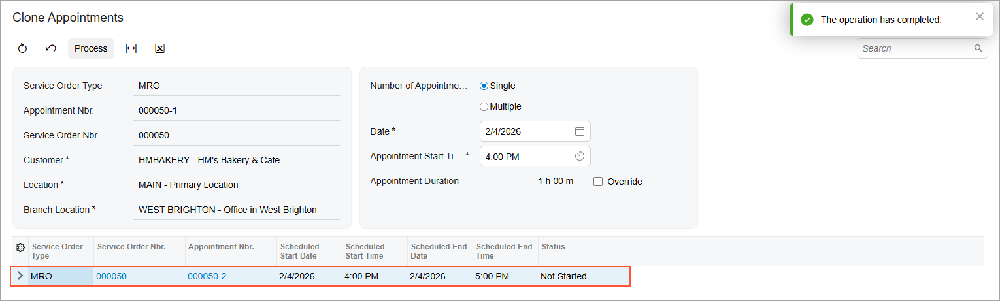
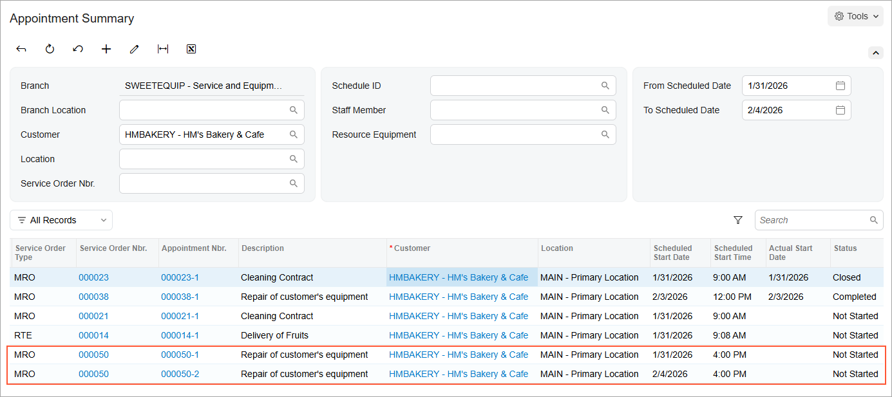

# Cloning of Appointments: Process Activity {#_997efad2-82a0-4300-8937-fe334202dc40 .task}

The following activity will walk you through the process of cloning an appointment.

**Attention:** This activity is based on the *U100* dataset. If you are using another dataset or if any system settings have been changed in *U100*, these changes can affect the workflow of the activity and the results of the processing. To avoid issues, restore the *U100* dataset to its initial state.

## Story { .section}

Suppose that the service manager \(Maia Davis\) of the SweetLife Service and Equipment Sales Center receives a call from HM's Bakery and Cafe regarding the repair of two juicers previously sold to the customer. The customer has requested that the repairs be performed on two separate days: January 31, 2026, and February 4, 2026.

The service manager needs to create an appointment for the repair of the first juicer. After creating the first appointment, Maia will clone it to create an appointment for the repair of the second juicer. Finally, she will review the customer's appointments. You will perform these actions, acting as the service manager.

## Configuration Overview { .section}

In the *U100* dataset, which you'll use to complete this lesson, the following setup has been configured. These settings ensure that the environment is ready for performing the activity:

-   The service management functionality has been configured with the ability to sell inventory items, as described in [Basic Service Management Configuration](../ImplementationGuide/config_ServMgmt_with_Inventory_Mapref.md).
-   On the [Users](SM_20_10_10.md) \(SM201010\) form, the *davis* account has been created. For the user account, in the **Linked Entity** box of the Summary area of the form, the Maia Davis employee account has been specified.
-   On the [User Profile](SM_20_30_10.md#) \(SM203010\) form, for the *davis* user, the *WEST BRIGHTON* branch location has been selected as the default branch location.
-   On the [Service Order Types](FS_20_23_00.md#) \(FS202300\) form, the *MRO* service order type has been defined.
-   On the [Non-Stock Items](IN_20_20_00.md#) \(IN202000\) form, the *REPAIR* service \(that is, the non-stock item of the *Service* type\) has been defined. This service has the *Flat Rate* billing rule selected on the **Price/Cost** tab. For this service, *REPAIRING* has been specified on the **Service Skills** tab \(so the assigned staff member must have this skill\), and *INST&amp;REP* has been specified on the **Service License Types** tab \(so the assigned staff member must have a license of this type\).
-   On the [Skills](FS_20_06_00.md#) \(FS200600\) form, the *REPAIRING* skill has been created.
-   On the [License Types](FS_20_09_00.md#) \(FS200900\) form, the *INST&amp;REP* license type has been created.
-   On the [Licenses](FS_20_10_00.md) \(FS201000\) form, the *FSL00002* license has been defined with the *INST&amp;REP* license type and the *EP00000003 \(Jon Waite\)* employee specified.
-   On the [Employees](EP_20_30_00.md#) \(EP203000\) form, *EP00000003 \(Jon Waite\)* has been created. On the **General Info** tab \(**Employee Settings** section\), the **Staff Member in Service Management** check box has been selected. Also, the *REPAIRING* skill has been added on the **Skills** tab, and license *FSL00002* of the *INST&amp;REP* type has been added on the **Licenses** tab.
-   On the [Customers](AR_30_30_00.md#) \(AR303000\) form, the *HMBAKERY \(HM's Bakery and Cafe\)* customer has been defined.

## Process Overview { .section}

You will create the first appointment on the [Appointments](FS_30_02_00.md#) \(FS300200\) form. Then, you will clone the appointment to a new one by using the [Clone Appointments](FS_50_02_01.md) \(FS500201\) form. Finally, you will review the customer's appointment history on the [Appointment Summary](FS_40_01_00.md) \(FS400100\) form, accessed from the [Customers](AR_30_30_00.md#) \(AR303000\) form.

## System Preparation {#section_isv_3sq_ghc .section}

Before you start this activity, do the following:

1.  Launch the Acumatica ERP website, and sign in to a company with the *U100* dataset preloaded; you should sign in as a service manager by using the *davis* username and the *123* password.
2.  In the Date box in the upper-right corner of the Acumatica ERP screen, specify the business date *2/16/2026*. For simplicity, you will use this business date to create and process all documents in this activity.
3.  After signing in, make sure that the *Service Management* feature is enabled on the [Enable/Disable Features](CS_10_00_00.md#) \(CS100000\) form.

## Step 1: Creating the First Appointment { .section}

To create an appointment for the customer, do the following:

1.  On the [Appointments](FS_30_02_00.md#) \(FS300200\) form, click **Add New Record**.
2.  In the **Customer** box, select *HMBAKERY - HM's Bakery and Cafe*
3.  On the **Settings** tab, in the **Scheduled Start Date and Time** section, specify *1/31/2026* 4:00 PM.
4.  On the **Details** tab, add a row, and in the **Inventory ID** box, select the *REPAIR* service.
5.  On the **Staff** tab, add a row, and specify Jon Waite as a staff member.
6.  On the form toolbar, click **Save**.

## Step 2: Cloning the Appointment { .section}

To clone the appointment that you created in Step 1, do the following:

1.  While you are still viewing the appointment on the [Appointments](FS_30_02_00.md#) \(FS300200\) form, on the More menu \(under **Scheduling**\), click **Clone**.

    The [Clone Appointments](FS_50_02_01.md#) \(FS500201\) form opens.

2.  In the Selection area, in the **Date** box, select *2/4/2026*.

    The appointment start time is set to match the time of the original appointment.

3.  Leave the **Number of Appointments** box set to **Single**.
4.  On the form toolbar, click **Process**.

    The new appointment is generated with the same details as the original appointment, except for the scheduled date, which is *2/4/2026* \(see below\).

## Step 3: Reviewing the Appointments Created for the Customer { .section}

To review the list of the customer's appointments, including the two appointments you created in this activity, follow these steps

1.  On the [Customers](AR_30_30_00.md#) \(AR303000\) form, open the *HMBAKERY \(HM's Bakery and Cafe\)* customer.
2.  On the More menu \(under **Inquiries**\), click **Appointment History**.

    The [Appointment Summary](FS_40_01_00.md) \(FS400100\) form opens.

3.  In the Selection area, clear the **Staff Member** box. In the **From Scheduled Date** box, select 1/31/2026. In the **To Scheduled Date** box, select 2/4/2026.

    Review the two appointments: one scheduled for *1/31/2026* *4:00 PM*, and the other scheduled for *2/4/2026* *4:00 PM* \(shown in the following screenshot\).

**Parent topic:**[Cloning Appointments](../UserGuide/ServMgmt_Appointments_Cloning_Mapref.md)

