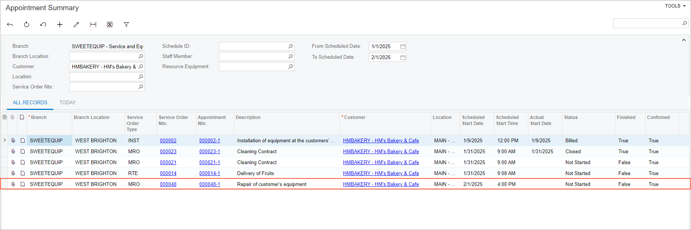

# Appointment Creation: To Create an Appointment from the Customers Form {#_b26e6cc9-c250-41e0-b045-7f3cdf4347c0 .task}

In this activity, you will create an appointment from the [Customers](AR_30_30_00.md#) \(AR303000\) form while viewing a particular customer. You will also learn how to send notification emails to the customer and to your company's own staff members.

**Important:** This activity is based on the classic Acumatica ERP UI.

**Attention:** This activity is based on the *U100* dataset. If you are using another dataset or if any system settings have been changed in *U100*, these changes can affect the workflow of the activity and the results of the processing. To avoid issues, restore the *U100* dataset to its initial state.

## Story { .section}

Suppose that the service manager \(Maia Davis\) of the SweetLife Service and Equipment Sales Center has received a call from HM's Bakery and Cafe about the repair of a juicer that had been sold to this customer previously. The customer has asked for the repair of the juicer to be performed on February 1, 2026.

The service manager needs to check the history of this customer and schedule the appointment for the repair of the juicer. When the appointment is scheduled, the service manager needs to send confirmation emails both to the assigned employee and to the customer. You will perform these actions, acting as the service manager.

## Configuration Overview { .section}

In the *U100* dataset, which you use to complete this lesson, the following setup has been carried out:

-   The minimum system configuration, which is described in [Company with Branches that Do Not Require Balancing: General Information](../ImplementationGuide/config_Company_with_Branches_No_Balancing_GeneralInfo.md), has been performed.
-   The *SWEETLIFE* company has been created on the [Companies](CS_10_15_00.md) \(CS101500\) form. This company has multiple branches created on the [Branches](CS_10_20_00.md#) \(CS102000\) form, including *SWEETEQUIP \(Service and Equipment Sales Center\)*.
-   On the [Service Management Preferences](FS_10_01_00.md) \(FS100100\) form, the minimum settings have been specified, including specifying the numbering sequences and work calendar, for the service management functionality to be used.
-   On the [Users](SM_20_10_10.md) \(SM201010\) form, the *davis* user account have been created. The *EP00000040 - Maia Davis* employee has been associated with the *davis* user account; that is, *Maia Davis* has been selected in the **Linked Entity** box of the Summary area of the [Users](SM_20_10_10.md) form.
-   On the [Branch Locations](FS_20_25_00.md#) \(FS202500\) form, the *WEST BRIGHTON* branch location of the *SWEETEQUIP* \(*Service and Equipment Sales Center*\) branch has been created.
-   On the [User Profile](SM_20_30_10.md#) \(SM203010\) form, for the *davis* user, *WEST BRIGHTON* has been specified as the default branch location.
-   On the [Service Order Types](FS_20_23_00.md#) \(FS202300\) form, the *MRO* service order type has been defined.
-   On the [Non-Stock Items](IN_20_20_00.md#) \(IN202000\) form, the *REPAIR* service \(that is, non-stock item of the *Service* type\) has been created. This item has the *Flat Rate* billing rule selected on the **Price/Cost** tab. For this service, *REPAIRING* has been specified on the **Service Skills** tab \(meaning that the assigned staff member must have this skill\), and *INST&amp;REP* has been specified on the **Service License Types** tab \(indicating that the assigned staff member must have a license of this type\).
-   On the [Skills](FS_20_06_00.md#) \(FS200600\) form, the *REPAIRING* skill has been created.
-   On the [License Types](FS_20_09_00.md#) \(FS200900\) form, the *INST&amp;REP* license type has been created.
-   On the [Licenses](FS_20_10_00.md) \(FS201000\) form, the *FSL00002* license has been defined with the *INST&amp;REP* license type and the *EP00000003 \(Jon Waite\)* employee specified.
-   On the [Employees](EP_20_30_00.md#) \(EP203000\) form, *EP00000003 \(Jon Waite\)* has been created. On the **General** tab \(**Employee Settings** section\), the **Staff Member in Service Management** check box has been selected. Also, the *REPAIRING* skill has been listed on the **Skills** tab, and the license of the *INST&amp;REP* type has been listed on the **Licenses** tab.
-   On the [Billing Cycles](FS_20_60_00.md#) \(FS206000\) form, the following settings have been specified for the *AP AP* billing cycle:
    -   **Run Billing For**: **Appointments**
    -   **Group Billing Documents By**: **Appointments**
-   On the [Customers](AR_30_30_00.md#) \(AR303000\) form, the *HMBAKERY \(HM's Bakery and Cafe\)* customer has been defined. The *AP AP* billing cycle has been selected in the **Service Management** section of the **Billing** tab.

## Process Overview { .section}

From the [Customers](AR_30_30_00.md#) \(AR303000\) form, you will open the [Calendar Board](FS_30_03_00.md#) \(FS300300\) form to create the first appointment. By using the [Appointments](FS_30_02_00.md#) \(FS300200\) form, you will then send notification emails about the appointment to the customer and staff member. Finally, while again using the [Customers](AR_30_30_00.md#) form as a starting point, you will go to the [Appointment Summary](FS_40_01_00.md#) \(FS400100\) form to view the list of all appointments scheduled for the customer.

## System Preparation { .section}

Before you begin performing the steps of this activity, do the following:

1.  Launch the Acumatica ERP website, and sign in to a company with the *U100* dataset preloaded. You should sign in as a service manager by using the *davis* username and the *123* password.
2.  In the info area at the upper-right corner of the top pane of the Acumatica ERP screen, make sure that the business date is set to *1/30/2026*. If a different date is displayed, click the Business Date menu button and select *1/30/2026* from the calendar. For simplicity, you'll create and process all documents in this activity using this business date.
3.  In the company to which you are signed in, ensure that the *Service Management* feature has been enabled on the [Enable/Disable Features](CS_10_00_00.md#) \(CS100000\) form.

## Step 1: Creating an Appointment from the Customers Form { .section}

To create an appointment for a customer whose record you are viewing on the [Customers](AR_30_30_00.md#) \(AR303000\) form, do the following:

1.  On the [Customers](AR_30_30_00.md#) \(AR303000\) form, open the *HMBAKERY - HM's Bakery and Cafe* customer.
2.  On the More menu \(under **Services**\), click **Schedule on Calendar**.

    The [Calendar Board](FS_30_03_00.md#) \(FS300300\) form is opened in a pop-up window.

3.  In the Date box \(in the top right corner of the dashboard\), change the calendar date to *2/1/2026*.
4.  On the dashboard, in the column for *Jon Waite*, click at 16:00, and drag the bottom of the shaded box to 17:30.
5.  In the appointment box, which has appeared on the calendar board and is shaded in green \(indicating that an appointment is in *Not Started* status\), click the reference number of the appointment, which is the top number in the box. The [Appointments](FS_30_02_00.md#) \(FS300200\) form opens. Notice that the system has filled in the default settings based on the settings of the customer and the service order type.
6.  On the **Details** tab of the [Appointments](FS_30_02_00.md#) form, add a row, and specify the following settings in the row:
    -   **Line Type**: *Service*
    -   **Inventory ID**: *REPAIR*
7.  On the form toolbar, click **Save**.
8.  On the **Staff** tab, confirm that the staff member, Jon Waite, has been assigned to the appointment.

## Step 2: Sending Appointment Confirmation Emails { .section}

To send emails confirming the scheduled appointment, while you are still viewing the appointment on the [Appointments](FS_30_02_00.md#) \(FS300200\) form, do the following:

1.  On the **Settings** tab \(**Scheduled Date and Time** section\), select the **Confirmed** check box.

    The selection of this check box indicates that the appointment date and time have been confirmed with the customer.

2.  On the form toolbar, click **Save**.
3.  On the More menu \(under **Printing and Emailing**\), click **Email Confirmation to Customer**.
4.  On the More menu \(under **Printing and Emailing**\), click **Email Confirmation to Staff**.
5.  On the form title bar \(at the top right corner of the form\), click **Activities**, and in the **Task &amp; Activities** pop-up window, which opens, click the link to each email to review what has been sent to the customer and to the staff member.
6.  Close the pop-up window.

## Step 3: Reviewing the Customer's Appointments { .section}

To review the appointments for the customer, do the following:

1.  On the [Customers](AR_30_30_00.md#) \(AR303000\) form, again open the *HMBAKERY - HM's Bakery and Cafe* customer.
2.  On the More menu \(under **Inquiries**\), click **Appointment History**.

    The [Appointment Summary](FS_40_01_00.md#) \(FS400100\) form opens.

3.  In the Selection area, clear the **Staff Member** box.
4.  In the **To Scheduled Date** box, select *2/1/2026*.

Review the list of all appointments scheduled for the customer, including the appointment you have just created \(see the following screenshot\).

**Parent topic:**[Creating Appointments](../UserGuide/ServMgmt_Processing_Appointments_Mapref.md)

