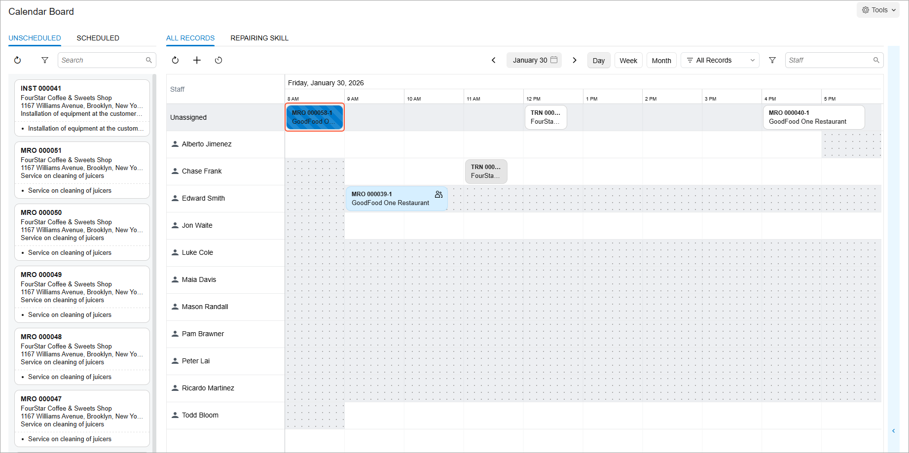
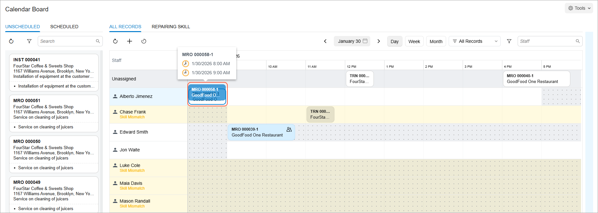

# Scheduling Appointments: To Create a Skill-Matched Appointment on the Calendar {#_59099902-17cb-42f0-bf60-861b344f57cd .task}

In this activity, you will create an appointment on the [Calendar Board](FS_30_03_00.md#) \(FS300300\) form. You will assign a staff member who meets the skill requirements for the appointment and observe how the system displays warnings for staff members whose skills do not match the required ones.

**Attention:** This activity is based on the *U100* dataset. If you are using another dataset or if any system settings have been changed in *U100*, these changes can affect the workflow of the activity and the results of the processing. To avoid issues, restore the *U100* dataset to its initial state.

## Story { .section}

Suppose that GoodFood One Restaurant has a juicer and wants the SweetLife Service and Equipment Sales Center to perform repairs on the juicer. The service manager \(Maia Davis\) and the customer have agreed that a staff member will come to repair the juicer on January 30, 2026, at 8:00 AM. The assigned staff member must have a special skill to repair the juicer, as well as a license from the producer of the juicer.

Acting as the service manager, you will create the appointment and assign a staff member who meets these requirements and can perform the work at the agreed-upon time.

## Configuration Overview { .section}

In the *U100* dataset, which you'll use to complete this lesson, the following setup has been configured. These settings ensure that the environment is ready for performing the activity:

-   The minimum system configuration, which is described in [Company with Branches that Do Not Require Balancing: General Information](../ImplementationGuide/config_Company_with_Branches_No_Balancing_GeneralInfo.md), has been performed.
-   The *SWEETLIFE* company has been created on the [Companies](CS_10_15_00.md) \(CS101500\) form. This company has multiple branches created on the [Branches](CS_10_20_00.md#) \(CS102000\) form, including *SWEETEQUIP \(Service and Equipment Sales Center\)*.
-   On the [Service Management Preferences](FS_10_01_00.md) \(FS100100\) form, the minimum settings have been specified, including specifying the numbering sequences and work calendar, for the service management functionality to be used. Also, the *MRO* service order type has been selected in the **Default Service Order Type** box.
-   On the [Users](SM_20_10_10.md) \(SM201010\) form, the *davis* and *jimenez* user accounts have been created. The *EP00000040 - Maia Davis* employee has been associated with the *davis* user account; that is, *Maia Davis* has been selected in the **Linked Entity** box of the Summary area of the [Users](SM_20_10_10.md) form. The *EP00000004 - Alberto Jimenez* employee has been associated with the *jimenez* user account; that is, *Alberto Jimenez* has been selected in the **Linked Entity** box of the Summary area on the [Users](SM_20_10_10.md) form.
-   On the [Staff Schedule Rules](FS_20_20_01.md) \(FS202001\) form, a work schedule rule has been defined for the *EP00000004 - Alberto Jimenez* employee, and the work schedule has been generated for this employee on the [Generate Staff Schedules](FS_50_04_00.md) \(FS500400\) form.
-   On the [Branch Locations](FS_20_25_00.md#) \(FS202500\) form, the *WEST BRIGHTON* branch location of the *SWEETEQUIP* \(*Service and Equipment Sales Center*\) branch has been created.
-   On the [User Profile](SM_20_30_10.md#) \(SM203010\) form, for the *davis* user, *WEST BRIGHTON* has been specified as the default branch location.
-   On the [Service Order Types](FS_20_23_00.md#) \(FS202300\) form, the *MRO* service order type has been defined.
-   On the [Skills](FS_20_06_00.md#) \(FS200600\) form, the *REPAIRING* skill has been created.
-   On the [Service Areas](FS_20_19_00.md#) \(FS201900\) form, the *MANHATTAN* area has been created.
-   On the [Non-Stock Items](IN_20_20_00.md#) \(IN202000\) form, the *REPAIR* service \(that is, non-stock item of the *Service* type\) has been defined. This service has the *Flat Rate* billing rule specified on the **Price/Cost** tab. For this service, *REPAIRING* has been listed on the **Service Skills** tab.
-   On the [Employees](EP_20_30_00.md#) \(EP203000\) form, the following employees have been created:
    -   *EP00000004 \(Alberto Jimenez\)*: On the **General** tab \(**Employee Settings** section\), the **Staff Member in Service Management** check box has been selected. Also, the *REPAIRING* skill has been listed on the **Skills** tab, license *FSL00003* of the *INST&amp;REP* type has been listed on the **Licenses** tab, and *MANHATTAN* has been listed on the **Service Areas** tab.
    -   *EP00000003 \(Jon Waite\)*: On the **General** tab \(**Employee Settings** section\), the **Staff Member in Service Management** check box has been selected. Also, the *REPAIRING* skill has been listed on the **Skills** tab, license *FSL00002* of the *INST&amp;REP* license type has been listed on the **Licenses** tab, and *MANHATTAN* has been listed on the **Service Areas** tab.

## Process Overview { .section}

On the [Calendar Board](FS_30_03_00.md#) \(FS300300\) form, you will initiate the creation of an appointment. On the [Appointments](FS_30_02_00.md) \(FS300200\) form, you will add a service to the appointment and save it. Then, on the [Calendar Board](FS_30_03_00.md#) \(FS300300\) form, you will confirm the appointment and assign it to a staff member who has the skills required to perform the service.

## System Preparation {#section_ahk_tdy_1hc .section}

Before you start this activity, do the following:

1.  Launch the Acumatica ERP website, and sign in to a company with the *U100* dataset preloaded; you should sign in as a service manager by using the *davis* username and the *123* password.
2.  In the Date box in the upper-right corner of the Acumatica ERP screen, specify the business date *1/30/2026*. For simplicity, you will use this business date to create and process all documents in this activity.
3.  After signing in, make sure that the *Service Management* feature is enabled on the [Enable/Disable Features](CS_10_00_00.md#) \(CS100000\) form.
4.  On the [Service Management Preferences](FS_10_01_00.md) \(FS100100\) form, select *Warn* in the **Skills** box \(**Appointment Validation Settings** section\), and save it.

## Step: To Initiate the Creation of an Appointment on the Calendar { .section}

To create the appointment, do the following:

1.  Open the [Calendar Board](FS_30_03_00.md#) \(FS300300\) form.
2.  In the Date box of the calendar toolbar, ensure that *January 30* is specified.
3.  On the Calendar toolbar, click **Add Appointment**. The **New Appointment** dialog box opens.
4.  In the **Customer** box \(**Service Order** section\), select *GOODFOOD - GoodFood One Restaurant*.
5.  In the **Description** box \(**Appointment** section\), enter `Diagnose and repair a customer’s juicer`.
6.  In the **Duration** box, enter *1 h 00 m*.
7.  Click **Create Appointment** on the toolbar.

    The system opens the [Appointments](FS_30_02_00.md) \(FS300200\) form.

8.  On the **Settings** tab, specify the following:
    -   In the **Scheduled Start Date** box, ensure *1/30/2026* is specified and select *8:00 AM* \(the time requested by the customer according to the activity story\).
    -   In the **Scheduled End Date** box, ensure *1/30/2026* is specified and select *9:00 AM* \(based on the default service duration of 1 hour and 00 minutes\).
9.  On the **Details** tab, add a service as follows:
    -   **Line Type**: *Service*
    -   **Inventory ID**: *REPAIR*
10. Save the appointment.
11. Return to the [Calendar Board](FS_30_03_00.md#) form and click **Refresh** on the calendar toolbar.

    On the calendar, the newly created appointment appears in the topmost **Unassigned** row \(see below\).

    

    The color and pattern of the appointment tile indicates that the appointment has not been assigned to any staff member and has not yet been confirmed by the customer.

12. Click the appointment reference number on the tile to open the quick view panel.
13. In the quick view panel, click **Confirm** on the toolbar, assuming that the customer has confirmed the appointment.

    On the calendar, you’ll see that the color and pattern of the appointment tile have changed to plain white, indicating that the appointment is confirmed but still unassigned.

14. Drag the tile to the *Alberto Jimenez* row. You’ll see that *Skill Mismatch* warnings appear next to the staff members who lack the required skill to perform the appointment’s service, and these staff members are highlighted in yellow \(see below\). You can still assign the appointment to any staff member because this is only a warning, not a restriction. However, in this instruction, you’ll assign the appointment to a qualified staff member without any warning. Notice that the tile’s color changes again \(now it’s blue\), indicating that the appointment is assigned to a staff member.

    

**Parent topic:**[Creating Appointments](../UserGuide/ServMgmt_Processing_Appointments_Mapref.md)

