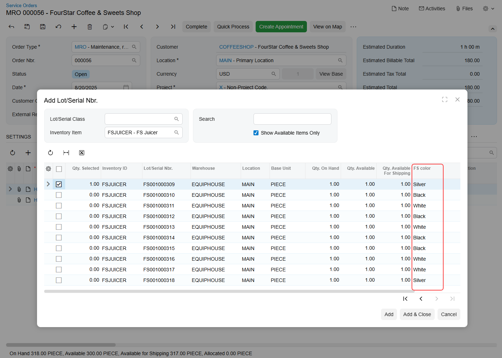

# Using Attributes with Lot and Serial Numbers in Service Documents {#_49d3a33b-a51a-4b8a-be32-ad4213c7be71 .concept}

In Acumatica ERP, you can assign attributes—such as color, model, or manufacturer—to individual units of lot- or serial-tracked items. These attributes are defined at the lot or serial class level and provide detailed information about each unit. Attribute values are typically recorded when finished goods are received into inventory, so that items with specific lot or serial attributes can later be added to service documents.

## Enabling the Feature {#section_n2w_2z3_jgc .section}

To use the functionality, make sure the *Lot/Serial Attributes* feature is enabled on the [Enable/Disable Features](CS_10_00_00.md) \(CS100000\) form. You can enable this feature if the *Lot and Serial Tracking* feature is also enabled.

## Defining Attributes for Lot and Serial Classes {#section_kj4_kyp_jgc .section}

To start using attributes, first create them on the [Attributes](CS_20_50_00.md) \(CS205000\) form—or verify that they already exist. Once that's done, add the attributes to a lot or serial class on the [Lot/Serial Classes](IN_20_70_00.md) \(IN207000\) form. You can add or delete attributes in the **Attributes** section if the class has the following settings:

-   **Tracking Method**: *Track Serial Numbers* or *Track Lot Numbers*
-   **Assignment Method**: *When Received*

Once you assign attributes to a lot or serial class, they're automatically added to the **Lot/Serial Attributes** table on the **Attributes** tab of the [Stock Items](IN_20_25_00.md) \(IN202500\) form. Here you can easily review and manage the assigned attributes before using the item in service documents.

To make attribute values available for selection in service documents, you must record lot or serial attribute values when receiving units into stock. On the [Purchase Receipts](PO_30_20_00.md) \(PO301000\) or [Receipts](IN_30_10_00.md) \(IN301000\) form, open the **Line Details** dialog box by selecting a line on the **Details** tab and clicking **Line Details** on the table toolbar. In the dialog box, select the lot or serial number first, and then specify the corresponding attributes in the **Lot/Serial Attributes** table.

For details on how to set up and work with lot and serial attributes, see [Items with Lot and Serial Numbers: Lot and Serial Attributes](Lot_and_Serial_Numbers_Lot_Serial_Attributes.md).

## Selecting Lot- or Serial-Tracked Items with Attributes in Service Documents {#section_u4l_r4j_jgc .section}

You can select a unit of a stock item with a lot or serial number and a specific attribute in the following documents:

-   A service order on the [Service Orders](FS_30_01_00.md) \(FS300100\) form
-   An appointment on the [Appointments](FS_30_02_00.md) \(FS300200\) form

To assign a lot or serial number with an attribute to a stock item, click **Add Lot/Serial Nbr.** on the table toolbar of the **Details** tab. In the **Add Lot/Serial Nbr.** dialog box that opens, you can check the item availability and select units. The table in this dialog box displays columns with the attribute values for each unit associated with a particular lot or serial number \(see below\). Use the **Search** box to find units by entering text strings that match attribute values or other item information shown in the table.

When you add a unit with a lot or serial number to a service document, the system creates a separate line for each unit on the **Details** tab.

**Parent topic:**[Working with Lot and Serial Numbers](../UserGuide/ServMgmt_Working_with_Lot_Serial_Numbers_mapref.md)

