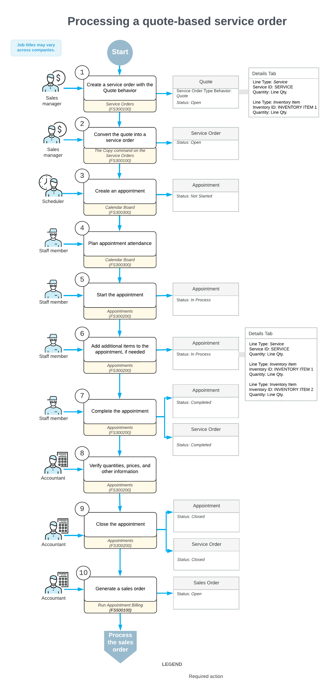

# Quotes: General Information {#_9872d712-271d-4ff2-bafd-c25cd2f330f2 .concept}

A quote is a document that lists the services and inventory items to be provided to a customer, along with their estimated costs. The quote serves as a preliminary offer and can be communicated to the customer by phone or email.

Once the customer agrees to proceed with the quoted services and costs, you create a service order based on the quote. Multiple service orders can be generated from a single quote, which makes quotes useful as templates for future service orders.

## Learning Objectives { .section}

In this chapter, you will learn how to do the following:

-   Create a quote for a customer
-   Confirm the quote once the customer accepts it
-   Copy the quote to a service order for further processing

## Applicable Scenarios { .section}

You create a quote in the following cases:

-   You want to show a customer which services and costs will be involved if the customer decides to order your company’s services.
-   You want to attract new customers by preparing quotes that include typical services, stock items, and their costs. Any of these quotes can then be sent to potential customers.

## Workflow of Quote Processing {#section_vv2_1y4_y4b .section}

For processing a quote, the typical workflow involves the actions and generated documents shown in the following diagram.

The remaining sections of this topic describe many of the actions shown in the diagram.

## Creating a Service Order from a Quote { .section}

When a customer's request is received, the sales manager enters a **quote**—a service order with the *Quote* behavior—by using the [Service Orders](FS_30_01_00.md) \(FS300100\) form \(see Item 1 in the diagram in the *Quote Processing* diagram\). In the quote, the sales manager specifies the customer who submitted the request, the branch and branch location that will deliver the services, the services to be performed, and any inventory items to be used with the service. The sales manager then sends the quote to the customer for confirmation.

After the customer has approved the quote, the sales manager creates a **service order** from the quote by using the **Copy** command on the [Service Orders](FS_30_01_00.md) form \(Item 2\). The system creates a service order with the *Open* status applying the settings defined in the quote.

Because accounts and subaccounts \(if used\) are not specified in quotes, the system determines them for the created service order based on the settings of the service order type selected during creation:

-   **Account**: The source of the sales account is defined in the **Use Sales Account From** box on the [Service Order Types](FS_20_23_00.md) \(FS202300\) form. The account can be taken from one of the following sources:
    -   *Inventory Item*: The account specified on the **GL Accounts** tab of the [Stock Items](IN_20_25_00.md) \(IN202500\) or [Non-Stock Items](IN_20_20_00.md) \(IN202000\) form.
    -   *Warehouse*: The account specified on the **GL Accounts** tab of the [Warehouses](IN_20_40_00.md) \(IN204000\) form.
    -   *Posting Class*: The account specified on the **GL Accounts** tab of the [Posting Classes](IN_20_60_00.md) \(IN206000\) form.
    -   *Customer/Vendor Location*: The account specified on the **Locations** tab of the [Customers](AR_30_30_00.md) \(AR303000\) form or [Vendors](AP_30_30_00.md) \(AP303000\) form.
-   **Subaccount**: The subaccount is determined by the rule specified in the **Combine Sales Sub. From** box on the [Service Order Types](FS_20_23_00.md) form for the selected service order type. For details, see the description of this box in the [Service Order Types](FS_20_23_00.md) topic.

The system inserts the corresponding account and subaccount \(if any\) in the **Account** and **Subaccount** columns on the **Details** tab of the [Service Orders](FS_30_01_00.md) form.

Once the service order has been created, staff members can be assigned to it, and appointments can be scheduled.

## Planning and Creating Appointments { .section}

After the service order has been created in the system, a scheduler \(that is, the person responsible for planning appointments\) uses the [Calendar Board](FS_30_03_00.md) \(FS300300\) form to schedule the appointments needed to perform the services requested by the customer \(see Item 3 in the Quote Processing diagram\).

**Tip:** Appointments can also be created directly on the [Appointments](FS_30_02_00.md) \(FS300200\) form.

When the scheduler assigns a staff member to an appointment, they take into account the staff member’s work schedule, the skills and licenses required to perform the service, and the service area where the work will be performed. The scheduler reviews the appointment settings and enters additional details if needed, such as the resource equipment to be used and the stock items purchased by the customer along with the service. The system assigns the *Not Started* status to the created appointments.

## Attending Appointments { .section}

The staff member assigned to an appointment reviews the upcoming appointments on the [Calendar Board](FS_30_03_00.md) \(FS300300\) form, identifies the appointment that needs to be attended \(see Item 4 in the *Quote Processing* diagram\), and travels to the location where the service is to be performed—typically the customer’s location.

The staff member starts the appointment on the [Appointments](FS_30_02_00.md) \(FS300200\) form \(Item 5\), which changes its status to *In Process*. While performing the services, the staff member updates the appointment with relevant details, such as service status, quantities, and any additional stock items used \(Item 6\).

Once all services have been performed, the staff member reviews the appointment details. When everything is complete and accurate, they select the **Finished** check box and complete the appointment \(Item 7\). The system then assigns the *Completed* status to the appointment and marks the related service order as *Completed* once all its appointments are finished.

## Closing Appointments and Service Order { .section}

Further processing of the service order is performed by an accountant. On the [Appointments](FS_30_02_00.md) \(FS300200\) form, the accountant opens the completed appointment and verifies the quantities and prices \(see Item 8 in the *Workflow of Quote Processing* diagram\). When all information has been verified and the appointments are ready for billing, the accountant closes the appointments \(Item 9\). As a result, the system closes the related service order. Both the appointments and the service order are then assigned the *Closed* status.

## Generation and Processing of the Billing Document { .section}

The accountant generates a document \(such as an AR invoice, a sales order, or a sales invoice\) with the *Open* status by using the [Run Appointment Billing](FS_50_01_00.md) \(FS500100\) form \(Item 10 in the diagram\).

After the document is generated, the accountant processes it in the system through the standard billing workflow.

**Parent topic:**[Creating Quotes and Converting Quotes to Service Orders](../UserGuide/ServMgmt_Managing_Quotes_Mapref.md)

