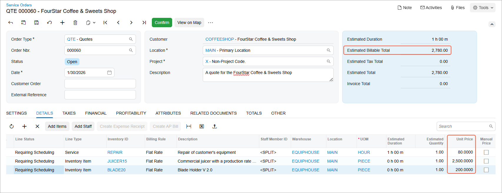
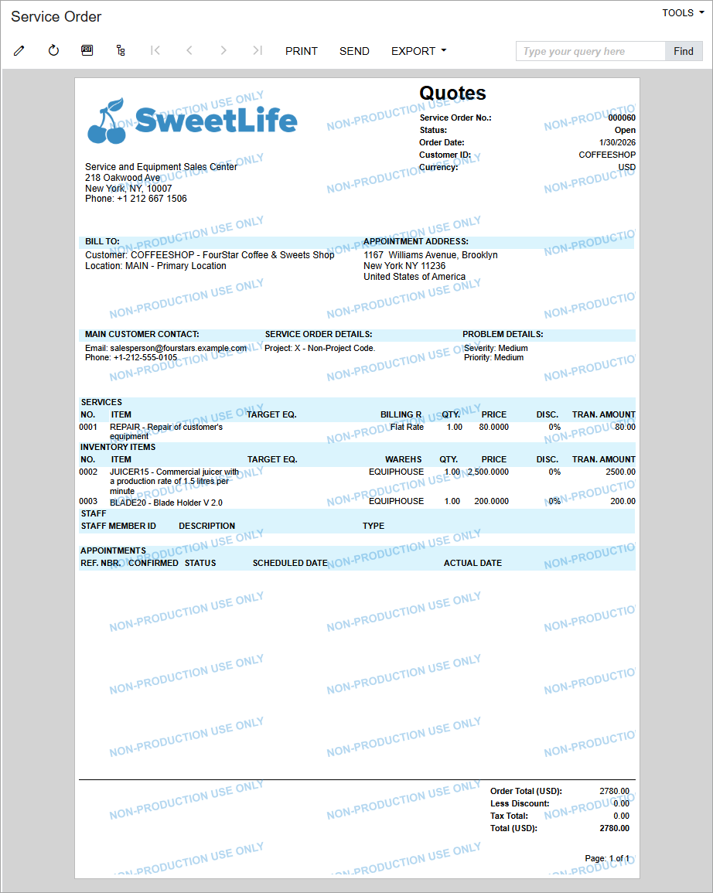

# Quotes: To Create and Process a Quote {#_28ab70c5-1532-4ae3-b541-619748c5ce67 .task}

This activity will walk you through the process of creating and confirming a quote in Acumatica ERP, and then converting the quote to a service order.

**Attention:** This activity is based on the *U100* dataset. If you are using another dataset or if any system settings have been changed in *U100*, these changes can affect the workflow of the activity and the results of the processing. To avoid issues, restore the *U100* dataset to its initial state.

## Story { .section}

Suppose that the *COFFEESHOP - FourStar Coffee &amp; Sweets Shop* customer has requested particular services from the SweetLife Service and Equipment Sales Center. Acting as a service manager \(Maia Davis\) of the company, you will create a quote in the Acumatica ERP. Then you will generate the quote and review a printable version of it. Finally, after the customer has approved the quote, you will confirm the quote in the system and convert it to a service order.

## Configuration Overview {#section_tz4_djx_cnb .section}

In the *U100* dataset, which you'll use to complete this lesson, the following setup has been configured. These settings ensure that the environment is ready for performing the activity:

-   The minimum system configuration, which is described in [Company with Branches that Do Not Require Balancing: General Information](../ImplementationGuide/config_Company_with_Branches_No_Balancing_GeneralInfo.md), has been performed.
-   The *SWEETLIFE* company has been created on the [Companies](CS_10_15_00.md) \(CS101500\) form. This company has multiple branches created on the [Branches](CS_10_20_00.md#) \(CS102000\) form, including *SWEETEQUIP \(Service and Equipment Sales Center\)*.
-   On the [Service Management Preferences](FS_10_01_00.md) \(FS100100\) form, the minimum settings have been specified, including specifying the numbering sequences and work calendar, for the service management functionality to be used.
-   On the [Users](SM_20_10_10.md) \(SM201010\) form, the *davis* account has been created. For the *davis* user account, in the **Linked Entity** box of the Summary area of the form, the *Maia Davis* employee account has been specified.
-   On the [Branch Locations](FS_20_25_00.md#) \(FS202500\) form, the *WEST BRIGHTON* branch location of the *SWEETEQUIP* \(*Service and Equipment Sales Center*\) branch has been created.
-   On the [User Profile](SM_20_30_10.md#) \(SM203010\) form, for the *davis* user, *WEST BRIGHTON* has been specified as the default branch location.
-   On the [Service Order Types](FS_20_23_00.md) \(FS202300\) form, the *QTE* service order type has been created.
-   On the [Customers](AR_30_30_00.md) \(AR303000\) form, the *COFFEESHOP - FourStar Coffee &amp; Sweets Shop* customer has been created.
-   On the [Non-Stock Items](IN_20_20_00.md) \(IN202000\) form, for the *TRAINING* non-stock item, the *Service* type has been selected, and the *Time* billing rule has been specified.
-   On the [Stock Items](IN_20_25_00.md) \(IN202500\) form, the *JUICER15* and *BLADE20* items have been created.

## Process Overview { .section}

On the [Service Orders](FS_30_01_00.md) \(FS300100\) form, you will create a quote for a one-hour repair service by creating a service order of the *QTE* type. You will also add to the quote the inventory items needed by the customer and see how the order total is updated. You will review the print-friendly form of the quote. On the [Service Orders](FS_30_01_00.md) form, you will then copy the service order of the type with the *Quote* behavior to a regular service order.

## System Preparation { .section}

Before you start this activity, do the following:

1.  Launch the Acumatica ERP website, and sign in to a company with the *U100* dataset preloaded; you should sign in as a service manager by using the *davis* username and the *123* password.
2.  In the Date box in the upper-right corner of the Acumatica ERP screen, specify the business date *1/30/2026*. For simplicity, you will use this business date to create and process all documents in this activity.
3.  After signing in, make sure that the *Service Management* feature is enabled on the [Enable/Disable Features](CS_10_00_00.md#) \(CS100000\) form.

## Step 1: Creating and Reviewing the Quote { .section}

You will create a quote that specifies the cost of the service and generate a print-friendly version of the quote for the customer’s review. Do the following:

1.  On the [Service Orders](FS_30_01_00.md) \(FS300100\) form, add a new record.
2.  In the Summary area of the form, specify the following settings:
    -   **Service Order Type**: *QTE*
    -   **Customer**: *COFFEESHOP - FourStar Coffee &amp; Sweets Shop*
    -   **Description**: `A quote for the FourStar Coffee & Sweets Shop`
3.  On the **Details** tab, add a row, and specify the following settings in the row:
    -   **Line Type**: *Service*
    -   **Inventory ID**: *REPAIR*

        As soon as you select the service, the system inserts the default billing rule \(which you will change\), price, and duration information that have been specified for the service.

    -   **Billing Rule**: *Flat Rate*
4.  Add another row, and specify the following settings in the row:

    -   **Line Type**: *Inventory Item*
    -   **Inventory ID**: *JUICER15*
    As soon as you select the inventory ID, the system inserts the stock item's unit price from its settings.

5.  Add a row, and specify the following settings in the row for the inventory item:

    -   **Line Type**: *Inventory Item*
    -   **Inventory ID**: *BLADE20*
    The system again inserts the stock item's unit prices from its settings.

6.  On the form toolbar, click **Save**.
7.  In the row with the *BLADE20* inventory item, change **Unit Price** to `300.0000`.
8.  On the form toolbar, click **Save**.
9.  Verify the service order total in the **Estimated Billable Total** box in the Summary area.

    This total is the sum of the unit prices of all lines of the **Details** tab.

    

10. On the More menu \(under **Printing and Emailing**\), click **Print Service Order**.

    A print-friendly version of the service quote is opened in a new window, as shown below, and you can print it, if needed. You can also convert the quote to PDF or XLS format, or send it to the customer via email for review.

    

## Step 2: Confirming the Quote { .section}

When the customer has agreed to have the services at the quoted costs, you confirm the quote in the system by doing the following:

1.  Return to the quote on the [Service Orders](FS_30_01_00.md) \(FS300100\) form.
2.  On the form toolbar, click **Confirm**.

Notice that the status of the service order changed to *Confirmed*.

## Step 3: Copying the Quote to a Service Order { .section}

Once the quote is confirmed, you should convert it to a regular service order \(that is, copy the quote to a service order\). Do the following:

1.  On the [Service Orders](FS_30_01_00.md) \(FS300100\) form, on the form toolbar, click **Copy**.
2.  In the **Select the New Service Order Type** dialog box, select *MRO*, and click **Proceed**.

    The system opens the [Service Orders](FS_30_01_00.md) form displaying the service order being created. The service order inherits the service and inventory lines from the quote.

3.  On the form toolbar, click **Save**; then verify that the service order has been assigned the *Open* status.
4.  On the **Settings** tab, verify that the quote number has been inserted in the **Reference Nbr.** box \(**Source Info** section\) as the source of this service order.
5.  Click the reference number link.

    The original quote opens on the [Service Orders](FS_30_01_00.md) form in a new window. Verify that the quote has been assigned the *Copied* status.

6.  On the **Related Documents** tab, make sure that the service order you created based on this quote is listed.

**Tip:** Multiple service orders can be displayed on this tab. A quote can be copied to any number of service orders, which may have different service order types.

**Parent topic:**[Creating Quotes and Converting Quotes to Service Orders](../UserGuide/ServMgmt_Managing_Quotes_Mapref.md)

