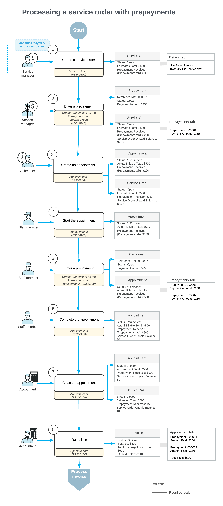

# Service Order Prepayments: General Information {#_4d02752f-7585-4087-81c2-c1cf508742b3 .concept}

Sometimes you may agree with the customer on providing a service or multiple services with some prepayment made by the customer beforehand.

## Learning Objectives { .section}

In this chapter, you will learn how to do the following:

-   Create a service order and enter the prepayment to the service order
-   Create an appointment and enter the second prepayment for the appointment
-   Generate a sales order and review two prepayments applied

## Applicable Scenarios { .section}

You process service orders with prepayments if customers of your company make prepayments for the service to be provided.

## Process Diagram { .section}

In the diagram below, you can see the general workflow of processing a service order with prepayments.

**Tip:** Processes and job titles may be different in your company.

## Creating a Service Order {#section_x5l_bxq_ghc .section}

The service manager creates a service order on the [Service Orders](FS_30_01_00.md) \(FS300100\) form. The order includes both service and inventory line items.

## Entering a Prepayment {#section_nph_fxq_ghc .section}

The service manager records a prepayment for the service order on the [Payments and Applications](AR_30_20_00.md#) \(AR302000\) form. The prepayment reduces the unpaid balance of the service order.

## Creating an Appointment {#section_rhp_gxq_ghc .section}

The scheduler creates an appointment on the [Appointments](FS_30_02_00.md#) \(FS300200\) form. The appointment includes all relevant details from the service order.

## Starting the Appointment {#section_jqx_hxq_ghc .section}

The assigned staff member starts the appointment on the [Appointments](FS_30_02_00.md#) \(FS300200\) form. The appointment status changes to *In Process*, and the system updates the balances accordingly.

## Entering an Additional Prepayment {#section_twt_3xq_ghc .section}

If necessary, the staff member records another prepayment on the [Appointments](FS_30_02_00.md#) \(FS300200\) form to reflect partial payments made during the service.

## Completing the Appointment {#section_qfp_jxq_ghc .section}

After performing the service, the staff member completes the appointment on the [Appointments](FS_30_02_00.md#) \(FS300200\) form. The appointment status changes to *Completed*.

## Closing the Appointment {#section_qsj_kxq_ghc .section}

The accountant reviews and verifies the appointment details, then closes it on the [Appointments](FS_30_02_00.md#) \(FS300200\) form. The appointment status changes to *Closed*.

## Generating an Invoice {#section_r1l_lxq_ghc .section}

The accountant runs billing for the completed appointment. After the invoice is generated and released, its balance reflects that all prepayment amounts have been subtracted from the total.

**Parent topic:**[Processing Prepayments for a Service Order](../UserGuide/ServMgmt_Prepayments_for_Service_Order_Mapref.md)

